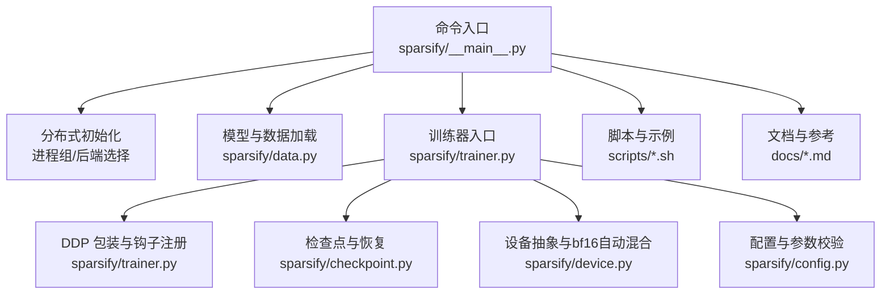
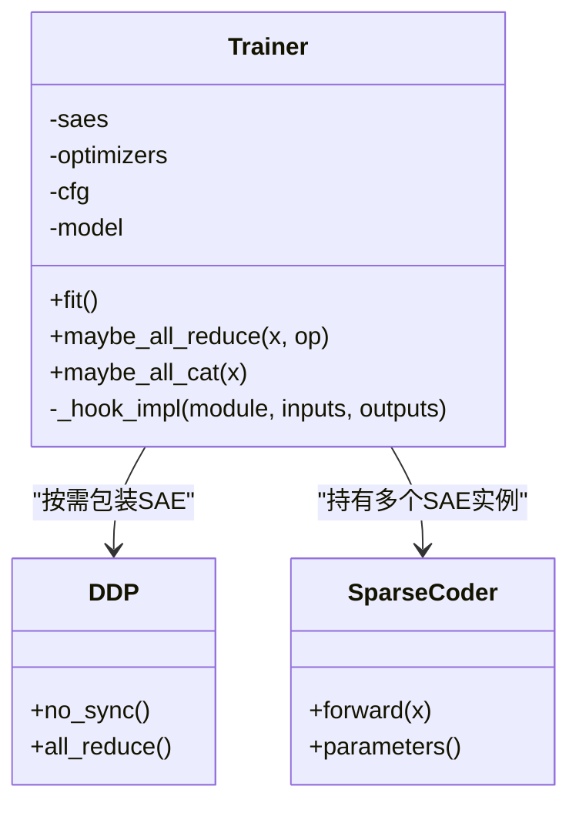
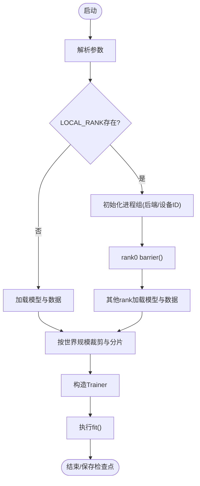
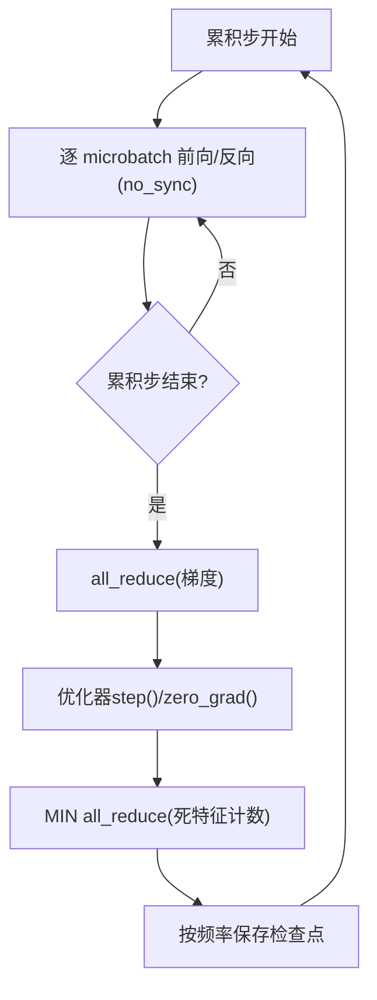
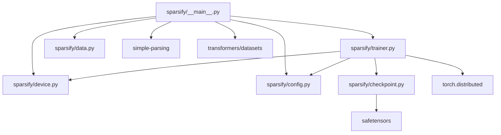

# 分布式训练

<cite>
**本文引用的文件**
- [sparsify/trainer.py](file://sparsify/trainer.py)
- [sparsify/__main__.py](file://sparsify/__main__.py)
- [sparsify/device.py](file://sparsify/device.py)
- [sparsify/config.py](file://sparsify/config.py)
- [sparsify/checkpoint.py](file://sparsify/checkpoint.py)
- [sparsify/data.py](file://sparsify/data.py)
- [scripts/simple_sweep.sh](file://scripts/simple_sweep.sh)
- [scripts/first_time_train/Qwen3-0.6B/script.sh](file://scripts/first_time_train/Qwen3-0.6B/script.sh)
- [docs/training/quickstart.md](file://docs/training/quickstart.md)
- [docs/training/config-reference.md](file://docs/training/config-reference.md)
- [docs/architecture/performance.md](file://docs/architecture/performance.md)
- [pyproject.toml](file://pyproject.toml)
</cite>

## 目录
1. [简介](#简介)
2. [项目结构](#项目结构)
3. [核心组件](#核心组件)
4. [架构总览](#架构总览)
5. [详细组件分析](#详细组件分析)
6. [依赖分析](#依赖分析)
7. [性能考虑](#性能考虑)
8. [故障排除指南](#故障排除指南)
9. [结论](#结论)
10. [附录](#附录)

## 简介
本文件面向 Sparsify 分布式训练系统，围绕多 GPU 训练架构、数据并行与梯度同步机制展开，系统性阐述 DDP 包装策略、进程组管理、通信优化、启动流程、环境变量配置与资源分配，并结合梯度累积、批量大小扩展与内存优化技术给出实践建议。同时提供性能基准、瓶颈分析与调优策略，以及部署、故障排除与监控方法。

## 项目结构
Sparsify 的分布式训练由命令入口、设备抽象、训练器与配置等模块协同完成。关键路径如下：
- 命令入口负责解析参数、初始化分布式进程组、加载模型与数据集，并按 rank 切分数据。
- 设备抽象屏蔽 CUDA/NPU 差异，统一后端选择、bf16 自动混合、事件与同步接口。
- 训练器在前向钩子中采集激活，构建 SAE 子模块，按需进行 DDP 包装与梯度累积，执行反向与优化。
- 配置模块定义训练参数与校验规则，确保分布式一致性与数值稳定性。
- 检查点模块支持多 SAE 保存与恢复，兼容 tiled 模式与多随机种子场景。
- 数据模块提供内存映射与分词工具，支撑大规模数据集高效读取。
- 脚本与文档提供快速开始、配置参考与性能要点，便于落地部署与调优。



图表来源
- [sparsify/__main__.py:131-206](file://sparsify/__main__.py#L131-L206)
- [sparsify/trainer.py:162-729](file://sparsify/trainer.py#L162-L729)
- [sparsify/device.py:92-118](file://sparsify/device.py#L92-L118)
- [sparsify/config.py:29-149](file://sparsify/config.py#L29-L149)
- [sparsify/checkpoint.py:149-302](file://sparsify/checkpoint.py#L149-L302)
- [sparsify/data.py:125-158](file://sparsify/data.py#L125-L158)

章节来源
- [sparsify/__main__.py:131-206](file://sparsify/__main__.py#L131-L206)
- [sparsify/trainer.py:162-729](file://sparsify/trainer.py#L162-L729)
- [sparsify/device.py:92-118](file://sparsify/device.py#L92-L118)
- [sparsify/config.py:29-149](file://sparsify/config.py#L29-L149)
- [sparsify/checkpoint.py:149-302](file://sparsify/checkpoint.py#L149-L302)
- [sparsify/data.py:125-158](file://sparsify/data.py#L125-L158)

## 核心组件
- 分布式入口与进程组管理
  - 通过环境变量 LOCAL_RANK 检测是否启用 DDP；在 DDP 模式下初始化进程组，设置后端与设备 ID，并在 rank 0 输出世界规模信息。
  - 数据分片：在 DDP 下，先按世界规模裁剪样本，再使用分片函数将数据均匀分配到各 rank，确保每个 rank 的样本数量一致。
- 训练器与 DDP 包装
  - 在首次前向且已设置解码器偏置后，按 LOCAL_RANK 对每个 SAE 实例进行 DDP 包装，避免梯度注册异常。
  - 使用 no_sync 上下文在累积步内延迟梯度同步，减少通信频次。
  - 提供批量归约辅助函数，将多个标量映射一次性 all_reduce，降低通信开销。
- 梯度累积与优化器步
  - 通过 grad_acc_steps 控制优化器步频率；在累积步结束时执行优化器 step 与 zero_grad。
  - 在优化器步前移除与解码器方向平行的梯度，稳定训练。
- 检查点与恢复
  - 支持按 hookpoint 保存/加载多个 SAE；在 DDP 下仅 rank 0 保存训练状态，其他 rank barrier 后继续。
  - 支持 finetune 从已有 SAE 权重初始化，或 resume 恢复完整训练状态。
- 设备抽象与 bf16 自动混合
  - 自动检测 CUDA/NPU 并选择对应后端；在支持的平台上启用 bf16 autocast，加速前向路径。
- 配置与参数校验
  - 提供丰富的训练参数，包括批大小、梯度累积、微累积、最大 token 数、Hookpoint 选择、Tiling、Hadamard 旋转等。
  - 校验规则确保参数合法性（如 Hadamard 块大小必须为 2 的幂、编译模式仅在 CUDA 生效等）。

章节来源
- [sparsify/__main__.py:134-171](file://sparsify/__main__.py#L134-L171)
- [sparsify/trainer.py:501-514](file://sparsify/trainer.py#L501-L514)
- [sparsify/trainer.py:294-332](file://sparsify/trainer.py#L294-L332)
- [sparsify/trainer.py:577-584](file://sparsify/trainer.py#L577-L584)
- [sparsify/checkpoint.py:149-302](file://sparsify/checkpoint.py#L149-L302)
- [sparsify/device.py:92-118](file://sparsify/device.py#L92-L118)
- [sparsify/config.py:29-149](file://sparsify/config.py#L29-L149)

## 架构总览
Sparsify 的分布式训练采用“数据并行 + 模型副本”的策略：每个 GPU 上均持有完整的 SAE 副本，通过 DDP 进行梯度同步；Transformer 模型在训练期间保持冻结，仅通过前向钩子采集输入激活参与 SAE 训练。训练器在钩子中对每个 SAE 执行前向与反向，累积步结束后统一优化器步。

```mermaid
sequenceDiagram
participant R0 as "Rank 0"
participant R1 as "Rank 1"
participant Rn as "Rank n"
participant PG as "进程组"
participant Model as "Transformer(冻结)"
participant SAE as "SAE(含DDP包装)"
participant Opt as "优化器"
R0->>PG : 初始化进程组(后端/设备ID)
R0->>R1 : barrier()
R0->>Rn : 数据分片(按世界规模)
R0->>Model : 前向(冻结)
Model-->>SAE : 注册钩子触发(输入激活)
SAE->>SAE : 前向(编码/解码/损失)
SAE-->>Opt : 反向(累积步内no_sync)
R0->>PG : all_reduce(累积步结束)
Opt->>SAE : step()/zero_grad()
R0->>R1 : barrier()
R0->>Rn : 保存检查点(仅rank0)
```

图表来源
- [sparsify/__main__.py:141-171](file://sparsify/__main__.py#L141-L171)
- [sparsify/trainer.py:501-514](file://sparsify/trainer.py#L501-L514)
- [sparsify/trainer.py:577-584](file://sparsify/trainer.py#L577-L584)
- [sparsify/checkpoint.py:246-256](file://sparsify/checkpoint.py#L246-L256)

## 详细组件分析

### 训练器类与 DDP 包装策略
- DDP 包装时机
  - 在首次进入训练循环且已设置解码器偏置后，按 LOCAL_RANK 对每个 SAE 进行 DDP 包装，避免 DDP 初始化后梯度未正确注册的问题。
- no_sync 与梯度累积
  - 在累积步内使用 no_sync 上下文，延迟梯度同步，减少通信；累积步结束时统一执行 all_reduce。
- 梯度处理
  - 在优化器步前移除与解码器方向平行的梯度，提升稳定性；随后执行 step 与 zero_grad。
- 检查点保存
  - 仅 rank 0 保存训练状态与 SAE 权重，其他 rank barrier 后继续；支持 best checkpoint 单独保存。



图表来源
- [sparsify/trainer.py:39-760](file://sparsify/trainer.py#L39-L760)

章节来源
- [sparsify/trainer.py:501-514](file://sparsify/trainer.py#L501-L514)
- [sparsify/trainer.py:402-406](file://sparsify/trainer.py#L402-L406)
- [sparsify/trainer.py:577-584](file://sparsify/trainer.py#L577-L584)
- [sparsify/checkpoint.py:246-256](file://sparsify/checkpoint.py#L246-L256)

### 启动流程与环境变量
- 环境变量
  - LOCAL_RANK：用于检测是否启用 DDP 与设置当前设备。
- 启动流程
  - 解析参数；在 DDP 模式下初始化进程组；rank 0 加载模型与数据，其他 rank barrier 后加载；按世界规模裁剪并分片数据；构造 Trainer 并执行 fit。



图表来源
- [sparsify/__main__.py:134-171](file://sparsify/__main__.py#L134-L171)

章节来源
- [sparsify/__main__.py:134-171](file://sparsify/__main__.py#L134-L171)

### 梯度累积、批量大小扩展与内存优化
- 梯度累积
  - 通过 grad_acc_steps 控制优化器步频率；在累积步内使用 no_sync 延迟同步，降低通信频次。
- 批量大小扩展
  - 通过 grad_acc_steps 与 micro_acc_steps 实现有效 batch size 扩展；当前实现中 micro_acc_steps 主要影响日志归一化。
- 内存优化
  - 死特征计数采用 MIN all_reduce 合并，避免昂贵的 per-forward scatter_；使用延迟指标事件与批量归约减少同步成本。
  - 编码器反向采用循环 k 次的稀疏累积，避免一次性分配大张量，节省显存。



图表来源
- [sparsify/trainer.py:577-616](file://sparsify/trainer.py#L577-L616)
- [sparsify/trainer.py:294-332](file://sparsify/trainer.py#L294-L332)

章节来源
- [sparsify/trainer.py:577-616](file://sparsify/trainer.py#L577-L616)
- [sparsify/trainer.py:294-332](file://sparsify/trainer.py#L294-L332)

### 检查点与恢复
- 多 SAE 保存/加载
  - 每个 hookpoint 保存独立的 SAE 权重；支持 tiled 模式与多随机种子场景。
- 恢复策略
  - resume：恢复完整训练状态（全局步、token 计数、优化器状态、最佳损失等）。
  - finetune：仅加载 SAE 权重，开启全新训练。
- DDP 一致性
  - 仅 rank 0 保存训练状态，其他 rank barrier 后继续，保证跨 rank 一致性。

章节来源
- [sparsify/checkpoint.py:149-302](file://sparsify/checkpoint.py#L149-L302)

### 设备抽象与通信后端
- 后端选择
  - CUDA 使用 nccl，NPU 使用 hccl，CPU 使用 gloo。
- bf16 自动混合
  - 在支持的平台上启用 bf16 autocast，加速前向路径。
- 同步与事件
  - 提供统一的事件创建与同步接口，适配 CUDA/NPU/CPU。

章节来源
- [sparsify/device.py:92-118](file://sparsify/device.py#L92-L118)

## 依赖分析
- 组件耦合
  - 训练器依赖设备抽象以获得后端与 bf16 能力；依赖配置模块进行参数校验与默认值推导；依赖检查点模块进行状态保存与恢复。
  - 命令入口负责分布式初始化与数据分片，然后将模型与数据传入训练器。
- 外部依赖
  - torch.distributed：进程组、all_reduce、all_gather、barrier。
  - safetensors：高效序列化 SAE 权重。
  - simple-parsing：参数解析与序列化。
  - datasets、transformers：数据加载与模型加载。



图表来源
- [sparsify/trainer.py:162-729](file://sparsify/trainer.py#L162-L729)
- [sparsify/__main__.py:131-206](file://sparsify/__main__.py#L131-L206)
- [sparsify/device.py:92-118](file://sparsify/device.py#L92-L118)
- [sparsify/config.py:29-149](file://sparsify/config.py#L29-L149)
- [sparsify/checkpoint.py:149-302](file://sparsify/checkpoint.py#L149-L302)
- [sparsify/data.py:125-158](file://sparsify/data.py#L125-L158)

章节来源
- [sparsify/trainer.py:162-729](file://sparsify/trainer.py#L162-L729)
- [sparsify/__main__.py:131-206](file://sparsify/__main__.py#L131-L206)
- [sparsify/device.py:92-118](file://sparsify/device.py#L92-L118)
- [sparsify/config.py:29-149](file://sparsify/config.py#L29-L149)
- [sparsify/checkpoint.py:149-302](file://sparsify/checkpoint.py#L149-L302)
- [sparsify/data.py:125-158](file://sparsify/data.py#L125-L158)

## 性能考虑
- 通信优化
  - 使用批量归约函数将多个标量映射一次性 all_reduce，减少通信次数。
  - 在累积步内使用 no_sync 延迟同步，降低通信开销。
- 内存优化
  - 死特征计数采用 MIN all_reduce 合并，避免 per-forward scatter_。
  - 编码器反向循环 k 次稀疏累积，避免一次性分配大张量。
- 计算加速
  - bf16 自动混合在支持的平台上默认启用，加速前向路径。
  - torch.compile（在 CUDA 上）可融合小核，减少内核启动开销。
- 数据并行效率
  - 按世界规模裁剪与分片数据，确保每个 rank 的样本数量一致，避免死锁与负载不均。

章节来源
- [docs/architecture/performance.md:1-75](file://docs/architecture/performance.md#L1-L75)
- [sparsify/trainer.py:294-332](file://sparsify/trainer.py#L294-L332)
- [sparsify/trainer.py:577-616](file://sparsify/trainer.py#L577-L616)

## 故障排除指南
- 端口冲突
  - 若多进程在同一节点启动，确保 master_port 不同；可在脚本中调整 MASTER_PORT。
- GPU 内存不足
  - 减少 batch_size 或增大 grad_acc_steps 以扩大有效 batch size；必要时降低 k 或 expansion_factor。
- 数据分片问题
  - 确保数据长度能被世界规模整除；若不能，脚本会自动裁剪尾部样本。
- 恢复失败
  - 检查检查点目录是否存在匹配的 run_name；若使用自动命名，确认保存目录与权限。
- 日志与监控
  - 使用 W&B 记录指标；通过日志查看训练进度与异常；使用 nvidia-smi 监控 GPU 使用率。

章节来源
- [scripts/simple_sweep.sh:137-166](file://scripts/simple_sweep.sh#L137-L166)
- [sparsify/__main__.py:161-169](file://sparsify/__main__.py#L161-L169)
- [docs/training/quickstart.md:60-79](file://docs/training/quickstart.md#L60-L79)

## 结论
Sparsify 的分布式训练以数据并行为核心，通过 DDP 包装与 no_sync 策略实现高效的梯度累积与同步；借助批量归约、bf16 自动混合与内存优化技术，在多 GPU 环境下实现稳定的高吞吐训练。配合完善的检查点与恢复机制、清晰的配置与脚本支持，能够满足从单机多卡到更大规模集群的训练需求。

## 附录
- 快速开始与配置参考
  - 参考快速入门文档了解最小化训练流程与输出结构。
  - 参考配置参考文档掌握参数含义与行为约束。
- 示例脚本
  - 使用 sweep 脚本并行运行超参扫描，提高实验效率。
  - 使用首次训练脚本直接启动 Qwen3 系列模型的训练任务。

章节来源
- [docs/training/quickstart.md:1-153](file://docs/training/quickstart.md#L1-L153)
- [docs/training/config-reference.md:1-193](file://docs/training/config-reference.md#L1-L193)
- [scripts/simple_sweep.sh:1-133](file://scripts/simple_sweep.sh#L1-L133)
- [scripts/first_time_train/Qwen3-0.6B/script.sh:1-124](file://scripts/first_time_train/Qwen3-0.6B/script.sh#L1-L124)
- [pyproject.toml:12-28](file://pyproject.toml#L12-L28)