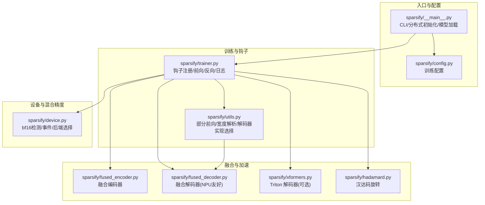
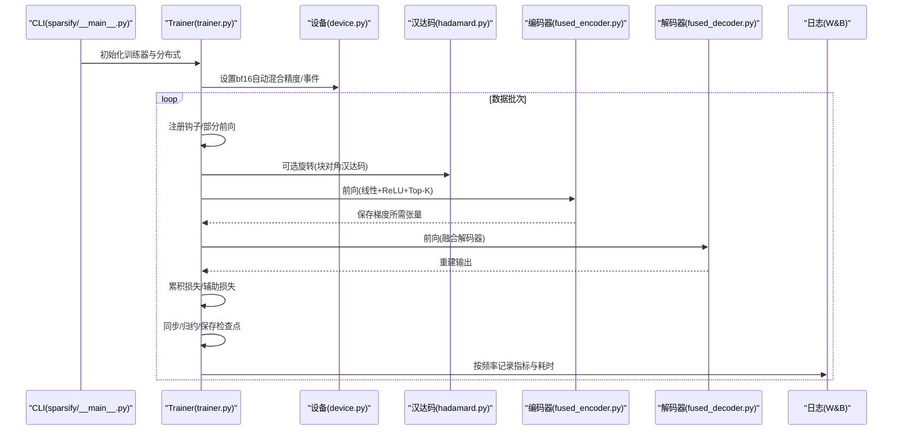
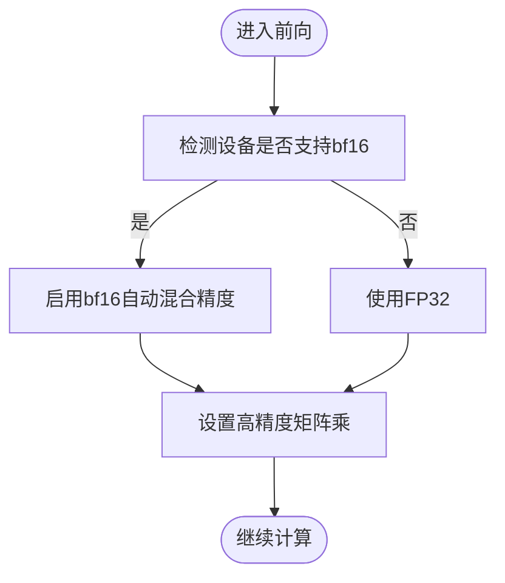
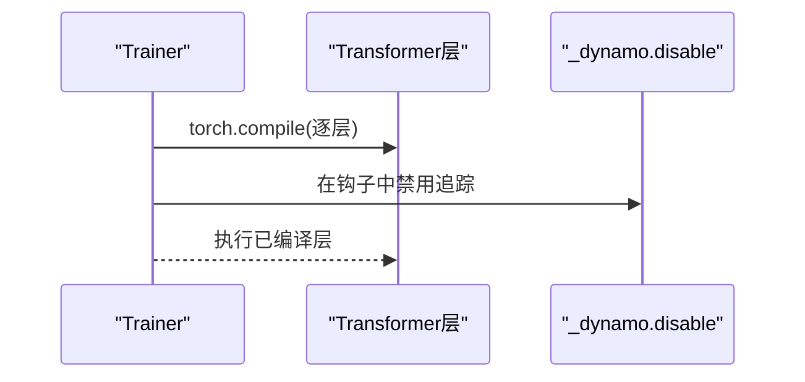
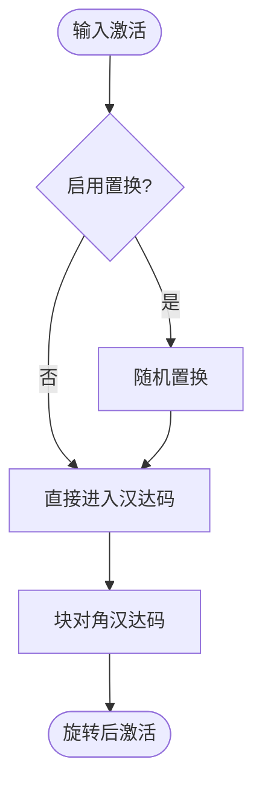
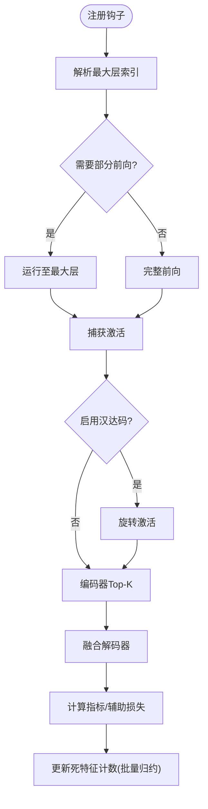
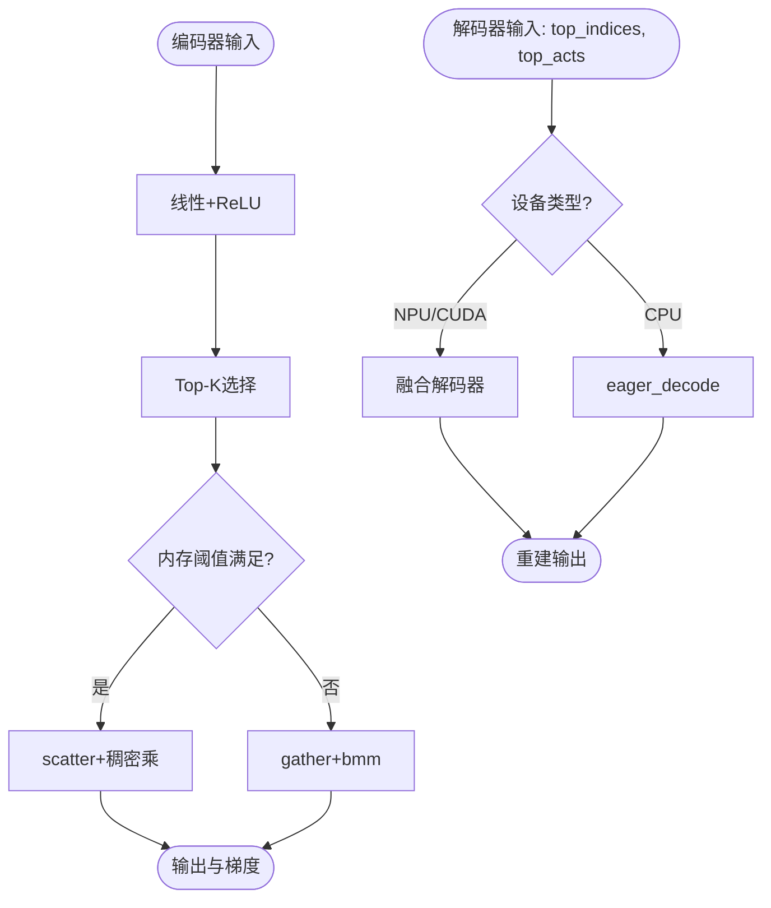
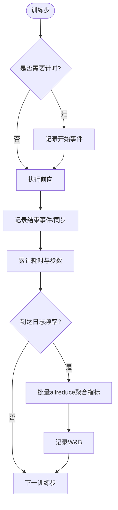
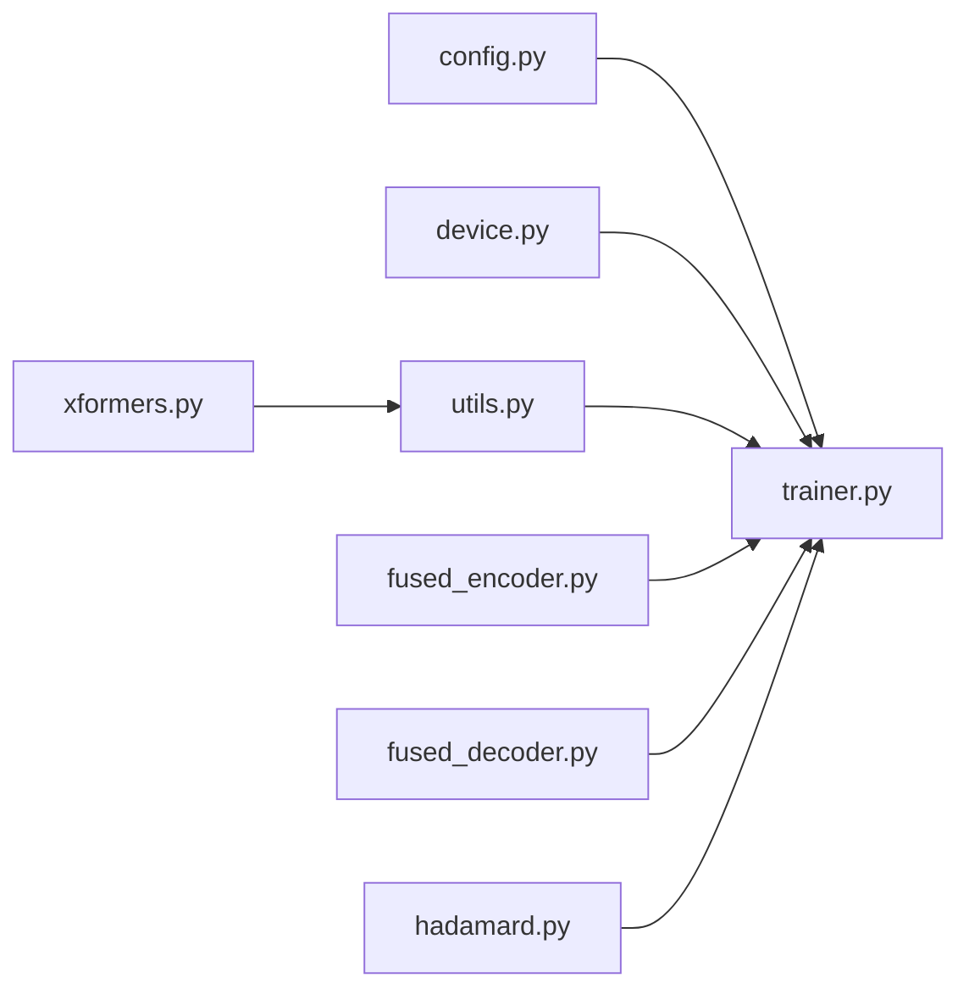

# 性能优化技术

<cite>
**本文引用的文件**
- [sparsify/__main__.py](file://sparsify/__main__.py)
- [sparsify/trainer.py](file://sparsify/trainer.py)
- [sparsify/config.py](file://sparsify/config.py)
- [sparsify/device.py](file://sparsify/device.py)
- [sparsify/utils.py](file://sparsify/utils.py)
- [sparsify/fused_encoder.py](file://sparsify/fused_encoder.py)
- [sparsify/fused_decoder.py](file://sparsify/fused_decoder.py)
- [sparsify/hadamard.py](file://sparsify/hadamard.py)
- [sparsify/xformers.py](file://sparsify/xformers.py)
- [docs/architecture/performance.md](file://docs/architecture/performance.md)
- [scripts/ascend/profile_sae.py](file://scripts/ascend/profile_sae.py)
- [benchmarks/bench_scatter.py](file://benchmarks/bench_scatter.py)
- [README.md](file://README.md)
</cite>

## 目录
1. [简介](#简介)
2. [项目结构](#项目结构)
3. [核心组件](#核心组件)
4. [架构总览](#架构总览)
5. [详细组件分析](#详细组件分析)
6. [依赖分析](#依赖分析)
7. [性能考量](#性能考量)
8. [故障排查指南](#故障排查指南)
9. [结论](#结论)
10. [附录](#附录)

## 简介
本文件系统性梳理 Sparsify 在稀疏自编码器（SAE）训练中的性能优化技术，重点覆盖以下方面：
- 混合精度训练：bf16 自动混合精度与设备抽象
- torch.compile 编译优化：Transformer 层编译与内核融合
- 内核融合与自定义 Autograd：编码器/解码器融合、NPU 友好反向
- 汉达码旋转优化：预处理与逆变换的代价权衡
- 注意力与激活优化：部分前向、Top-K 选择、稀疏重构
- 内存管理策略：阈值控制、延迟归约、避免 CPU 回落
- 性能监控与瓶颈分析：事件计时、指标聚合、日志频率
- 跨硬件平台策略：CUDA/NPU 适配与缓存优化
- 基准测试与对比分析：散列融合替代方案、NPU 事件计时
- 最佳实践与优化配置示例：参数调优、运行策略

## 项目结构
Sparsify 的性能相关实现集中在训练器、设备抽象、融合算子与工具函数中，形成“钩子驱动的训练循环 + 设备无关的融合内核”的高性能路径。

**图表来源**
- [sparsify/__main__.py:131-211](file://sparsify/__main__.py#L131-L211)
- [sparsify/trainer.py:162-760](file://sparsify/trainer.py#L162-L760)
- [sparsify/config.py:28-149](file://sparsify/config.py#L28-L149)
- [sparsify/device.py:34-118](file://sparsify/device.py#L34-L118)
- [sparsify/utils.py:33-227](file://sparsify/utils.py#L33-L227)
- [sparsify/fused_encoder.py:21-107](file://sparsify/fused_encoder.py#L21-L107)
- [sparsify/fused_decoder.py:27-107](file://sparsify/fused_decoder.py#L27-L107)
- [sparsify/xformers.py:188-218](file://sparsify/xformers.py#L188-L218)
- [sparsify/hadamard.py:66-259](file://sparsify/hadamard.py#L66-L259)

**章节来源**
- [README.md:71-103](file://README.md#L71-L103)
- [docs/architecture/performance.md:1-75](file://docs/architecture/performance.md#L1-L75)

## 核心组件
- 训练器（Trainer）：负责钩子注册、前向/反向执行、梯度累积、指标聚合与日志记录；支持 torch.compile 编译与事件计时。
- 设备抽象（device.py）：统一 bf16 自动混合精度、事件计时、分布式后端选择与设备同步。
- 融合算子：编码器/解码器自定义 Autograd，优先稠密中间态（阈值内）再回退到稀疏/向量化路径。
- 工具函数（utils.py）：部分前向、宽度解析、解码器实现选择（NPU/CUDA 优先融合，否则回退）。
- 汉达码旋转（hadamard.py）：块对角汉达码预处理，可选随机置换，支持 dtype 缓存与逆变换。
- 配置（config.py）：训练超参、编译开关、Hadamard 参数、日志频率、阈值评估等。

**章节来源**
- [sparsify/trainer.py:39-760](file://sparsify/trainer.py#L39-L760)
- [sparsify/device.py:34-118](file://sparsify/device.py#L34-L118)
- [sparsify/fused_encoder.py:21-107](file://sparsify/fused_encoder.py#L21-L107)
- [sparsify/fused_decoder.py:27-107](file://sparsify/fused_decoder.py#L27-L107)
- [sparsify/utils.py:33-227](file://sparsify/utils.py#L33-L227)
- [sparsify/hadamard.py:66-259](file://sparsify/hadamard.py#L66-L259)
- [sparsify/config.py:28-149](file://sparsify/config.py#L28-L149)

## 架构总览
Sparsify 的性能路径由“设备无关的混合精度 + 融合内核 + 钩子驱动 + 编译优化”构成，训练器在每个训练步中：
- 注册钩子捕获激活
- 可选汉达码旋转
- 调用融合编码器/解码器
- 执行辅助损失与死特征处理
- 统一事件计时与指标聚合

**图表来源**
- [sparsify/__main__.py:131-211](file://sparsify/__main__.py#L131-L211)
- [sparsify/trainer.py:162-760](file://sparsify/trainer.py#L162-L760)
- [sparsify/device.py:101-118](file://sparsify/device.py#L101-L118)
- [sparsify/hadamard.py:155-187](file://sparsify/hadamard.py#L155-L187)
- [sparsify/fused_encoder.py:21-107](file://sparsify/fused_encoder.py#L21-L107)
- [sparsify/fused_decoder.py:27-107](file://sparsify/fused_decoder.py#L27-L107)

## 详细组件分析

### 混合精度与设备抽象
- bf16 自动混合精度：通过设备装饰器在 CUDA/NPU 上启用 bf16，CPU 上自动降级；同时设置浮点矩阵乘精度以利用 Tensor Cores。
- 事件计时与同步：按设备类型创建事件，使用记录/同步测量前向与指标耗时。
- 分布式后端：根据设备类型选择 nccl/hccl/gloo，确保跨进程一致性。

**图表来源**
- [sparsify/device.py:58-64](file://sparsify/device.py#L58-L64)
- [sparsify/device.py:101-118](file://sparsify/device.py#L101-L118)
- [sparsify/trainer.py:163-164](file://sparsify/trainer.py#L163-L164)

**章节来源**
- [sparsify/device.py:34-118](file://sparsify/device.py#L34-L118)
- [sparsify/trainer.py:163-164](file://sparsify/trainer.py#L163-L164)

### torch.compile 编译优化与内核融合
- 层编译：在训练循环中对 Transformer 层逐一编译，融合小算子（如元素级/层归一化/类型转换），降低启动开销。
- 动态图禁用：在钩子内部禁用 Dynamo 追踪，保证 DDP 自动求导钩子正确触发。
- 平台限制：仅在 CUDA 上启用编译，NPU/CPU 自动关闭。

**图表来源**
- [sparsify/trainer.py:481-496](file://sparsify/trainer.py#L481-L496)
- [sparsify/config.py:138-142](file://sparsify/config.py#L138-L142)

**章节来源**
- [sparsify/trainer.py:481-496](file://sparsify/trainer.py#L481-L496)
- [sparsify/config.py:138-142](file://sparsify/config.py#L138-L142)
- [docs/architecture/performance.md:26-34](file://docs/architecture/performance.md#L26-L34)

### 汉达码旋转优化
- 结构：块对角汉达码 + 可选随机置换，支持 dtype 缓存与逆变换。
- 成本：增加一次线性变换与可选置换，属于“预处理增益 vs 计算开销”的权衡。
- 使用：在钩子中按需初始化，先旋转再编码，必要时在指标计算中逆变换还原。

**图表来源**
- [sparsify/hadamard.py:155-187](file://sparsify/hadamard.py#L155-L187)
- [sparsify/trainer.py:359-371](file://sparsify/trainer.py#L359-L371)

**章节来源**
- [sparsify/hadamard.py:66-259](file://sparsify/hadamard.py#L66-L259)
- [sparsify/trainer.py:359-371](file://sparsify/trainer.py#L359-L371)
- [docs/architecture/performance.md:50-53](file://docs/architecture/performance.md#L50-L53)

### 注意力与激活优化
- 部分前向：当所有钩子位于最终层之前时，仅运行到最大层索引，跳过后续层，显著减少计算。
- Top-K 稀疏：编码器输出仅保留前 k 个最大激活，降低解码器与重建成本。
- 死特征处理：使用“累计令牌数 - 唯一计数”策略，避免昂贵的 per-forward scatter，改用一次性 cat+索引写入。

**图表来源**
- [sparsify/utils.py:82-154](file://sparsify/utils.py#L82-L154)
- [sparsify/trainer.py:347-480](file://sparsify/trainer.py#L347-L480)
- [sparsify/trainer.py:575-648](file://sparsify/trainer.py#L575-L648)

**章节来源**
- [sparsify/utils.py:82-154](file://sparsify/utils.py#L82-L154)
- [sparsify/trainer.py:347-480](file://sparsify/trainer.py#L347-L480)
- [sparsify/trainer.py:575-648](file://sparsify/trainer.py#L575-L648)

### 内核融合与内存管理策略
- 编码器融合：线性+ReLU+Top-K 后，自定义反向通过“稠密系数矩阵 + 稠密乘法”或“gather+bmm”两种路径，依据内存阈值切换。
- 解码器融合（NPU 友好）：在 NPU/CUDA 上优先使用融合解码器，避免原生 embedding_bag 反向的 CPU 回落；阈值外回退到 embedding_bag。
- 解码器实现选择：根据设备类型动态选择 fused_decode 或 eager_decode；Triton 版本可选。
- 内存阈值：默认约 256MB，平衡稠密中间态与稀疏/向量化路径。

**图表来源**
- [sparsify/fused_encoder.py:21-107](file://sparsify/fused_encoder.py#L21-L107)
- [sparsify/fused_decoder.py:27-107](file://sparsify/fused_decoder.py#L27-L107)
- [sparsify/utils.py:187-196](file://sparsify/utils.py#L187-L196)

**章节来源**
- [sparsify/fused_encoder.py:18-107](file://sparsify/fused_encoder.py#L18-L107)
- [sparsify/fused_decoder.py:18-107](file://sparsify/fused_decoder.py#L18-L107)
- [sparsify/utils.py:187-196](file://sparsify/utils.py#L187-L196)

### 性能监控指标与瓶颈分析
- 计时指标：前向平均耗时、指标计算平均耗时、按步计数；仅在需要日志时开启事件计时，减少开销。
- 指标聚合：每 log 频率进行一次 allreduce，合并各 GPU 指标，降低通信频次。
- 指标内容：FVU、AuxK、死特征比例、阈值超出比例（exceed）。
- 瓶颈定位：结合事件计时与日志频率，识别前向、指标计算、通信与死特征计数更新的热点阶段。

**图表来源**
- [sparsify/trainer.py:267-290](file://sparsify/trainer.py#L267-L290)
- [sparsify/trainer.py:524-567](file://sparsify/trainer.py#L524-L567)
- [sparsify/trainer.py:654-720](file://sparsify/trainer.py#L654-L720)

**章节来源**
- [sparsify/trainer.py:267-290](file://sparsify/trainer.py#L267-L290)
- [sparsify/trainer.py:524-567](file://sparsify/trainer.py#L524-L567)
- [sparsify/trainer.py:654-720](file://sparsify/trainer.py#L654-L720)

### 不同硬件平台的优化策略与缓存优化
- CUDA 默认路径：启用 bf16、Tensor Cores、可选 torch.compile；融合解码器与编码器路径均可用。
- NPU 兼容路径：设备抽象自动选择 hccl、bf16 支持；优先使用融合解码器避免 CPU 回落；汉达码旋转与阈值评估可选。
- 缓存优化：汉达码类缓存 dtype 对应的 H 矩阵，避免重复类型转换；融合算子阈值控制稠密/稀疏路径切换。
- 日志与通信：统一 allreduce/广播策略，确保多卡一致性。

**章节来源**
- [sparsify/device.py:34-118](file://sparsify/device.py#L34-L118)
- [sparsify/utils.py:187-196](file://sparsify/utils.py#L187-L196)
- [sparsify/hadamard.py:122-140](file://sparsify/hadamard.py#L122-L140)
- [docs/architecture/performance.md:54-71](file://docs/architecture/performance.md#L54-L71)

### 基准测试、对比分析与最佳实践
- 散列融合替代基准：在 NPU 上比较 scatter+matmul、index_put+matmul、gather+elementwise+sum、gather+bmm 等路径，区分事件计时、流水线计时与同步计时三种模式，揭示 CPU 回落导致的隐藏延迟。
- NPU 算子剖析：提供 Ascend NPU 的剖析脚本，生成 Chrome Trace 与 CSV 汇总，便于定位热点算子。
- 最佳实践：
  - CUDA：优先启用 bf16/Tensor Cores，按需启用 torch.compile；使用融合解码器；合理设置日志频率。
  - NPU：启用融合解码器；避免触发 CPU 回落；关注阈值外回退路径的性能差异。
  - 汉达码：仅在收益明显时启用，注意预处理开销；确保块大小为 2 的幂且整除维度。
  - 指标评估：结合 exceed 指标与肘部阈值，评估重建误差分布。

**章节来源**
- [benchmarks/bench_scatter.py:19-176](file://benchmarks/bench_scatter.py#L19-L176)
- [scripts/ascend/profile_sae.py:101-222](file://scripts/ascend/profile_sae.py#L101-L222)
- [docs/architecture/performance.md:54-71](file://docs/architecture/performance.md#L54-L71)

## 依赖分析
- 训练器依赖设备抽象进行 bf16 与事件计时，依赖工具函数进行部分前向与解码器实现选择，依赖融合算子提供高效内核。
- 配置文件控制编译开关、汉达码参数与日志频率，影响运行时路径与性能表现。
- 汉达码与融合算子相互独立但可在同一前向链路中组合使用。

**图表来源**
- [sparsify/config.py:28-149](file://sparsify/config.py#L28-L149)
- [sparsify/trainer.py:162-760](file://sparsify/trainer.py#L162-L760)
- [sparsify/device.py:34-118](file://sparsify/device.py#L34-L118)
- [sparsify/utils.py:33-227](file://sparsify/utils.py#L33-L227)
- [sparsify/fused_encoder.py:21-107](file://sparsify/fused_encoder.py#L21-L107)
- [sparsify/fused_decoder.py:27-107](file://sparsify/fused_decoder.py#L27-L107)
- [sparsify/xformers.py:188-218](file://sparsify/xformers.py#L188-L218)

**章节来源**
- [sparsify/trainer.py:162-760](file://sparsify/trainer.py#L162-L760)
- [sparsify/config.py:28-149](file://sparsify/config.py#L28-L149)

## 性能考量
- 计算与通信：尽量减少 per-hookpoint 的 allreduce 次数，采用批量归约；在需要计时的步上进行一次同步即可覆盖指标计时。
- 内存与带宽：融合算子在阈值内使用稠密中间态，阈值外回退到向量化/稀疏路径，平衡内存占用与吞吐。
- 启动开销：torch.compile 融合小算子，显著降低 kernel launch 开销；仅在 CUDA 生效。
- 混合精度：bf16 在现代 GPU 上通常提供更高吞吐；Tensor Cores 需配合合适的矩阵乘精度设置。
- 指标与日志：合理设置日志频率，避免频繁同步与通信；exceed 指标有助于发现重建误差异常区域。

[本节为通用性能讨论，无需特定文件分析]

## 故障排查指南
- CUDA/NPU 事件计时无效：确认设备类型与事件创建逻辑；在非 CUDA/NPU 上事件返回空。
- 指标计时异常：检查 should_time 条件与同步位置，确保仅在需要日志时开启计时。
- 死特征计数更新缓慢：确认使用 cat+索引写入替代 per-forward scatter，避免 NPU 上的 AI_CPU 回落。
- 编译失败或 DDP 钩子异常：在钩子中禁用 Dynamo 追踪，确保 DDP autograd 钩子正常触发。
- NPU 融合解码器回退：检查阈值外路径是否被触发，必要时调整 k 或内存阈值。

**章节来源**
- [sparsify/device.py:75-90](file://sparsify/device.py#L75-L90)
- [sparsify/trainer.py:267-290](file://sparsify/trainer.py#L267-L290)
- [sparsify/trainer.py:575-648](file://sparsify/trainer.py#L575-L648)
- [sparsify/trainer.py:481-488](file://sparsify/trainer.py#L481-L488)
- [sparsify/fused_decoder.py:39-50](file://sparsify/fused_decoder.py#L39-L50)

## 结论
Sparsify 的性能优化以“设备无关的混合精度 + 融合内核 + 钩子驱动 + 编译优化”为核心路径，通过阈值控制、延迟归约与事件计时等手段，在 CUDA/NPU 上实现高效稳定的 SAE 训练。汉达码旋转与注意力/激活优化进一步改善重建质量与稳定性。建议在 CUDA 上启用 bf16/Tensor Cores 与 torch.compile，在 NPU 上优先使用融合解码器并避免 CPU 回落；结合基准测试与剖析工具持续迭代参数与策略。

[本节为总结性内容，无需特定文件分析]

## 附录
- 优化配置示例（基于配置项）
  - CUDA 主线：启用 bf16、Tensor Cores、torch.compile；使用融合解码器；合理设置日志频率。
  - NPU 兼容：启用 bf16、HCCL、融合解码器；避免触发 CPU 回落；按需启用汉达码。
  - 汉达码：块大小为 2 的幂且整除维度；仅在收益明显时启用。
  - 指标评估：启用 exceed 指标与肘部阈值文件，定期评估重建误差分布。
- 性能提升案例（来自基准与剖析）
  - NPU 散列融合替代：在不同计时模式下对比多种路径，识别 CPU 回落带来的隐藏延迟。
  - Ascend NPU 剖析：生成 Chrome Trace 与 CSV 汇总，定位热点算子与内核时间分布。

**章节来源**
- [sparsify/config.py:28-149](file://sparsify/config.py#L28-L149)
- [benchmarks/bench_scatter.py:19-176](file://benchmarks/bench_scatter.py#L19-L176)
- [scripts/ascend/profile_sae.py:101-222](file://scripts/ascend/profile_sae.py#L101-L222)
- [docs/architecture/performance.md:54-71](file://docs/architecture/performance.md#L54-L71)