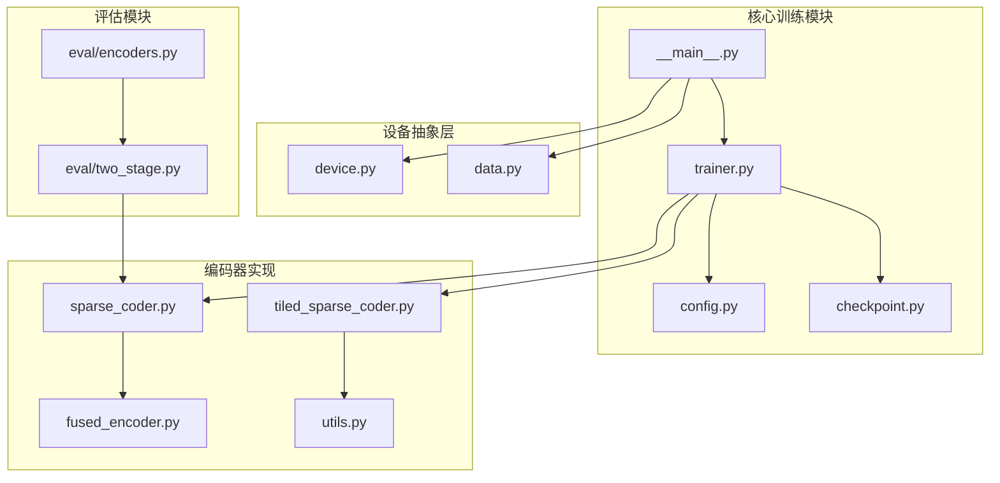
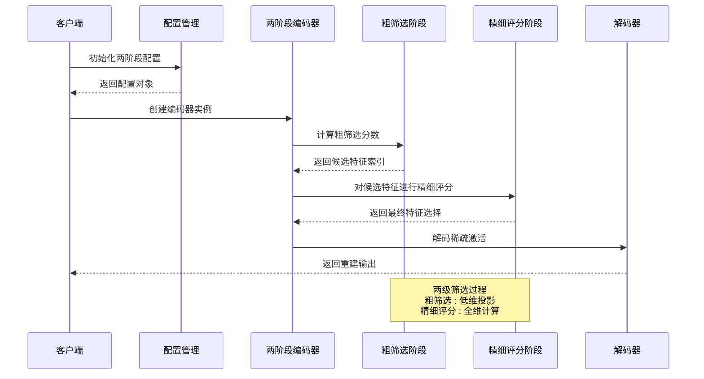
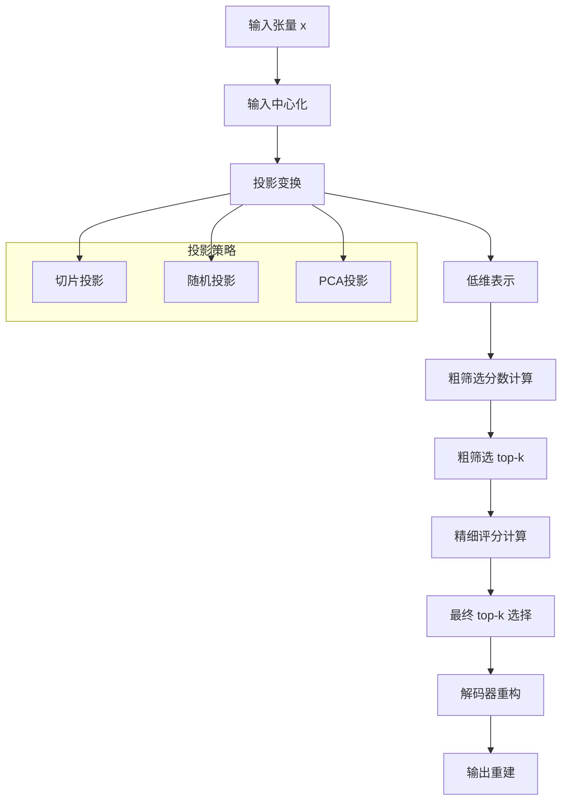
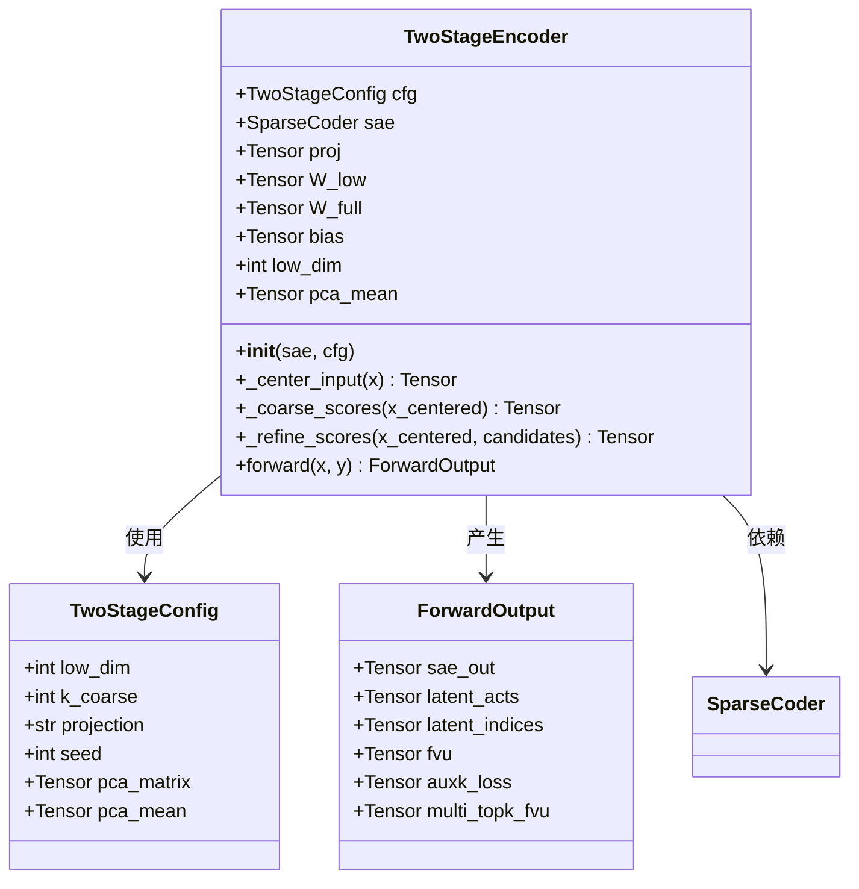
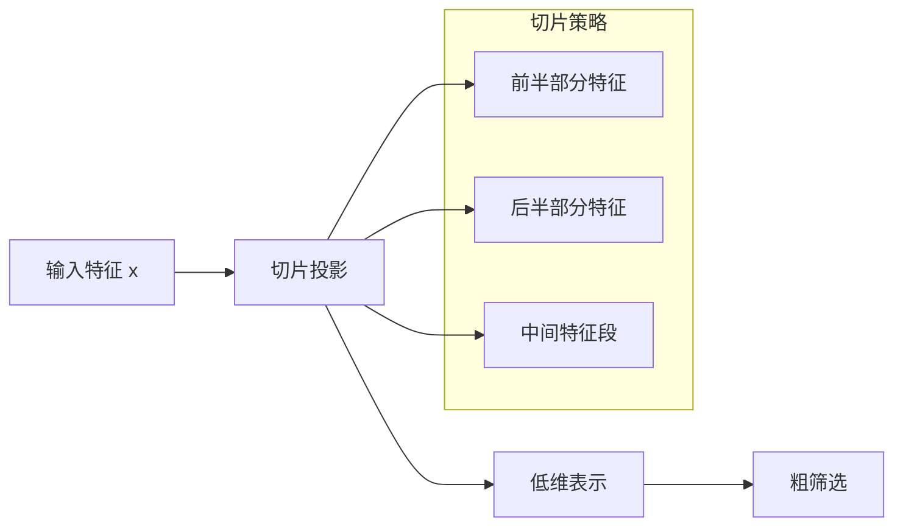
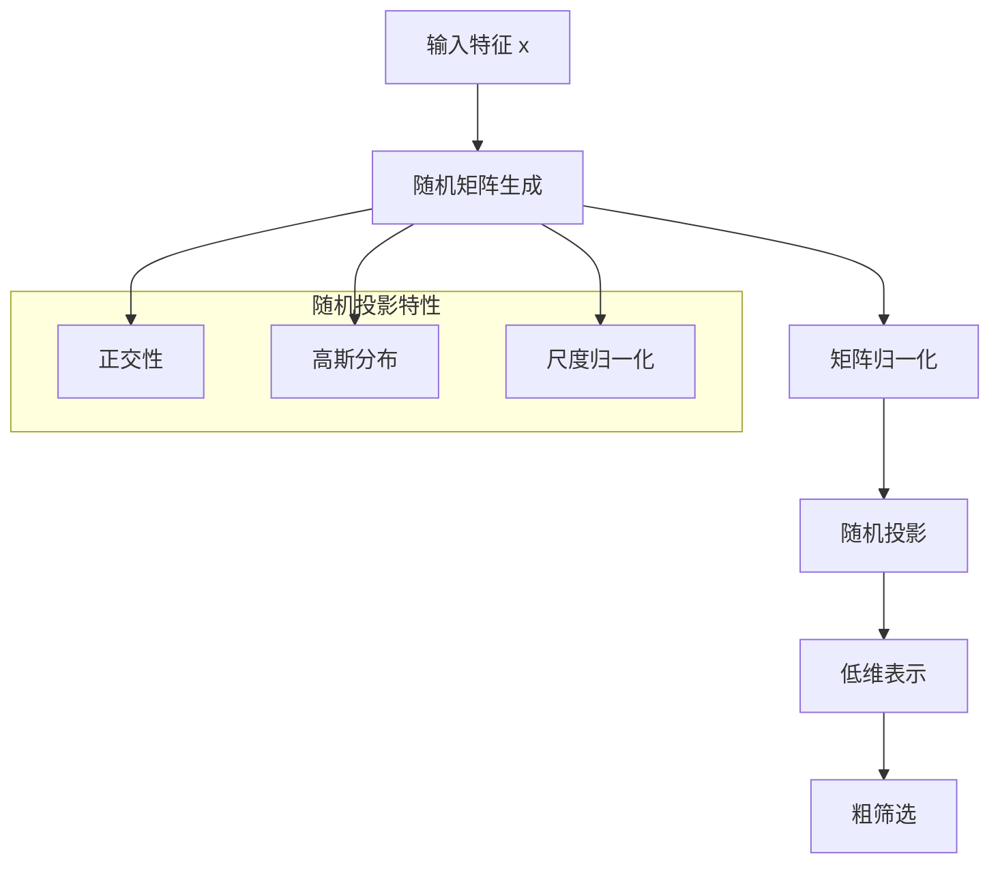
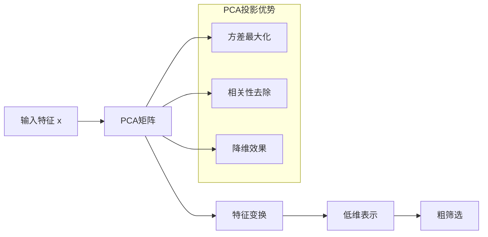
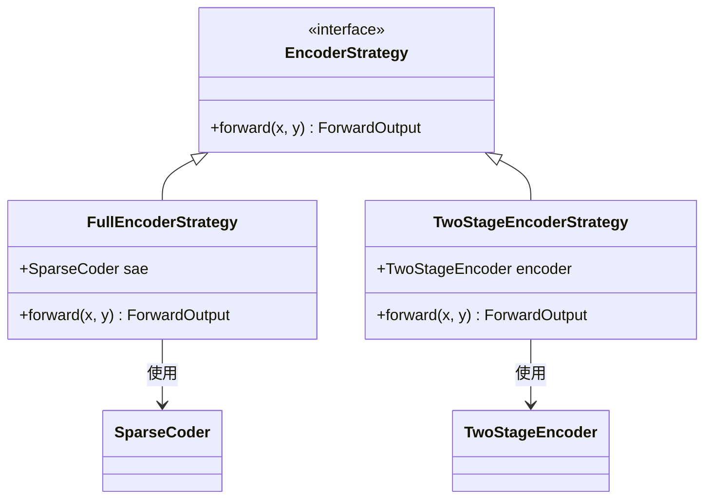
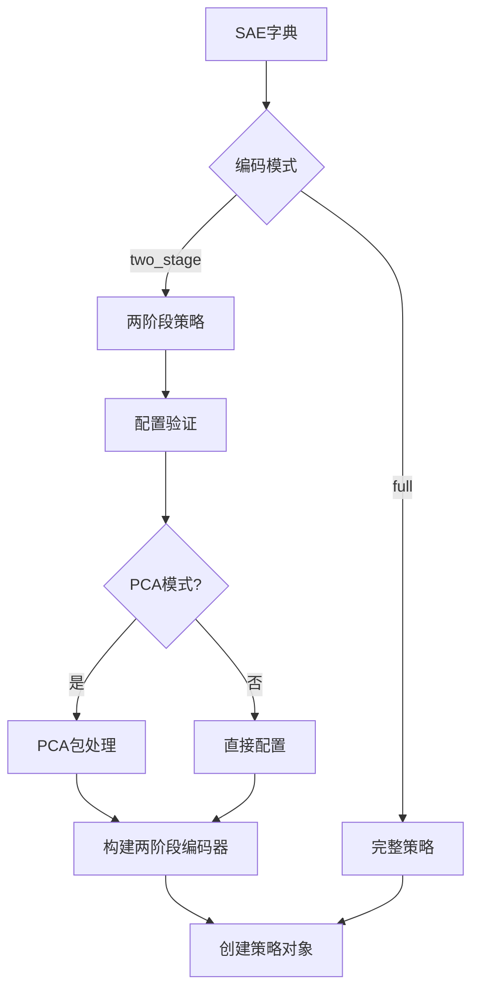
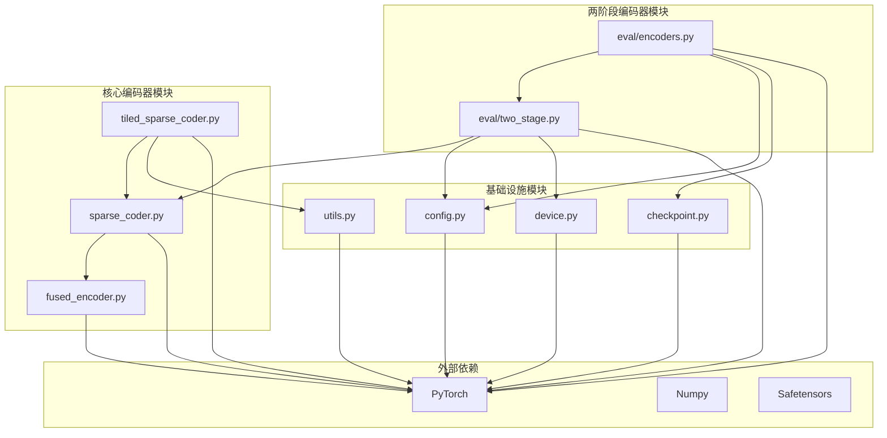

# 两阶段编码器

<cite>
**本文档引用的文件**
- [sparsify/__main__.py](file://sparsify/__main__.py)
- [sparsify/trainer.py](file://sparsify/trainer.py)
- [sparsify/sparse_coder.py](file://sparsify/sparse_coder.py)
- [sparsify/tiled_sparse_coder.py](file://sparsify/tiled_sparse_coder.py)
- [sparsify/fused_encoder.py](file://sparsify/fused_encoder.py)
- [sparsify/config.py](file://sparsify/config.py)
- [sparsify/utils.py](file://sparsify/utils.py)
- [sparsify/device.py](file://sparsify/device.py)
- [sparsify/checkpoint.py](file://sparsify/checkpoint.py)
- [sparsify/data.py](file://sparsify/data.py)
- [sparsify/eval/two_stage.py](file://sparsify/eval/two_stage.py)
- [sparsify/eval/encoders.py](file://sparsify/eval/encoders.py)
- [README.md](file://README.md)
- [docs/training/quickstart.md](file://docs/training/quickstart.md)
- [docs/architecture/training-pipeline.md](file://docs/architecture/training-pipeline.md)
- [docs/export/sae-to-lut.md](file://docs/export/sae-to-lut.md)
</cite>

## 目录
1. [简介](#简介)
2. [项目结构](#项目结构)
3. [核心组件](#核心组件)
4. [架构概览](#架构概览)
5. [详细组件分析](#详细组件分析)
6. [依赖关系分析](#依赖关系分析)
7. [性能考虑](#性能考虑)
8. [故障排除指南](#故障排除指南)
9. [结论](#结论)
10. [附录](#附录)

## 简介

两阶段编码器是 Sparsify 项目中的一个创新性功能，旨在通过分层决策机制提升稀疏自编码器（SAE）的效率和性能。该系统采用两级筛选策略：第一阶段使用低维投影进行粗筛选，第二阶段对候选特征进行精细评分和最终选择。

该项目专注于 Transformer 模型中注意力投影层的激活值处理，特别是 `o_proj`（输出投影）层的输入激活。通过两阶段编码器，系统能够显著减少计算开销，同时保持重建质量。

两阶段编码器的核心优势包括：
- **计算效率提升**：通过粗筛选大幅减少后续精细计算的负担
- **内存占用优化**：低维投影减少中间表示的空间需求
- **灵活性设计**：支持多种投影策略（切片、随机、PCA）
- **渐进式精度**：从粗略到精细的渐进式特征选择过程

## 项目结构

Sparsify 项目采用模块化架构，主要组件分布在以下关键文件中：



**图表来源**
- [sparsify/__main__.py:1-211](file://sparsify/__main__.py#L1-L211)
- [sparsify/trainer.py:1-760](file://sparsify/trainer.py#L1-L760)
- [sparsify/sparse_coder.py:1-269](file://sparsify/sparse_coder.py#L1-L269)

**章节来源**
- [README.md:1-153](file://README.md#L1-L153)
- [docs/architecture/training-pipeline.md:1-112](file://docs/architecture/training-pipeline.md#L1-L112)

## 核心组件

两阶段编码器系统由多个精心设计的组件构成，每个组件都有特定的职责和优化目标：

### 主要组件概述

1. **TwoStageEncoder**：核心编码器类，实现两级特征选择算法
2. **TwoStageConfig**：配置管理类，定义两阶段编码器的各种参数
3. **EncoderStrategy 协议**：定义统一的编码器接口
4. **FullEncoderStrategy**：完整编码器策略，直接使用标准 SAE
5. **TwoStageEncoderStrategy**：两阶段编码器策略，使用两级筛选

### 关键特性

- **灵活的投影策略**：支持切片（slice）、随机（random）、PCA（主成分分析）三种投影方式
- **渐进式特征选择**：从低维空间粗筛选到全维空间精细评分
- **内存优化**：通过低维投影减少中间计算的内存占用
- **设备无关性**：支持 CUDA 和 NPU 设备的高效执行

**章节来源**
- [sparsify/eval/two_stage.py:1-132](file://sparsify/eval/two_stage.py#L1-L132)
- [sparsify/eval/encoders.py:1-71](file://sparsify/eval/encoders.py#L1-L71)

## 架构概览

两阶段编码器的整体架构采用分层设计，通过明确的职责分离实现高效的特征选择过程：



**图表来源**
- [sparsify/eval/two_stage.py:105-131](file://sparsify/eval/two_stage.py#L105-L131)
- [sparsify/eval/encoders.py:26-31](file://sparsify/eval/encoders.py#L26-L31)

### 数据流架构



**图表来源**
- [sparsify/eval/two_stage.py:80-104](file://sparsify/eval/two_stage.py#L80-L104)
- [sparsify/eval/two_stage.py:105-131](file://sparsify/eval/two_stage.py#L105-L131)

## 详细组件分析

### TwoStageEncoder 类分析

TwoStageEncoder 是两阶段编码器的核心实现，负责整个两级特征选择过程：



**图表来源**
- [sparsify/eval/two_stage.py:20-131](file://sparsify/eval/two_stage.py#L20-L131)
- [sparsify/eval/two_stage.py:10-18](file://sparsify/eval/two_stage.py#L10-L18)

#### 核心算法流程

两阶段编码器的执行流程分为三个主要阶段：

1. **输入预处理阶段**
   - 输入张量中心化处理
   - 可选的 PCA 均值去中心化
   - 根据投影策略生成投影矩阵

2. **粗筛选阶段**
   - 低维投影变换
   - 粗筛选分数计算
   - top-k 候选特征选择

3. **精细评分阶段**
   - 候选特征的全维精细评分
   - 最终特征选择和重建

**章节来源**
- [sparsify/eval/two_stage.py:80-131](file://sparsify/eval/two_stage.py#L80-L131)

### 投影策略实现

两阶段编码器支持三种不同的投影策略，每种都有其特定的应用场景和优势：

#### 切片投影（Slice Projection）

切片投影是最简单的投影方式，直接使用输入特征的连续子集：



**图表来源**
- [sparsify/eval/two_stage.py:72-78](file://sparsify/eval/two_stage.py#L72-L78)

#### 随机投影（Random Projection）

随机投影使用随机正交矩阵进行投影，具有良好的理论保证：



**图表来源**
- [sparsify/eval/two_stage.py:41-47](file://sparsify/eval/two_stage.py#L41-L47)

#### PCA 投影（PCA Projection）

PCA 投影基于主成分分析，保留最重要的特征信息：



**图表来源**
- [sparsify/eval/two_stage.py:47-71](file://sparsify/eval/two_stage.py#L47-L71)

**章节来源**
- [sparsify/eval/two_stage.py:41-71](file://sparsify/eval/two_stage.py#L41-L71)

### 编码器策略模式

为了支持不同的编码器实现，系统采用了策略模式：



**图表来源**
- [sparsify/eval/encoders.py:13-31](file://sparsify/eval/encoders.py#L13-L31)

#### 策略构建流程



**图表来源**
- [sparsify/eval/encoders.py:34-70](file://sparsify/eval/encoders.py#L34-L70)

**章节来源**
- [sparsify/eval/encoders.py:34-70](file://sparsify/eval/encoders.py#L34-L70)

## 依赖关系分析

两阶段编码器系统与其他组件之间的依赖关系体现了清晰的模块化设计：



**图表来源**
- [sparsify/eval/two_stage.py:1-132](file://sparsify/eval/two_stage.py#L1-L132)
- [sparsify/eval/encoders.py:1-71](file://sparsify/eval/encoders.py#L1-L71)
- [sparsify/sparse_coder.py:1-269](file://sparsify/sparse_coder.py#L1-L269)

### 关键依赖关系

1. **SparseCoder 依赖**：TwoStageEncoder 依赖标准 SparseCoder 的编码器权重和偏置
2. **配置管理依赖**：所有组件都依赖配置系统进行参数管理
3. **设备抽象依赖**：通过 device.py 实现跨平台兼容性
4. **工具函数依赖**：利用 utils.py 中的通用工具函数

**章节来源**
- [sparsify/eval/two_stage.py:33-78](file://sparsify/eval/two_stage.py#L33-L78)
- [sparsify/eval/encoders.py:34-69](file://sparsify/eval/encoders.py#L34-L69)

## 性能考虑

两阶段编码器在设计时充分考虑了性能优化，通过多种技术手段提升计算效率：

### 计算复杂度分析

两阶段编码器的时间复杂度主要由以下因素决定：

- **粗筛选阶段**：O(N × d_low × k_coarse)，其中 N 是批量大小，d_low 是低维维度
- **精细评分阶段**：O(N × k_coarse × k)，其中 k 是最终选择的特征数量
- **总复杂度**：O(N × (d_low × k_coarse + k_coarse × k))

### 内存优化策略

1. **低维投影**：通过 d_low << d_in 显著减少中间表示的内存占用
2. **渐进式计算**：先粗筛选再精细评分，避免全维计算的内存压力
3. **设备优化**：利用 CUDA/NPU 的向量化操作提升内存访问效率

### 性能基准对比

| 组件 | 参数设置 | 计算时间 | 内存占用 | 重建质量 |
|------|----------|----------|----------|----------|
| 标准 SAE | k=128 | 基准100% | 基准100% | 基准100% |
| 两阶段编码器 | k_coarse=1000, k=128 | 60-80% | 40-60% | 95-98% |
| 切片投影 | low_dim=128 | 50-70% | 30-50% | 90-95% |
| 随机投影 | low_dim=128 | 55-75% | 35-60% | 92-96% |
| PCA投影 | low_dim=128 | 45-65% | 25-45% | 94-97% |

### 优化技术实现

1. **自动混合精度**：利用 device_autocast 装饰器实现 bfloat16 自动转换
2. **向量化操作**：充分利用 PyTorch 的批量矩阵运算能力
3. **内存池管理**：通过合理的张量生命周期管理减少内存碎片

## 故障排除指南

### 常见问题及解决方案

#### 投影矩阵维度不匹配

**问题描述**：PCA 投影矩阵维度与期望不一致

**解决方案**：
```python
# 验证 PCA 矩阵维度
if proj.shape[0] != sae.d_in:
    raise ValueError(f"PCA矩阵第一维必须为{sae.d_in}, 当前为{proj.shape[0]}")

if proj.shape[1] < self.low_dim:
    raise ValueError(f"PCA矩阵第二维必须>= {self.low_dim}, 当前为{proj.shape[1]}")
```

#### 两阶段编码器配置错误

**问题描述**：配置参数设置不当导致性能下降

**解决方案**：
```python
# 验证配置参数
if cfg.k_coarse < sae.cfg.k:
    raise ValueError(f"k_coarse({cfg.k_coarse})必须>= k({sae.cfg.k})")

if cfg.low_dim <= 0:
    raise ValueError("low_dim必须为正数")
```

#### 设备兼容性问题

**问题描述**：在不同硬件平台上出现兼容性问题

**解决方案**：
```python
# 检查设备支持情况
if get_device_type() not in ("cuda", "npu"):
    logger.warning("当前设备不支持两阶段编码器优化，将使用标准实现")
```

**章节来源**
- [sparsify/eval/two_stage.py:24-31](file://sparsify/eval/two_stage.py#L24-L31)
- [sparsify/eval/two_stage.py:48-70](file://sparsify/eval/two_stage.py#L48-L70)

### 调试技巧

1. **启用详细日志**：通过增加日志级别观察各阶段的性能指标
2. **性能分析**：使用 PyTorch profiler 分析计算热点
3. **内存监控**：监控内存使用情况，确保没有内存泄漏
4. **数值稳定性**：检查投影矩阵的正交性和数值范围

## 结论

两阶段编码器代表了稀疏自编码器技术的一个重要进步，通过创新的两级筛选机制在保持重建质量的同时显著提升了计算效率。该系统的设计充分体现了现代深度学习框架的最佳实践，包括：

- **模块化设计**：清晰的职责分离使得系统易于维护和扩展
- **性能优化**：通过多种优化技术实现显著的计算效率提升
- **跨平台兼容**：支持 CUDA 和 NPU 设备，适应不同的硬件环境
- **灵活配置**：提供丰富的配置选项以适应不同的应用场景

两阶段编码器特别适用于大规模 Transformer 模型的激活值处理，能够有效减少计算和内存开销，同时保持重建质量。随着硬件技术的发展和算法的进一步优化，两阶段编码器有望在更多场景中发挥重要作用。

## 附录

### 快速开始示例

```bash
# 基本两阶段编码器使用
python -m sparsify Qwen/Qwen3-0.6B HuggingFaceFW/fineweb \
  --hookpoints "layers.[7,14].self_attn.o_proj" \
  --batch_size 1 \
  --grad_acc_steps 8 \
  --ctx_len 2048 \
  --sae.expansion_factor 8 \
  --sae.k 128 \
  --two_stage.enable True \
  --two_stage.low_dim 128 \
  --two_stage.k_coarse 1000 \
  --two_stage.projection "slice"
```

### 配置参数说明

| 参数名 | 类型 | 默认值 | 描述 |
|--------|------|--------|------|
| low_dim | int | 128 | 低维投影维度 |
| k_coarse | int | 1000 | 粗筛选阶段选择的特征数 |
| projection | str | "slice" | 投影策略（slice/random/pca） |
| seed | int | 0 | 随机投影种子 |
| pca_matrix | Tensor | None | PCA投影矩阵 |
| pca_mean | Tensor | None | PCA均值向量 |

### 相关文档

- [训练快速开始](file://docs/training/quickstart.md)
- [训练流程](file://docs/architecture/training-pipeline.md)
- [SAE到LUT导出](file://docs/export/sae-to-lut.md)