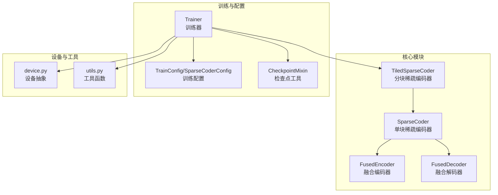
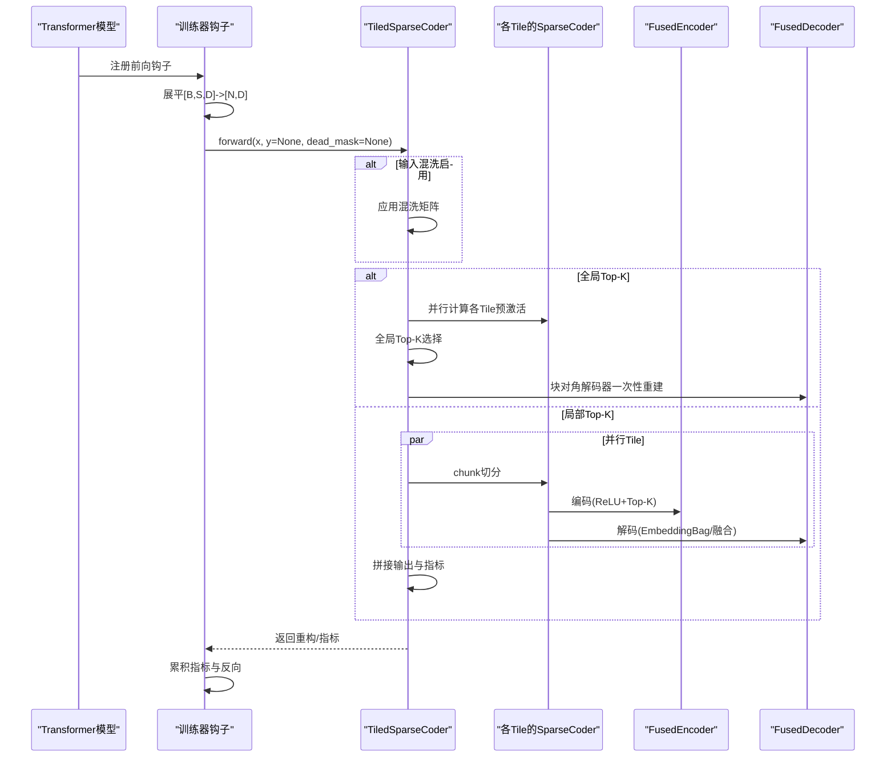
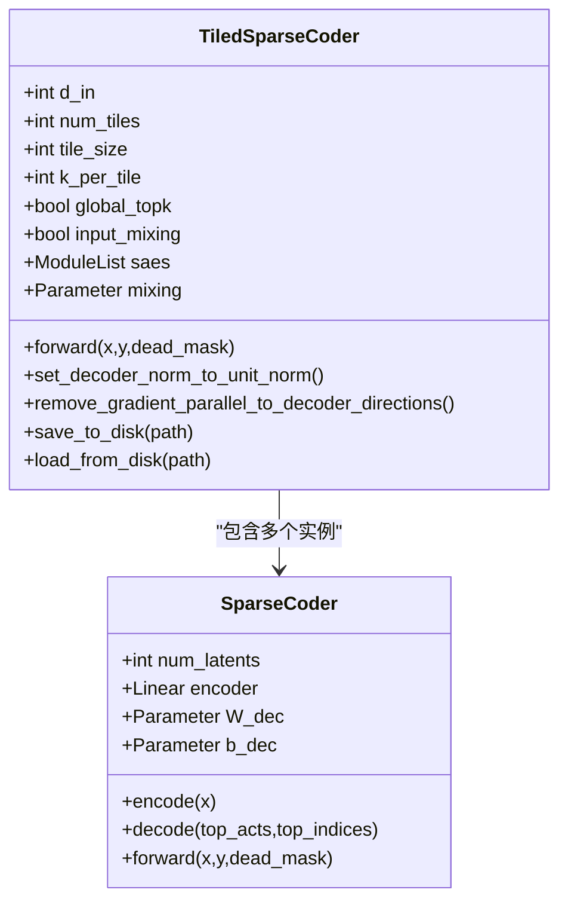
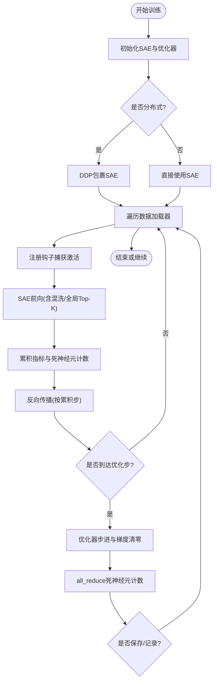
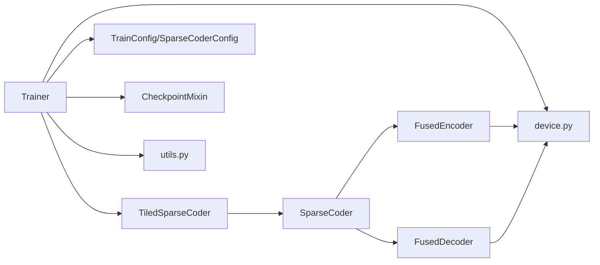

# 分块稀疏编码器

<cite>
**本文档引用的文件**
- [sparsify/tiled_sparse_coder.py](file://sparsify/tiled_sparse_coder.py)
- [sparsify/sparse_coder.py](file://sparsify/sparse_coder.py)
- [sparsify/fused_encoder.py](file://sparsify/fused_encoder.py)
- [sparsify/fused_decoder.py](file://sparsify/fused_decoder.py)
- [sparsify/trainer.py](file://sparsify/trainer.py)
- [sparsify/config.py](file://sparsify/config.py)
- [sparsify/utils.py](file://sparsify/utils.py)
- [sparsify/device.py](file://sparsify/device.py)
- [sparsify/checkpoint.py](file://sparsify/checkpoint.py)
- [docs/training/config-reference.md](file://docs/training/config-reference.md)
- [scripts/tiling_train/script.sh](file://scripts/tiling_train/script.sh)
- [scripts/tiling_train/4B.sh](file://scripts/tiling_train/4B.sh)
- [tests/test_tiled_sparse_coder.py](file://tests/test_tiled_sparse_coder.py)
</cite>

## 目录
1. [简介](#简介)
2. [项目结构](#项目结构)
3. [核心组件](#核心组件)
4. [架构总览](#架构总览)
5. [详细组件分析](#详细组件分析)
6. [依赖关系分析](#依赖关系分析)
7. [性能考量](#性能考量)
8. [故障排除指南](#故障排除指南)
9. [结论](#结论)
10. [附录](#附录)

## 简介
本文件面向分块稀疏编码器（Tiled Sparse Coder）的技术文档，系统阐述其在大规模特征空间下的分块训练架构设计与实现细节。重点包括：
- 隐藏维度的分割策略与并行训练机制
- 全局Top-K与局部Top-K两种竞争模式
- 输入混洗（Input Mixing）带来的跨块信息流动
- 分布式训练中的梯度同步、内存管理与负载均衡
- 分块大小选择指导原则、性能优化技巧与故障排除方法
- 配置示例、使用场景与性能对比分析思路

## 项目结构
该项目围绕稀疏自编码器（SAE）训练构建，分块稀疏编码器作为核心模块，配合融合的编码/解码器、训练器与设备抽象层协同工作。

**图表来源**
- [sparsify/tiled_sparse_coder.py:17-342](file://sparsify/tiled_sparse_coder.py#L17-L342)
- [sparsify/sparse_coder.py:36-269](file://sparsify/sparse_coder.py#L36-L269)
- [sparsify/fused_encoder.py:21-107](file://sparsify/fused_encoder.py#L21-L107)
- [sparsify/fused_decoder.py:27-107](file://sparsify/fused_decoder.py#L27-L107)
- [sparsify/trainer.py:39-760](file://sparsify/trainer.py#L39-L760)
- [sparsify/config.py:7-149](file://sparsify/config.py#L7-L149)
- [sparsify/checkpoint.py:44-73](file://sparsify/checkpoint.py#L44-L73)
- [sparsify/device.py:34-118](file://sparsify/device.py#L34-L118)
- [sparsify/utils.py:33-227](file://sparsify/utils.py#L33-L227)

**章节来源**
- [sparsify/tiled_sparse_coder.py:17-342](file://sparsify/tiled_sparse_coder.py#L17-L342)
- [sparsify/trainer.py:39-160](file://sparsify/trainer.py#L39-L160)

## 核心组件
- 分块稀疏编码器（TiledSparseCoder）：将输入沿隐藏维度切分为T个独立子块，每个子块由一个独立的SparseCoder进行训练；支持全局Top-K与输入混洗两种增强模式。
- 单块稀疏编码器（SparseCoder）：标准SAE，包含编码器线性层、解码器权重共享、偏置项以及辅助损失（AuxK）。
- 融合编码器（FusedEncoder）：将ReLU + Top-K融合为一次自定义前向/反向，自动选择稠密矩阵乘或稀疏gather/bmm路径以平衡内存与带宽。
- 融合解码器（FusedDecoder）：针对NPU兼容性，提供自定义autograd函数替代embedding_bag的反向，避免CPU回退。
- 训练器（Trainer）：负责模型钩子注册、分布式数据并行（DDP）、梯度累积、死神经元检测与同步、日志与检查点保存。
- 配置系统（TrainConfig/SparseCoderConfig）：统一管理SAE架构参数与训练超参，含分块训练开关与混洗选项。
- 设备抽象（device.py）：统一CUDA/NPU/CPUs的事件、同步、bf16支持与后端选择。
- 工具与检查点（utils.py/checkpoint.py）：提供维度解析、部分前向、检查点加载/保存与类型校验。

**章节来源**
- [sparsify/sparse_coder.py:36-269](file://sparsify/sparse_coder.py#L36-L269)
- [sparsify/fused_encoder.py:21-107](file://sparsify/fused_encoder.py#L21-L107)
- [sparsify/fused_decoder.py:27-107](file://sparsify/fused_decoder.py#L27-L107)
- [sparsify/trainer.py:39-200](file://sparsify/trainer.py#L39-L200)
- [sparsify/config.py:7-149](file://sparsify/config.py#L7-L149)
- [sparsify/device.py:34-118](file://sparsify/device.py#L34-L118)
- [sparsify/utils.py:33-227](file://sparsify/utils.py#L33-L227)
- [sparsify/checkpoint.py:44-73](file://sparsify/checkpoint.py#L44-L73)

## 架构总览
分块稀疏编码器通过“按隐藏维度切分 + 独立训练 + 可选全局竞争/输入混洗”实现高效的大规模特征空间训练。整体数据流如下：

**图表来源**
- [sparsify/trainer.py:347-488](file://sparsify/trainer.py#L347-L488)
- [sparsify/tiled_sparse_coder.py:103-253](file://sparsify/tiled_sparse_coder.py#L103-L253)
- [sparsify/fused_encoder.py:21-107](file://sparsify/fused_encoder.py#L21-L107)
- [sparsify/fused_decoder.py:27-107](file://sparsify/fused_decoder.py#L27-L107)

## 详细组件分析

### 分块稀疏编码器（TiledSparseCoder）
- 分割策略：输入维度d_in必须能被num_tiles整除；总活跃特征k也需能被num_tiles整除，每块k_per_tile = k/num_tiles。
- 独立训练：为每个tile构造独立的SparseCoder，参数完全分离，便于并行与扩展。
- 两种前向模式：
  - 局部Top-K：每块独立Top-K，再拼接输出；适合跨块特征隔离与更强的局部稀疏性。
  - 全局Top-K：将所有块的预激活拼接后做一次全局Top-K，随后使用块对角解码器一次性重建，减少循环开销。
- 输入混洗（可选）：引入T×T可学习混洗矩阵，在编码前对块维进行线性组合，允许跨块信息流动；在重构时应用逆变换并在原始空间重新计算FVU。
- 指标合并：将各块的latent_indices按块偏移拼接，确保全局唯一索引范围。
- 权重与偏置：提供批量设置b_dec的方法，并支持统一单位范数的解码器权重初始化。
- 检查点：保存顶层配置（含num_tiles/k_per_tile/global_topk/input_mixing），以及每个tile的独立检查点；若启用输入混洗，同时保存mixing矩阵。

**图表来源**
- [sparsify/tiled_sparse_coder.py:27-61](file://sparsify/tiled_sparse_coder.py#L27-L61)
- [sparsify/sparse_coder.py:36-62](file://sparsify/sparse_coder.py#L36-L62)

**章节来源**
- [sparsify/tiled_sparse_coder.py:17-342](file://sparsify/tiled_sparse_coder.py#L17-L342)

### 融合编码器（FusedEncoder）
- 功能：将线性层+ReLU+Top-K封装为一次自定义autograd函数，前向返回top_acts、top_indices与pre_acts；反向根据阈值自动选择稠密scatter+matmul或稀疏gather+bmm路径，兼顾内存与带宽。
- 适用场景：在CUDA/NPU上显著提升Top-K编码效率，避免传统稀疏索引展开的高内存占用。

**章节来源**
- [sparsify/fused_encoder.py:21-107](file://sparsify/fused_encoder.py#L21-L107)

### 融合解码器（FusedDecoder）
- 功能：替代embedding_bag的反向，提供NPU原生支持的自定义autograd函数；同样根据阈值在稠密路径与稀疏路径间切换。
- 优势：避免NPU后端对aten::_embedding_bag_backward的CPU回退，提升端到端吞吐。

**章节来源**
- [sparsify/fused_decoder.py:27-107](file://sparsify/fused_decoder.py#L27-L107)

### 训练器（Trainer）与分布式训练
- 钩子与前向：在指定模块输入处注册钩子，展平激活后送入SAE；支持Hadarmard旋转、肘部阈值评估与超过比率统计。
- 分布式：在首次迭代时将SAE包裹为DDP，使用no_sync减少同步开销；在累积步结束时执行all_reduce。
- 死神经元：采用“计数累计+MIN归约”的方式高效检测与同步，避免昂贵的scatter操作。
- 梯度处理：在必要时移除与解码器方向平行的梯度分量，保持单位范数；在优化器步骤后进行归一化。
- 日志与检查点：统一记录FVU/AuxK/超过比率等指标，按频率批量all_reduce；保存训练状态、优化器状态与SAE权重。

**图表来源**
- [sparsify/trainer.py:498-722](file://sparsify/trainer.py#L498-L722)

**章节来源**
- [sparsify/trainer.py:39-760](file://sparsify/trainer.py#L39-L760)

### 配置系统（TrainConfig/SparseCoderConfig）
- 关键参数：
  - num_tiles：分块数量（默认1，即禁用分块）
  - global_topk：启用全局Top-K（仅当num_tiles>1时有效）
  - input_mixing：启用输入混洗（仅当num_tiles>1时有效）
  - expansion_factor/num_latents/k：SAE架构参数
  - grad_acc_steps/micro_acc_steps：梯度累积与微批
  - dead_feature_threshold/auxk_alpha：死神经元检测与辅助损失
  - use_hadamard/hadamard_block_size：Hadamard旋转及其块大小
- 参数验证：确保num_tiles整除d_in与k；校验hadamard_block_size为2的幂等。

**章节来源**
- [sparsify/config.py:28-149](file://sparsify/config.py#L28-L149)
- [docs/training/config-reference.md:107-122](file://docs/training/config-reference.md#L107-L122)

### 设备抽象与工具
- device.py：统一设备类型检测、bf16支持、事件与同步、分布式后端选择。
- utils.py：维度解析、部分前向、解码器实现选择（fused/eager/triton）。

**章节来源**
- [sparsify/device.py:34-118](file://sparsify/device.py#L34-L118)
- [sparsify/utils.py:33-227](file://sparsify/utils.py#L33-L227)

## 依赖关系分析
- 组件耦合：
  - TiledSparseCoder依赖SparseCoder与设备/工具模块；在全局Top-K模式下依赖块对角解码器实现。
  - Trainer依赖TiledSparseCoder/SparseCoder、分布式接口、检查点工具与设备抽象。
  - FusedEncoder/FusedDecoder与设备类型强相关，自动选择最优实现。
- 外部依赖：
  - torch.distributed（NCCL/HCCN）用于DDP；schedulefree用于优化器包装；safetensors用于高效权重存储。
- 潜在循环依赖：当前模块间无循环导入，职责清晰。

**图表来源**
- [sparsify/trainer.py:21-34](file://sparsify/trainer.py#L21-L34)
- [sparsify/tiled_sparse_coder.py:11-14](file://sparsify/tiled_sparse_coder.py#L11-L14)
- [sparsify/sparse_coder.py:14-17](file://sparsify/sparse_coder.py#L14-L17)
- [sparsify/fused_encoder.py:1-107](file://sparsify/fused_encoder.py#L1-L107)
- [sparsify/fused_decoder.py:1-107](file://sparsify/fused_decoder.py#L1-L107)

**章节来源**
- [sparsify/trainer.py:21-34](file://sparsify/trainer.py#L21-L34)
- [sparsify/tiled_sparse_coder.py:11-14](file://sparsify/tiled_sparse_coder.py#L11-L14)
- [sparsify/sparse_coder.py:14-17](file://sparsify/sparse_coder.py#L14-L17)

## 性能考量
- 计算复杂度：
  - 局部Top-K：每块独立计算，总FLOPs近似为T倍单块编码+解码；适合特征分布分散的场景。
  - 全局Top-K：一次拼接Top-K与块对角解码，避免循环，适合特征高度集中或需要跨块竞争的场景。
- 内存管理：
  - FusedEncoder/FusedDecoder自动在稠密与稀疏路径间切换，避免大矩阵展开导致的内存峰值。
  - Tiled模式下，每块独立维护参数与激活，显存占用与单块相当，但总参数量增加T倍。
- 通信优化：
  - DDP中使用no_sync减少同步次数；死神经元计数通过all_reduce MIN归约同步，避免散列回退。
  - 指标聚合采用批量all_reduce，降低通信频次。
- 设备适配：
  - NPU后端强制使用fused解码器，避免CPU回退；bf16自动开启提升吞吐。
- 分块大小选择建议：
  - 当d_in较大且显存受限时，优先增大num_tiles以降低单块参数规模；当k较小或特征高度集中时，考虑global_topk提升跨块竞争效果。
  - num_tiles应同时满足：d_in % num_tiles == 0 且 cfg.k % num_tiles == 0。
- 微批与累积：
  - 适当增大grad_acc_steps与micro_acc_steps可在内存受限时提升有效batch size，但需注意指标缩放与收敛稳定性。

[本节为通用性能讨论，无需特定文件来源]

## 故障排除指南
- 初始化错误：
  - d_in或k不能被num_tiles整除会触发断言失败。请调整分块数或输入维度。
- 混洗与全局Top-K冲突：
  - 同时启用input_mixing与global_topk时，FVU会在原始空间重新计算，确保指标可比。
- 检查点不匹配：
  - 加载检查点时若num_tiles不一致会抛出异常；请确保配置与检查点一致。
- 指标异常：
  - 若出现FVU异常升高，检查是否启用了input_mixing导致的逆变换误差；确认b_dec初始化与数据均值一致。
- 分布式同步问题：
  - 死神经元计数使用MIN归约，若出现计数异常，检查分布式后端与进程组初始化。
- NPU兼容性：
  - 确保使用fused解码器；若仍出现CPU回退，请检查设备类型与后端。

**章节来源**
- [tests/test_tiled_sparse_coder.py:42-52](file://tests/test_tiled_sparse_coder.py#L42-L52)
- [sparsify/checkpoint.py:44-73](file://sparsify/checkpoint.py#L44-L73)
- [sparsify/tiled_sparse_coder.py:103-140](file://sparsify/tiled_sparse_coder.py#L103-L140)

## 结论
分块稀疏编码器通过“隐藏维度切分 + 独立训练 + 可选全局竞争/输入混洗”，在大规模特征空间下实现了高效的分布式训练。结合融合编码/解码器与设备抽象层，系统在计算与内存之间取得良好平衡，并提供了完善的分布式同步与检查点机制。合理选择分块大小、启用全局Top-K或输入混洗，可进一步提升训练效率与表示能力。

[本节为总结性内容，无需特定文件来源]

## 附录

### 配置示例与使用场景
- 基础分块训练（4卡）：参考脚本，设置num_tiles=4，expansion_factor=8，k=128，batch_size=8，grad_acc_steps=8。
- 大模型低秩训练（Qwen3-4B）：设置num_tiles=4，k=320，batch_size=2，grad_acc_steps=8，启用elbow阈值与exceed指标。
- 全局Top-K与输入混洗：在配置中分别启用global_topk与input_mixing，适合特征高度集中或需要跨块信息融合的场景。

**章节来源**
- [scripts/tiling_train/script.sh:11-85](file://scripts/tiling_train/script.sh#L11-L85)
- [scripts/tiling_train/4B.sh:1-36](file://scripts/tiling_train/4B.sh#L1-L36)
- [docs/training/config-reference.md:107-122](file://docs/training/config-reference.md#L107-L122)

### 性能对比分析思路
- 指标：FVU、AuxK、每步时间、峰值显存、死神经元比例、exceed比率。
- 场景：相同k与expansion_factor下比较局部Top-K vs 全局Top-K；相同num_tiles下比较有/无输入混洗；不同num_tiles下的吞吐与显存占用。
- 方法：固定随机种子，控制batch与累积步，使用相同硬件环境与分布式配置，记录关键指标并对比。

[本节为方法论建议，无需特定文件来源]