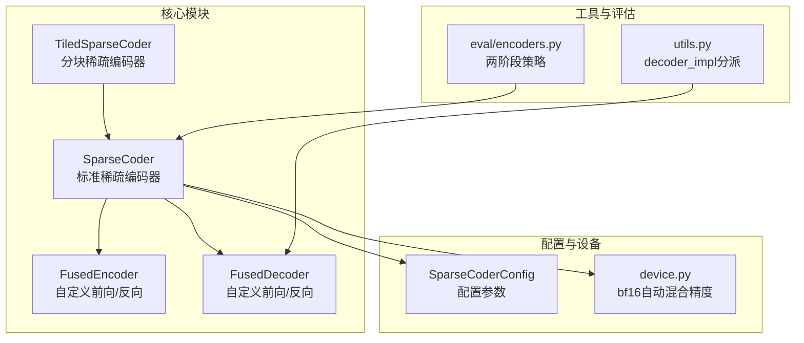
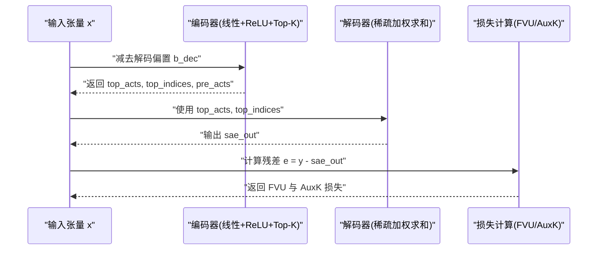
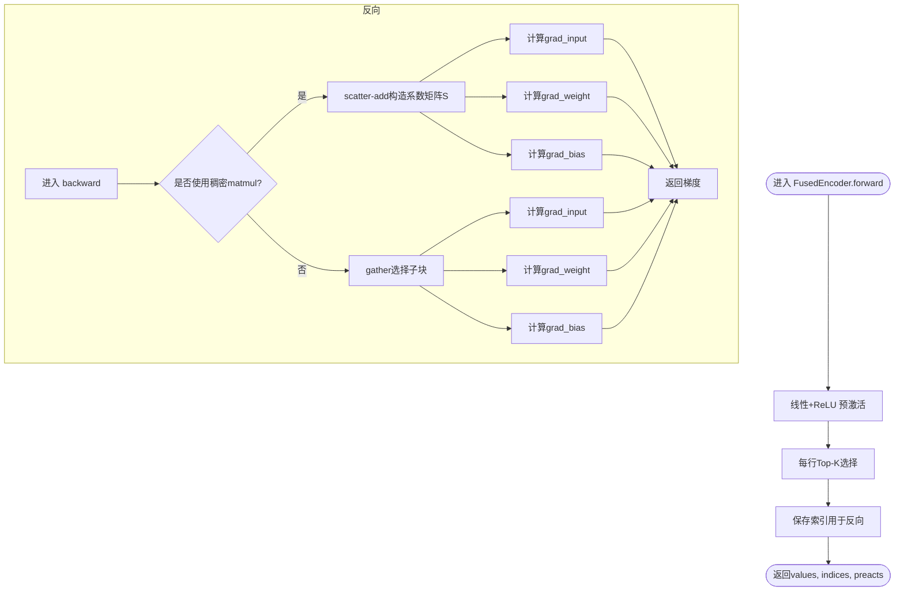
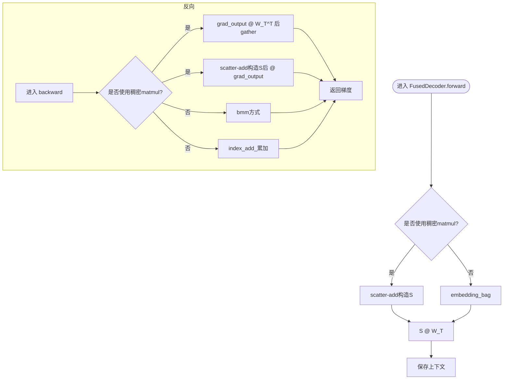
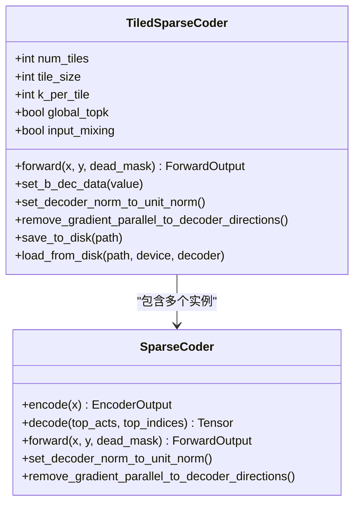
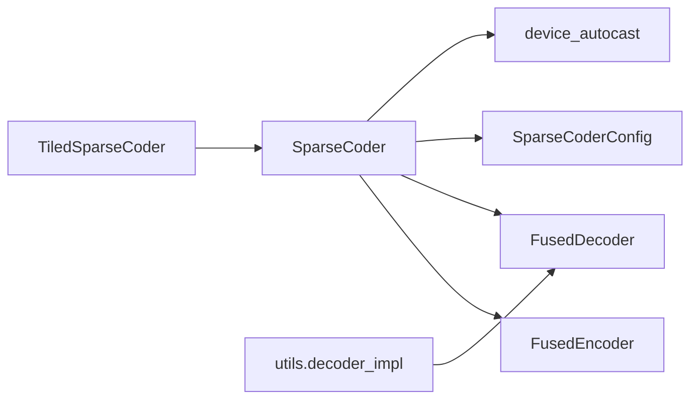

# 标准稀疏编码器

<cite>
**本文引用的文件**   
- [sparsify/sparse_coder.py](file://sparsify/sparse_coder.py)
- [sparsify/fused_encoder.py](file://sparsify/fused_encoder.py)
- [sparsify/fused_decoder.py](file://sparsify/fused_decoder.py)
- [sparsify/tiled_sparse_coder.py](file://sparsify/tiled_sparse_coder.py)
- [sparsify/config.py](file://sparsify/config.py)
- [sparsify/utils.py](file://sparsify/utils.py)
- [sparsify/device.py](file://sparsify/device.py)
- [sparsify/eval/encoders.py](file://sparsify/eval/encoders.py)
- [benchmarks/bench_scatter.py](file://benchmarks/bench_scatter.py)
- [tests/test_encode.py](file://tests/test_encode.py)
- [tests/test_decode.py](file://tests/test_decode.py)
- [docs/training/qwen3-guide.md](file://docs/training/qwen3-guide.md)
- [docs/training/config-reference.md](file://docs/training/config-reference.md)
- [scripts/first_time_train/Qwen3-0.6B/script.sh](file://scripts/first_time_train/Qwen3-0.6B/script.sh)
</cite>

## 目录
1. [引言](#引言)
2. [项目结构](#项目结构)
3. [核心组件](#核心组件)
4. [架构总览](#架构总览)
5. [详细组件分析](#详细组件分析)
6. [依赖分析](#依赖分析)
7. [性能考量](#性能考量)
8. [故障排查指南](#故障排查指南)
9. [结论](#结论)
10. [附录](#附录)

## 引言
本文件面向“标准稀疏编码器”（SparseCoder）的完整技术文档，系统阐述其架构设计与实现细节，覆盖编码器与解码器初始化、权重矩阵设置与归一化策略、前向传播流程（含输入预处理、Top-K 稀疏选择、辅助损失与重构误差）、以及编码器融合（fused encoder/decoder）在不同硬件平台上的优化路径。文档同时给出配置参数说明、典型使用场景与性能基准方法，并通过图示帮助读者建立从概念到代码的清晰映射。

## 项目结构
围绕标准稀疏编码器的关键文件组织如下：
- 核心模块：SparseCoder、FusedEncoder、FusedDecoder、TiledSparseCoder
- 配置与设备抽象：SparseCoderConfig、device 自动类型检测与 bf16 自动混合精度装饰器
- 工具与评估：decoder_impl 分派、两阶段编码器策略、NPU/CUDA 兼容性
- 基准与测试：散点加法替代方案对比、端到端编码/解码正确性验证

图表来源
- [sparsify/sparse_coder.py:36-269](file://sparsify/sparse_coder.py#L36-L269)
- [sparsify/fused_encoder.py:21-107](file://sparsify/fused_encoder.py#L21-L107)
- [sparsify/fused_decoder.py:27-107](file://sparsify/fused_decoder.py#L27-L107)
- [sparsify/tiled_sparse_coder.py:17-342](file://sparsify/tiled_sparse_coder.py#L17-L342)
- [sparsify/config.py:7-26](file://sparsify/config.py#L7-L26)
- [sparsify/utils.py:185-197](file://sparsify/utils.py#L185-L197)
- [sparsify/device.py:101-118](file://sparsify/device.py#L101-L118)
- [sparsify/eval/encoders.py:14-72](file://sparsify/eval/encoders.py#L14-L72)

章节来源
- [sparsify/sparse_coder.py:36-269](file://sparsify/sparse_coder.py#L36-L269)
- [sparsify/fused_encoder.py:21-107](file://sparsify/fused_encoder.py#L21-L107)
- [sparsify/fused_decoder.py:27-107](file://sparsify/fused_decoder.py#L27-L107)
- [sparsify/tiled_sparse_coder.py:17-342](file://sparsify/tiled_sparse_coder.py#L17-L342)
- [sparsify/config.py:7-26](file://sparsify/config.py#L7-L26)
- [sparsify/utils.py:185-197](file://sparsify/utils.py#L185-L197)
- [sparsify/device.py:101-118](file://sparsify/device.py#L101-L118)
- [sparsify/eval/encoders.py:14-72](file://sparsify/eval/encoders.py#L14-L72)

## 核心组件
- SparseCoder：标准自顶向下的稀疏编码器，包含线性编码器、可选解码器、偏置与辅助损失计算；支持从磁盘加载/保存、bf16 自动混合精度加速。
- FusedEncoder：自定义 Autograd 函数，对线性层+ReLU+Top-K 的前向与反向进行融合优化，避免稀疏系数矩阵显式构造。
- FusedDecoder：自定义 Autograd 函数，针对 NPU/CUDA 平台提供原生内核路径，避免回退到 CPU 的 embedding_bag 反向。
- TiledSparseCoder：将输入按隐藏维切分为多个块，每个块独立训练一个 SAE，并提供全局 Top-K 与输入混洗能力。
- SparseCoderConfig：稀疏编码器架构级配置，如扩展因子、隐变量数、Top-K 数量、是否归一化解码器等。
- utils.decoder_impl：根据设备类型动态选择 eager、triton 或 fused 解码实现。
- device.device_autocast：统一的 bf16 自动混合精度装饰器，适配 CUDA/NPU/CPU。

章节来源
- [sparsify/sparse_coder.py:36-269](file://sparsify/sparse_coder.py#L36-L269)
- [sparsify/fused_encoder.py:21-107](file://sparsify/fused_encoder.py#L21-L107)
- [sparsify/fused_decoder.py:27-107](file://sparsify/fused_decoder.py#L27-L107)
- [sparsify/tiled_sparse_coder.py:17-342](file://sparsify/tiled_sparse_coder.py#L17-L342)
- [sparsify/config.py:7-26](file://sparsify/config.py#L7-L26)
- [sparsify/utils.py:185-197](file://sparsify/utils.py#L185-L197)
- [sparsify/device.py:101-118](file://sparsify/device.py#L101-L118)

## 架构总览
标准稀疏编码器以 SparseCoder 为核心，内部组合编码器与解码器两部分。编码器通过线性变换与 ReLU 后进行 Top-K 选择，得到稀疏激活与索引；解码器将稀疏激活与解码权重相乘重建输入；前向过程中还计算重构误差与辅助损失（AuxK），用于抑制死亡特征。

图表来源
- [sparsify/sparse_coder.py:176-239](file://sparsify/sparse_coder.py#L176-L239)
- [sparsify/fused_encoder.py:21-38](file://sparsify/fused_encoder.py#L21-L38)
- [sparsify/fused_decoder.py:27-53](file://sparsify/fused_decoder.py#L27-L53)

章节来源
- [sparsify/sparse_coder.py:176-239](file://sparsify/sparse_coder.py#L176-L239)
- [sparsify/fused_encoder.py:21-38](file://sparsify/fused_encoder.py#L21-L38)
- [sparsify/fused_decoder.py:27-53](file://sparsify/fused_decoder.py#L27-L53)

## 详细组件分析

### SparseCoder 类与初始化
- 初始化要点
  - 编码器：线性层输入维度 d_in，输出维度由配置决定（expansion_factor 或显式 num_latents），偏置初始化为零。
  - 解码器：若启用，复制编码器权重作为解码器权重，并可选进行单位范数归一化。
  - 解码偏置：初始化为全零。
- 权重归一化
  - 提供单位范数归一化接口，按行计算范数后归一化，避免能量级漂移。
- 设备与 dtype
  - 支持指定设备与数据类型，加载/保存时保留原始权重 dtype 信息。
- 加载/保存
  - 支持从磁盘加载/保存，包含配置与权重文件；支持从 HuggingFace Hub 下载与按层加载。

章节来源
- [sparsify/sparse_coder.py:36-175](file://sparsify/sparse_coder.py#L36-L175)
- [sparsify/sparse_coder.py:121-167](file://sparsify/sparse_coder.py#L121-L167)

### 前向传播与损失计算
- 输入预处理
  - 解码偏置从输入中减去，保证重建中心化。
- Top-K 稀疏选择
  - 使用 fused_encoder 返回 top_acts、top_indices 与 pre_acts，便于后续 AuxK 计算。
- 辅助损失（AuxK）
  - 当提供死亡特征掩码且存在死亡特征时，选择一定比例的死亡特征参与预测残差，计算与真实残差的 L2 距离，并按死亡特征数量缩放。
- 重构误差与 FVU
  - 计算残差平方和作为 L2 损失，并除以目标方差总和得到 FVU（方差未解释比例）。
- 自动混合精度
  - 前向包裹 device_autocast，利用 bf16 在 CUDA/NPU 上显著提速。

章节来源
- [sparsify/sparse_coder.py:176-239](file://sparsify/sparse_coder.py#L176-L239)
- [sparsify/device.py:101-118](file://sparsify/device.py#L101-L118)

### 编码器融合（FusedEncoder）
- 前向
  - 线性变换 + ReLU，随后对每行取 Top-K，返回值、索引与未裁剪的预激活。
- 反向
  - 根据阈值判断是否使用稠密矩阵乘法（scatter-add 构造系数矩阵再乘）或回退到 gather+bmm/index_add_。
  - 对输入、权重、偏置分别计算梯度，确保稀疏性在反向中被正确传播。
- 性能优化
  - 通过阈值控制内存占用，避免大规模稀疏矩阵显式构造带来的内存峰值与同步开销。

图表来源
- [sparsify/fused_encoder.py:21-92](file://sparsify/fused_encoder.py#L21-L92)

章节来源
- [sparsify/fused_encoder.py:21-107](file://sparsify/fused_encoder.py#L21-L107)

### 解码器融合（FusedDecoder）
- 前向
  - 将 top_acts 投影到解码器权重行，使用稠密矩阵乘法或回退到 embedding_bag。
- 反向
  - 对 top_acts 与解码器权重分别计算梯度，同样支持稠密与回退两种路径。
- 设备兼容
  - 在 CUDA/NPU 上默认使用 fused_decode，避免 embedding_bag 反向回退到 CPU。

图表来源
- [sparsify/fused_decoder.py:27-91](file://sparsify/fused_decoder.py#L27-L91)

章节来源
- [sparsify/fused_decoder.py:27-107](file://sparsify/fused_decoder.py#L27-L107)
- [sparsify/utils.py:185-197](file://sparsify/utils.py#L185-L197)

### TiledSparseCoder（分块稀疏编码器）
- 设计动机
  - 将输入按隐藏维切分为 T 个块，每个块独立训练一个 SAE，降低单体模型规模与内存占用。
- 关键特性
  - per-tile 前向：独立 Top-K，合并输出与指标。
  - global_topk：所有块共享同一预算，先拼接预激活再做一次全局 Top-K，随后一次性解码，减少循环。
  - input_mixing：学习 T×T 混合矩阵，在编码前对各块进行信息交互，解码后再逆变换并重新计算 FVU。
- 保存/加载
  - 顶层保存整体配置，逐 tile 保存各自 SAE 权重；可选保存混合矩阵。

图表来源
- [sparsify/tiled_sparse_coder.py:17-342](file://sparsify/tiled_sparse_coder.py#L17-L342)
- [sparsify/sparse_coder.py:36-269](file://sparsify/sparse_coder.py#L36-L269)

章节来源
- [sparsify/tiled_sparse_coder.py:17-342](file://sparsify/tiled_sparse_coder.py#L17-L342)

### 两阶段编码器策略（评估）
- Full 模式：直接调用 SAE 前向。
- Two-stage 模式：对 SAE 进行投影（如 PCA）后再编码，适用于特定评估需求。
- 不支持 TiledSparseCoder 的两阶段模式。

章节来源
- [sparsify/eval/encoders.py:14-72](file://sparsify/eval/encoders.py#L14-L72)

## 依赖分析
- 组件耦合
  - SparseCoder 依赖 FusedEncoder/FusedDecoder 以获得高效前向/反向；依赖 device_autocast 实现跨设备 bf16 自动混合精度。
  - TiledSparseCoder 依赖多个 SparseCoder 实例，并在 global_topk 模式下构建块对角解码器矩阵。
  - utils.decoder_impl 动态选择解码实现，受设备类型影响。
- 外部依赖
  - torch、einops、safetensors、huggingface_hub 等。

图表来源
- [sparsify/sparse_coder.py:14-17](file://sparsify/sparse_coder.py#L14-L17)
- [sparsify/tiled_sparse_coder.py:11-14](file://sparsify/tiled_sparse_coder.py#L11-L14)
- [sparsify/utils.py:185-197](file://sparsify/utils.py#L185-L197)

章节来源
- [sparsify/sparse_coder.py:14-17](file://sparsify/sparse_coder.py#L14-L17)
- [sparsify/tiled_sparse_coder.py:11-14](file://sparsify/tiled_sparse_coder.py#L11-L14)
- [sparsify/utils.py:185-197](file://sparsify/utils.py#L185-L197)

## 性能考量
- 自动混合精度
  - device_autocast 在支持的设备上启用 bf16，可显著提升吞吐，尤其在 CUDA/NPU 上。
- 稀疏融合
  - FusedEncoder/FusedDecoder 通过阈值控制稠密 matmul 与回退路径，平衡内存与速度。
- 基准脚本
  - benchmarks/bench_scatter.py 提供多种散点加法替代方案的时间对比，涵盖事件计时、流水线计时与同步计时三种模式，有助于识别 CPU 回退导致的长尾延迟。
- 测试验证
  - tests/test_encode.py 与 tests/test_decode.py 验证融合实现的正确性与梯度一致性，并在 CUDA/NPU 上进行端到端性能评估。

章节来源
- [sparsify/device.py:101-118](file://sparsify/device.py#L101-L118)
- [sparsify/fused_encoder.py:18-48](file://sparsify/fused_encoder.py#L18-L48)
- [sparsify/fused_decoder.py:24-62](file://sparsify/fused_decoder.py#L24-L62)
- [benchmarks/bench_scatter.py:1-176](file://benchmarks/bench_scatter.py#L1-L176)
- [tests/test_encode.py:1-65](file://tests/test_encode.py#L1-L65)
- [tests/test_decode.py:1-85](file://tests/test_decode.py#L1-L85)

## 故障排查指南
- 解码器未初始化
  - 若未启用解码器，W_dec 为 None，调用 decode 将触发断言错误。请在初始化时传入 decoder=True。
- 归一化与梯度方向
  - 单位范数归一化后，若仍需保持梯度与解码方向平行，可调用 remove_gradient_parallel_to_decoder_directions 进行正交化。
- 设备不支持 bf16
  - device_autocast 会根据设备能力自动降级；在不支持的设备上将使用 fp32。
- 辅助损失无效
  - dead_mask 为空或死亡特征数为 0 时，AuxK 损失恒为 0；请确保训练中正确统计死亡特征并传入掩码。
- 两阶段编码器限制
  - TiledSparseCoder 不支持两阶段策略；请改用标准 SparseCoder 或低秩版本。

章节来源
- [sparsify/sparse_coder.py:181-185](file://sparsify/sparse_coder.py#L181-L185)
- [sparsify/sparse_coder.py:241-264](file://sparsify/sparse_coder.py#L241-L264)
- [sparsify/device.py:58-64](file://sparsify/device.py#L58-L64)
- [sparsify/eval/encoders.py:54-57](file://sparsify/eval/encoders.py#L54-L57)

## 结论
标准稀疏编码器通过编码器与解码器的融合实现，结合设备无关的 bf16 自动混合精度与稀疏前向/反向优化，在保证数值稳定的同时显著提升了吞吐与可扩展性。TiledSparseCoder 进一步将宽度切分为多个块，支持全局 Top-K 与输入混洗，适合大规模模型与多硬件平台部署。配合完善的配置、评估与基准体系，该实现为下游任务（如 LUT 转换）提供了可靠的稀疏表示基础。

## 附录

### 配置参数说明
- SparseCoderConfig
  - expansion_factor：隐变量维度与输入维度的比例因子。
  - normalize_decoder：是否对解码器权重按行进行单位范数归一化。
  - num_latents：隐变量总数；为 0 时由 expansion_factor 推导。
  - k：每样本非零特征数（即 Top-K）。
- TrainConfig（训练相关）
  - batch_size、grad_acc_steps、micro_acc_steps：批大小、梯度累积步数、微累积步数。
  - lr、auxk_alpha、dead_feature_threshold：学习率、AuxK 损失权重、死亡特征阈值。
  - num_tiles、global_topk、input_mixing：分块训练、全局 Top-K、输入混洗。
  - use_hadamard、hadamard_block_size、hadamard_seed、hadamard_use_perm：哈达玛旋转相关。
  - compile_model、save_every、save_best、save_dir、log_to_wandb、run_name、wandb_project、wandb_log_frequency、finetune：编译、保存、日志与微调。

章节来源
- [sparsify/config.py:7-149](file://sparsify/config.py#L7-L149)
- [docs/training/config-reference.md:38-170](file://docs/training/config-reference.md#L38-L170)

### 使用场景与示例
- Qwen3 系列模型
  - 推荐钩点：注意力输出投影、查询/键/值投影、MLP 上投影等。
  - 示例脚本展示了如何训练不同投影的输入 SAE，并设置合适的 k 与 expansion_factor。
- 两阶段编码器
  - 适用于需要先进行投影（如 PCA）再编码的评估场景；注意不支持 TiledSparseCoder。

章节来源
- [docs/training/qwen3-guide.md:1-78](file://docs/training/qwen3-guide.md#L1-L78)
- [scripts/first_time_train/Qwen3-0.6B/script.sh:1-124](file://scripts/first_time_train/Qwen3-0.6B/script.sh#L1-L124)
- [sparsify/eval/encoders.py:53-71](file://sparsify/eval/encoders.py#L53-L71)