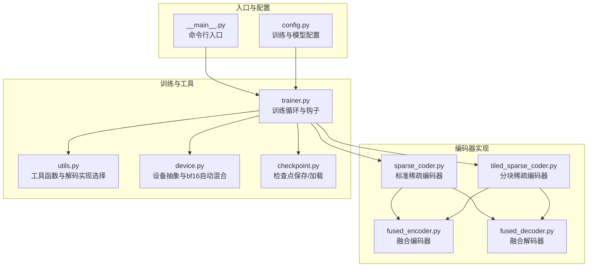
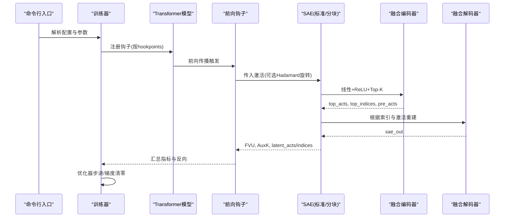
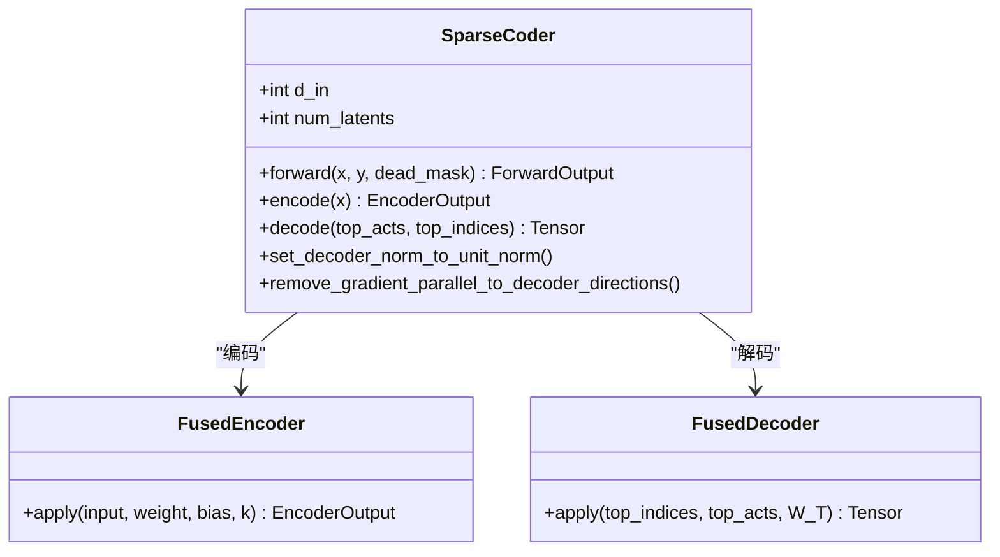
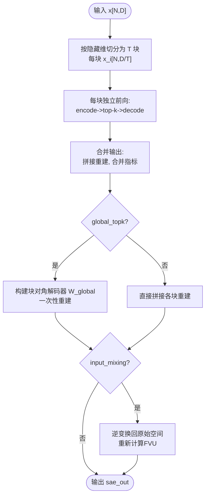
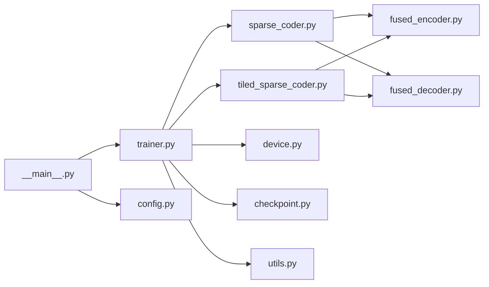

# 稀疏编码器实现

<cite>
**本文档引用的文件**
- [sparsify/__main__.py](file://sparsify/__main__.py)
- [sparsify/config.py](file://sparsify/config.py)
- [sparsify/sparse_coder.py](file://sparsify/sparse_coder.py)
- [sparsify/tiled_sparse_coder.py](file://sparsify/tiled_sparse_coder.py)
- [sparsify/fused_encoder.py](file://sparsify/fused_encoder.py)
- [sparsify/fused_decoder.py](file://sparsify/fused_decoder.py)
- [sparsify/trainer.py](file://sparsify/trainer.py)
- [sparsify/utils.py](file://sparsify/utils.py)
- [sparsify/device.py](file://sparsify/device.py)
- [sparsify/checkpoint.py](file://sparsify/checkpoint.py)
- [tests/test_tiled_sparse_coder.py](file://tests/test_tiled_sparse_coder.py)
- [docs/training/qwen3-guide.md](file://docs/training/qwen3-guide.md)
- [scripts/README.md](file://scripts/README.md)
- [pyproject.toml](file://pyproject.toml)
</cite>

## 目录
1. [简介](#简介)
2. [项目结构](#项目结构)
3. [核心组件](#核心组件)
4. [架构总览](#架构总览)
5. [详细组件分析](#详细组件分析)
6. [依赖关系分析](#依赖关系分析)
7. [性能考量](#性能考量)
8. [故障排查指南](#故障排查指南)
9. [结论](#结论)
10. [附录](#附录)

## 简介
本文件面向 Sparsify 稀疏编码器实现，系统化阐述标准稀疏自编码器与分块稀疏编码器的架构设计、前向传播与反向传播实现、Top-K 稀疏性机制、辅助损失函数与解码器设计；深入解析分块稀疏编码器的隐藏维度分割、并行训练与通信优化；总结编码器融合技术、性能优化与内存管理策略；提供数学公式推导、算法实现细节与性能基准测试思路，并给出具体使用示例与配置参数说明。

## 项目结构
Sparsify 采用模块化组织，围绕“配置-编码器-训练器-设备抽象-检查点”等核心模块构建，支持标准稀疏自编码器与分块稀疏自编码器两类实现，具备分布式训练、混合精度、加速算子融合等能力。

**图表来源**
- [sparsify/__main__.py:1-211](file://sparsify/__main__.py#L1-L211)
- [sparsify/config.py:1-149](file://sparsify/config.py#L1-L149)
- [sparsify/sparse_coder.py:1-269](file://sparsify/sparse_coder.py#L1-L269)
- [sparsify/tiled_sparse_coder.py:1-342](file://sparsify/tiled_sparse_coder.py#L1-L342)
- [sparsify/fused_encoder.py:1-107](file://sparsify/fused_encoder.py#L1-L107)
- [sparsify/fused_decoder.py:1-107](file://sparsify/fused_decoder.py#L1-L107)
- [sparsify/trainer.py:1-760](file://sparsify/trainer.py#L1-L760)
- [sparsify/utils.py:1-227](file://sparsify/utils.py#L1-L227)
- [sparsify/device.py:1-118](file://sparsify/device.py#L1-L118)
- [sparsify/checkpoint.py:1-302](file://sparsify/checkpoint.py#L1-L302)

**章节来源**
- [sparsify/__main__.py:1-211](file://sparsify/__main__.py#L1-L211)
- [sparsify/config.py:1-149](file://sparsify/config.py#L1-L149)
- [sparsify/trainer.py:1-760](file://sparsify/trainer.py#L1-L760)

## 核心组件
- 标准稀疏编码器（SparseCoder）
  - 线性编码器 + ReLU + Top-K 选择 + 线性解码器
  - 支持辅助损失（AuxK）与单位范数解码器约束
  - 前向返回重构输出、Top-K 激活与索引、FVU 与 AuxK 损失
- 分块稀疏编码器（TiledSparseCoder）
  - 将输入按隐藏维切分为 T 个块，每块独立训练 SAE
  - 支持 per-tile Top-K 与 global Top-K（跨块竞争预算）
  - 可选输入混洗矩阵实现跨块信息流
- 融合算子
  - FusedEncoder：线性 + ReLU + Top-K 的自定义反向，按内存阈值选择稀疏散射+稠密乘或 gather+bmm
  - FusedDecoder：embedding_bag 替代的自定义反向，NPU 友好路径
- 训练器（Trainer）
  - 通过模型前向钩子捕获激活，按配置初始化 SAE，执行前向/反向/优化/日志/检查点
  - 支持分布式数据并行（DDP）、梯度累积、微批、编译加速、Hadamard 旋转
- 设备抽象与工具
  - device.py 提供统一设备检测、bf16 自动混合装饰器
  - utils.py 选择解码实现（NPU/CUDA 用融合解码器，否则回退）

**章节来源**
- [sparsify/sparse_coder.py:36-269](file://sparsify/sparse_coder.py#L36-L269)
- [sparsify/tiled_sparse_coder.py:17-342](file://sparsify/tiled_sparse_coder.py#L17-L342)
- [sparsify/fused_encoder.py:21-107](file://sparsify/fused_encoder.py#L21-L107)
- [sparsify/fused_decoder.py:27-107](file://sparsify/fused_decoder.py#L27-L107)
- [sparsify/trainer.py:39-760](file://sparsify/trainer.py#L39-L760)
- [sparsify/device.py:101-118](file://sparsify/device.py#L101-L118)
- [sparsify/utils.py:185-227](file://sparsify/utils.py#L185-L227)

## 架构总览
Sparsify 的训练流程以 Transformer 模型为载体，通过注册前向钩子在指定层捕获激活，随后将激活送入 SAE（标准或分块），计算损失并反向传播。训练器负责调度、分布式同步、日志与检查点。

**图表来源**
- [sparsify/trainer.py:347-488](file://sparsify/trainer.py#L347-L488)
- [sparsify/sparse_coder.py:176-239](file://sparsify/sparse_coder.py#L176-L239)
- [sparsify/tiled_sparse_coder.py:103-140](file://sparsify/tiled_sparse_coder.py#L103-L140)
- [sparsify/fused_encoder.py:21-107](file://sparsify/fused_encoder.py#L21-L107)
- [sparsify/fused_decoder.py:27-107](file://sparsify/fused_decoder.py#L27-L107)

## 详细组件分析

### 标准稀疏编码器（SparseCoder）
- 结构与参数
  - 编码器：线性层 + ReLU，偏置初始化为 0
  - 解码器：权重复制自编码器，可选单位范数约束
  - 解码器偏置：逐层初始化为目标均值
- 前向传播
  - 输入中心化：x - b_dec
  - 融合编码：fused_encoder 返回 top_acts、top_indices、pre_acts
  - 解码：decoder_impl(top_indices, top_acts, W_dec^T)
  - 残差与损失：e = y - sae_out；FVU = ||e||^2 / 总方差；若 dead_mask 存在则计算 AuxK 损失
- 反向传播
  - 编码器：FusedEncoder 自定义反向，按内存阈值选择稠密散射乘或 gather+bmm
  - 解码器：FusedDecoder 自定义反向，NPU 友好路径
  - 解码器权重梯度去除沿解码方向的平行分量，保持正交性

**图表来源**
- [sparsify/sparse_coder.py:36-269](file://sparsify/sparse_coder.py#L36-L269)
- [sparsify/fused_encoder.py:21-107](file://sparsify/fused_encoder.py#L21-L107)
- [sparsify/fused_decoder.py:27-107](file://sparsify/fused_decoder.py#L27-L107)

**章节来源**
- [sparsify/sparse_coder.py:36-269](file://sparsify/sparse_coder.py#L36-L269)
- [sparsify/fused_encoder.py:21-107](file://sparsify/fused_encoder.py#L21-L107)
- [sparsify/fused_decoder.py:27-107](file://sparsify/fused_decoder.py#L27-L107)

### 分块稀疏编码器（TiledSparseCoder）
- 隐藏维度分割
  - 将输入按隐藏维切分为 T 块，每块大小 = d_in / num_tiles
  - 每块独立训练 SAE，总活跃特征数为 cfg.k（per-tile 为 k_per_tile = k / num_tiles）
- 并行训练与通信优化
  - 每块独立前向/反向，合并输出：拼接各块重建结果、合并指标
  - 可选 global_topk：跨块竞争预算，使用块对角解码器一次性重建
  - 可选 input_mixing：学习 T×T 混合矩阵，在 tile 维度上进行信息交互
- 输出与索引映射
  - 合并索引时对每块索引加上偏移，确保全局唯一性
  - 若启用 input_mixing，需在逆变换后重新计算 FVU

**图表来源**
- [sparsify/tiled_sparse_coder.py:17-342](file://sparsify/tiled_sparse_coder.py#L17-L342)

**章节来源**
- [sparsify/tiled_sparse_coder.py:17-342](file://sparsify/tiled_sparse_coder.py#L17-L342)

### 融合编码器（FusedEncoder）
- 数学实现
  - 前向：pre_acts = ReLU(x W^T + b)，对每行取 top-k 得到 values/indices
  - 反向：根据阈值选择两种策略
    - 内存充足：构造稀疏系数矩阵 S，稠密矩阵乘法求梯度
    - 内存不足：gather + bmm 或 index_add_，避免大矩阵分配
- 性能特性
  - 针对不同规模自动切换稠密/稀疏路径，平衡内存与吞吐

**章节来源**
- [sparsify/fused_encoder.py:21-107](file://sparsify/fused_encoder.py#L21-L107)

### 融合解码器（FusedDecoder）
- 数学实现
  - 前向：将 top_acts 投影到 W_T 对应行，稠密乘法或 embedding_bag
  - 反向：根据阈值选择稠密散射乘或 gather+bmm/index_add_
- 设备适配
  - NPU/CUDA 下优先使用融合路径，避免 CPU 回退

**章节来源**
- [sparsify/fused_decoder.py:27-107](file://sparsify/fused_decoder.py#L27-L107)
- [sparsify/utils.py:185-227](file://sparsify/utils.py#L185-L227)

### 训练器（Trainer）
- 钩子与激活捕获
  - 按 hookpoints 注册前向钩子，捕获输入激活，可选 Hadamard 旋转
  - 首步用数据均值初始化解码器偏置，必要时做单位范数约束
- 损失与指标
  - 主损失：FVU；可选 AuxK 损失；Exceed 指标（基于肘部阈值）
- 分布式与优化
  - DDP 包装 SAE；梯度累积与微批；编译加速；Schedule-Free 优化器
- 日志与检查点
  - 定期保存；支持最佳模型保存；支持从检查点恢复

**章节来源**
- [sparsify/trainer.py:39-760](file://sparsify/trainer.py#L39-L760)

### 设备抽象与工具
- device.py
  - 统一检测 CUDA/NPU/CPu，提供 bf16 自动混合装饰器
- utils.py
  - 根据设备类型选择解码实现（融合/回退）
  - 解析层列表、部分前向、设置子模块等工具

**章节来源**
- [sparsify/device.py:1-118](file://sparsify/device.py#L1-L118)
- [sparsify/utils.py:1-227](file://sparsify/utils.py#L1-L227)

## 依赖关系分析
- 组件耦合
  - Trainer 依赖 SparseCoder/TiledSparseCoder、设备抽象、工具函数与检查点
  - 编码器/解码器依赖 fused_encoder/fused_decoder 与 utils 的实现选择
- 外部依赖
  - PyTorch、Transformers、Datasets、Accelerate、safetensors、schedulefree 等

**图表来源**
- [sparsify/trainer.py:1-760](file://sparsify/trainer.py#L1-L760)
- [sparsify/sparse_coder.py:1-269](file://sparsify/sparse_coder.py#L1-L269)
- [sparsify/tiled_sparse_coder.py:1-342](file://sparsify/tiled_sparse_coder.py#L1-L342)
- [sparsify/fused_encoder.py:1-107](file://sparsify/fused_encoder.py#L1-L107)
- [sparsify/fused_decoder.py:1-107](file://sparsify/fused_decoder.py#L1-L107)
- [sparsify/utils.py:1-227](file://sparsify/utils.py#L1-L227)
- [sparsify/device.py:1-118](file://sparsify/device.py#L1-L118)
- [sparsify/checkpoint.py:1-302](file://sparsify/checkpoint.py#L1-L302)
- [sparsify/__main__.py:1-211](file://sparsify/__main__.py#L1-L211)
- [sparsify/config.py:1-149](file://sparsify/config.py#L1-L149)

**章节来源**
- [sparsify/trainer.py:1-760](file://sparsify/trainer.py#L1-L760)
- [sparsify/__main__.py:1-211](file://sparsify/__main__.py#L1-L211)
- [sparsify/config.py:1-149](file://sparsify/config.py#L1-L149)

## 性能考量
- 稀疏算子融合
  - FusedEncoder/FusedDecoder 在内存充足时走稠密散射+矩阵乘，避免频繁内核启动
- 混合精度与编译
  - device_autocast 在支持设备上启用 bf16，提升吞吐；可选 torch.compile 融合小算子
- 分块并行与通信
  - TiledSparseCoder 的 per-tile 训练天然并行；global_topk 通过块对角解码减少循环
  - input_mixing 引入额外矩阵运算，需权衡收益与通信成本
- 内存管理
  - 按阈值切换稠密/稀疏路径；延迟/批量 all_reduce；微批与梯度累积降低显存峰值
- 指标与早停
  - FVU、Dead Feature Ratio、Exceed 指标用于评估与早停；支持最佳模型保存

[本节为通用性能讨论，不直接分析具体文件]

## 故障排查指南
- 分块配置校验
  - d_in 与 cfg.k 必须能被 num_tiles 整除，否则初始化即报错
- 检查点兼容性
  - 加载检查点时，regular SAE 与 TiledSparseCoder 之间必须匹配 num_tiles
- 梯度与数值稳定性
  - 解码器权重单位范数约束与梯度去平行分量有助于稳定训练
- 设备与后端
  - NPU/CUDA 不同后端的事件/同步 API 需正确初始化，避免计时不准确

**章节来源**
- [sparsify/tiled_sparse_coder.py:38-43](file://sparsify/tiled_sparse_coder.py#L38-L43)
- [sparsify/checkpoint.py:44-73](file://sparsify/checkpoint.py#L44-L73)
- [sparsify/sparse_coder.py:241-265](file://sparsify/sparse_coder.py#L241-L265)
- [sparsify/device.py:83-99](file://sparsify/device.py#L83-L99)

## 结论
Sparsify 提供了高效、可扩展的稀疏自编码器实现，涵盖标准与分块两种模式，结合融合算子、设备抽象与分布式训练，满足大规模语言模型的激活稀疏化需求。通过合理的超参数与训练策略，可在保证重建质量的同时显著降低存储与计算开销。

[本节为总结性内容，不直接分析具体文件]

## 附录

### 使用示例与配置参数说明
- 命令行入口
  - 通过命令行指定模型、数据集、上下文长度、分词列名、随机种子、分布式后端等
- 训练配置
  - sae.expansion_factor、sae.k、batch_size、grad_acc_steps、micro_acc_steps、max_tokens
  - auxk_alpha、dead_feature_threshold、exceed_alphas、elbow_threshold_path
  - hookpoints/layers/layer_stride、num_tiles/global_topk/input_mixing
  - use_hadamard/hadamard_block_size/hadamard_seed/hadamard_use_perm
  - compile_model、save_every/save_best、save_dir、log_to_wandb/run_name/wandb_project
- Qwen3 推荐配置
  - 常见 hookpoints：self_attn.o_proj、self_attn.q_proj、mlp.up_proj
  - 建议起始参数：expansion_factor=8，k=128，batch_size=1，grad_acc_steps=8，ctx_len=2048
- 超参扫描脚本
  - 支持 Python 与 Shell 两种脚本，便于探索 expansion_factor 与 k 的组合

**章节来源**
- [sparsify/__main__.py:31-207](file://sparsify/__main__.py#L31-L207)
- [sparsify/config.py:28-149](file://sparsify/config.py#L28-L149)
- [docs/training/qwen3-guide.md:17-77](file://docs/training/qwen3-guide.md#L17-L77)
- [scripts/README.md:1-299](file://scripts/README.md#L1-L299)

### 测试与验证要点
- 分块编码器测试覆盖
  - 初始化与断言、前向形状与索引范围、保存/加载、梯度流动、global_topk、input_mixing
- 单元测试参考
  - 参考测试文件对分块编码器行为进行验证，确保索引偏移、权重一致性与混合矩阵正确性

**章节来源**
- [tests/test_tiled_sparse_coder.py:1-468](file://tests/test_tiled_sparse_coder.py#L1-L468)

### 依赖清单
- 核心依赖：PyTorch、Transformers、Datasets、Accelerate、safetensors、schedulefree、simple-parsing
- 可选依赖：wandb、triton、torch_npu（Ascend NPU）

**章节来源**
- [pyproject.toml:12-28](file://pyproject.toml#L12-L28)