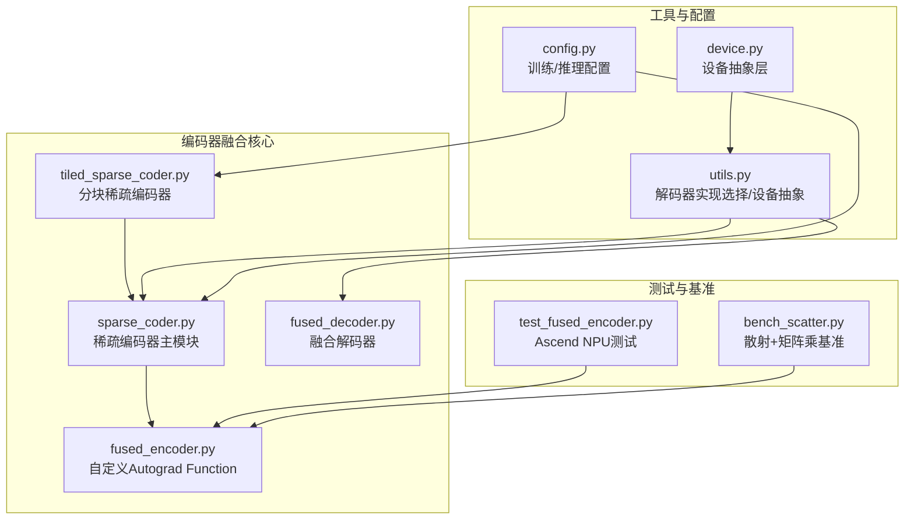
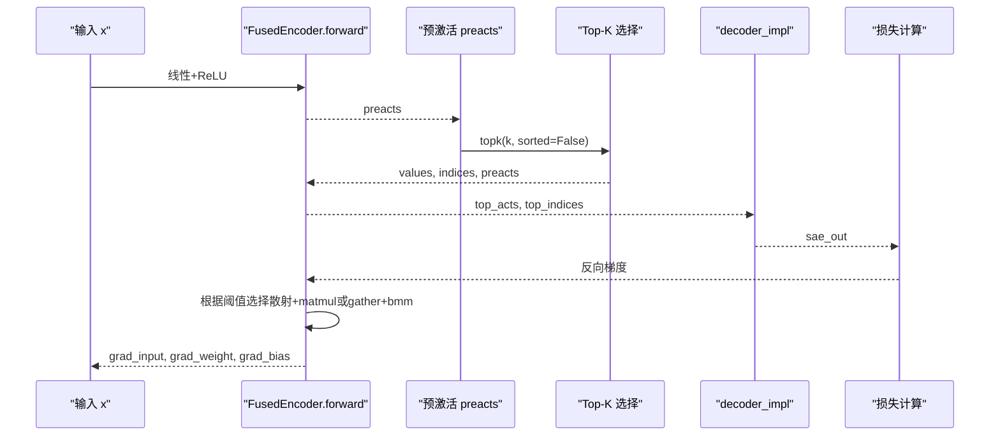
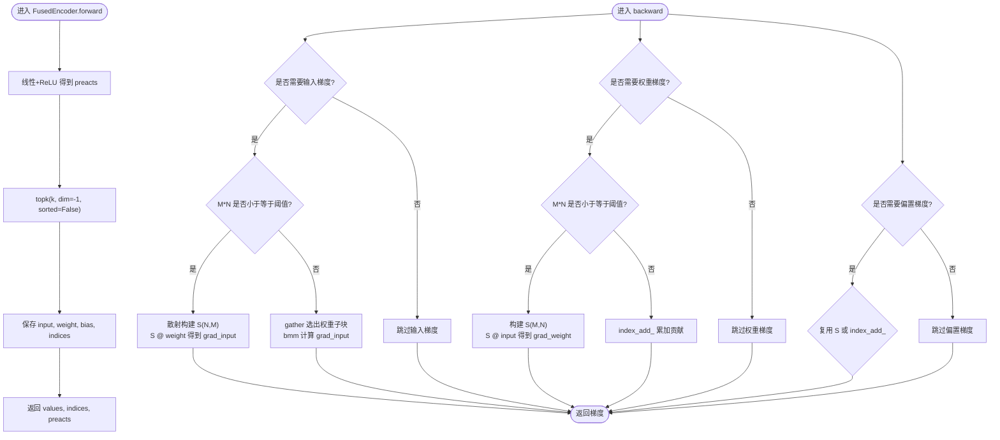
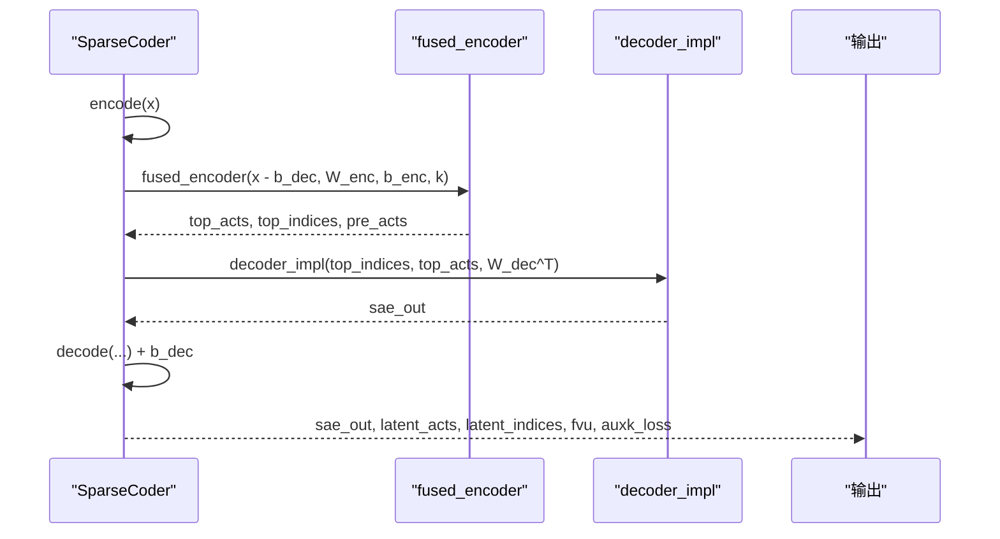
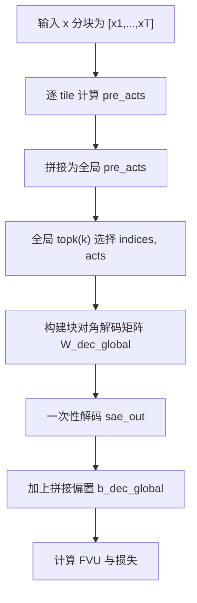
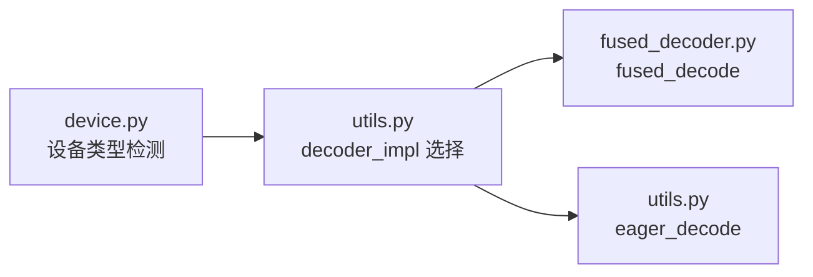
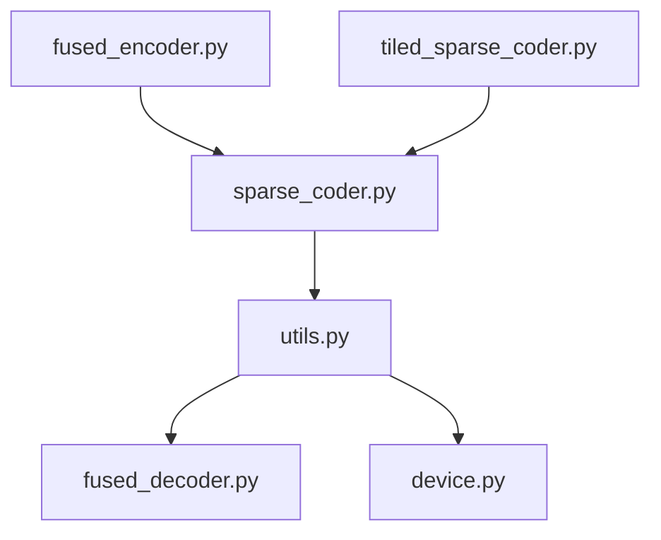
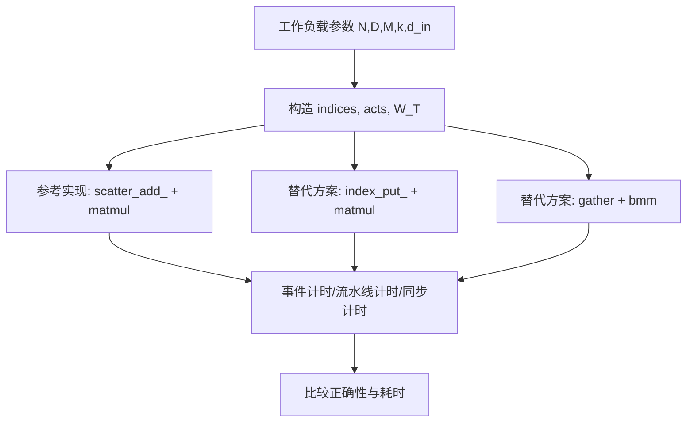

# 编码器融合优化

<cite>
**本文引用的文件列表**
- [fused_encoder.py](file://sparsify/fused_encoder.py)
- [fused_decoder.py](file://sparsify/fused_decoder.py)
- [sparse_coder.py](file://sparsify/sparse_coder.py)
- [tiled_sparse_coder.py](file://sparsify/tiled_sparse_coder.py)
- [utils.py](file://sparsify/utils.py)
- [config.py](file://sparsify/config.py)
- [test_fused_encoder.py](file://tests/ascend/test_fused_encoder.py)
- [bench_scatter.py](file://benchmarks/bench_scatter.py)
- [device.py](file://sparsify/device.py)
- [SKILL.md](file://.claude/skills/npu_profiling/SKILL.md)
</cite>

## 目录
1. [简介](#简介)
2. [项目结构](#项目结构)
3. [核心组件](#核心组件)
4. [架构总览](#架构总览)
5. [详细组件分析](#详细组件分析)
6. [依赖关系分析](#依赖关系分析)
7. [性能考量](#性能考量)
8. [故障排查指南](#故障排查指南)
9. [结论](#结论)
10. [附录](#附录)

## 简介
本技术文档围绕编码器融合优化展开，重点解析 fused_encoder 函数的实现原理与工程实践。内容涵盖张量操作融合策略、内存访问优化、计算图简化、数学原理与性能提升机制，并结合 Ascend NPU 的兼容性设计与回退路径，提供配置参数说明、最佳实践与调试技巧。同时给出与传统实现的对比、内存使用分析以及与其他优化技术（如分块训练、编译融合等）的关系。

## 项目结构
该仓库采用模块化组织，编码器融合优化主要集中在 sparsify 子包中，配合工具模块与测试验证形成闭环。关键文件如下：
- sparsify/fused_encoder.py：自定义 Autograd Function 实现融合编码器，包含前向与反向逻辑及阈值切换策略
- sparsify/fused_decoder.py：与编码器对应，提供 NPU 兼容的解码器融合实现
- sparsify/sparse_coder.py：稀疏编码器主模块，封装编码/解码流程与损失计算
- sparsify/tiled_sparse_coder.py：分块稀疏编码器，支持多 tile 并行与全局 top-k
- sparsify/utils.py：通用工具与设备抽象层，包含解码器实现选择与辅助函数
- sparsify/config.py：配置类，定义训练与推理的关键参数
- tests/ascend/test_fused_encoder.py：针对 Ascend NPU 的功能与数值正确性测试
- benchmarks/bench_scatter.py：散射+矩阵乘的性能基准脚本，用于评估不同实现路径
- sparsify/device.py：设备抽象层，统一 CUDA/NPU/CPU 的能力探测与 API
- .claude/skills/npu_profiling/SKILL.md：NPU 性能分析技能说明，指导如何使用 msprof 进行性能剖析

**图表来源**
- [fused_encoder.py:1-107](file://sparsify/fused_encoder.py#L1-L107)
- [sparse_coder.py:1-269](file://sparsify/sparse_coder.py#L1-L269)
- [tiled_sparse_coder.py:1-342](file://sparsify/tiled_sparse_coder.py#L1-L342)
- [fused_decoder.py:1-107](file://sparsify/fused_decoder.py#L1-L107)
- [utils.py:1-227](file://sparsify/utils.py#L1-L227)
- [config.py:1-149](file://sparsify/config.py#L1-L149)
- [device.py:1-118](file://sparsify/device.py#L1-L118)
- [test_fused_encoder.py:1-141](file://tests/ascend/test_fused_encoder.py#L1-L141)
- [bench_scatter.py:1-175](file://benchmarks/bench_scatter.py#L1-L175)

**章节来源**
- [fused_encoder.py:1-107](file://sparsify/fused_encoder.py#L1-L107)
- [sparse_coder.py:1-269](file://sparsify/sparse_coder.py#L1-L269)
- [tiled_sparse_coder.py:1-342](file://sparsify/tiled_sparse_coder.py#L1-L342)
- [fused_decoder.py:1-107](file://sparsify/fused_decoder.py#L1-L107)
- [utils.py:1-227](file://sparsify/utils.py#L1-L227)
- [config.py:1-149](file://sparsify/config.py#L1-L149)
- [device.py:1-118](file://sparsify/device.py#L1-L118)
- [test_fused_encoder.py:1-141](file://tests/ascend/test_fused_encoder.py#L1-L141)
- [bench_scatter.py:1-175](file://benchmarks/bench_scatter.py#L1-L175)

## 核心组件
- 自定义 Autograd Function（FusedEncoder）：将线性变换、ReLU、Top-K 三步操作融合为一次前向，仅保存必要中间变量，显著减少内存分配与图节点数量；反向通过阈值判断选择“散射+稠密矩阵乘”或“gather+bmm/index_add_”两种路径，兼顾内存与性能。
- 稀疏编码器（SparseCoder）：封装编码器权重、偏置与解码器权重，提供 encode/decode/forward 接口；在 forward 中调用 fused_encoder 获取 top-k 激活与索引，随后通过 decoder_impl 解码并计算损失。
- 分块稀疏编码器（TiledSparseCoder）：将输入按隐藏维切分为多个 tile，每个 tile 独立训练 SAE；支持 per-tile top-k 与 global_topk 两种模式，后者合并所有 tile 的预激活后做全局 top-k，避免重复循环。
- 设备抽象与解码器实现选择：根据设备类型动态选择 eager_decode、fused_decode 或其他实现，确保在 NPU/CUDA 上获得最优性能与兼容性。

**章节来源**
- [fused_encoder.py:21-107](file://sparsify/fused_encoder.py#L21-L107)
- [sparse_coder.py:36-269](file://sparsify/sparse_coder.py#L36-L269)
- [tiled_sparse_coder.py:17-342](file://sparsify/tiled_sparse_coder.py#L17-L342)
- [utils.py:173-227](file://sparsify/utils.py#L173-L227)

## 架构总览
编码器融合贯穿于稀疏编码器的前向与反向过程，形成如下端到端流程：
- 输入 x 经过中心化（可选）、线性层、ReLU，得到预激活 preacts
- 对 preacts 做 top-k 选择，得到 values、indices 与 preacts
- 反向时，根据阈值选择不同的梯度计算路径：
  - 使用散射构建稀疏系数矩阵 S，再进行稠密矩阵乘，适合 M*N 较小的情况
  - 否则使用 gather + bmm 或 index_add_，避免大矩阵构造，适合内存受限场景
- 解码阶段通过 decoder_impl（在 NPU/CUDA 上为 fused_decode，在 CPU 上为 eager_decode）实现高效解码

**图表来源**
- [fused_encoder.py:21-91](file://sparsify/fused_encoder.py#L21-L91)
- [sparse_coder.py:176-239](file://sparsify/sparse_coder.py#L176-L239)
- [utils.py:185-196](file://sparsify/utils.py#L185-L196)

**章节来源**
- [fused_encoder.py:21-91](file://sparsify/fused_encoder.py#L21-L91)
- [sparse_coder.py:176-239](file://sparsify/sparse_coder.py#L176-L239)
- [utils.py:185-196](file://sparsify/utils.py#L185-L196)

## 详细组件分析

### FusedEncoder 类与 fused_encoder 包装函数
- 前向逻辑
  - 线性层 + ReLU 得到预激活
  - 使用 topk 选择前 k 个最大值及其索引，sorted=False 以避免排序开销
  - 保存输入、权重、偏置与 indices 用于反向
- 反向逻辑
  - 输入梯度：根据阈值选择两种路径
    - 散射+稠密矩阵乘：构建 (N,M) 稀疏系数矩阵 S，S.scatter_add_(1, indices, grad_values)，再 S @ weight
    - 回退路径：gather 选出权重子块，再 bmm 计算
  - 权重与偏置梯度：共享 S 矩阵或使用 index_add_ 累加贡献
  - k 参数不可导，返回 None
- 阈值策略
  - _MATMUL_THRESHOLD 控制是否走散射+稠密矩阵乘路径，避免 S 矩阵过大导致内存不足

**图表来源**
- [fused_encoder.py:21-91](file://sparsify/fused_encoder.py#L21-L91)

**章节来源**
- [fused_encoder.py:21-107](file://sparsify/fused_encoder.py#L21-L107)

### SparseCoder 编码与解码流程
- encode：对输入减去解码器偏置，调用 fused_encoder 获取 top-k 激活与索引
- decode：通过 decoder_impl 解码，随后加上解码器偏置
- forward：在 autoencoding 场景下，计算残差、FVU 与可选的 AuxK 损失

**图表来源**
- [sparse_coder.py:176-239](file://sparsify/sparse_coder.py#L176-L239)
- [utils.py:185-196](file://sparsify/utils.py#L185-L196)

**章节来源**
- [sparse_coder.py:176-239](file://sparsify/sparse_coder.py#L176-L239)
- [utils.py:185-196](file://sparsify/utils.py#L185-L196)

### TiledSparseCoder 的全局 Top-K 优化
- per-tile 模式：各 tile 独立计算 pre-acts，独立做 top-k，再拼接输出
- global_topk 模式：将所有 tile 的 pre-acts 拼接后做全局 top-k，随后通过块对角解码矩阵一次性解码，避免在解码阶段的循环

**图表来源**
- [tiled_sparse_coder.py:204-253](file://sparsify/tiled_sparse_coder.py#L204-L253)

**章节来源**
- [tiled_sparse_coder.py:17-342](file://sparsify/tiled_sparse_coder.py#L17-L342)

### 设备抽象与解码器实现选择
- device.py 提供统一的设备类型检测、bf16 支持判断、事件与同步接口
- utils.py 根据设备类型选择 decoder_impl：NPU/CUDA 使用 fused_decode，CPU 使用 eager_decode

**图表来源**
- [device.py:34-118](file://sparsify/device.py#L34-L118)
- [utils.py:185-196](file://sparsify/utils.py#L185-L196)
- [fused_decoder.py:93-107](file://sparsify/fused_decoder.py#L93-L107)

**章节来源**
- [device.py:34-118](file://sparsify/device.py#L34-L118)
- [utils.py:185-196](file://sparsify/utils.py#L185-L196)
- [fused_decoder.py:93-107](file://sparsify/fused_decoder.py#L93-L107)

## 依赖关系分析
- FusedEncoder 依赖于 torch.topk、scatter_add_、bmm 等原语，通过阈值策略在内存与性能间权衡
- SparseCoder 依赖 FusedEncoder 与 decoder_impl，构成完整的编码-解码链路
- TiledSparseCoder 依赖 SparseCoder 与 utils 的解码实现，支持 per-tile 与 global_topk 两种模式
- utils 与 device 提供跨平台兼容性与性能优化入口

**图表来源**
- [fused_encoder.py:1-107](file://sparsify/fused_encoder.py#L1-L107)
- [sparse_coder.py:1-269](file://sparsify/sparse_coder.py#L1-L269)
- [tiled_sparse_coder.py:1-342](file://sparsify/tiled_sparse_coder.py#L1-L342)
- [utils.py:1-227](file://sparsify/utils.py#L1-L227)
- [fused_decoder.py:1-107](file://sparsify/fused_decoder.py#L1-L107)
- [device.py:1-118](file://sparsify/device.py#L1-L118)

**章节来源**
- [fused_encoder.py:1-107](file://sparsify/fused_encoder.py#L1-L107)
- [sparse_coder.py:1-269](file://sparsify/sparse_coder.py#L1-L269)
- [tiled_sparse_coder.py:1-342](file://sparsify/tiled_sparse_coder.py#L1-L342)
- [utils.py:1-227](file://sparsify/utils.py#L1-L227)
- [fused_decoder.py:1-107](file://sparsify/fused_decoder.py#L1-L107)
- [device.py:1-118](file://sparsify/device.py#L1-L118)

## 性能考量

### 数学原理与融合策略
- 线性层 + ReLU + Top-K 的融合减少了中间张量的创建与传递，降低了图节点数量与内存峰值
- 反向时，散射+稠密矩阵乘将稀疏梯度映射到稠密空间，利用矩阵乘的高吞吐特性；当 M*N 过大时，回退到 gather+bmm 或 index_add_，避免构造大矩阵 S

### 内存访问优化
- 仅保存 indices 与必要的输入/权重/偏置，避免保存整个 preacts，显著降低峰值内存
- 通过阈值策略在“构造 S + 稠密矩阵乘”与“gather+bmm/index_add_”之间切换，平衡内存占用与计算效率

### 计算图简化
- 将三层操作融合为一次前向，减少图节点与调度开销
- 反向时共享 S 矩阵，减少重复计算

### 与传统实现的对比
- 传统实现需分别执行线性、ReLU、Top-K，再在反向中逐个计算梯度，存在大量临时张量与额外的图节点
- 融合实现通过阈值策略在内存与性能间权衡，适合大规模模型与大 batch 场景

### 性能基准与内存分析
- bench_scatter.py 提供了在 Ascend NPU 上对不同散射+矩阵乘替代方案的基准测试，覆盖事件计时、流水线计时与同步计时三种模式，能够反映 CPU 回退带来的管道停顿
- 测试用例 test_fused_encoder.py 验证了在 NPU/CPU 上的数值一致性与大 batch 场景下的稳定性

**图表来源**
- [bench_scatter.py:1-175](file://benchmarks/bench_scatter.py#L1-L175)
- [test_fused_encoder.py:1-141](file://tests/ascend/test_fused_encoder.py#L1-L141)

**章节来源**
- [bench_scatter.py:1-175](file://benchmarks/bench_scatter.py#L1-L175)
- [test_fused_encoder.py:1-141](file://tests/ascend/test_fused_encoder.py#L1-L141)

### 与其他优化技术的对比
- 分块训练（TiledSparseCoder）：通过将输入分块并在 tile 维度上并行训练，提升吞吐；global_topk 模式进一步减少解码阶段的循环
- 编译融合（config.compile_model）：在 CUDA 上启用 torch.compile 融合小算子，减少内核启动开销，与编码器融合互补
- 设备加速：NPU/CUDA 的 fused_decode 与 bf16 自动混合精度在 utils/device 中统一处理，提升整体性能

**章节来源**
- [tiled_sparse_coder.py:17-342](file://sparsify/tiled_sparse_coder.py#L17-L342)
- [config.py:100-104](file://sparsify/config.py#L100-L104)
- [utils.py:185-196](file://sparsify/utils.py#L185-L196)
- [device.py:101-118](file://sparsify/device.py#L101-L118)

## 故障排查指南
- 数值一致性验证：使用 test_fused_encoder.py 的测试用例对比融合实现与传统实现的前向输出与梯度，确保在 NPU/CPU 上的一致性
- 大 batch 稳定性：stress test_large_batch 验证在大 N 下的形状与梯度正确性
- 回退路径验证：通过修改阈值强制走散射+矩阵乘或 embedding_bag 回退路径，验证两种回退实现与传统实现一致
- NPU 性能分析：使用 .claude/skills/npu_profiling/SKILL.md 中的脚本对 msprof 输出进行全量分析，识别算子耗时、核利用率与通信开销，定位瓶颈

**章节来源**
- [test_fused_encoder.py:1-141](file://tests/ascend/test_fused_encoder.py#L1-L141)
- [SKILL.md:1-256](file://.claude/skills/npu_profiling/SKILL.md#L1-L256)

## 结论
编码器融合优化通过将线性层、ReLU 与 Top-K 融合为一次前向，并在反向上采用阈值驱动的路径选择，有效减少了内存分配、简化了计算图并提升了整体性能。在 Ascend NPU 上，结合 fused_decode 与设备抽象层，实现了端到端的 NPU 原生后向，避免了 CPU 回退带来的性能损失。配合分块训练、编译融合与性能分析工具，可在大规模模型与大 batch 场景下取得更优的吞吐与资源利用率。

## 附录

### 配置参数说明
- SparseCoderConfig
  - expansion_factor：扩展因子，决定稀疏编码器维度
  - normalize_decoder：是否将解码器权重归一化
  - num_latents：隐状态数，若为 0 则由 expansion_factor 推导
  - k：非零特征数
- TrainConfig
  - num_tiles：分块数量（默认 1），与 TiledSparseCoder 配合使用
  - global_topk：是否使用全局 top-k（仅在 num_tiles>1 时有效）
  - input_mixing：是否在 tile 维度上应用可学习混合矩阵
  - use_hadamard / hadamard_block_size / hadamard_seed / hadamard_use_perm：Hadamard 旋转相关配置
  - compile_model：是否在 CUDA 上启用 torch.compile 融合小算子
  - 其他训练超参：batch_size、grad_acc_steps、micro_acc_steps、lr、auxk_alpha、dead_feature_threshold 等

**章节来源**
- [config.py:7-149](file://sparsify/config.py#L7-L149)

### 最佳实践
- 合理设置 k：k 越大，内存占用越高，但表达能力更强；需结合任务与硬件资源权衡
- 使用阈值策略：在大模型场景下，优先保证 M*N 不超过阈值，以使用散射+稠密矩阵乘路径
- 分块训练：在多 tile 场景下，优先考虑 global_topk 以减少解码阶段循环
- 设备选择：在 NPU/CUDA 上启用 fused_decode 与 bf16 自动混合精度，提升吞吐
- 性能分析：定期使用 NPU Profiling 工具对 msprof 输出进行全量分析，持续优化

### 调试技巧
- 使用测试用例对比融合与传统实现的数值一致性
- 通过修改阈值强制切换回退路径，验证不同路径的正确性
- 在 NPU 上使用事件计时与流水线计时，识别 CPU 回退导致的管道停顿
- 结合分块训练与编译融合，逐步排查瓶颈并优化