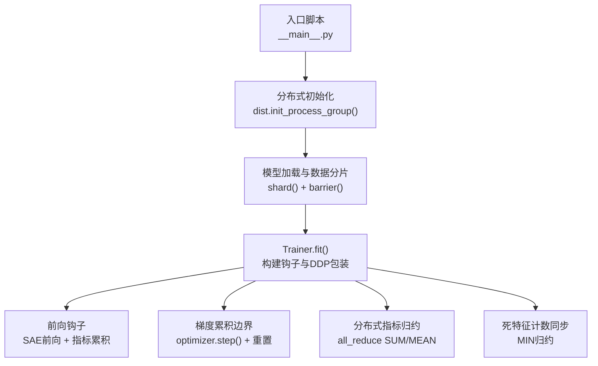
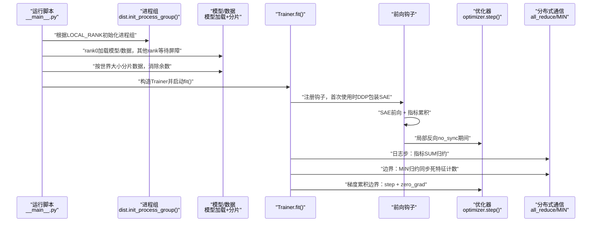
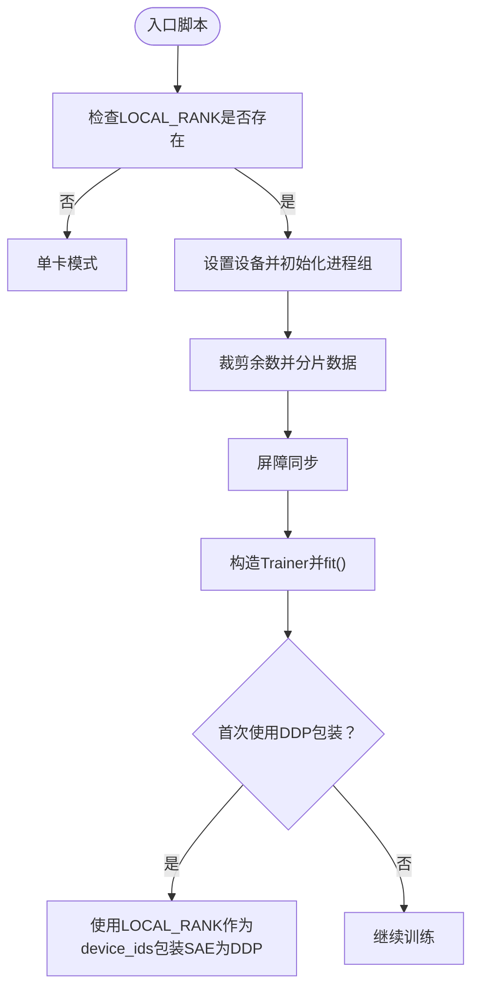
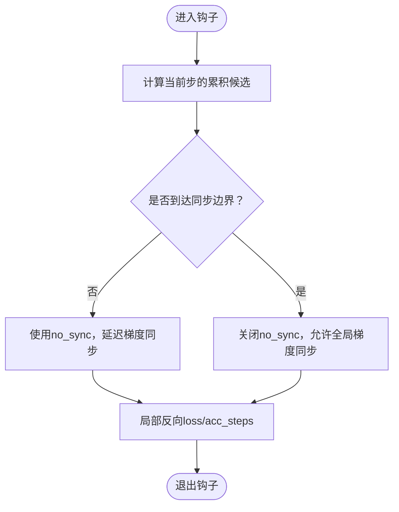
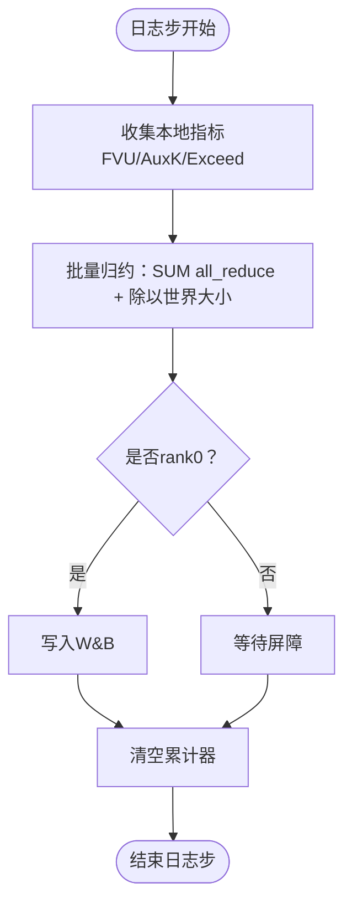
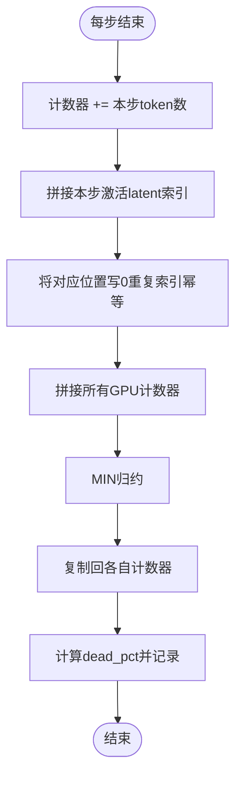
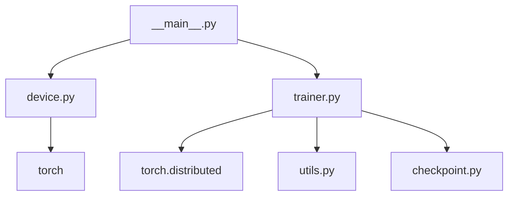

# 分布式训练支持

<cite>
**本文引用的文件**   
- [sparsify/trainer.py](file://sparsify/trainer.py)
- [sparsify/__main__.py](file://sparsify/__main__.py)
- [sparsify/device.py](file://sparsify/device.py)
- [sparsify/config.py](file://sparsify/config.py)
- [sparsify/checkpoint.py](file://sparsify/checkpoint.py)
- [sparsify/utils.py](file://sparsify/utils.py)
- [docs/architecture/training-pipeline.md](file://docs/architecture/training-pipeline.md)
- [docs/training/quickstart.md](file://docs/training/quickstart.md)
- [benchmarks/bench_scatter.py](file://benchmarks/bench_scatter.py)
</cite>

## 目录
1. [简介](#简介)
2. [项目结构](#项目结构)
3. [核心组件](#核心组件)
4. [架构总览](#架构总览)
5. [详细组件分析](#详细组件分析)
6. [依赖关系分析](#依赖关系分析)
7. [性能考量](#性能考量)
8. [故障排查指南](#故障排查指南)
9. [结论](#结论)
10. [附录](#附录)

## 简介
本文件系统性阐述 Sparsify 的分布式训练支持，重点覆盖以下方面：
- DDP 包装机制与进程组管理
- 梯度同步策略与 no_sync 使用
- 指标聚合、张量归约与通信优化
- LOCAL_RANK 的使用、设备 ID 配置与跨 GPU 同步机制
- 死特征检测的分布式实现、计数器同步与最小值归约
- 典型配置示例与常见问题诊断

## 项目结构
Sparsify 的分布式训练由入口脚本初始化进程组，Trainer 在首次使用时将 SAE 模块包装为 DDP，并在钩子中进行前向、反向与指标累积。设备抽象层提供统一的后端选择与事件/同步接口。

图表来源
- [sparsify/__main__.py:131-211](file://sparsify/__main__.py#L131-L211)
- [sparsify/trainer.py:162-760](file://sparsify/trainer.py#L162-L760)
- [sparsify/device.py:1-118](file://sparsify/device.py#L1-L118)

章节来源
- [sparsify/__main__.py:131-211](file://sparsify/__main__.py#L131-L211)
- [sparsify/trainer.py:162-760](file://sparsify/trainer.py#L162-L760)
- [sparsify/device.py:1-118](file://sparsify/device.py#L1-L118)

## 核心组件
- 分布式入口与进程组管理：通过环境变量 LOCAL_RANK 判定是否启用 DDP，设置设备并初始化进程组，随后对数据集进行分片与屏障同步。
- Trainer 分布式训练流程：在首次使用时以 LOCAL_RANK 作为 device_ids 对 SAE 进行 DDP 包装；在钩子中根据梯度累积边界决定是否使用 no_sync；在日志步进行指标批量归约；在死特征更新处执行 MIN 归约。
- 设备抽象层：统一返回后端类型、设备字符串、bf16 支持状态、事件与同步接口，并根据平台返回对应的分布式后端名称。
- 配置与保存：Trainer 与 CheckpointMixin 在保存时遵循 rank 0 优先写入并在分布式环境下使用 barrier 同步。

章节来源
- [sparsify/__main__.py:131-211](file://sparsify/__main__.py#L131-L211)
- [sparsify/trainer.py:162-760](file://sparsify/trainer.py#L162-L760)
- [sparsify/device.py:1-118](file://sparsify/device.py#L1-L118)
- [sparsify/checkpoint.py:240-302](file://sparsify/checkpoint.py#L240-L302)

## 架构总览
下图展示了分布式训练的关键交互：入口脚本负责进程组与数据分片，Trainer 在钩子中完成 SAE 前向、指标累积与局部反向，最终在日志步与梯度累积边界进行归约与同步。

图表来源
- [sparsify/__main__.py:131-211](file://sparsify/__main__.py#L131-L211)
- [sparsify/trainer.py:162-760](file://sparsify/trainer.py#L162-L760)

## 详细组件分析

### DDP 包装与进程组管理
- 进程组初始化：入口脚本读取 LOCAL_RANK，若存在则设置设备并调用 dist.init_process_group，使用设备字符串与后端名称（CUDA 使用 nccl，NPU 使用 hccl）。
- 数据分片：在分布式模式下，先计算余数并裁剪数据集，再调用 shard(world_size, rank) 将数据均匀分配给各 rank，确保各 rank 工作量一致且避免死锁。
- SAE DDP 包装时机：Trainer 在首次进入训练循环时才进行 DDP 包装，且使用 LOCAL_RANK 作为 device_ids，避免在设置 decoder bias 之前包装导致 DDP 无法正确追踪梯度。

图表来源
- [sparsify/__main__.py:131-211](file://sparsify/__main__.py#L131-L211)
- [sparsify/trainer.py:501-514](file://sparsify/trainer.py#L501-L514)

章节来源
- [sparsify/__main__.py:131-211](file://sparsify/__main__.py#L131-L211)
- [sparsify/trainer.py:501-514](file://sparsify/trainer.py#L501-L514)

### 梯度同步策略与 no_sync 使用
- no_sync 策略：Trainer 在钩子内部根据“是否到达梯度累积边界”决定是否使用 wrapped.no_sync()，在非边界步减少不必要的梯度同步开销。
- 同步边界：当 substep == 0 时，表示需要进行一次全局同步（optimizer.step），此时不再使用 no_sync。
- 自动梯度累积：Trainer 将 grad_acc_steps 与 micro_acc_steps 组合为一次逻辑累积步长，仅在整步边界触发全局同步与优化器更新。

图表来源
- [sparsify/trainer.py:519-528](file://sparsify/trainer.py#L519-L528)
- [sparsify/trainer.py:402-406](file://sparsify/trainer.py#L402-L406)

章节来源
- [sparsify/trainer.py:519-528](file://sparsify/trainer.py#L519-L528)
- [sparsify/trainer.py:402-406](file://sparsify/trainer.py#L402-L406)

### 指标聚合、张量归约与通信优化
- 批量归约策略：Trainer 定义了两个归约辅助函数，分别对标量映射与嵌套标量映射进行一次性 all_reduce SUM，随后除以世界大小得到平均值，避免在微批次粒度频繁通信。
- 日志步归约：在日志频率步，Trainer 对 FVU、AuxK 与 exceed 指标分别进行批量归约，仅在 rank 0 写入 W&B，其余 rank 通过广播/屏障保持一致性。
- 时间指标归约：Trainer 将平均前向时间与指标时间通过 maybe_all_reduce 进行归约，保证多 GPU 下的统计一致性。

图表来源
- [sparsify/trainer.py:294-332](file://sparsify/trainer.py#L294-L332)
- [sparsify/trainer.py:654-720](file://sparsify/trainer.py#L654-L720)

章节来源
- [sparsify/trainer.py:294-332](file://sparsify/trainer.py#L294-L332)
- [sparsify/trainer.py:654-720](file://sparsify/trainer.py#L654-L720)

### 死特征检测的分布式实现
- 计数器设计：Trainer 维护每个 SAE 的 num_tokens_since_fired（长整型计数器），记录每个 latent 自上次激活以来的 token 数。
- 激活收集：在钩子中收集每步激活的 latent 索引，使用一次性 concat 与直接写零的方式更新计数器，避免昂贵的 per-forward scatter。
- 跨 GPU 同步：在每步结束，将所有计数器拼接后进行 MIN 归约，确保任一 GPU 上被激活的 latent 在所有副本上计数器被清零，从而实现与旧版 did_fire 掩码等价的行为。
- 死特征阈值：超过 dead_feature_threshold 的比例通过掩码求平均得到 dead_pct，用于监控与报告。

图表来源
- [sparsify/trainer.py:586-616](file://sparsify/trainer.py#L586-L616)
- [sparsify/trainer.py:690-696](file://sparsify/trainer.py#L690-L696)

章节来源
- [sparsify/trainer.py:586-616](file://sparsify/trainer.py#L586-L616)
- [sparsify/trainer.py:690-696](file://sparsify/trainer.py#L690-L696)

### 设备 ID 配置与跨 GPU 同步机制
- 设备 ID：DDP 包装时使用 device_ids=[LOCAL_RANK]，确保每个进程绑定到正确的本地 GPU。
- 后端选择：设备抽象层根据平台返回 nccl（CUDA）或 hccl（NPU），并提供统一的事件与同步接口，保证跨后端的一致行为。
- 同步与计时：Trainer 在 CUDA/NPU 上使用 Event 计时，在 CPU 上使用 perf_counter；在日志步对时间指标进行归约，避免每 hookpoint 每 microbatch 的同步。

章节来源
- [sparsify/trainer.py:505-514](file://sparsify/trainer.py#L505-L514)
- [sparsify/device.py:92-98](file://sparsify/device.py#L92-L98)
- [sparsify/trainer.py:530-567](file://sparsify/trainer.py#L530-L567)

### 通信优化与实现细节
- 指标批量归约：将多个标量或嵌套标量映射扁平化后一次性 all_reduce，显著降低通信次数。
- 指标时间聚合：将每步的前向与指标时间分别累加并取平均，最后通过 maybe_all_reduce 归约，保证多 GPU 一致性。
- 事件计时：在 CUDA/NPU 上使用 Event.record()/elapsed_time()，在 CPU 上使用 time.perf_counter()，并结合同步点避免计时不准确。

章节来源
- [sparsify/trainer.py:294-332](file://sparsify/trainer.py#L294-L332)
- [sparsify/trainer.py:668-689](file://sparsify/trainer.py#L668-L689)
- [sparsify/device.py:83-89](file://sparsify/device.py#L83-L89)

## 依赖关系分析
- 入口脚本依赖设备抽象层选择后端与设备字符串，并在分布式模式下进行数据分片与屏障同步。
- Trainer 依赖 torch.distributed 进行 all_reduce、all_gather_into_tensor、broadcast、destroy_process_group 等操作。
- 设备抽象层提供统一的后端选择与事件/同步接口，屏蔽 CUDA/NPU 差异。
- CheckpointMixin 在保存时遵循 rank 0 优先写入并在分布式环境下使用 barrier 同步。

图表来源
- [sparsify/__main__.py:131-211](file://sparsify/__main__.py#L131-L211)
- [sparsify/trainer.py:162-760](file://sparsify/trainer.py#L162-L760)
- [sparsify/device.py:1-118](file://sparsify/device.py#L1-L118)
- [sparsify/checkpoint.py:240-302](file://sparsify/checkpoint.py#L240-L302)

章节来源
- [sparsify/__main__.py:131-211](file://sparsify/__main__.py#L131-L211)
- [sparsify/trainer.py:162-760](file://sparsify/trainer.py#L162-L760)
- [sparsify/device.py:1-118](file://sparsify/device.py#L1-L118)
- [sparsify/checkpoint.py:240-302](file://sparsify/checkpoint.py#L240-L302)

## 性能考量
- 通信优化：通过批量归约与 MIN 归约减少通信次数；避免在钩子内每 microbatch 做 all_reduce。
- 计时与同步：使用 Event 计时并尽量减少同步点；在 CPU 上采用 perf_counter 替代。
- 死特征更新：采用一次性 concat + 直接写零替代 per-forward scatter，避免 AI_CPU 回退。
- 编译加速：在 CUDA 上可启用 torch.compile 以融合小算子，降低核启动开销。

章节来源
- [sparsify/trainer.py:294-332](file://sparsify/trainer.py#L294-L332)
- [sparsify/trainer.py:586-616](file://sparsify/trainer.py#L586-L616)
- [sparsify/utils.py:113-154](file://sparsify/utils.py#L113-L154)
- [benchmarks/bench_scatter.py:77-126](file://benchmarks/bench_scatter.py#L77-L126)

## 故障排查指南
- 进程组初始化失败
  - 症状：分布式初始化报错或超时。
  - 排查：确认 LOCAL_RANK 环境变量设置正确；检查后端名称（CUDA=nccl，NPU=hccl）；适当增大超时时间。
  - 参考：[sparsify/__main__.py:138-145](file://sparsify/__main__.py#L138-L145)，[sparsify/device.py:92-98](file://sparsify/device.py#L92-L98)
- 数据分片不均衡导致死锁
  - 症状：训练卡住或报错。
  - 排查：确保在分片前裁剪余数并再次裁剪，保证每个 rank 的样本数一致。
  - 参考：[sparsify/__main__.py:161-168](file://sparsify/__main__.py#L161-L168)
- DDP 包装时机错误
  - 症状：DDP 无法正确追踪梯度或初始化失败。
  - 排查：确保在设置 decoder bias 之后再进行 DDP 包装；使用 LOCAL_RANK 作为 device_ids。
  - 参考：[sparsify/trainer.py:501-514](file://sparsify/trainer.py#L501-L514)
- 死特征计数异常
  - 症状：dead_pct 异常高或不变化。
  - 排查：确认每步结束执行了 MIN 归约；检查 num_tokens_since_fired 的更新逻辑与拼接写零实现。
  - 参考：[sparsify/trainer.py:586-616](file://sparsify/trainer.py#L586-L616)
- 指标不一致
  - 症状：不同 GPU 上指标差异较大。
  - 排查：确认日志步进行了批量归约；检查是否在非 rank0 写入 W&B 导致不同步。
  - 参考：[sparsify/trainer.py:654-720](file://sparsify/trainer.py#L654-L720)，[sparsify/checkpoint.py:248-302](file://sparsify/checkpoint.py#L248-L302)

章节来源
- [sparsify/__main__.py:138-145](file://sparsify/__main__.py#L138-L145)
- [sparsify/__main__.py:161-168](file://sparsify/__main__.py#L161-L168)
- [sparsify/trainer.py:501-514](file://sparsify/trainer.py#L501-L514)
- [sparsify/trainer.py:586-616](file://sparsify/trainer.py#L586-L616)
- [sparsify/trainer.py:654-720](file://sparsify/trainer.py#L654-L720)
- [sparsify/checkpoint.py:248-302](file://sparsify/checkpoint.py#L248-L302)

## 结论
Sparsify 的分布式训练通过明确的进程组初始化、合理的 DDP 包装时机、基于 no_sync 的梯度同步策略、批量归约与 MIN 归约的指标/计数同步，实现了高效稳定的多 GPU 训练。配合设备抽象层与统一的计时/同步接口，系统在 CUDA 与 NPU 上均具备良好的可移植性与性能表现。

## 附录

### 分布式训练配置示例（路径参考）
- 基础命令与参数
  - 示例命令与参数说明参见快速入门文档中的示例与说明。
  - 参考：[docs/training/quickstart.md:19-33](file://docs/training/quickstart.md#L19-L33)
- 训练流程与参数
  - 训练流程、钩子点解析、优化器设置与保存策略详见训练管线文档。
  - 参考：[docs/architecture/training-pipeline.md:1-167](file://docs/architecture/training-pipeline.md#L1-L167)
- 训练配置项
  - 训练配置类包含批大小、梯度累积、最大 token、学习率、死特征阈值、Hadamard 旋转、编译选项、日志与保存等。
  - 参考：[sparsify/config.py:28-149](file://sparsify/config.py#L28-L149)

章节来源
- [docs/training/quickstart.md:19-33](file://docs/training/quickstart.md#L19-L33)
- [docs/architecture/training-pipeline.md:1-167](file://docs/architecture/training-pipeline.md#L1-L167)
- [sparsify/config.py:28-149](file://sparsify/config.py#L28-L149)