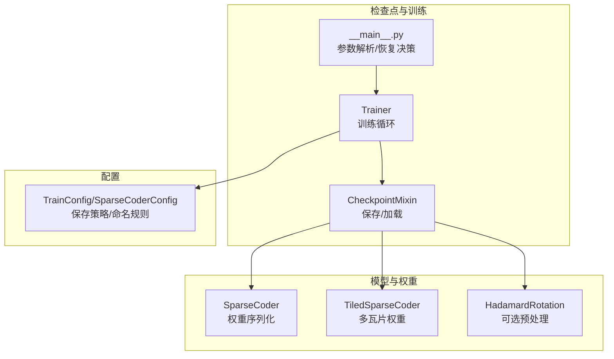
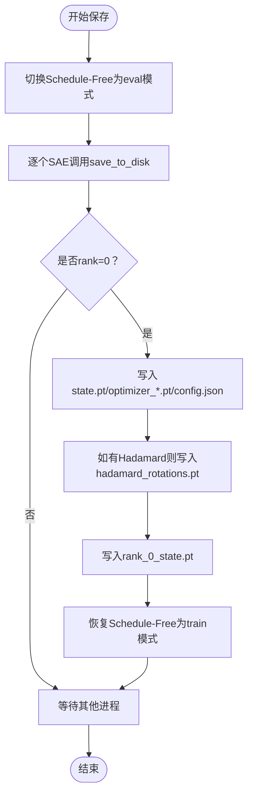
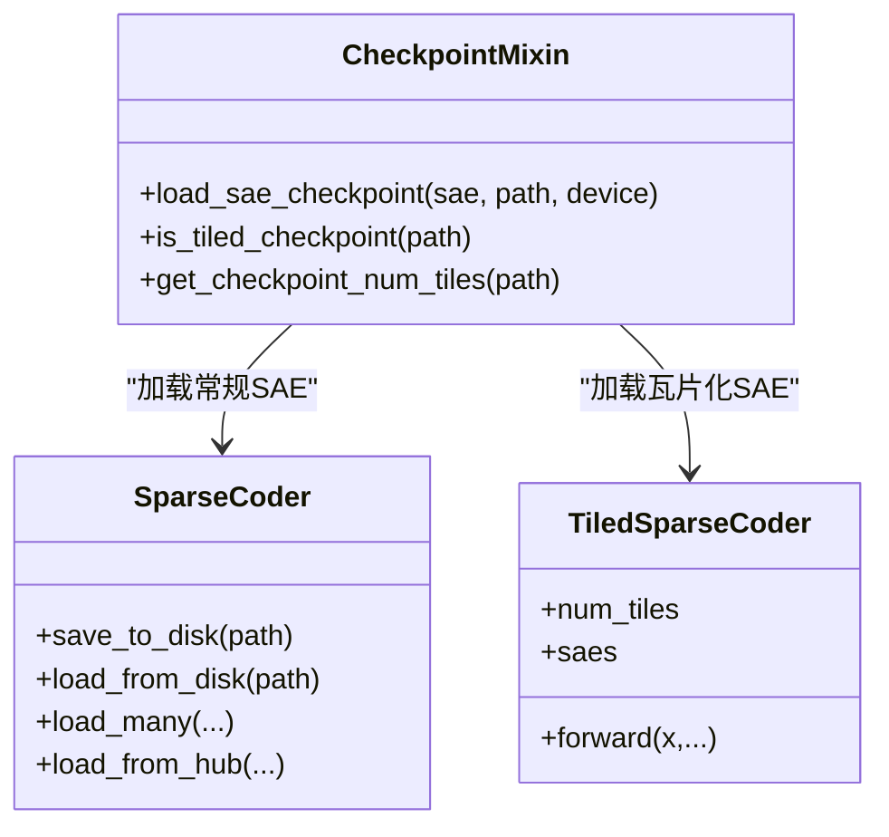
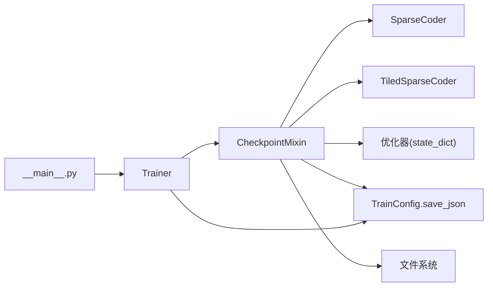

# 检查点管理

<cite>
**本文引用的文件**
- [checkpoint.py](file://sparsify/checkpoint.py)
- [trainer.py](file://sparsify/trainer.py)
- [__main__.py](file://sparsify/__main__.py)
- [config.py](file://sparsify/config.py)
- [sparse_coder.py](file://sparsify/sparse_coder.py)
- [tiled_sparse_coder.py](file://sparsify/tiled_sparse_coder.py)
- [hadamard.py](file://sparsify/hadamard.py)
- [config-reference.md](file://docs/training/config-reference.md)
</cite>

## 目录
1. [简介](#简介)
2. [项目结构](#项目结构)
3. [核心组件](#核心组件)
4. [架构总览](#架构总览)
5. [详细组件分析](#详细组件分析)
6. [依赖关系分析](#依赖关系分析)
7. [性能考量](#性能考量)
8. [故障排查指南](#故障排查指南)
9. [结论](#结论)
10. [附录](#附录)

## 简介
本文件系统性阐述 Sparsify 的检查点管理模块，覆盖以下关键主题：
- 检查点保存与加载机制
- 模型权重（SAE）的序列化与恢复流程
- 训练状态的持久化（全局步数、累计 token 数）
- 优化器状态的保存与恢复
- 学习率调度器的状态管理（通过 Schedule-Free 包装器）
- 最佳模型保存策略、增量检查点与断点续训
- 检查点文件命名规则、版本兼容性与迁移方法
- 使用示例与训练中断后的恢复流程及最佳实践

## 项目结构
检查点管理相关代码主要分布在以下模块：
- 检查点混合类：提供保存/加载能力
- 训练器：封装训练循环与调用检查点接口
- 主入口：解析参数、决定是否从检查点恢复
- 配置：定义训练配置与保存策略
- SAE 实现：提供权重序列化/反序列化接口
- 瓦片化 SAE：支持多瓦片并行训练与检查点布局
- Hadamard 旋转：可选的预处理，其状态参与检查点



图表来源
- [checkpoint.py:101-302](file://sparsify/checkpoint.py#L101-L302)
- [trainer.py:39-760](file://sparsify/trainer.py#L39-L760)
- [__main__.py:131-211](file://sparsify/__main__.py#L131-L211)
- [config.py:28-149](file://sparsify/config.py#L28-L149)
- [sparse_coder.py:121-167](file://sparsify/sparse_coder.py#L121-L167)
- [tiled_sparse_coder.py:17-200](file://sparsify/tiled_sparse_coder.py#L17-L200)
- [hadamard.py:66-200](file://sparsify/hadamard.py#L66-L200)

章节来源
- [checkpoint.py:1-302](file://sparsify/checkpoint.py#L1-L302)
- [trainer.py:1-760](file://sparsify/trainer.py#L1-L760)
- [__main__.py:1-211](file://sparsify/__main__.py#L1-L211)
- [config.py:1-149](file://sparsify/config.py#L1-L149)
- [sparse_coder.py:1-269](file://sparsify/sparse_coder.py#L1-L269)
- [tiled_sparse_coder.py:1-342](file://sparsify/tiled_sparse_coder.py#L1-L342)
- [hadamard.py:1-259](file://sparsify/hadamard.py#L1-L259)
- [config-reference.md:170-193](file://docs/training/config-reference.md#L170-L193)

## 核心组件
- CheckpointMixin：提供保存/加载检查点的通用逻辑，包括：
  - SAE 权重保存/加载（常规与瓦片化）
  - 训练状态保存（global_step、total_tokens）
  - 优化器状态保存/加载
  - Hadamard 旋转状态保存/加载
  - 最佳模型保存（按 hookpoint 单独保存）
- Trainer：继承 CheckpointMixin，负责训练循环并在合适时机调用保存接口
- 主入口：根据命令行参数决定是否从检查点恢复，并在恢复时调用 Trainer.load_state
- 配置：定义保存目录、命名规则、保存频率、最佳模型保存开关等
- SAE/Tiled SAE：提供 save_to_disk/load_from_disk，使用 safetensors 序列化权重与配置
- HadamardRotation：提供 state_dict/from_state_dict，用于保存/恢复旋转状态

章节来源
- [checkpoint.py:101-302](file://sparsify/checkpoint.py#L101-L302)
- [trainer.py:39-760](file://sparsify/trainer.py#L39-L760)
- [__main__.py:173-206](file://sparsify/__main__.py#L173-L206)
- [config.py:28-149](file://sparsify/config.py#L28-L149)
- [sparse_coder.py:121-167](file://sparsify/sparse_coder.py#L121-L167)
- [tiled_sparse_coder.py:17-200](file://sparsify/tiled_sparse_coder.py#L17-L200)
- [hadamard.py:66-200](file://sparsify/hadamard.py#L66-L200)

## 架构总览
检查点管理采用“混合类 + 训练器 + 配置 + 模型权重”的分层设计：
- 混合类统一处理文件系统层面的保存/加载
- 训练器协调分布式环境与保存时机
- 配置控制命名、保存频率与最佳模型策略
- 模型权重通过 safetensors 保证跨设备/精度安全

```mermaid
sequenceDiagram
participant CLI as "命令行"
participant Main as "__main__.py"
participant Trainer as "Trainer.fit()"
participant Mixin as "CheckpointMixin"
participant SAE as "SAE/Tiled SAE"
participant Opt as "优化器"
participant FS as "文件系统"
CLI->>Main : 解析参数(--resume/--finetune)
Main->>Trainer : 构造Trainer(cfg, dataset, model, resume_from)
alt 需要恢复
Main->>Trainer : load_state(resume_path)
Trainer->>Mixin : load_state(path)
Mixin->>FS : 读取state.pt/optimizer_*.pt/rank_0_state.pt
Mixin->>SAE : load_sae_checkpoint(...)
Mixin->>Opt : 加载优化器状态字典
end
Trainer->>Trainer : fit()主循环
alt 达到保存条件
Trainer->>Mixin : save()/save_best()
Mixin->>SAE : save_to_disk(...)
Mixin->>FS : 写入state.pt/optimizer_*.pt/config.json
end
```

图表来源
- [__main__.py:173-206](file://sparsify/__main__.py#L173-L206)
- [trainer.py:162-727](file://sparsify/trainer.py#L162-L727)
- [checkpoint.py:149-302](file://sparsify/checkpoint.py#L149-L302)
- [sparse_coder.py:154-167](file://sparsify/sparse_coder.py#L154-L167)
- [tiled_sparse_coder.py:17-200](file://sparsify/tiled_sparse_coder.py#L17-L200)

## 详细组件分析

### 检查点保存与加载（CheckpointMixin）
- 保存内容
  - SAE 权重：每个 hookpoint 下一个目录，包含 cfg.json 与 sae.safetensors
  - 训练状态：state.pt（global_step、total_tokens）
  - 优化器状态：optimizer_*.pt（多个优化器时分别保存）
  - 配置：config.json（顶层）
  - 死特征计数与最佳损失：rank_0_state.pt
  - 可选：Hadamard 旋转状态 hadamard_rotations.pt
- 加载顺序
  - 先加载训练状态与死特征计数/最佳损失
  - 再加载优化器状态
  - 最后加载 SAE 权重，自动识别常规或瓦片化格式
  - 若启用 Hadamard，再加载旋转状态



图表来源
- [checkpoint.py:199-245](file://sparsify/checkpoint.py#L199-L245)

章节来源
- [checkpoint.py:149-302](file://sparsify/checkpoint.py#L149-L302)

### SAE 权重序列化与恢复
- 常规 SAE
  - 保存：调用 save_to_disk，生成 cfg.json 与 sae.safetensors
  - 加载：load_from_disk 读取 cfg.json 并使用 safetensors 加载权重
- 瓦片化 SAE
  - 保存：顶层 cfg.json 记录 num_tiles/k_per_tile/global_topk/input_mixing；每个 tile_<i> 目录下保存 sae.safetensors
  - 加载：is_tiled_checkpoint/get_checkpoint_num_tiles 判断瓦片化；逐 tile 加载
- 断言与兼容性
  - 当前配置与检查点的 num_tiles 必须匹配，否则抛出异常
  - 非瓦片化检查点不可恢复到瓦片化配置



图表来源
- [sparse_coder.py:121-167](file://sparsify/sparse_coder.py#L121-L167)
- [tiled_sparse_coder.py:17-200](file://sparsify/tiled_sparse_coder.py#L17-L200)
- [checkpoint.py:44-73](file://sparsify/checkpoint.py#L44-L73)

章节来源
- [sparse_coder.py:121-167](file://sparsify/sparse_coder.py#L121-L167)
- [tiled_sparse_coder.py:17-200](file://sparsify/tiled_sparse_coder.py#L17-L200)
- [checkpoint.py:22-73](file://sparsify/checkpoint.py#L22-L73)

### 训练状态持久化
- global_step：训练步数
- total_tokens：累计 token 数
- 死特征计数：num_tokens_since_fired（按 hookpoint 维度记录）
- 最佳损失：best_loss（按 hookpoint 维度记录）

加载时会合并来自不同 rank 的 rank_*_state.pt 文件，若存在非字典形式的 best_loss，则广播为各 SAE 的初始值。

章节来源
- [checkpoint.py:149-198](file://sparsify/checkpoint.py#L149-L198)

### 优化器状态保存与学习率调度器管理
- 优化器状态：每个优化器保存为 optimizer_*.pt（state_dict）
- 学习率调度器：通过 Schedule-Free 包装器实现，保存时会将包装器置于 eval 模式以确保状态一致性，保存后再恢复为 train 模式
- 多优化器：按索引保存多个 optimizer_*.pt

章节来源
- [checkpoint.py:176-180](file://sparsify/checkpoint.py#L176-L180)
- [checkpoint.py:205-244](file://sparsify/checkpoint.py#L205-L244)
- [trainer.py:119-131](file://sparsify/trainer.py#L119-L131)

### 最佳模型保存策略
- 按 hookpoint 单独保存最佳模型，路径为 {save_dir}/{full_run_name}/best/{hookpoint}
- 仅当该 hookpoint 的平均损失低于历史最佳时才保存
- 保存时不包含训练状态（save_training_state=False），仅保存 SAE 权重与顶层配置

章节来源
- [checkpoint.py:257-299](file://sparsify/checkpoint.py#L257-L299)

### 增量检查点与断点续训
- 命名规则：run_name_dpX_bsY_gaZ_efU_kV_YYYYMMDD_HHMMSS
- 自动发现：若指定 --resume 且未提供完整路径，会按命名规则查找最新运行目录
- 续训流程：构造 Trainer 时传入 resume_from，随后调用 load_state 恢复状态

章节来源
- [config-reference.md:171-177](file://docs/training/config-reference.md#L171-L177)
- [__main__.py:173-196](file://sparsify/__main__.py#L173-L196)
- [trainer.py:162-184](file://sparsify/trainer.py#L162-L184)

### 检查点文件命名规则、版本兼容性与迁移
- 命名与布局：见配置参考文档
- 瓦片化布局：顶层 cfg.json 记录 num_tiles/k_per_tile/global_topk/input_mixing；tile_<i>/sae.safetensors
- 兼容性约束：常规/瓦片化必须严格匹配；否则抛出类型错误或数值不匹配
- 迁移建议：如需变更 num_tiles 或 k_per_tile，应重新训练而非直接恢复

章节来源
- [config-reference.md:179-193](file://docs/training/config-reference.md#L179-L193)
- [checkpoint.py:44-73](file://sparsify/checkpoint.py#L44-L73)
- [tiled_sparse_coder.py:27-61](file://sparsify/tiled_sparse_coder.py#L27-L61)

### 使用示例与恢复流程
- 从检查点恢复
  - 在命令行中设置 --resume，程序会自动定位最近一次运行目录并调用 Trainer.load_state
  - 若需要微调现有检查点，可使用 --finetune 指定预训练权重目录
- 保存检查点
  - 训练过程中按 save_every 步保存；达到保存条件时调用 Trainer.save
  - 如开启 save_best，则在每个保存周期比较并保存最佳模型

章节来源
- [__main__.py:173-206](file://sparsify/__main__.py#L173-L206)
- [trainer.py:649-652](file://sparsify/trainer.py#L649-L652)
- [checkpoint.py:246-302](file://sparsify/checkpoint.py#L246-L302)

## 依赖关系分析
- CheckpointMixin 依赖：
  - SAE/Tiled SAE 的 save_to_disk/load_sae_checkpoint
  - torch.save/load 保存/加载优化器状态
  - safetensors.torch.load_model/save_model 保存/加载权重
  - 配置对象的 save_json
- Trainer 依赖：
  - CheckpointMixin 提供保存/加载接口
  - 分布式环境下的 rank 判定与 barrier 同步
- 配置依赖：
  - 控制保存目录、命名规则、保存频率、最佳模型开关



图表来源
- [checkpoint.py:199-245](file://sparsify/checkpoint.py#L199-L245)
- [trainer.py:39-760](file://sparsify/trainer.py#L39-L760)
- [__main__.py:173-206](file://sparsify/__main__.py#L173-L206)

章节来源
- [checkpoint.py:101-302](file://sparsify/checkpoint.py#L101-L302)
- [trainer.py:39-760](file://sparsify/trainer.py#L39-L760)
- [__main__.py:131-211](file://sparsify/__main__.py#L131-L211)

## 性能考量
- 保存时将 Schedule-Free 包装器置于 eval 模式，避免状态不一致导致的额外开销
- 使用 safetensors 序列化权重，减少 CPU/GPU 数据拷贝与类型转换成本
- 分布式环境下仅 rank=0 执行实际写盘操作，其余进程等待 barrier，降低锁竞争
- 死特征计数与最佳损失的聚合在加载时进行，避免每次训练都做昂贵的 all_reduce

章节来源
- [checkpoint.py:205-244](file://sparsify/checkpoint.py#L205-L244)
- [checkpoint.py:159-173](file://sparsify/checkpoint.py#L159-L173)

## 故障排查指南
- 常见错误与原因
  - “无法从常规/瓦片化检查点恢复到相反配置”：当前 num_tiles 与检查点不匹配
  - “找不到检查点”：--resume 未提供完整路径且未找到匹配命名模式的目录
  - “Hadamard block size 不是 2 的幂”：配置校验失败
- 排查步骤
  - 确认 save_dir 与 run_name 是否正确
  - 检查 cfg.json 中的 num_tiles/k_per_tile 是否与当前配置一致
  - 确保分布式环境下的 rank=0 有写权限
  - 如需微调，确认 finetune 路径下每个 hookpoint 目录均存在

章节来源
- [checkpoint.py:44-73](file://sparsify/checkpoint.py#L44-L73)
- [__main__.py:173-196](file://sparsify/__main__.py#L173-L196)
- [config.py:143-149](file://sparsify/config.py#L143-L149)

## 结论
Sparsify 的检查点管理模块通过 CheckpointMixin 将保存/加载逻辑抽象化，结合 Trainer 的训练循环与配置驱动的命名规则，实现了稳定可靠的断点续训与最佳模型保存。SAE/Tiled SAE 的 safetensors 序列化确保了权重与配置的安全持久化，而对 Schedule-Free 包装器的特殊处理保障了优化器状态的一致性。遵循本文的最佳实践与排错建议，可在大规模分布式训练中高效、安全地管理检查点。

## 附录
- 关键文件与职责
  - [checkpoint.py](file://sparsify/checkpoint.py)：检查点保存/加载核心逻辑
  - [trainer.py](file://sparsify/trainer.py)：训练循环与保存触发点
  - [__main__.py](file://sparsify/__main__.py)：参数解析与恢复决策
  - [config.py](file://sparsify/config.py)：训练配置与保存策略
  - [sparse_coder.py](file://sparsify/sparse_coder.py)：SAE 权重序列化/反序列化
  - [tiled_sparse_coder.py](file://sparsify/tiled_sparse_coder.py)：瓦片化 SAE 权重布局
  - [hadamard.py](file://sparsify/hadamard.py)：可选预处理与状态管理
  - [config-reference.md](file://docs/training/config-reference.md)：命名与布局规范