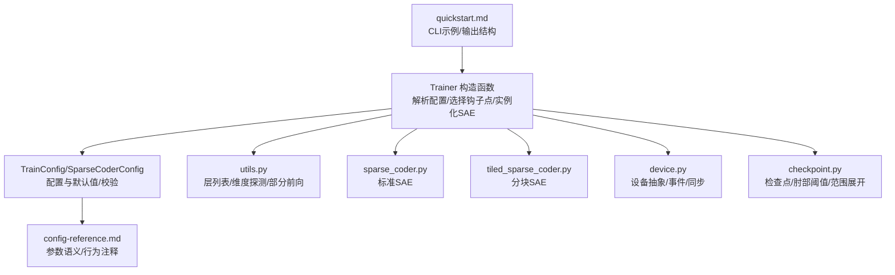
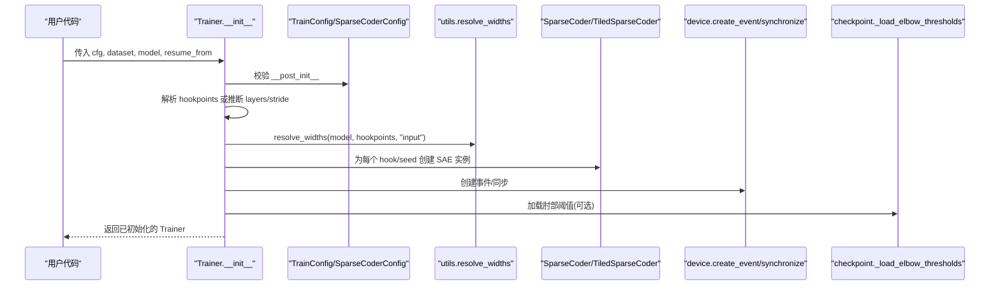
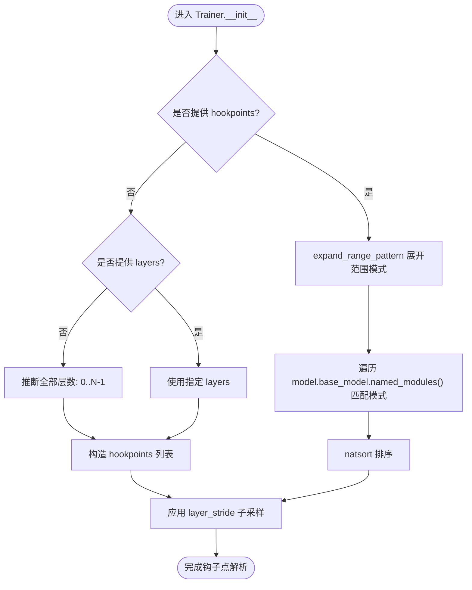
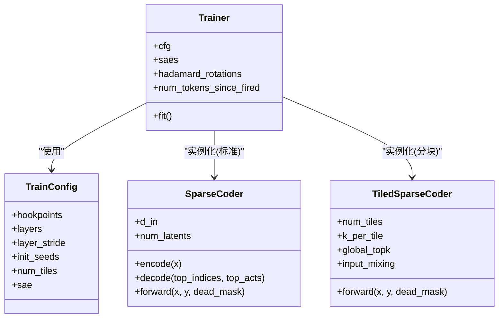
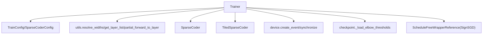

# 训练器初始化与配置

<cite>
**本文引用的文件列表**
- [trainer.py](file://sparsify/trainer.py)
- [config.py](file://sparsify/config.py)
- [device.py](file://sparsify/device.py)
- [utils.py](file://sparsify/utils.py)
- [sparse_coder.py](file://sparsify/sparse_coder.py)
- [tiled_sparse_coder.py](file://sparsify/tiled_sparse_coder.py)
- [checkpoint.py](file://sparsify/checkpoint.py)
- [config-reference.md](file://docs/training/config-reference.md)
- [quickstart.md](file://docs/training/quickstart.md)
- [README.md](file://README.md)
</cite>

## 目录
1. [简介](#简介)
2. [项目结构](#项目结构)
3. [核心组件](#核心组件)
4. [架构总览](#架构总览)
5. [详细组件分析](#详细组件分析)
6. [依赖关系分析](#依赖关系分析)
7. [性能考量](#性能考量)
8. [故障排查指南](#故障排查指南)
9. [结论](#结论)
10. [附录](#附录)

## 简介
本文件聚焦 Sparsify 训练器初始化与配置模块，系统性阐述 Trainer 类构造函数的实现细节，包括配置参数解析、钩子点选择与扩展、SAE 实例化流程；训练配置的验证与默认值设置（hookpoints、layers、layer_stride 等）；多种子初始化机制与分块训练模式配置；设备抽象层初始化、优化器配置与学习率调度策略；并提供具体代码示例路径与常见配置错误排查方法，帮助读者快速、准确地完成训练器初始化与配置。

## 项目结构
围绕训练器初始化与配置的关键文件与职责如下：
- sparsify/trainer.py：训练器主入口，负责构造函数中的配置解析、钩子点选择、SAE 实例化、优化器与学习率配置、训练循环启动等。
- sparsify/config.py：定义 TrainConfig 与 SparseCoderConfig，包含训练与 SAE 架构的全部配置项及其默认值与校验规则。
- sparsify/device.py：设备抽象层，统一 CUDA/NPU/CPUs 的事件、同步、自动混合精度等能力。
- sparsify/utils.py：工具函数，包括层列表解析、维度探测、部分前向、范围索引提取等。
- sparsify/sparse_coder.py：标准稀疏自编码器实现，含编码、解码、损失计算、权重初始化与保存/加载。
- sparsify/tiled_sparse_coder.py：分块稀疏自编码器实现，支持按隐藏维分块、全局 top-k、输入混洗等高级特性。
- sparsify/checkpoint.py：检查点加载/保存工具，含肘部阈值加载、范围模式展开、混合器 CheckpointMixin 等。
- docs/training/config-reference.md：配置参考文档，涵盖参数语义、行为注释与验证规则。
- docs/training/quickstart.md：快速开始文档，给出 CLI 示例与输出结构说明。
- README.md：项目概览与主要代码路径说明。

图表来源
- [trainer.py:39-161](file://sparsify/trainer.py#L39-L161)
- [config.py:28-149](file://sparsify/config.py#L28-L149)
- [utils.py:20-154](file://sparsify/utils.py#L20-L154)
- [sparse_coder.py:36-269](file://sparsify/sparse_coder.py#L36-L269)
- [tiled_sparse_coder.py:17-342](file://sparsify/tiled_sparse_coder.py#L17-L342)
- [device.py:14-118](file://sparsify/device.py#L14-L118)
- [checkpoint.py:75-148](file://sparsify/checkpoint.py#L75-L148)

章节来源
- [trainer.py:39-161](file://sparsify/trainer.py#L39-L161)
- [config.py:28-149](file://sparsify/config.py#L28-L149)
- [utils.py:20-154](file://sparsify/utils.py#L20-L154)
- [sparse_coder.py:36-269](file://sparsify/sparse_coder.py#L36-L269)
- [tiled_sparse_coder.py:17-342](file://sparsify/tiled_sparse_coder.py#L17-L342)
- [device.py:14-118](file://sparsify/device.py#L14-L118)
- [checkpoint.py:75-148](file://sparsify/checkpoint.py#L75-L148)

## 核心组件
- Trainer 构造函数：完成配置解析、钩子点选择与扩展、SAE 实例化、优化器与学习率配置、设备与事件初始化、肘部阈值加载、最佳损失字典初始化等。
- TrainConfig/SparseCoderConfig：集中定义训练与 SAE 架构参数、默认值与运行期校验。
- 设备抽象层：统一事件、同步、bf16 自动混合精度等。
- 工具函数：层列表解析、维度探测、部分前向、范围索引提取。
- SAE 实现：标准与分块两种变体，支持不同训练模式与导出需求。
- 检查点工具：范围模式展开、肘部阈值匹配、训练状态与权重保存/加载。

章节来源
- [trainer.py:39-161](file://sparsify/trainer.py#L39-L161)
- [config.py:28-149](file://sparsify/config.py#L28-L149)
- [device.py:14-118](file://sparsify/device.py#L14-L118)
- [utils.py:20-154](file://sparsify/utils.py#L20-L154)
- [sparse_coder.py:36-269](file://sparsify/sparse_coder.py#L36-L269)
- [tiled_sparse_coder.py:17-342](file://sparsify/tiled_sparse_coder.py#L17-L342)
- [checkpoint.py:75-148](file://sparsify/checkpoint.py#L75-L148)

## 架构总览
训练器初始化阶段的高层流程如下：
- 解析配置：读取 TrainConfig 与 SparseCoderConfig，执行 __post_init__ 校验。
- 钩子点选择：若显式提供 hookpoints，则展开范围模式并匹配模型模块名；否则根据 layers 与 layer_stride 推断。
- 维度探测：resolve_widths 获取各钩子点输入宽度，用于 SAE 初始化。
- SAE 实例化：根据 num_tiles 决定使用标准或分块 SAE，支持多种子初始化。
- 优化器与学习率：基于每个 SAE 参数组构建 SignSGD，使用 ScheduleFree 包装器，学习率按 num_latents 自动缩放。
- 设备与事件：根据设备类型创建事件与同步，初始化 Hadamard 旋转（可选）。
- 肘部阈值：从 JSON 文件加载阈值并匹配钩子点，用于 exceed 指标计算。

图表来源
- [trainer.py:39-161](file://sparsify/trainer.py#L39-L161)
- [config.py:124-149](file://sparsify/config.py#L124-L149)
- [utils.py:33-79](file://sparsify/utils.py#L33-L79)
- [sparse_coder.py:36-100](file://sparsify/sparse_coder.py#L36-L100)
- [tiled_sparse_coder.py:27-61](file://sparsify/tiled_sparse_coder.py#L27-L61)
- [checkpoint.py:104-147](file://sparsify/checkpoint.py#L104-L147)

## 详细组件分析

### 配置参数解析与验证
- TrainConfig.__post_init__ 执行关键校验：
  - 不能同时指定 layers 与 layer_stride。
  - init_seeds 必须非空。
  - exceed_alphas 必须为正数。
  - 若提供 elbow_threshold_path，文件必须存在。
  - 若 use_hadamard，hadamard_block_size 必须为正的 2 的幂。
  - 若 compile_model，仅在 CUDA 后端生效，否则自动禁用。
- SparseCoderConfig 默认值：
  - expansion_factor=32，normalize_decoder=True，num_latents=0（由 d_in×expansion_factor 推导），k=32。
- 关键参数含义与默认值详见配置参考文档。

章节来源
- [config.py:124-149](file://sparsify/config.py#L124-L149)
- [config-reference.md:55-169](file://docs/training/config-reference.md#L55-L169)

### 钩子点选择与扩展
- 若显式提供 hookpoints：
  - expand_range_pattern 展开形如 layers.[1-10].xxx 的范围语法。
  - 使用 fnmatch 对模型 base_model 的所有模块名进行匹配，得到原始钩子点列表。
  - 使用 natsort 对钩子点进行自然排序。
- 若未提供 hookpoints：
  - 若未指定 layers，默认训练全部层数（基于模型 config.num_hidden_layers）。
  - 通过 get_layer_list 获取层列表，构造 hookpoints 列表。
- 最终应用 layer_stride 进行子采样。

图表来源
- [trainer.py:49-73](file://sparsify/trainer.py#L49-L73)
- [checkpoint.py:75-98](file://sparsify/checkpoint.py#L75-L98)
- [utils.py:20-31](file://sparsify/utils.py#L20-L31)

章节来源
- [trainer.py:49-73](file://sparsify/trainer.py#L49-L73)
- [checkpoint.py:75-98](file://sparsify/checkpoint.py#L75-L98)
- [utils.py:20-31](file://sparsify/utils.py#L20-L31)

### SAE 实例化与多种子初始化
- 维度探测：resolve_widths 基于模型前向钩住输入/输出维度，返回每个钩子点的输入宽度。
- SAE 实例化：
  - 若 num_tiles > 1：使用 TiledSparseCoder，按隐藏维分块，每块独立训练 SAE。
  - 否则：使用 SparseCoder，标准单体 SAE。
- 多种子初始化：对每个 hook 与每个 seed，分别设置随机种子并创建 SAE；若 seed 数大于 1，命名格式为 "<hook>/seed<seed>"。
- 分块模式下，k 与 num_tiles 的整除性约束由 TiledSparseCoder 断言保证。

图表来源
- [trainer.py:88-116](file://sparsify/trainer.py#L88-L116)
- [sparse_coder.py:36-100](file://sparsify/sparse_coder.py#L36-L100)
- [tiled_sparse_coder.py:27-61](file://sparsify/tiled_sparse_coder.py#L27-L61)
- [config.py:28-149](file://sparsify/config.py#L28-L149)

章节来源
- [trainer.py:88-116](file://sparsify/trainer.py#L88-L116)
- [sparse_coder.py:36-100](file://sparsify/sparse_coder.py#L36-L100)
- [tiled_sparse_coder.py:27-61](file://sparsify/tiled_sparse_coder.py#L27-L61)
- [config.py:28-149](file://sparsify/config.py#L28-L149)

### 设备抽象层初始化与事件
- 设备检测：自动识别 CUDA/NPU/CPUs，提供统一的 set_device、synchronize、create_event、get_dist_backend 等接口。
- 事件与计时：在 CUDA/NPU 上启用事件计时，CPU 上使用 perf_counter；在日志频率触发时记录前向时间与指标计算时间。
- 自动混合精度：device_autocast 装饰器在运行时根据设备类型切换 bf16 autocast。

章节来源
- [device.py:14-118](file://sparsify/device.py#L14-L118)
- [trainer.py:282-288](file://sparsify/trainer.py#L282-L288)
- [utils.py:185-197](file://sparsify/utils.py#L185-L197)

### 优化器配置与学习率调度策略
- 优化器：为每个 SAE 参数组构建 SignSGD，使用 ScheduleFreeWrapperReference 包装器，设置 momentum=0.95。
- 学习率：若 cfg.lr 未指定，按每个 SAE 的 num_latents 自动计算学习率，公式为 5e-3 / sqrt(num_latents / 2^14)，确保随规模缩放。
- 训练步进：grad_acc_steps 控制梯度累积步长，每 acc_steps 执行一次优化器 step 并清零梯度。

章节来源
- [trainer.py:119-135](file://sparsify/trainer.py#L119-L135)
- [config-reference.md:65-75](file://docs/training/config-reference.md#L65-L75)

### 分块训练模式配置选项
- num_tiles：将输入隐藏维 d_in 分割为 num_tiles 个块，每块独立训练 SAE。
- global_topk：在全局范围内对所有块的预激活进行 top-k 选择，合并后一次性解码，减少循环。
- input_mixing：在块空间引入可学习的 T×T 混合矩阵，训练时对输入进行混洗，推理时再逆变换，FVU 在原始空间重新计算。
- 断言约束：d_in 必须被 num_tiles 整除；k 必须被 num_tiles 整除；TiledSparseCoder 内部会将全局 k 均匀分配给每块。

章节来源
- [tiled_sparse_coder.py:17-61](file://sparsify/tiled_sparse_coder.py#L17-L61)
- [tiled_sparse_coder.py:102-253](file://sparsify/tiled_sparse_coder.py#L102-L253)
- [config-reference.md:107-122](file://docs/training/config-reference.md#L107-L122)

### 肘部阈值与 exceed 指标
- 肘部阈值加载：从 JSON 文件中按钩子点精确匹配或按层号/组件名启发式匹配，支持多策略回退。
- exceed 指标：在启用 Hadamard 时，先对目标与重构进行反旋转，再计算绝对误差超过 α×elbow_value 的比例，按多个 α 记录。

章节来源
- [checkpoint.py:104-147](file://sparsify/checkpoint.py#L104-L147)
- [trainer.py:428-476](file://sparsify/trainer.py#L428-L476)
- [config-reference.md:77-89](file://docs/training/config-reference.md#L77-L89)

### 具体初始化示例（代码路径）
- 基本初始化：参考 Trainer.__init__ 的参数与内部流程。
  - [trainer.py:39-161](file://sparsify/trainer.py#L39-L161)
- 配置定义与校验：参考 TrainConfig.__post_init__。
  - [config.py:124-149](file://sparsify/config.py#L124-L149)
- 钩子点展开与匹配：参考 expand_range_pattern 与 Trainer 中的匹配逻辑。
  - [checkpoint.py:75-98](file://sparsify/checkpoint.py#L75-L98)
  - [trainer.py:49-73](file://sparsify/trainer.py#L49-L73)
- SAE 实例化：参考 SparseCoder 与 TiledSparseCoder 的构造。
  - [sparse_coder.py:36-100](file://sparsify/sparse_coder.py#L36-L100)
  - [tiled_sparse_coder.py:27-61](file://sparsify/tiled_sparse_coder.py#L27-L61)
- 设备与事件：参考 device.py 的事件与同步接口。
  - [device.py:75-89](file://sparsify/device.py#L75-L89)
- 肘部阈值加载：参考 CheckpointMixin._load_elbow_thresholds。
  - [checkpoint.py:104-147](file://sparsify/checkpoint.py#L104-L147)

## 依赖关系分析
- Trainer 依赖：
  - TrainConfig/SparseCoderConfig：提供配置与默认值。
  - utils：resolve_widths、get_layer_list、partial_forward_to_layer 等。
  - sparse_coder/tiled_sparse_coder：SAE 实现。
  - device：事件、同步、自动混合精度。
  - checkpoint：范围展开、肘部阈值加载。
- Trainer 与 SAE 的耦合：
  - 通过参数组为每个 SAE 构建优化器参数组，学习率按 num_latents 缩放。
  - DDP 包裹 SAE 实例，延迟到首次 forward 后再包裹，避免梯度注册问题。
- 训练循环与日志：
  - 通过 WandB 日志与计时事件，结合 reduce_scalar_mapping/reduce_nested_scalar_mapping 进行分布式聚合。

图表来源
- [trainer.py:39-161](file://sparsify/trainer.py#L39-L161)
- [config.py:28-149](file://sparsify/config.py#L28-L149)
- [utils.py:33-154](file://sparsify/utils.py#L33-L154)
- [sparse_coder.py:36-269](file://sparsify/sparse_coder.py#L36-L269)
- [tiled_sparse_coder.py:17-342](file://sparsify/tiled_sparse_coder.py#L17-L342)
- [device.py:75-89](file://sparsify/device.py#L75-L89)
- [checkpoint.py:104-147](file://sparsify/checkpoint.py#L104-L147)

章节来源
- [trainer.py:39-161](file://sparsify/trainer.py#L39-L161)
- [config.py:28-149](file://sparsify/config.py#L28-L149)
- [utils.py:33-154](file://sparsify/utils.py#L33-L154)
- [sparse_coder.py:36-269](file://sparsify/sparse_coder.py#L36-L269)
- [tiled_sparse_coder.py:17-342](file://sparsify/tiled_sparse_coder.py#L17-L342)
- [device.py:75-89](file://sparsify/device.py#L75-L89)
- [checkpoint.py:104-147](file://sparsify/checkpoint.py#L104-L147)

## 性能考量
- 计时与事件：在 CUDA/NPU 上使用事件计时，避免 Python 层计时开销；CPU 上使用 perf_counter。
- 指标聚合：使用批量 all_reduce 减少通信次数，降低分布式开销。
- 梯度累积：通过 grad_acc_steps 与 micro_acc_steps 控制有效损失尺度与日志归一化。
- 编译加速：compile_model 仅在 CUDA 上启用，编译层内小算子融合，减少核启动开销。
- 分块训练：global_topk 与 input_mixing 在大模型上提升吞吐，但需注意混合矩阵的逆变换成本。

章节来源
- [trainer.py:282-333](file://sparsify/trainer.py#L282-L333)
- [trainer.py:490-496](file://sparsify/trainer.py#L490-L496)
- [config-reference.md:138-159](file://docs/training/config-reference.md#L138-L159)

## 故障排查指南
- 配置错误
  - 同时指定 layers 与 layer_stride：违反校验规则，需二选一。
    - 参考：[config.py:126-127](file://sparsify/config.py#L126-L127)
  - init_seeds 为空：必须至少提供一个种子。
    - 参考：[config.py:129-130](file://sparsify/config.py#L129-L130)
  - exceed_alphas 含非正数：必须全为正。
    - 参考：[config.py:132-133](file://sparsify/config.py#L132-L133)
  - elbow_threshold_path 不存在：请确认路径与权限。
    - 参考：[config.py:135-136](file://sparsify/config.py#L135-L136)
  - hadamard_block_size 非正或非 2 的幂：需满足约束。
    - 参考：[config.py:144-148](file://sparsify/config.py#L144-L148)
  - compile_model 在非 CUDA 平台：会被自动禁用。
    - 参考：[config.py:138-142](file://sparsify/config.py#L138-L142)
- 钩子点问题
  - hookpoints 与 layers 同时指定：构造函数断言冲突。
    - 参考：[trainer.py:50](file://sparsify/trainer.py#L50)
  - 范围模式展开失败：确认模式语法正确。
    - 参考：[checkpoint.py:75-98](file://sparsify/checkpoint.py#L75-L98)
- SAE 实例化问题
  - d_in 无法被 num_tiles 整除：修改 num_tiles 或 d_in。
    - 参考：[tiled_sparse_coder.py:38-43](file://sparsify/tiled_sparse_coder.py#L38-L43)
  - k 无法被 num_tiles 整除：调整 k 或 num_tiles。
    - 参考：[tiled_sparse_coder.py:41-43](file://sparsify/tiled_sparse_coder.py#L41-L43)
- 检查点与恢复
  - 精确匹配钩子点失败：检查钩子点命名与 JSON 键的对应关系。
    - 参考：[checkpoint.py:104-147](file://sparsify/checkpoint.py#L104-L147)
  - 瓶颈：W&B 初始化失败会自动降级为关闭日志。
    - 参考：[trainer.py:186-218](file://sparsify/trainer.py#L186-L218)

章节来源
- [config.py:124-149](file://sparsify/config.py#L124-L149)
- [trainer.py:50](file://sparsify/trainer.py#L50)
- [checkpoint.py:75-98](file://sparsify/checkpoint.py#L75-L98)
- [tiled_sparse_coder.py:38-43](file://sparsify/tiled_sparse_coder.py#L38-L43)
- [trainer.py:186-218](file://sparsify/trainer.py#L186-L218)

## 结论
Trainer 的初始化流程围绕“配置解析—钩子点选择—维度探测—SAE 实例化—优化器与学习率—设备与事件—肘部阈值”展开，形成高内聚、低耦合的模块化设计。通过严格的配置校验、灵活的钩子点选择与扩展、可插拔的 SAE 实现（标准/分块）、统一的设备抽象与高效计时，训练器能够在多平台、多规模场景下稳定运行。遵循本文提供的配置要点与排错建议，可显著提升初始化成功率与训练效率。

## 附录
- 快速开始与 CLI 示例：参考快速开始文档中的命令与输出结构。
  - [quickstart.md:19-78](file://docs/training/quickstart.md#L19-L78)
- 项目概览与主要代码路径：参考 README。
  - [README.md:71-103](file://README.md#L71-L103)