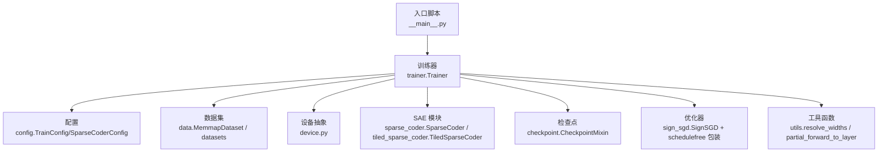
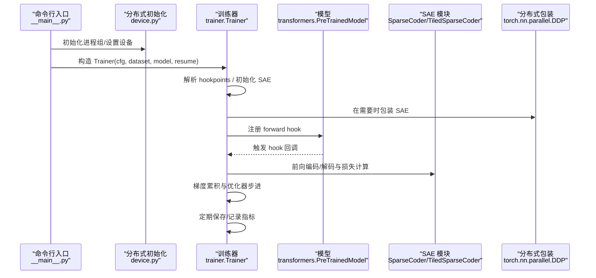
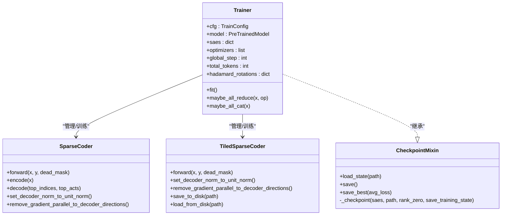
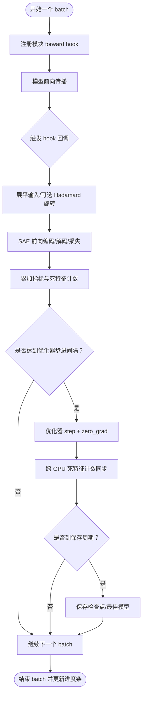
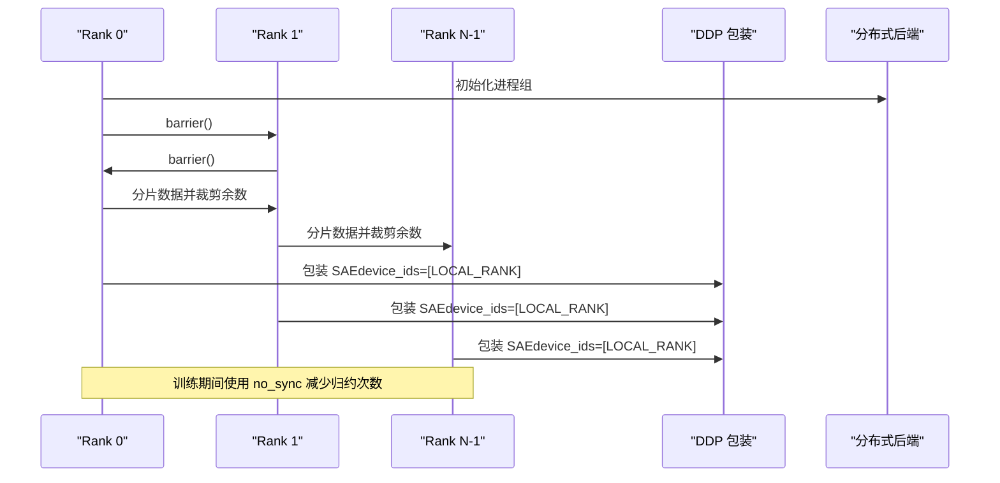
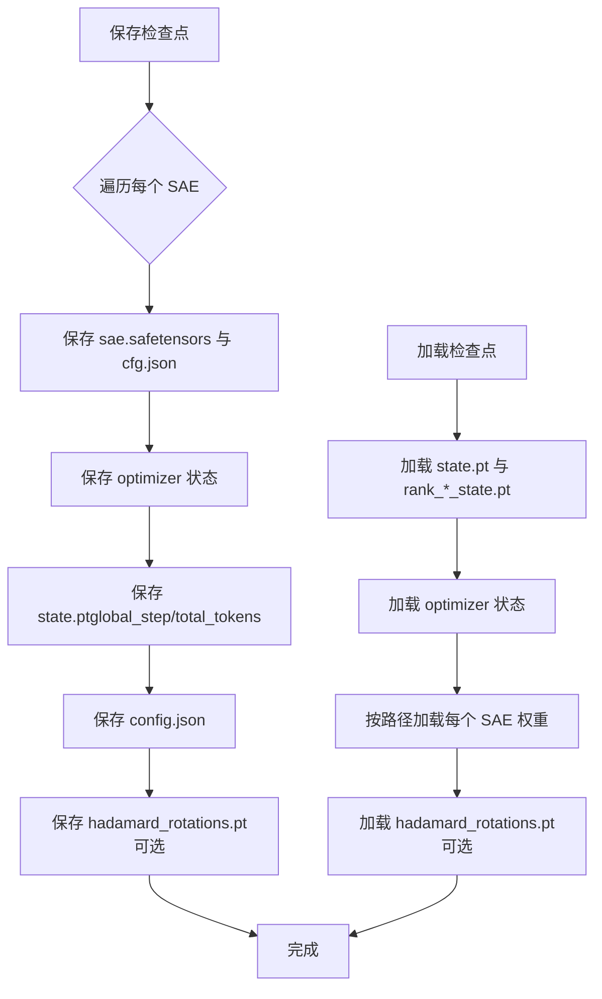
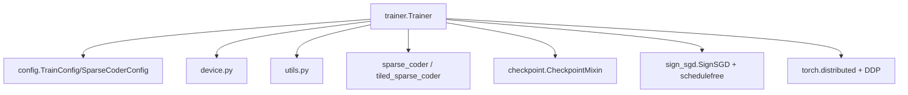

# 训练器核心

<cite>
**本文引用的文件**
- [sparsify/trainer.py](file://sparsify/trainer.py)
- [sparsify/config.py](file://sparsify/config.py)
- [sparsify/checkpoint.py](file://sparsify/checkpoint.py)
- [sparsify/device.py](file://sparsify/device.py)
- [sparsify/utils.py](file://sparsify/utils.py)
- [sparsify/sparse_coder.py](file://sparsify/sparse_coder.py)
- [sparsify/tiled_sparse_coder.py](file://sparsify/tiled_sparse_coder.py)
- [sparsify/sign_sgd.py](file://sparsify/sign_sgd.py)
- [sparsify/data.py](file://sparsify/data.py)
- [sparsify/__main__.py](file://sparsify/__main__.py)
- [docs/training/quickstart.md](file://docs/training/quickstart.md)
- [docs/training/config-reference.md](file://docs/training/config-reference.md)
- [docs/training/qwen3-guide.md](file://docs/training/qwen3-guide.md)
</cite>

## 目录
1. [简介](#简介)
2. [项目结构](#项目结构)
3. [核心组件](#核心组件)
4. [架构总览](#架构总览)
5. [详细组件分析](#详细组件分析)
6. [依赖关系分析](#依赖关系分析)
7. [性能考量](#性能考量)
8. [故障排查指南](#故障排查指南)
9. [结论](#结论)
10. [附录](#附录)

## 简介
本文件面向 Sparsify 训练器核心模块，系统性阐述 Trainer 类的设计架构、初始化流程、训练循环实现，以及钩子系统、分布式训练支持、检查点管理、训练配置解析与优化器初始化等关键主题。文档同时提供可视化图示与最佳实践建议，帮助读者快速理解并高效使用该训练框架。

## 项目结构
Sparsify 训练器位于 sparsify/trainer.py，围绕以下核心模块协作：
- 配置层：TrainConfig/SparseCoderConfig 定义训练参数与 SAE 架构参数
- 数据层：MemmapDataset、chunk_and_tokenize 提供高效数据加载与分词
- 设备层：device.py 抽象 CUDA/NPU/CPUs 的设备与事件接口
- 模型封装：SparseCoder、TiledSparseCoder 实现编码/解码与损失计算
- 检查点：CheckpointMixin 提供保存/加载 SAE 与训练状态的能力
- 入口与分布式：__main__.py 负责参数解析、分布式初始化与数据分片

**图表来源**
- [sparsify/__main__.py:131-211](file://sparsify/__main__.py#L131-L211)
- [sparsify/trainer.py:39-162](file://sparsify/trainer.py#L39-L162)
- [sparsify/config.py:29-149](file://sparsify/config.py#L29-L149)
- [sparsify/data.py:125-158](file://sparsify/data.py#L125-L158)
- [sparsify/device.py:34-118](file://sparsify/device.py#L34-L118)
- [sparsify/sparse_coder.py:36-269](file://sparsify/sparse_coder.py#L36-L269)
- [sparsify/tiled_sparse_coder.py:17-342](file://sparsify/tiled_sparse_coder.py#L17-L342)
- [sparsify/checkpoint.py:101-302](file://sparsify/checkpoint.py#L101-L302)
- [sparsify/sign_sgd.py:5-24](file://sparsify/sign_sgd.py#L5-L24)
- [sparsify/utils.py:20-154](file://sparsify/utils.py#L20-L154)

**章节来源**
- [sparsify/trainer.py:39-162](file://sparsify/trainer.py#L39-L162)
- [sparsify/__main__.py:131-211](file://sparsify/__main__.py#L131-L211)

## 核心组件
- Trainer：负责构建 SAE、注册钩子、执行训练循环、管理分布式与检查点、记录日志与指标
- TrainConfig/SparseCoderConfig：集中定义训练超参、SAE 架构参数与验证规则
- CheckpointMixin：统一保存/加载 SAE 权重、训练状态、优化器状态与 Hadamard 旋转状态
- SparseCoder/TiledSparseCoder：实现编码、解码、FVU/AuxK 损失与梯度约束
- SignSGD + ScheduleFree 包装：提供高效的梯度更新策略
- 设备抽象与工具函数：resolve_widths、partial_forward_to_layer 等提升性能与灵活性

**章节来源**
- [sparsify/trainer.py:39-162](file://sparsify/trainer.py#L39-L162)
- [sparsify/config.py:29-149](file://sparsify/config.py#L29-L149)
- [sparsify/checkpoint.py:101-302](file://sparsify/checkpoint.py#L101-L302)
- [sparsify/sparse_coder.py:36-269](file://sparsify/sparse_coder.py#L36-L269)
- [sparsify/tiled_sparse_coder.py:17-342](file://sparsify/tiled_sparse_coder.py#L17-L342)
- [sparsify/sign_sgd.py:5-24](file://sparsify/sign_sgd.py#L5-L24)
- [sparsify/utils.py:20-154](file://sparsify/utils.py#L20-L154)

## 架构总览
下图展示了从入口到训练器、再到 SAE 与分布式同步的关键交互：

**图表来源**
- [sparsify/__main__.py:131-211](file://sparsify/__main__.py#L131-L211)
- [sparsify/trainer.py:162-729](file://sparsify/trainer.py#L162-L729)
- [sparsify/device.py:92-118](file://sparsify/device.py#L92-L118)
- [sparsify/sparse_coder.py:188-239](file://sparsify/sparse_coder.py#L188-L239)
- [sparsify/tiled_sparse_coder.py:102-140](file://sparsify/tiled_sparse_coder.py#L102-L140)

## 详细组件分析

### 训练器类 Trainer 设计与初始化
- 钩子点选择与展开
  - 支持显式 hookpoints 列表或基于层索引的自动推断
  - 使用 expand_range_pattern 将范围语法扩展为具体模块名
  - 通过 natsort 对模块名进行自然排序，保证一致性
- SAE 初始化
  - 根据输入宽度与配置构造 SparseCoder 或 TiledSparseCoder
  - 多随机种子可并行训练多个 SAE，命名形如 "<hook>/seed<seed>"
  - 可选 Hadamard 旋转，按需延迟初始化
- 优化器与学习率
  - 使用 SignSGD 包裹于 ScheduleFreeWrapperReference，便于 schedule-free 训练
  - 学习率按每个 SAE 的隐状态维度自适应缩放
- 训练状态
  - 维护 global_step、total_tokens、死特征计数等状态
  - 可加载/保存最佳损失与检查点

**图表来源**
- [sparsify/trainer.py:39-162](file://sparsify/trainer.py#L39-L162)
- [sparsify/sparse_coder.py:36-269](file://sparsify/sparse_coder.py#L36-L269)
- [sparsify/tiled_sparse_coder.py:17-342](file://sparsify/tiled_sparse_coder.py#L17-L342)
- [sparsify/checkpoint.py:101-302](file://sparsify/checkpoint.py#L101-L302)

**章节来源**
- [sparsify/trainer.py:39-162](file://sparsify/trainer.py#L39-L162)
- [sparsify/checkpoint.py:101-302](file://sparsify/checkpoint.py#L101-L302)

### 训练循环与钩子系统
- 钩子注册与捕获
  - 在每个 batch 开始时为选定模块注册 forward hook
  - 在 hook 中提取模块输入（作为 SAE 训练激活），可选应用 Hadamard 旋转
  - 对每个 SAE 执行前向，累加 FVU/AuxK 指标，按需计算 exceed 比例
- 梯度累积与同步
  - 通过 grad_acc_steps 控制优化器步进频率
  - 在 no_sync 上下文中对 DDP 模块禁用梯度归约，减少通信开销
- 死特征检测与同步
  - 使用累计 token 数与最小归约确保跨 GPU 一致性
  - 采用一次性 cat+unique 的高效策略避免 AI_CPU fallback
- 日志与计时
  - 仅在需要时启动 CUDA/NPU 事件计时，聚合平均前向时间与指标时间
  - 通过批量归约减少每步指标的 allreduce 次数

**图表来源**
- [sparsify/trainer.py:498-729](file://sparsify/trainer.py#L498-L729)

**章节来源**
- [sparsify/trainer.py:347-577](file://sparsify/trainer.py#L347-L577)

### 分布式训练支持与 DDP 包装
- 进程组初始化
  - 通过 device.py 自动选择后端（NCCL/HCCL/Gloo），设置设备并初始化进程组
- 数据分片
  - 训练前对数据集按世界规模整除余数裁剪，并按 rank 进行分片，确保各 rank 示例数量一致
- SAE DDP 包装
  - 在首次需要时以 LOCAL_RANK 为 device_ids 对 SAE 进行 DDP 包装
  - 在 no_sync 上下文中减少梯度归约次数，提高吞吐
- 指标与张量归约
  - 提供 maybe_all_reduce 与 maybe_all_cat，按需执行 all_reduce/all_gather
  - 批量归约嵌套字典指标，降低通信频次

**图表来源**
- [sparsify/__main__.py:134-171](file://sparsify/__main__.py#L134-L171)
- [sparsify/trainer.py:501-514](file://sparsify/trainer.py#L501-L514)
- [sparsify/device.py:92-118](file://sparsify/device.py#L92-L118)

**章节来源**
- [sparsify/__main__.py:134-171](file://sparsify/__main__.py#L134-L171)
- [sparsify/trainer.py:294-333](file://sparsify/trainer.py#L294-L333)
- [sparsify/device.py:92-118](file://sparsify/device.py#L92-L118)

### 检查点管理与模型保存/恢复
- 保存策略
  - 按 save_every 步保存；若启用 save_best，则单独维护 best/ 子树
  - 保存内容：config.json、state.pt、optimizer_*.pt、每个 hookpoint 的 cfg.json 与 sae.safetensors
  - 若启用 Hadamard，额外保存 hadamard_rotations.pt
- 加载策略
  - 支持从完整 run 恢复（训练状态+优化器+SAE权重）
  - 支持 finetune：仅加载 SAE 权重，开启全新训练
  - TiledSparseCoder 与常规 SparseCoder 的检查点格式不同，加载时会校验 num_tiles 一致性

**图表来源**
- [sparsify/checkpoint.py:199-302](file://sparsify/checkpoint.py#L199-L302)
- [sparsify/checkpoint.py:149-198](file://sparsify/checkpoint.py#L149-L198)

**章节来源**
- [sparsify/checkpoint.py:101-302](file://sparsify/checkpoint.py#L101-L302)

### 训练配置解析、学习率调度与优化器初始化
- 配置解析
  - RunConfig 继承 TrainConfig，提供 CLI 参数与默认值
  - TrainConfig 对关键参数进行运行时校验（如 hadamard_block_size 必须为 2 的幂）
- 学习率与优化器
  - 默认使用 ScheduleFreeWrapperReference(SignSGD)；学习率按隐状态维度自适应
  - 通过 grad_acc_steps 控制有效损失归一化与优化器步进
- 指标与日志
  - 支持 WandB 日志，自动同步日志开关标志，避免跨 rank 不一致

**章节来源**
- [sparsify/config.py:29-149](file://sparsify/config.py#L29-L149)
- [sparsify/trainer.py:119-135](file://sparsify/trainer.py#L119-L135)
- [sparsify/__main__.py:150-211](file://sparsify/__main__.py#L150-L211)

### 使用示例与最佳实践
- 快速开始
  - 使用 python -m sparsify 指定模型、数据集、hookpoints、批大小与梯度累积步数
  - 支持 resume 与 finetune，分别用于恢复训练状态与从已有 SAE 权重继续训练
- 最佳实践
  - 优先选择与导出目标一致的投影类 hookpoints（如 o_proj、up_proj）
  - 合理设置 sae.k 与 expansion_factor，结合目标模型隐藏维
  - 使用 save_best 与定期 save_every 确保关键里程碑可恢复
  - 在 CUDA 上启用 compile_model 以融合小算子，减少内核启动开销

**章节来源**
- [docs/training/quickstart.md:1-153](file://docs/training/quickstart.md#L1-L153)
- [docs/training/config-reference.md:1-193](file://docs/training/config-reference.md#L1-L193)
- [docs/training/qwen3-guide.md:1-78](file://docs/training/qwen3-guide.md#L1-L78)

## 依赖关系分析
- Trainer 依赖
  - 配置：TrainConfig/SparseCoderConfig
  - 设备：device.py 的事件/同步/后端选择
  - 工具：utils 的维度解析与部分前向
  - SAE：SparseCoder/TiledSparseCoder
  - 检查点：CheckpointMixin
  - 优化器：SignSGD + ScheduleFree 包装
- 分布式依赖
  - torch.distributed 与 DDP 包装
  - 设备后端（NCCL/HCCL/Gloo）

**图表来源**
- [sparsify/trainer.py:21-34](file://sparsify/trainer.py#L21-L34)
- [sparsify/config.py:29-149](file://sparsify/config.py#L29-L149)
- [sparsify/device.py:92-118](file://sparsify/device.py#L92-L118)
- [sparsify/utils.py:20-154](file://sparsify/utils.py#L20-L154)
- [sparsify/sparse_coder.py:36-269](file://sparsify/sparse_coder.py#L36-L269)
- [sparsify/tiled_sparse_coder.py:17-342](file://sparsify/tiled_sparse_coder.py#L17-L342)
- [sparsify/checkpoint.py:101-302](file://sparsify/checkpoint.py#L101-L302)
- [sparsify/sign_sgd.py:5-24](file://sparsify/sign_sgd.py#L5-L24)

**章节来源**
- [sparsify/trainer.py:21-34](file://sparsify/trainer.py#L21-L34)

## 性能考量
- 内核融合与编译
  - compile_model 在 CUDA 上启用，对 Transformer 层进行 torch.compile 以融合小算子
- 指标与通信优化
  - 批量归约 scalar 映射与嵌套映射，减少 allreduce 次数
  - 使用 CUDA/NPU Event 计时，避免每次指标计算的同步开销
- 死特征检测
  - 采用一次性 cat+unique 的高效策略，避免 unique() 的 AI_CPU fallback
- Hadamard 旋转
  - 按需延迟初始化，避免不必要的矩阵操作

**章节来源**
- [sparsify/trainer.py:294-333](file://sparsify/trainer.py#L294-L333)
- [sparsify/trainer.py:418-476](file://sparsify/trainer.py#L418-L476)
- [sparsify/trainer.py:586-627](file://sparsify/trainer.py#L586-L627)
- [sparsify/trainer.py:360-371](file://sparsify/trainer.py#L360-L371)

## 故障排查指南
- 分布式初始化失败
  - 确认 LOCAL_RANK 环境变量与后端可用性；检查进程组超时与设备 ID
- 检查点不匹配
  - TiledSparseCoder 与常规 SAE 的 num_tiles 必须一致；否则加载时报错
- 指标未同步
  - 确保 log_to_wandb 在所有 rank 上保持一致（已自动广播 flag）
- 梯度未归约
  - 在 DDP 模式下，确认 no_sync 使用正确，且在步进前完成一次 all_reduce
- 学习率异常
  - 若未指定 lr，将按隐状态维度自适应缩放；请检查 sae.k 与 expansion_factor

**章节来源**
- [sparsify/__main__.py:134-171](file://sparsify/__main__.py#L134-L171)
- [sparsify/checkpoint.py:44-73](file://sparsify/checkpoint.py#L44-L73)
- [sparsify/trainer.py:193-227](file://sparsify/trainer.py#L193-L227)
- [sparsify/trainer.py:402-406](file://sparsify/trainer.py#L402-L406)

## 结论
Trainer 通过清晰的模块化设计与高效的实现细节，实现了对大规模语言模型中间层激活的快速、稳定与可扩展的稀疏编码训练。其钩子系统、分布式支持、检查点管理与配置解析共同构成了完整的训练流水线。遵循本文的最佳实践与排障建议，可在多平台与多规模场景下获得稳定可靠的训练体验。

## 附录
- 常用参数参考
  - hookpoints：支持通配符与范围语法，自动展开为具体模块名
  - num_tiles / global_topk / input_mixing：控制分块与全局竞争策略
  - use_hadamard / hadamard_block_size：启用 Hadamard 旋转并设置块大小
  - compile_model：在 CUDA 上启用层编译以提升性能
- 输出目录布局
  - config.json、state.pt、optimizer_*.pt、rank_0_state.pt、每个 hookpoint 的 cfg.json 与 sae.safetensors
  - 若启用 save_best，将在 best/ 下保存改进的 per-hookpoint 快照

**章节来源**
- [docs/training/config-reference.md:171-193](file://docs/training/config-reference.md#L171-L193)
- [docs/training/quickstart.md:42-78](file://docs/training/quickstart.md#L42-L78)