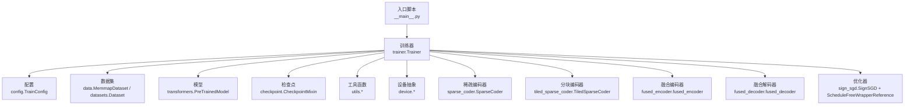
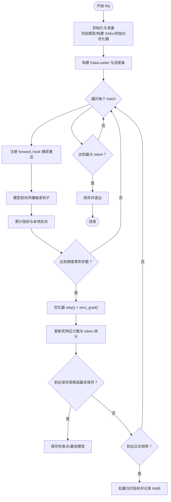
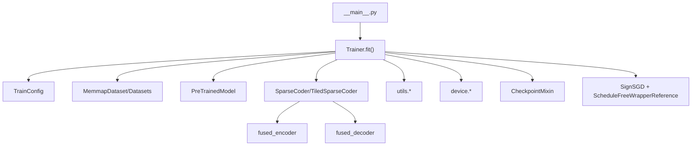

# 训练循环实现

<cite>
**本文档引用的文件**
- [sparsify/trainer.py](file://sparsify/trainer.py)
- [sparsify/__main__.py](file://sparsify/__main__.py)
- [sparsify/config.py](file://sparsify/config.py)
- [sparsify/checkpoint.py](file://sparsify/checkpoint.py)
- [sparsify/data.py](file://sparsify/data.py)
- [sparsify/device.py](file://sparsify/device.py)
- [sparsify/utils.py](file://sparsify/utils.py)
- [sparsify/sparse_coder.py](file://sparsify/sparse_coder.py)
- [sparsify/tiled_sparse_coder.py](file://sparsify/tiled_sparse_coder.py)
- [sparsify/fused_encoder.py](file://sparsify/fused_encoder.py)
- [sparsify/fused_decoder.py](file://sparsify/fused_decoder.py)
- [sparsify/sign_sgd.py](file://sparsify/sign_sgd.py)
</cite>

## 目录
1. [简介](#简介)
2. [项目结构](#项目结构)
3. [核心组件](#核心组件)
4. [架构总览](#架构总览)
5. [详细组件分析](#详细组件分析)
6. [依赖关系分析](#依赖关系分析)
7. [性能考量](#性能考量)
8. [故障排除指南](#故障排除指南)
9. [结论](#结论)
10. [附录](#附录)

## 简介
本文件面向 Sparsify 训练循环实现模块，系统性阐述 Trainer.fit() 的整体流程、批次处理与训练步骤的协调机制，重点覆盖：
- 梯度累积、优化器步骤执行与参数更新的时机控制
- 训练进度监控、指标计算与日志记录机制
- 训练终止条件、最大 token 数限制与早停策略
- 性能监控、调试技巧与故障排除方法

目标是帮助读者在理解代码实现细节的同时，掌握如何高效地配置与运行训练任务。

## 项目结构
Sparsify 的训练循环位于 sparsify/trainer.py 中，围绕 Trainer 类展开；入口脚本在 sparsify/__main__.py；训练配置定义在 sparsify/config.py；分布式与设备抽象在 sparsify/device.py；数据加载与预处理在 sparsify/data.py；检查点与恢复在 sparsify/checkpoint.py；稀疏编码器与解码器实现分别在 sparsify/sparse_coder.py、sparsify/tiled_sparse_coder.py、sparsify/fused_encoder.py、sparsify/fused_decoder.py；优化器在 sparsify/sign_sgd.py。



图表来源
- [sparsify/__main__.py:131-206](file://sparsify/__main__.py#L131-L206)
- [sparsify/trainer.py:39-161](file://sparsify/trainer.py#L39-L161)
- [sparsify/config.py:28-149](file://sparsify/config.py#L28-L149)
- [sparsify/checkpoint.py:101-302](file://sparsify/checkpoint.py#L101-L302)
- [sparsify/data.py:125-158](file://sparsify/data.py#L125-L158)
- [sparsify/device.py:1-118](file://sparsify/device.py#L1-L118)
- [sparsify/utils.py:20-154](file://sparsify/utils.py#L20-L154)
- [sparsify/sparse_coder.py:36-200](file://sparsify/sparse_coder.py#L36-L200)
- [sparsify/tiled_sparse_coder.py:17-200](file://sparsify/tiled_sparse_coder.py#L17-L200)
- [sparsify/fused_encoder.py:21-107](file://sparsify/fused_encoder.py#L21-L107)
- [sparsify/fused_decoder.py:27-107](file://sparsify/fused_decoder.py#L27-L107)
- [sparsify/sign_sgd.py:5-23](file://sparsify/sign_sgd.py#L5-L23)

章节来源
- [sparsify/trainer.py:39-161](file://sparsify/trainer.py#L39-L161)
- [sparsify/__main__.py:131-206](file://sparsify/__main__.py#L131-L206)
- [sparsify/config.py:28-149](file://sparsify/config.py#L28-L149)

## 核心组件
- Trainer.fit(): 训练主循环，负责注册钩子、前向传播、反向传播、梯度累积、优化器步骤、指标聚合与日志记录、检查点保存与终止条件判断。
- TrainConfig: 训练配置，包括批大小、梯度累积步数、微累积步数、最大 token 数、学习率、辅助损失权重、死特征阈值、超阈值评估系数、钩子点选择、初始化种子、分块训练、Hadamard 旋转、编译选项、保存与日志频率等。
- CheckpointMixin: 提供检查点加载/保存、最佳模型保存、肘部阈值加载等功能。
- SparseCoder/TiledSparseCoder: 稀疏自编码器及其分块版本，提供编码、解码、前向输出（含 FVU、AuxK 损失等）。
- fused_encoder/fused_decoder: 自定义融合前向/反向实现，提升 CUDA/NPU 性能与兼容性。
- SignSGD + ScheduleFreeWrapperReference: 优化器与调度器包装，支持 schedule-free 训练。

章节来源
- [sparsify/trainer.py:162-729](file://sparsify/trainer.py#L162-L729)
- [sparsify/config.py:28-149](file://sparsify/config.py#L28-L149)
- [sparsify/checkpoint.py:101-302](file://sparsify/checkpoint.py#L101-L302)
- [sparsify/sparse_coder.py:20-200](file://sparsify/sparse_coder.py#L20-L200)
- [sparsify/tiled_sparse_coder.py:17-200](file://sparsify/tiled_sparse_coder.py#L17-L200)
- [sparsify/fused_encoder.py:21-107](file://sparsify/fused_encoder.py#L21-L107)
- [sparsify/fused_decoder.py:27-107](file://sparsify/fused_decoder.py#L27-L107)
- [sparsify/sign_sgd.py:5-23](file://sparsify/sign_sgd.py#L5-L23)

## 架构总览
下图展示了训练循环从入口到模型前向、钩子捕获、SAE 前向/反向、梯度累积与优化器更新的完整流程。

```mermaid
sequenceDiagram
participant CLI as "命令行入口<br/>__main__.py"
participant Trainer as "训练器<br/>trainer.Trainer"
participant Model as "模型<br/>PreTrainedModel"
participant Hooks as "钩子注册<br/>register_forward_hook"
participant SAE as "SAE<br/>SparseCoder/TiledSparseCoder"
participant Opt as "优化器<br/>ScheduleFreeWrapperReference + SignSGD"
participant Log as "日志/W&B<br/>wandb"
CLI->>Trainer : 创建 Trainer 并调用 fit()
Trainer->>Model : 冻结参数 requires_grad_(False)
Trainer->>Trainer : 构建 hookpoints 列表与 SAEs
Trainer->>Hooks : 为每个 hookpoint 注册 forward_hook
Hooks->>Model : 前向传播触发钩子
Hooks->>SAE : 执行编码/解码与损失计算
SAE-->>Hooks : 返回 FVU/AuxK/latent 指标
Hooks-->>Trainer : 汇总指标与梯度
Trainer->>Trainer : 判断是否达到梯度累积步数
Trainer->>Opt : optimizer.step() + zero_grad()
Trainer->>Trainer : 更新死特征计数与 token 统计
Trainer->>Log : 按频率记录指标与耗时
Trainer->>Trainer : 达到最大 token 或保存周期则保存检查点
Trainer-->>CLI : 训练结束或继续下一 batch
```

图表来源
- [sparsify/trainer.py:162-729](file://sparsify/trainer.py#L162-L729)
- [sparsify/__main__.py:197-206](file://sparsify/__main__.py#L197-L206)

## 详细组件分析

### 训练主循环 fit() 流程
- 初始化与准备
  - 设置浮点矩阵乘法精度以利用 Tensor Cores
  - 冻结模型参数，避免参与训练
  - 生成运行名称（包含世界规模、批大小、梯度累积步数、扩展因子、k 值等）
  - 初始化优化器（ScheduleFreeWrapperReference 包装的 SignSGD），按 SAE 参数组设置学习率
  - 初始化计数器（global_step、total_tokens）、死特征计数、Hadamard 旋转缓存、肘部阈值
- 数据加载与进度条
  - 使用 DataLoader 加载数据集，禁用 shuffle
  - 使用 tqdm 进度条显示训练状态
- 钩子实现与前向传播
  - 注册 forward_hook，捕获各 hookpoint 的输入激活
  - 可选：应用 Hadamard 旋转（按需延迟初始化）
  - 首步：根据数据均值初始化解码器偏置
  - 对每个 SAE 执行编码/解码，累计指标（FVU、AuxK、超阈值比例）
  - 在同步上下文中进行局部反向（支持 DDP no_sync）
- 梯度累积与优化器步骤
  - 每经过 grad_acc_steps 步，执行一次优化器步骤
  - 可选：移除与解码器方向平行的梯度
  - 清零梯度
- 死特征检测与 token 统计
  - 通过累加 num_tokens_since_fired 与 fired_indices 的合并更新，实现高效的“已触发”计数
  - 支持多 GPU 下的最小归约（MIN）传播，确保一致性
- 日志与检查点
  - 按频率批量归约指标（FVU、AuxK、超阈值比例），记录到 W&B
  - 记录平均前向时间与指标计算时间
  - 达到保存周期保存检查点，必要时保存最佳模型
- 终止条件
  - 达到最大 token 数时保存并退出
  - 支持分布式销毁进程组



图表来源
- [sparsify/trainer.py:162-729](file://sparsify/trainer.py#L162-L729)

章节来源
- [sparsify/trainer.py:162-729](file://sparsify/trainer.py#L162-L729)

### 批次处理与训练步骤协调
- 批次维度与 token 计数
  - 每个 batch 的 token 数由 input_ids 的元素总数统计，累加到 num_tokens_in_step
  - 多 GPU 下通过 all_reduce 汇总 total_tokens
- 梯度累积与微累积
  - grad_acc_steps 控制全局累积步数
  - micro_acc_steps 控制微累积（在钩子内部按 microbatch 累积梯度，减少峰值显存）
  - 优化器 step() 在 substep == 0 时执行，确保累积完成
- DDP 同步策略
  - 使用 DDP 包装 SAE，支持 no_sync 在微累积期间避免梯度同步
  - 最终一次性 all_reduce，提高效率
- 时间与指标统计
  - 使用设备事件（CUDA/NPU Event）或 Python perf_counter 记录前向与指标耗时
  - 按频率批量归约指标，减少通信开销

章节来源
- [sparsify/trainer.py:244-288](file://sparsify/trainer.py#L244-L288)
- [sparsify/trainer.py:498-574](file://sparsify/trainer.py#L498-L574)
- [sparsify/trainer.py:575-722](file://sparsify/trainer.py#L575-L722)
- [sparsify/device.py:75-89](file://sparsify/device.py#L75-L89)

### 梯度累积、优化器步骤与参数更新时机
- 梯度累积
  - 通过 acc_steps = grad_acc_steps * micro_acc_steps 计算累积步数
  - 钩子中对损失除以 acc_steps 后 backward，实现等效放大
- 优化器步骤
  - 当 substep == 0 时，执行 optimizer.step() 与 zero_grad()
  - 可选：移除与解码器方向平行的梯度，提升稳定性
- 参数更新
  - 仅在优化器 step() 后更新 SAE 参数
  - 解码器权重可选单位范数约束（normalize_decoder）

章节来源
- [sparsify/trainer.py:263-265](file://sparsify/trainer.py#L263-L265)
- [sparsify/trainer.py:477-479](file://sparsify/trainer.py#L477-L479)
- [sparsify/trainer.py:577-584](file://sparsify/trainer.py#L577-L584)
- [sparsify/trainer.py:578-580](file://sparsify/trainer.py#L578-L580)

### 训练进度监控、指标计算与日志记录
- 指标计算
  - FVU（方差未解释比例）：基于重建误差与总体方差
  - AuxK 损失：用于抑制死特征（可选）
  - 超阈值比例：基于肘部阈值与误差幅度，支持多个 alpha 系数
- 指标聚合
  - 使用 reduce_scalar_mapping 与 reduce_nested_scalar_mapping 批量归约
  - 支持多 GPU 下的 SUM/MEAN/MIN 归约
- 日志记录
  - 按频率记录到 W&B，包含前向时间、指标时间、死特征比例、FVU、AuxK、超阈值比例
  - 记录 total_tokens 作为横轴

章节来源
- [sparsify/trainer.py:294-333](file://sparsify/trainer.py#L294-L333)
- [sparsify/trainer.py:421-476](file://sparsify/trainer.py#L421-L476)
- [sparsify/trainer.py:654-720](file://sparsify/trainer.py#L654-L720)

### 训练终止条件、最大 token 数限制与早停策略
- 终止条件
  - 达到配置的最大 token 数（max_tokens）时保存并退出
- 早停策略
  - 通过 save_best 保存每个 hookpoint 的最佳模型（基于平均损失）
  - 结合日志频率与保存周期，形成“阶段性评估 + 保存”的策略
- 分布式处理
  - 在满足终止条件后销毁进程组，确保资源释放

章节来源
- [sparsify/trainer.py:629-642](file://sparsify/trainer.py#L629-L642)
- [sparsify/checkpoint.py:257-299](file://sparsify/checkpoint.py#L257-L299)

### 具体代码示例路径
以下为训练循环关键流程的代码片段路径（不直接展示代码内容）：
- 训练主循环与钩子注册
  - [sparsify/trainer.py:162-161](file://sparsify/trainer.py#L162-L161)
  - [sparsify/trainer.py:498-574](file://sparsify/trainer.py#L498-L574)
- 梯度累积与优化器步骤
  - [sparsify/trainer.py:263-265](file://sparsify/trainer.py#L263-L265)
  - [sparsify/trainer.py:575-584](file://sparsify/trainer.py#L575-L584)
- 指标计算与日志记录
  - [sparsify/trainer.py:421-476](file://sparsify/trainer.py#L421-L476)
  - [sparsify/trainer.py:654-720](file://sparsify/trainer.py#L654-L720)
- 终止条件与检查点保存
  - [sparsify/trainer.py:629-642](file://sparsify/trainer.py#L629-L642)
  - [sparsify/checkpoint.py:246-302](file://sparsify/checkpoint.py#L246-L302)

## 依赖关系分析
- Trainer 依赖
  - 配置：TrainConfig（训练参数）
  - 数据：MemmapDataset 或 HuggingFace Dataset
  - 模型：PreTrainedModel（冻结参数）
  - SAE：SparseCoder 或 TiledSparseCoder
  - 设备：device.*（事件、同步、后端）
  - 工具：utils.*（层列表解析、部分前向、维度解析）
  - 检查点：CheckpointMixin（保存/加载）
  - 优化器：SignSGD + ScheduleFreeWrapperReference
- SAE 依赖
  - 编码器：fused_encoder（TopK、前向/反向融合）
  - 解码器：fused_decoder（NPU 兼容的 embedding_bag 替代）
- 入口脚本依赖
  - __main__.py 负责解析参数、加载模型与数据、初始化分布式、创建 Trainer 并启动 fit()



图表来源
- [sparsify/trainer.py:39-161](file://sparsify/trainer.py#L39-L161)
- [sparsify/__main__.py:131-206](file://sparsify/__main__.py#L131-L206)

章节来源
- [sparsify/trainer.py:39-161](file://sparsify/trainer.py#L39-L161)
- [sparsify/__main__.py:131-206](file://sparsify/__main__.py#L131-L206)

## 性能考量
- Tensor Cores 与混合精度
  - 设置高精度 matmul 以利用 Tensor Cores
  - SAE 前向使用 device_autocast（bf16）提升吞吐
- 融合内核与内存优化
  - fused_encoder/fused_decoder 采用稀疏 scatter + dense matmul 或 embedding_bag 替代，减少 kernel 启动开销与内存碎片
  - TiledSparseCoder 支持 per-tile 与 global_topk，平衡并行与全局稀疏性
- 梯度累积与微累积
  - 通过 micro_acc_steps 降低峰值显存占用，提升有效 batch size
- DDP 优化
  - no_sync 避免频繁 all_reduce，最终一次性归约
  - 批量归约指标，减少通信频次
- 时间测量
  - 使用设备事件（CUDA/NPU）或 perf_counter 记录前向与指标耗时，便于定位瓶颈

章节来源
- [sparsify/trainer.py:164](file://sparsify/trainer.py#L164)
- [sparsify/utils.py:187-196](file://sparsify/utils.py#L187-L196)
- [sparsify/fused_encoder.py:21-107](file://sparsify/fused_encoder.py#L21-L107)
- [sparsify/fused_decoder.py:27-107](file://sparsify/fused_decoder.py#L27-L107)
- [sparsify/tiled_sparse_coder.py:17-200](file://sparsify/tiled_sparse_coder.py#L17-L200)

## 故障排除指南
- 分布式相关
  - 确保 WORLD_SIZE 与数据划分一致，避免死锁
  - 使用 barrier 与分片选择，保证每个 rank 的数据长度一致
- 检查点不匹配
  - 确认 num_tiles 与 checkpoint 文件一致，否则会抛出类型/数值错误
- 指标异常
  - 若出现 NaN/FusionFallback，检查输入维度与 dtype 是否匹配
  - 确认 Hadamard 旋转块大小为 2 的幂
- 训练停滞
  - 检查 dead_feature_threshold 与 save_every 设置是否合理
  - 确认 max_tokens 是否过小导致提前退出
- 日志缺失
  - 确认 log_to_wandb 与环境变量配置正确，且 rank 为 0 才写入

章节来源
- [sparsify/__main__.py:161-169](file://sparsify/__main__.py#L161-L169)
- [sparsify/checkpoint.py:44-73](file://sparsify/checkpoint.py#L44-L73)
- [sparsify/config.py:138-149](file://sparsify/config.py#L138-L149)
- [sparsify/trainer.py:629-642](file://sparsify/trainer.py#L629-L642)

## 结论
Trainer.fit() 通过钩子驱动的激活捕获、融合编码/解码、梯度累积与优化器步骤的精确协调，实现了高效稳定的稀疏自编码器训练。其设计兼顾了性能（融合内核、Tensor Cores、微累积）、可扩展性（DDP、分块训练、Hadamard 旋转）与可观测性（指标批量归约、W&B 日志）。结合合理的配置与检查点策略，可在大规模数据上稳定收敛并产出高质量模型。

## 附录
- 训练配置要点
  - 批大小、梯度累积步数、微累积步数、最大 token 数、学习率、辅助损失权重、死特征阈值、超阈值评估系数、钩子点选择、初始化种子、分块训练、Hadamard 旋转、编译选项、保存与日志频率
- 入口参数
  - 模型名、数据集路径、上下文长度、最大样本数、是否恢复、文本列名、shuffle 种子、数据预处理进程数、数据集构造参数字符串

章节来源
- [sparsify/config.py:28-149](file://sparsify/config.py#L28-L149)
- [sparsify/__main__.py:31-80](file://sparsify/__main__.py#L31-L80)