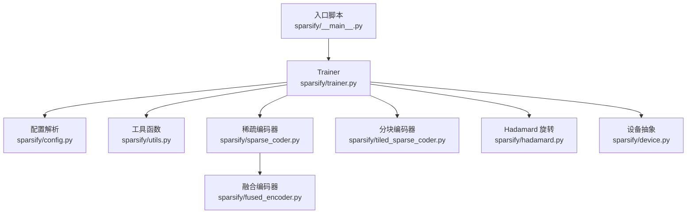
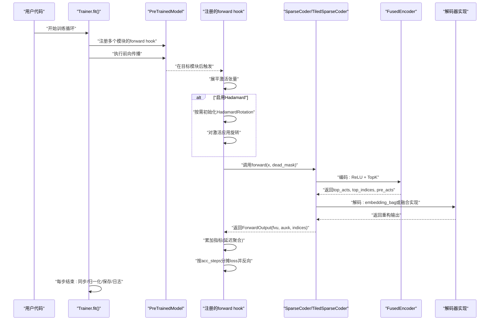
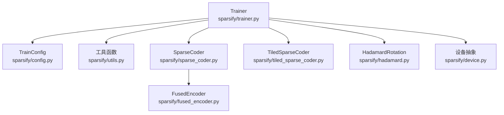
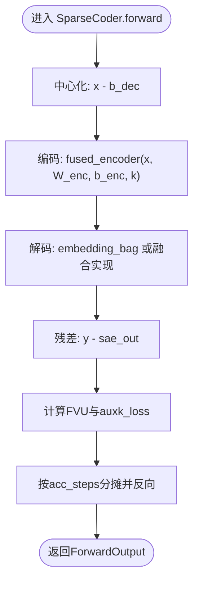

# 钩子系统与激活捕获

<cite>
**本文引用的文件列表**
- [sparsify/__main__.py](file://sparsify/__main__.py)
- [sparsify/trainer.py](file://sparsify/trainer.py)
- [sparsify/utils.py](file://sparsify/utils.py)
- [sparsify/config.py](file://sparsify/config.py)
- [sparsify/sparse_coder.py](file://sparsify/sparse_coder.py)
- [sparsify/tiled_sparse_coder.py](file://sparsify/tiled_sparse_coder.py)
- [sparsify/hadamard.py](file://sparsify/hadamard.py)
- [sparsify/fused_encoder.py](file://sparsify/fused_encoder.py)
- [sparsify/device.py](file://sparsify/device.py)
- [tests/test_encode.py](file://tests/test_encode.py)
</cite>

## 目录
1. [简介](#简介)
2. [项目结构](#项目结构)
3. [核心组件](#核心组件)
4. [架构总览](#架构总览)
5. [详细组件分析](#详细组件分析)
6. [依赖关系分析](#依赖关系分析)
7. [性能考量](#性能考量)
8. [故障排查指南](#故障排查指南)
9. [结论](#结论)
10. [附录](#附录)

## 简介
本文件面向 Sparsify 的“钩子系统与激活捕获”模块，系统性阐述以下主题：
- forward hook 的注册机制与生命周期管理
- 钩子函数的实现逻辑与激活数据处理流程
- 激活张量的扁平化与维度处理
- Hadamard 旋转的应用时机与条件
- 多 SAE 实例并行处理与延迟指标计算
- 梯度累积与死神经元检测机制
- 部分前向传播优化与最大层索引检测
- 内存优化策略与性能优化技巧
- 具体使用示例与调试方法

## 项目结构
Sparsify 的训练主流程由入口脚本驱动，通过 Trainer 统一调度模型、数据集与 SAE 模块；激活捕获通过 PyTorch forward hook 在目标模块上进行拦截；Hadamard 旋转按需应用；编码/解码采用融合内核以降低显存与带宽压力；设备抽象层提供跨 CUDA/NPU 的统一接口。

图表来源
- [sparsify/__main__.py:131-211](file://sparsify/__main__.py#L131-L211)
- [sparsify/trainer.py:39-161](file://sparsify/trainer.py#L39-L161)
- [sparsify/config.py:28-149](file://sparsify/config.py#L28-L149)
- [sparsify/utils.py:20-154](file://sparsify/utils.py#L20-L154)
- [sparsify/sparse_coder.py:36-269](file://sparsify/sparse_coder.py#L36-L269)
- [sparsify/tiled_sparse_coder.py:17-342](file://sparsify/tiled_sparse_coder.py#L17-L342)
- [sparsify/hadamard.py:66-259](file://sparsify/hadamard.py#L66-L259)
- [sparsify/fused_encoder.py:21-107](file://sparsify/fused_encoder.py#L21-L107)
- [sparsify/device.py:34-118](file://sparsify/device.py#L34-L118)

章节来源
- [sparsify/__main__.py:131-211](file://sparsify/__main__.py#L131-L211)
- [sparsify/trainer.py:39-161](file://sparsify/trainer.py#L39-L161)

## 核心组件
- Trainer：负责构建 hookpoint 列表、初始化 SAE、注册/移除 hook、执行前向与反向、聚合指标、保存检查点。
- SparseCoder/TiledSparseCoder：实现编码/解码、Top-K 选择、AuxK 损失、死神经元处理等。
- HadamardRotation：提供块对角 Hadamard 旋转与随机置换，支持 dtype 缓存与设备迁移。
- FusedEncoder：自定义 autograd 函数，融合 ReLU + Top-K + 稀疏反向，显著降低内存与带宽消耗。
- 工具函数：分辨率探测、最大层索引提取、部分前向停止、解码器实现选择等。
- 设备抽象：统一 CUDA/NPU/CPU 的事件、同步、自动混合精度等。

章节来源
- [sparsify/trainer.py:39-161](file://sparsify/trainer.py#L39-L161)
- [sparsify/sparse_coder.py:36-269](file://sparsify/sparse_coder.py#L36-L269)
- [sparsify/tiled_sparse_coder.py:17-342](file://sparsify/tiled_sparse_coder.py#L17-L342)
- [sparsify/hadamard.py:66-259](file://sparsify/hadamard.py#L66-L259)
- [sparsify/fused_encoder.py:21-107](file://sparsify/fused_encoder.py#L21-L107)
- [sparsify/utils.py:20-154](file://sparsify/utils.py#L20-L154)
- [sparsify/device.py:34-118](file://sparsify/device.py#L34-L118)

## 架构总览
下图展示了从模型前向传播到 SAE 训练的关键路径，包括 hook 注册、激活扁平化、Hadamard 旋转、编码/解码、指标计算与梯度累积。

图表来源
- [sparsify/trainer.py:537-574](file://sparsify/trainer.py#L537-L574)
- [sparsify/trainer.py:347-480](file://sparsify/trainer.py#L347-L480)
- [sparsify/sparse_coder.py:187-239](file://sparsify/sparse_coder.py#L187-L239)
- [sparsify/fused_encoder.py:21-107](file://sparsify/fused_encoder.py#L21-L107)
- [sparsify/utils.py:173-196](file://sparsify/utils.py#L173-L196)

## 详细组件分析

### 1) Hook 注册与生命周期
- Trainer 在训练循环中为每个目标模块注册 forward hook，使用模块名到模块的映射，确保仅对指定 hookpoint 生效。
- 注册后执行模型前向，触发各模块的 hook；前向结束后统一移除所有 handle，避免泄漏。
- 支持 torch.compile 场景下禁用 Dynamo 对 hook 体的追踪，保证 DDP 梯度钩子正常工作。

章节来源
- [sparsify/trainer.py:334-346](file://sparsify/trainer.py#L334-L346)
- [sparsify/trainer.py:537-574](file://sparsify/trainer.py#L537-L574)
- [sparsify/trainer.py:481-488](file://sparsify/trainer.py#L481-L488)

### 2) 钩子函数实现逻辑
- 输入展平：将 batch × seq × dim 展平为 N × D，便于 SAE 编码。
- 可选 Hadamard 旋转：首次遇到某 hookpoint 时按 d_in 动态初始化 HadamardRotation，随后对激活进行旋转。
- 首步初始化：若为全局第一步且非微调模式，基于均值初始化解码器偏置。
- 解码器正则：若开启 normalize_decoder，则在每次前向后强制单位范数。
- 并行 SAE 处理：同一 hookpoint 可对应多个种子实例，按 key 分组依次处理。
- 梯度累积：在 sync_context 下执行 wrapped.forward，累积损失并按 acc_steps 分摊后反向。
- 指标延迟计算：FVU/AuxK/exceed 等指标先本地累加，按日志频率批量 allreduce。

章节来源
- [sparsify/trainer.py:347-480](file://sparsify/trainer.py#L347-L480)

### 3) 激活张量的扁平化与维度处理
- 展平策略：对输入元组取第一个张量，按 [batch × seq, d_in] 展平，确保后续编码器输入形状一致。
- 宽度解析：通过临时 forward hook 获取输入/输出维度，用于动态配置 SAE 输入宽度。
- 解码器实现选择：根据设备类型选择 fused 或 eager 实现，NPU/CUDA 使用融合内核避免 CPU fallback。

章节来源
- [sparsify/trainer.py:356-357](file://sparsify/trainer.py#L356-L357)
- [sparsify/utils.py:33-79](file://sparsify/utils.py#L33-L79)
- [sparsify/utils.py:173-196](file://sparsify/utils.py#L173-L196)

### 4) Hadamard 旋转的应用时机与条件
- 应用条件：当 use_hadamard 为真，且当前 hookpoint 尚未初始化 HadamardRotation。
- 初始化参数：d_in、block_size、seed、use_permutation，支持 dtype 缓存与设备迁移。
- 应用顺序：先随机置换，再块对角 Hadamard；解码时可逆变换回原空间用于指标计算。
- 性能收益：有助于将异常值能量均匀分布，改善重建质量与稳定性。

章节来源
- [sparsify/trainer.py:359-371](file://sparsify/trainer.py#L359-L371)
- [sparsify/hadamard.py:66-259](file://sparsify/hadamard.py#L66-L259)
- [sparsify/config.py:87-99](file://sparsify/config.py#L87-L99)

### 5) 多 SAE 实例的并行处理与延迟指标
- 多种子：同一 hookpoint 可同时训练多个 SAE（不同随机种子），通过 key 映射区分。
- 并行执行：按 key 顺序调用 wrapped.forward，每个实例独立完成编码/解码与损失计算。
- 延迟指标：FVU/AuxK/exceed 指标先在本地累加，按日志频率一次性 allreduce，减少通信开销。
- 装饰器包装：DDP 包装 SAE，在首步后才包装，避免梯度注册问题。

章节来源
- [sparsify/trainer.py:384-480](file://sparsify/trainer.py#L384-L480)
- [sparsify/trainer.py:501-514](file://sparsify/trainer.py#L501-L514)

### 6) 梯度累积与死神经元检测
- 梯度累积：按 grad_acc_steps × micro_acc_steps 分摊 loss，减少单步梯度方差。
- 死神经元检测：维护 num_tokens_since_fired，每步累加 tokens 数，随后在每步结束清零已激活 latent 的计数，并通过 allreduce 传播最小值，实现全局一致性。
- 正交约束：每步结束对解码器权重去除与解码方向平行的梯度分量，提升稳定性。

章节来源
- [sparsify/trainer.py:263-265](file://sparsify/trainer.py#L263-L265)
- [sparsify/trainer.py:575-627](file://sparsify/trainer.py#L575-L627)
- [sparsify/trainer.py:577-580](file://sparsify/trainer.py#L577-L580)
- [sparsify/sparse_coder.py:249-264](file://sparsify/sparse_coder.py#L249-L264)

### 7) 部分前向传播优化与最大层索引检测
- 最大层索引：从 hookpoint 列表中提取最大层索引，用于决定 partial_forward_to_layer 的停止点。
- 部分前向：在目标层后注册 pre-hook 抛出异常，使前向在达到最大层时提前停止，避免不必要的后续层计算。
- 适用场景：仅训练前几层 SAE 时，显著节省计算与显存。

章节来源
- [sparsify/utils.py:82-105](file://sparsify/utils.py#L82-L105)
- [sparsify/utils.py:113-154](file://sparsify/utils.py#L113-L154)
- [sparsify/trainer.py:543-548](file://sparsify/trainer.py#L543-L548)

### 8) 内存优化策略与性能技巧
- 稀疏融合：FusedEncoder 在反向中仅对 top-k 位置累积梯度，避免稠密张量分配。
- dtype 缓存：HadamardRotation 对不同 dtype 预缓存 H 矩阵，避免重复转换。
- 设备自适配：device_autocast 自动选择 bf16/混合精度，加速计算。
- 解码器融合：NPU/CUDA 使用融合实现，避免 CPU fallback。
- 指标延迟聚合：按日志频率一次性 allreduce，减少通信次数。

章节来源
- [sparsify/fused_encoder.py:41-91](file://sparsify/fused_encoder.py#L41-L91)
- [sparsify/hadamard.py:136-140](file://sparsify/hadamard.py#L136-L140)
- [sparsify/device.py:101-117](file://sparsify/device.py#L101-L117)
- [sparsify/utils.py:173-196](file://sparsify/utils.py#L173-L196)
- [sparsify/trainer.py:294-332](file://sparsify/trainer.py#L294-L332)

### 9) 使用示例与最佳实践
- 基本使用：通过命令行传入模型、数据集、hookpoints 或 layers，Trainer 自动展开并初始化 SAE。
- 多 SAE 并行：设置 init_seeds 多个种子，同一 hookpoint 生成多个实例并行训练。
- 分块 SAE：num_tiles > 1 时使用 TiledSparseCoder，支持 per-tile 或 global_topk。
- Hadamard：use_hadamard=true 时自动初始化旋转，建议与 normalize_decoder 配合。
- 性能优化：compile_model=true（仅 CUDA）编译层以融合小算子；合理设置 grad_acc_steps 与 micro_acc_steps。

章节来源
- [sparsify/__main__.py:31-80](file://sparsify/__main__.py#L31-L80)
- [sparsify/trainer.py:88-116](file://sparsify/trainer.py#L88-L116)
- [sparsify/config.py:74-104](file://sparsify/config.py#L74-L104)

## 依赖关系分析

图表来源
- [sparsify/trainer.py:21-34](file://sparsify/trainer.py#L21-L34)
- [sparsify/sparse_coder.py:14-17](file://sparsify/sparse_coder.py#L14-L17)
- [sparsify/tiled_sparse_coder.py:11-14](file://sparsify/tiled_sparse_coder.py#L11-L14)
- [sparsify/hadamard.py:10-11](file://sparsify/hadamard.py#L10-L11)
- [sparsify/fused_encoder.py:3-4](file://sparsify/fused_encoder.py#L3-L4)
- [sparsify/device.py:9-12](file://sparsify/device.py#L9-L12)

章节来源
- [sparsify/trainer.py:21-34](file://sparsify/trainer.py#L21-L34)

## 性能考量
- 计算融合：torch.compile（CUDA）融合小算子，减少内核启动开销。
- 内存优化：FusedEncoder 循环 k 次稀疏累积，避免大中间张量；HadamardRotation dtype 缓存减少转换。
- 通信优化：指标延迟聚合与按步 allreduce，降低分布式通信频次。
- 指标计算：CUDA/NPU 使用事件计时，CPU 使用 perf_counter，避免不必要的同步。

章节来源
- [sparsify/trainer.py:490-496](file://sparsify/trainer.py#L490-L496)
- [sparsify/fused_encoder.py:48-78](file://sparsify/fused_encoder.py#L48-L78)
- [sparsify/hadamard.py:136-140](file://sparsify/hadamard.py#L136-L140)
- [sparsify/trainer.py:282-290](file://sparsify/trainer.py#L282-L290)

## 故障排查指南
- Hook 未触发：确认 Trainer 是否正确注册了 name_to_module 对应模块的 forward hook，并在前向结束后移除。
- 指标异常：检查 exceed_alphas 与 elbow_threshold_path 配置是否匹配；确认日志频率与 acc_steps 的关系。
- 死神经元过多：调整 dead_feature_threshold 与 auxk_alpha；必要时增加 normalize_decoder 与 remove_gradient_parallel_to_decoder_directions。
- 性能退化：确认 compile_model 仅在 CUDA 上启用；检查 num_tiles 与 global_topk 设置；验证 dtype 缓存与设备迁移。
- 内存不足：优先使用 fused_encoder 与 fused 解码器；适当增大 micro_acc_steps；减少 k 或 num_tiles。

章节来源
- [sparsify/trainer.py:537-574](file://sparsify/trainer.py#L537-L574)
- [sparsify/config.py:124-149](file://sparsify/config.py#L124-L149)
- [sparsify/sparse_coder.py:249-264](file://sparsify/sparse_coder.py#L249-L264)
- [sparsify/utils.py:173-196](file://sparsify/utils.py#L173-L196)

## 结论
Sparsify 的钩子系统与激活捕获模块通过 forward hook 精准拦截目标层激活，结合 Hadamard 旋转、稀疏融合与延迟指标聚合，实现了高效稳定的 SAE 训练。配合部分前向优化与设备抽象，可在多平台下获得优异的吞吐与稳定性。建议在生产环境中启用 dtype 缓存、融合内核与合理的梯度累积策略，并根据任务规模调整 k、num_tiles 与日志频率。

## 附录

### A. 关键流程图：编码/解码与反向

图表来源
- [sparsify/sparse_coder.py:187-239](file://sparsify/sparse_coder.py#L187-L239)
- [sparsify/fused_encoder.py:21-107](file://sparsify/fused_encoder.py#L21-L107)
- [sparsify/utils.py:173-196](file://sparsify/utils.py#L173-L196)

### B. 测试参考
- 单元测试验证 FusedEncoder 的数值一致性与性能优势，适合在本地加速开发与回归测试。

章节来源
- [tests/test_encode.py:10-61](file://tests/test_encode.py#L10-L61)