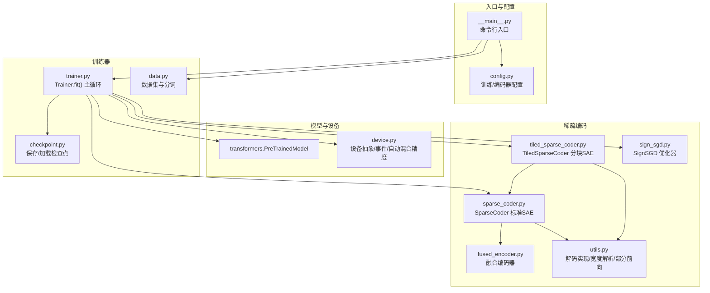
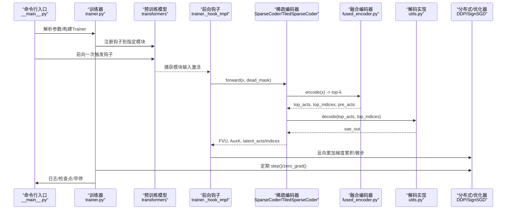
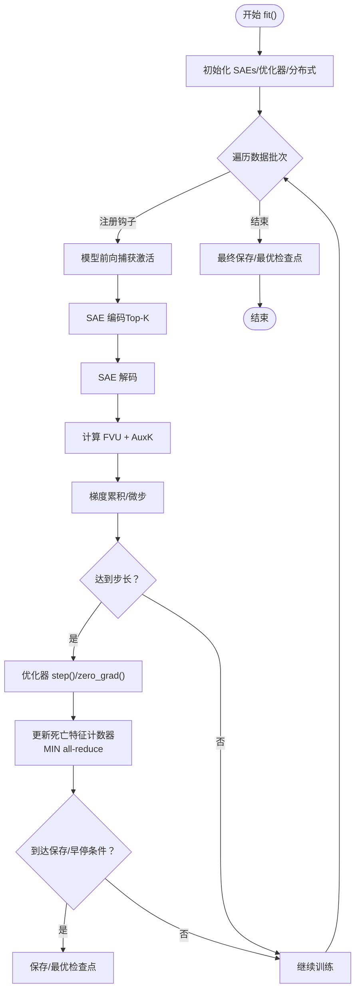
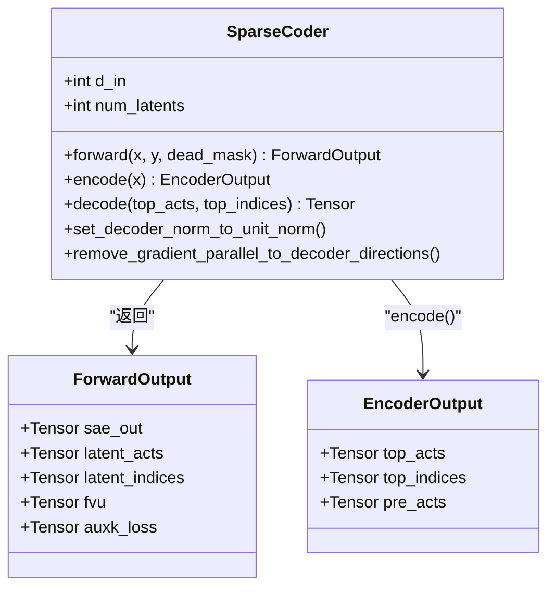
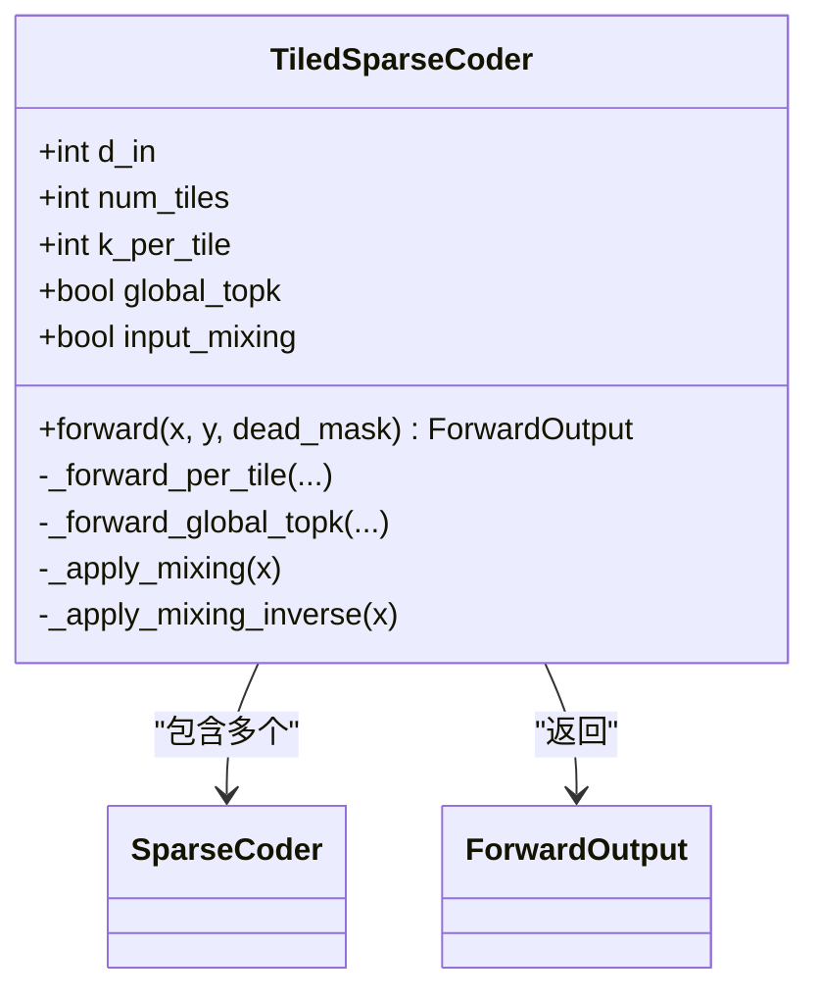
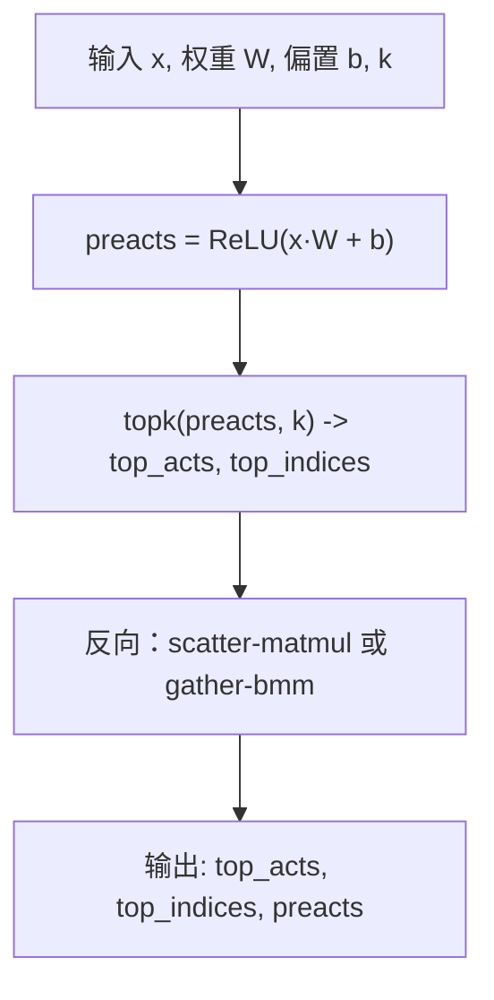
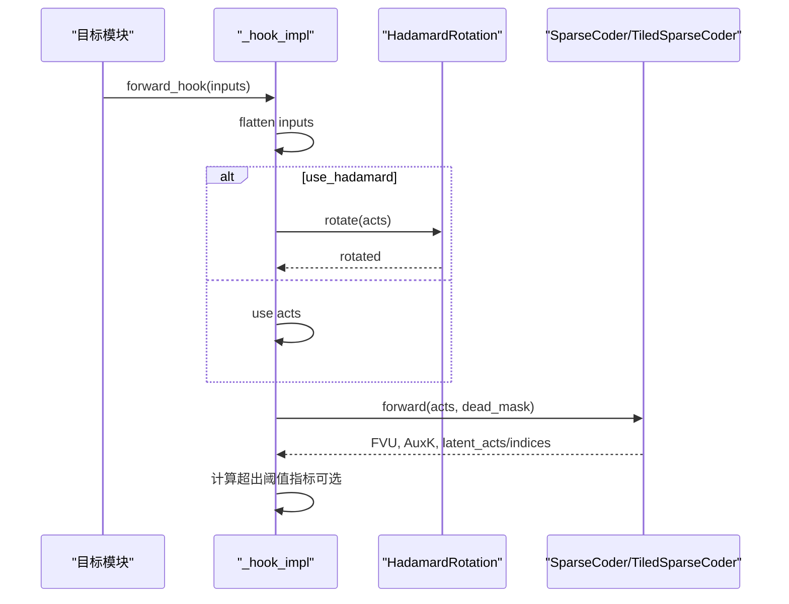
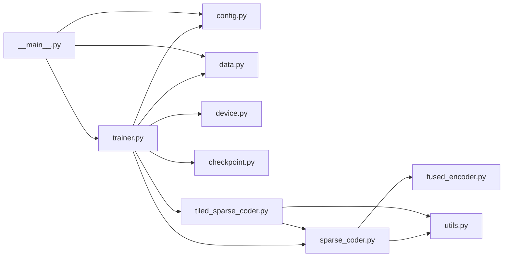

# 训练系统

<cite>
**本文引用的文件**
- [sparsify/trainer.py](file://sparsify/trainer.py)
- [sparsify/sparse_coder.py](file://sparsify/sparse_coder.py)
- [sparsify/tiled_sparse_coder.py](file://sparsify/tiled_sparse_coder.py)
- [sparsify/config.py](file://sparsify/config.py)
- [sparsify/fused_encoder.py](file://sparsify/fused_encoder.py)
- [sparsify/utils.py](file://sparsify/utils.py)
- [sparsify/device.py](file://sparsify/device.py)
- [sparsify/checkpoint.py](file://sparsify/checkpoint.py)
- [sparsify/data.py](file://sparsify/data.py)
- [sparsify/sign_sgd.py](file://sparsify/sign_sgd.py)
- [sparsify/__main__.py](file://sparsify/__main__.py)
- [docs/training/quickstart.md](file://docs/training/quickstart.md)
- [docs/training/qwen3-guide.md](file://docs/training/qwen3-guide.md)
- [scripts/first_time_train/Qwen3-0.6B/script.sh](file://scripts/first_time_train/Qwen3-0.6B/script.sh)
- [pyproject.toml](file://pyproject.toml)
</cite>

## 目录
1. [简介](#简介)
2. [项目结构](#项目结构)
3. [核心组件](#核心组件)
4. [架构总览](#架构总览)
5. [详细组件分析](#详细组件分析)
6. [依赖分析](#依赖分析)
7. [性能考量](#性能考量)
8. [故障排查指南](#故障排查指南)
9. [结论](#结论)
10. [附录](#附录)

## 简介
本文件面向 Sparsify 训练系统，提供从架构到实现细节的完整技术文档。内容覆盖训练器架构、稀疏编码器（标准与分块）实现、训练管道、钩子系统、Top-K 稀疏性机制、损失函数设计、配置系统、分布式训练支持与性能优化，并给出训练流程图、数据流分析与关键算法的数学原理。文档同时提供可操作的最佳实践与排障建议。

## 项目结构
Sparsify 以模块化方式组织，核心训练入口位于命令行脚本，训练器负责钩子注册、前向捕获、损失计算与反向传播，稀疏编码器封装编码/解码与损失，分块编码器扩展至多 Tile 并支持全局 Top-K 与输入混洗；设备抽象层统一 CUDA/NPU/CPUs；检查点与数据工具分别处理权重持久化与数据预处理。

**图表来源**
- [sparsify/__main__.py:131-211](file://sparsify/__main__.py#L131-L211)
- [sparsify/trainer.py:162-760](file://sparsify/trainer.py#L162-L760)
- [sparsify/config.py:28-149](file://sparsify/config.py#L28-L149)
- [sparsify/sparse_coder.py:36-269](file://sparsify/sparse_coder.py#L36-L269)
- [sparsify/tiled_sparse_coder.py:17-342](file://sparsify/tiled_sparse_coder.py#L17-L342)
- [sparsify/fused_encoder.py:21-107](file://sparsify/fused_encoder.py#L21-L107)
- [sparsify/utils.py:33-227](file://sparsify/utils.py#L33-L227)
- [sparsify/device.py:34-118](file://sparsify/device.py#L34-L118)
- [sparsify/checkpoint.py:101-302](file://sparsify/checkpoint.py#L101-L302)
- [sparsify/data.py:16-158](file://sparsify/data.py#L16-L158)
- [sparsify/sign_sgd.py:5-24](file://sparsify/sign_sgd.py#L5-L24)

**章节来源**
- [sparsify/__main__.py:131-211](file://sparsify/__main__.py#L131-L211)
- [sparsify/trainer.py:162-760](file://sparsify/trainer.py#L162-L760)
- [sparsify/config.py:28-149](file://sparsify/config.py#L28-L149)

## 核心组件
- 训练器（Trainer）
  - 负责钩子点选择与展开、SAE 初始化（标准或分块）、DDP 包装、优化器配置、主训练循环、指标聚合与日志、检查点保存与恢复。
- 稀疏编码器（SparseCoder）
  - 标准 SAE：线性编码器 + Top-K 选择 + 线性解码器 + 偏置 + 损失（FVU/AuxK）。
- 分块稀疏编码器（TiledSparseCoder）
  - 将输入按隐藏维切分为多个 Tile，每个 Tile 独立训练 SAE；支持 per-tile Top-K 或 global Top-K；可选输入混洗矩阵。
- 融合编码器（FusedEncoder）
  - 自定义 Autograd 函数，对 ReLU + Top-K + 稀疏反向进行高效实现。
- 设备抽象（device.py）
  - 统一 CUDA/NPU/CPUs 的事件、bf16 支持、后端选择与自动混合精度装饰器。
- 配置系统（config.py）
  - 训练配置与编码器配置的数据类，含校验逻辑。
- 数据与检查点（data.py, checkpoint.py）
  - 数据预处理（分块+分词）、内存映射数据集；检查点保存/加载（含 Hadamard 状态）。
- 优化器（sign_sgd.py）
  - L-infty 梯度下降优化器，适配稀疏训练。

**章节来源**
- [sparsify/trainer.py:39-161](file://sparsify/trainer.py#L39-L161)
- [sparsify/sparse_coder.py:36-269](file://sparsify/sparse_coder.py#L36-L269)
- [sparsify/tiled_sparse_coder.py:17-342](file://sparsify/tiled_sparse_coder.py#L17-L342)
- [sparsify/fused_encoder.py:21-107](file://sparsify/fused_encoder.py#L21-L107)
- [sparsify/device.py:34-118](file://sparsify/device.py#L34-L118)
- [sparsify/config.py:7-149](file://sparsify/config.py#L7-L149)
- [sparsify/checkpoint.py:101-302](file://sparsify/checkpoint.py#L101-L302)
- [sparsify/data.py:16-158](file://sparsify/data.py#L16-L158)
- [sparsify/sign_sgd.py:5-24](file://sparsify/sign_sgd.py#L5-L24)

## 架构总览
Sparsify 的训练架构围绕“模型钩子 + 稀疏编码器 + 融合算子 + 分布式优化”的主线展开。训练器在模型前向过程中注册钩子，捕获各模块输入激活，调用 SAE 进行编码/解码与损失计算；通过融合编码器与设备自动混合精度减少内核开销；在多 GPU 下使用 DDP 包装 SAE 参数，配合梯度累积与微步加速吞吐。

**图表来源**
- [sparsify/__main__.py:131-211](file://sparsify/__main__.py#L131-L211)
- [sparsify/trainer.py:347-574](file://sparsify/trainer.py#L347-L574)
- [sparsify/sparse_coder.py:176-239](file://sparsify/sparse_coder.py#L176-L239)
- [sparsify/fused_encoder.py:21-107](file://sparsify/fused_encoder.py#L21-L107)
- [sparsify/utils.py:173-197](file://sparsify/utils.py#L173-L197)

## 详细组件分析

### 训练器（Trainer）架构与控制流
- 钩子点解析与展开
  - 支持通配符与范围模式（如 layers.[1-10].xxx），自动展开为具体模块名并排序。
- SAE 初始化
  - 标准 SAE：SparseCoder；分块 SAE：TiledSparseCoder（num_tiles>1）。
- 优化器与学习率
  - 使用 ScheduleFree 包装的 SignSGD，按潜特征数自适应学习率。
- 分布式与编译
  - DDP 包装 SAE；可选 torch.compile 编译层以融合小算子。
- 主循环与指标
  - 按批/微步累积梯度；每步记录 FVU/AuxK/死亡特征比例；周期性统计“超出阈值”指标。
- 死亡特征检测
  - 采用“计数器最小归约”策略替代 per-forward scatter，避免 NPU 上的 AI_CPU 回退。
- 检查点与早停
  - 支持保存/恢复训练状态、最优检查点、Hadamard 旋转状态。

**图表来源**
- [sparsify/trainer.py:162-760](file://sparsify/trainer.py#L162-L760)

**章节来源**
- [sparsify/trainer.py:39-161](file://sparsify/trainer.py#L39-L161)
- [sparsify/trainer.py:162-760](file://sparsify/trainer.py#L162-L760)

### 稀疏编码器（SparseCoder）实现
- 结构
  - 编码器：线性层 + ReLU + Top-K。
  - 解码器：线性层（与编码器共享权重或独立）+ 偏置。
  - 可选单位范数正则化与梯度投影。
- 损失
  - FVU：重构误差平方和除以总方差。
  - AuxK：对“已死亡”潜特征施加辅助损失，鼓励其预测残差。
- 性能
  - 编码阶段使用融合实现；解码阶段根据设备选择高效实现（CUDA/NPU/回退）。

**图表来源**
- [sparsify/sparse_coder.py:20-269](file://sparsify/sparse_coder.py#L20-L269)

**章节来源**
- [sparsify/sparse_coder.py:36-269](file://sparsify/sparse_coder.py#L36-L269)

### 分块稀疏编码器（TiledSparseCoder）实现
- 多 Tile 独立训练
  - 输入按隐藏维等分，每个 Tile 对应一个 SparseCoder；总活跃特征数为 cfg.k（per-tile k = k/num_tiles）。
- 两种前向路径
  - per-tile：各 Tile 独立 Top-K，合并输出。
  - global-topk：所有 Tile 的预激活拼接后统一 Top-K，解码时使用块对角 W_dec，单次调用完成。
- 输入混洗（可选）
  - 引入可学习的 T×T 混洗矩阵，在 Tile 维度上混合输入/输出，提升跨通道信息流动；支持逆变换以在原始空间重新计算 FVU。
- 权重与偏置
  - 提供聚合视图（concat）用于兼容接口；保存/加载时保留每 Tile 的独立权重与混洗矩阵。

**图表来源**
- [sparsify/tiled_sparse_coder.py:17-342](file://sparsify/tiled_sparse_coder.py#L17-L342)

**章节来源**
- [sparsify/tiled_sparse_coder.py:17-342](file://sparsify/tiled_sparse_coder.py#L17-L342)

### 融合编码器（FusedEncoder）与解码实现
- 融合编码器
  - ReLU + Top-K + 稀疏反向，自动区分大/小矩阵场景，采用 scatter-matmul 或 gather-bmm 以平衡速度与内存。
- 解码实现
  - CUDA/NPU：使用融合实现（fused_decode）；其他设备：回退到 embedding_bag/eager 实现。
- 自动混合精度
  - 通过设备抽象装饰器在 bf16 可用时启用，显著提升性能。

**图表来源**
- [sparsify/fused_encoder.py:21-107](file://sparsify/fused_encoder.py#L21-L107)
- [sparsify/utils.py:173-197](file://sparsify/utils.py#L173-L197)
- [sparsify/device.py:101-118](file://sparsify/device.py#L101-L118)

**章节来源**
- [sparsify/fused_encoder.py:21-107](file://sparsify/fused_encoder.py#L21-L107)
- [sparsify/utils.py:173-197](file://sparsify/utils.py#L173-L197)
- [sparsify/device.py:101-118](file://sparsify/device.py#L101-L118)

### 钩子系统与激活捕获
- 钩子注册
  - 在选定模块的前向钩子中捕获输入张量（扁平化批次与序列维度）。
- 可选 Hadamard 旋转
  - 首次使用时按 d_in 构建块对角 Hadamard 矩阵，加速表示学习。
- 超出阈值评估
  - 若提供肘部阈值与 alpha 列表，则在原始域计算误差幅度并统计超过阈值的比例。

**图表来源**
- [sparsify/trainer.py:347-476](file://sparsify/trainer.py#L347-L476)
- [sparsify/checkpoint.py:104-147](file://sparsify/checkpoint.py#L104-L147)

**章节来源**
- [sparsify/trainer.py:347-476](file://sparsify/trainer.py#L347-L476)
- [sparsify/checkpoint.py:104-147](file://sparsify/checkpoint.py#L104-L147)

### 损失函数设计与 Top-K 稀疏性机制
- 损失
  - FVU：衡量重构误差占总方差的比例。
  - AuxK：对“死亡”潜特征施加辅助损失，鼓励其学习残差方向。
- Top-K 稀疏性
  - 编码阶段在预激活上进行 Top-K 选择，仅保留最大 k 个激活；融合编码器在反向中仅传播到被选中的位置，保证稀疏性。
- 单独的“死亡特征”检测
  - 通过计数器增量并在跨 GPU 时取最小值，确保一致性且避免昂贵的 scatter 操作。

**章节来源**
- [sparsify/sparse_coder.py:176-239](file://sparsify/sparse_coder.py#L176-L239)
- [sparsify/trainer.py:586-616](file://sparsify/trainer.py#L586-L616)

### 标准 SAE 与分块 SAE 的差异与适用场景
- 差异
  - 标准 SAE：单网络，per-tile Top-K（若未分块）；适合中小规模隐藏维。
  - 分块 SAE：多 Tile 独立训练，支持 global-topk 与输入混洗；适合大规模隐藏维与高吞吐需求。
- 适用场景
  - 标准 SAE：简单部署、调试快速收敛。
  - 分块 SAE：大模型、高显存带宽要求、需要更强的跨通道交互时（配合 input_mixing）。

**章节来源**
- [sparsify/tiled_sparse_coder.py:17-342](file://sparsify/tiled_sparse_coder.py#L17-L342)
- [sparsify/sparse_coder.py:36-269](file://sparsify/sparse_coder.py#L36-L269)

### 配置系统与命令行
- 训练配置（TrainConfig）
  - 批大小、梯度累积、微步、最大 token 数、学习率、AuxK 权重、死亡特征阈值、超参扫描 alpha、钩子点、初始化种子、分块参数、Hadamard 选项、编译开关、保存/日志、微调来源等。
- 编码器配置（SparseCoderConfig）
  - 扩张因子、是否单位范数、潜特征数、Top-K 数。
- 命令行入口
  - 自动下载/缓存模型与数据，按需分词，支持 DDP、断点续训/微调、运行命名与检查点目录管理。

**章节来源**
- [sparsify/config.py:28-149](file://sparsify/config.py#L28-L149)
- [sparsify/__main__.py:31-211](file://sparsify/__main__.py#L31-L211)

### 分布式训练支持与性能优化
- 分布式
  - DDP 包装 SAE；按 rank 切片数据；同步日志标志；在钩子上下文中使用 no_sync 控制反向同步。
- 性能优化
  - Tensor Cores 精度设置；bf16 自动混合精度；融合编码/解码；torch.compile 融合小算子；延迟指标聚合与批量 all_reduce；“计数器最小归约”替代 per-forward scatter。
- 设备抽象
  - 统一事件、同步、后端名称与 bf16 支持检测。

**章节来源**
- [sparsify/trainer.py:294-333](file://sparsify/trainer.py#L294-L333)
- [sparsify/trainer.py:501-514](file://sparsify/trainer.py#L501-L514)
- [sparsify/device.py:34-118](file://sparsify/device.py#L34-L118)

## 依赖分析
- 组件耦合
  - Trainer 依赖配置、数据、设备、稀疏编码器、检查点与工具模块；稀疏编码器依赖融合编码器与解码实现；分块编码器组合多个稀疏编码器。
- 外部依赖
  - Transformers、Datasets、Accelerate、ScheduleFree、safetensors、triton 等。

**图表来源**
- [sparsify/trainer.py:21-35](file://sparsify/trainer.py#L21-L35)
- [sparsify/sparse_coder.py:14-18](file://sparsify/sparse_coder.py#L14-L18)
- [sparsify/tiled_sparse_coder.py:11-14](file://sparsify/tiled_sparse_coder.py#L11-L14)
- [sparsify/__main__.py:15-26](file://sparsify/__main__.py#L15-L26)

**章节来源**
- [sparsify/trainer.py:21-35](file://sparsify/trainer.py#L21-L35)
- [sparsify/sparse_coder.py:14-18](file://sparsify/sparse_coder.py#L14-L18)
- [sparsify/tiled_sparse_coder.py:11-14](file://sparsify/tiled_sparse_coder.py#L11-L14)
- [sparsify/__main__.py:15-26](file://sparsify/__main__.py#L15-L26)

## 性能考量
- 内核融合与自动混合精度
  - 融合编码器与设备自动混合精度在 CUDA/NPU 上显著降低内核启动与类型转换开销。
- 计数器最小归约
  - 以“计数器最小归约”替代 per-forward scatter，避免 NPU 上的 AI_CPU 回退，提升吞吐。
- 梯度累积与微步
  - 通过 grad_acc_steps 与 micro_acc_steps 提升吞吐，同时保持有效批量稳定。
- 编译优化
  - torch.compile 融合层内元素运算，减少小算子开销（当前限制为 CUDA）。
- I/O 与数据管线
  - 内存映射数据集与并行分词减少磁盘与 CPU 压力。

[本节为通用性能讨论，无需特定文件分析]

## 故障排查指南
- 无法找到钩子点
  - 确认模式展开与实际模块名一致；使用范围/通配符语法正确。
- 分块参数不匹配
  - d_in 与 num_tiles、k 与 num_tiles 必须整除；否则会抛出断言错误。
- 恢复/微调失败
  - 确认检查点的 num_tiles 与当前配置一致；非 tiled 与 tiled 不可互换加载。
- 分布式数据不均衡
  - DDP 下需确保数据长度可被 world_size 整除，必要时丢弃尾部样本。
- 日志与可视化
  - 启用 WandB 并确认安装；若初始化失败会自动降级为关闭日志。

**章节来源**
- [sparsify/tiled_sparse_coder.py:38-43](file://sparsify/tiled_sparse_coder.py#L38-L43)
- [sparsify/checkpoint.py:44-73](file://sparsify/checkpoint.py#L44-L73)
- [sparsify/__main__.py:161-169](file://sparsify/__main__.py#L161-L169)
- [sparsify/trainer.py:186-227](file://sparsify/trainer.py#L186-L227)

## 结论
Sparsify 训练系统通过“模型钩子 + 稀疏编码器 + 融合算子 + 分布式优化”的组合，实现了对大模型中间层激活的高效稀疏建模。标准与分块 SAE 在不同规模与硬件条件下各有优势；融合编码/解码与自动混合精度显著提升性能；完善的检查点与分布式支持保障了生产可用性。结合超参扫描与 LUT 导出流程，可形成从训练到推理加速的闭环。

[本节为总结性内容，无需特定文件分析]

## 附录
- 快速开始与工作流
  - 参考快速入门文档，了解从训练到阈值生成再到 LUT 导出的完整路径。
- Qwen3 推荐配置与钩子点
  - 面向 LUTurbo 的推荐钩子点与起始超参，便于快速落地。
- 示例脚本
  - 提供多卡训练脚本，展示典型参数组合与多投影家族训练顺序。

**章节来源**
- [docs/training/quickstart.md:1-153](file://docs/training/quickstart.md#L1-L153)
- [docs/training/qwen3-guide.md:1-78](file://docs/training/qwen3-guide.md#L1-L78)
- [scripts/first_time_train/Qwen3-0.6B/script.sh:1-124](file://scripts/first_time_train/Qwen3-0.6B/script.sh#L1-L124)
- [pyproject.toml:1-131](file://pyproject.toml#L1-L131)