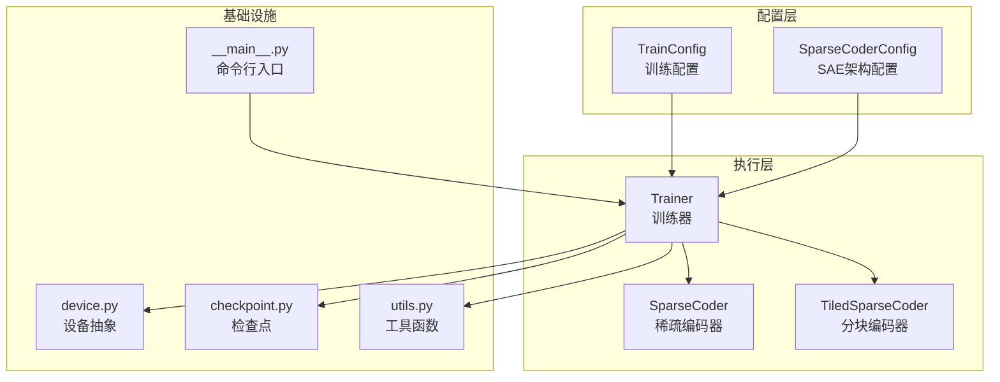
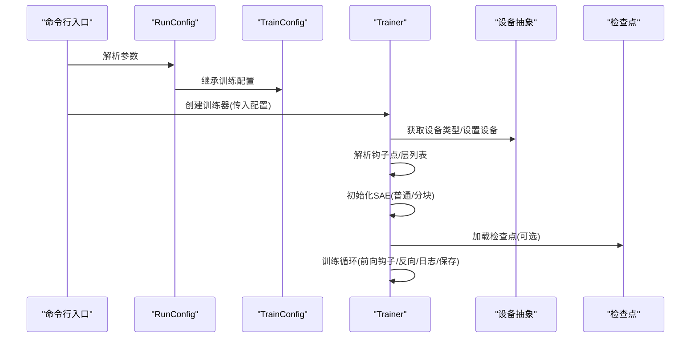
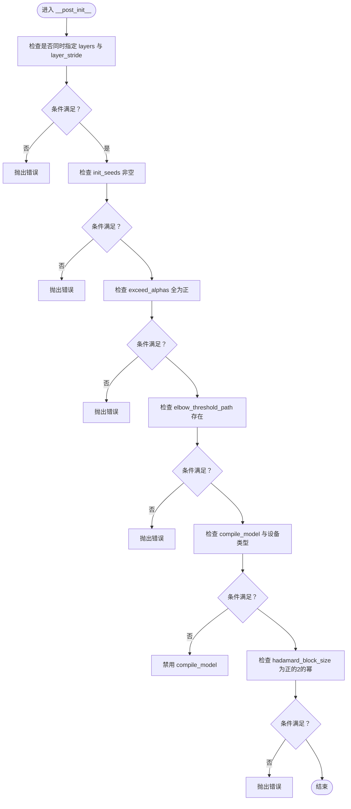
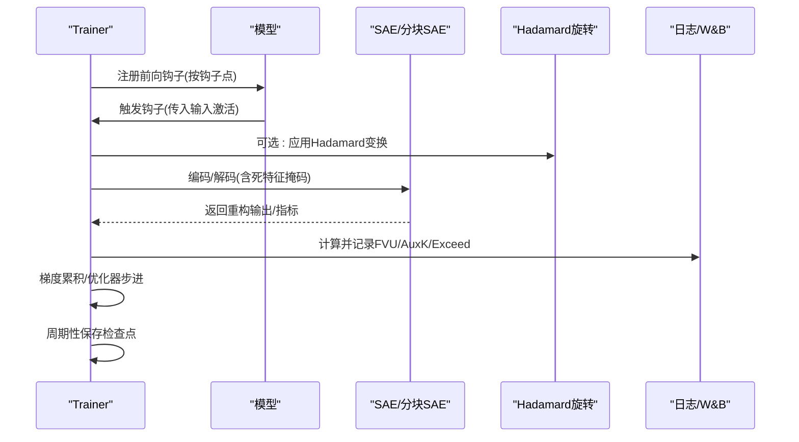
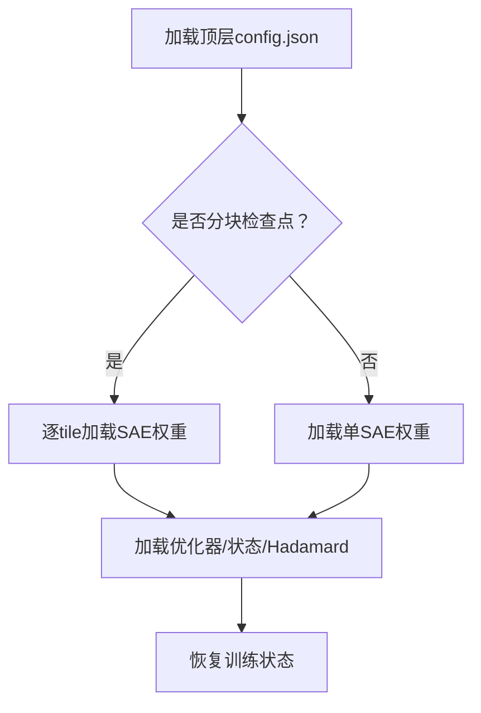
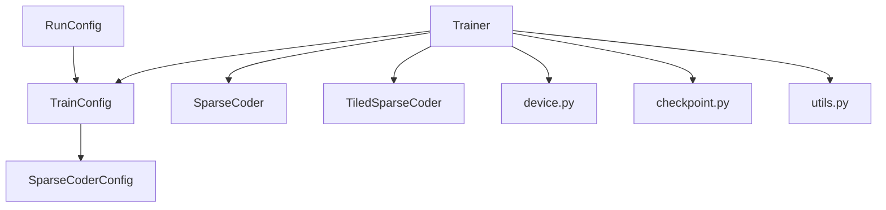

# 配置管理系统

<cite>
**本文档引用的文件**
- [sparsify/config.py](file://sparsify/config.py)
- [sparsify/sparse_coder.py](file://sparsify/sparse_coder.py)
- [sparsify/trainer.py](file://sparsify/trainer.py)
- [sparsify/device.py](file://sparsify/device.py)
- [sparsify/checkpoint.py](file://sparsify/checkpoint.py)
- [sparsify/tiled_sparse_coder.py](file://sparsify/tiled_sparse_coder.py)
- [sparsify/utils.py](file://sparsify/utils.py)
- [sparsify/__main__.py](file://sparsify/__main__.py)
- [docs/training/config-reference.md](file://docs/training/config-reference.md)
- [thresholds/Qwen3-8B/thresholds.json](file://thresholds/Qwen3-8B/thresholds.json)
</cite>

## 目录
1. [简介](#简介)
2. [项目结构](#项目结构)
3. [核心组件](#核心组件)
4. [架构总览](#架构总览)
5. [详细组件分析](#详细组件分析)
6. [依赖关系分析](#依赖关系分析)
7. [性能考量](#性能考量)
8. [故障排除指南](#故障排除指南)
9. [结论](#结论)
10. [附录](#附录)

## 简介
本文件面向 Sparsify 配置管理系统，系统性阐述 TrainConfig 与 SparseCoderConfig 的设计架构、参数体系与运行机制。内容覆盖训练配置选项、SAE 配置参数、设备配置、配置验证机制、默认值与继承规则、配置文件格式与动态更新策略，并提供完整参数参考、最佳实践与常见问题解决方案。

## 项目结构
Sparsify 的配置系统围绕两个核心配置类展开：
- SparseCoderConfig：定义稀疏编码器（SAE）的架构参数
- TrainConfig：定义训练循环、日志、数据集与运行时参数

此外，系统通过 Trainer 统一解析与执行配置，设备抽象层 device.py 提供跨 CUDA/NPU 的统一接口，检查点模块 checkpoint.py 负责保存与加载配置与权重，tiled_sparse_coder.py 支持分块训练模式，utils.py 提供工具函数，__main__.py 提供命令行入口与运行参数。

**图表来源**
- [sparsify/config.py:7-149](file://sparsify/config.py#L7-L149)
- [sparsify/trainer.py:39-760](file://sparsify/trainer.py#L39-L760)
- [sparsify/sparse_coder.py:36-269](file://sparsify/sparse_coder.py#L36-L269)
- [sparsify/tiled_sparse_coder.py:17-342](file://sparsify/tiled_sparse_coder.py#L17-L342)
- [sparsify/device.py:1-118](file://sparsify/device.py#L1-L118)
- [sparsify/checkpoint.py:1-302](file://sparsify/checkpoint.py#L1-L302)
- [sparsify/utils.py:1-227](file://sparsify/utils.py#L1-L227)
- [sparsify/__main__.py:31-211](file://sparsify/__main__.py#L31-L211)

**章节来源**
- [sparsify/config.py:7-149](file://sparsify/config.py#L7-L149)
- [sparsify/__main__.py:31-211](file://sparsify/__main__.py#L31-L211)

## 核心组件
- TrainConfig：集中管理训练生命周期、日志、梯度累积、微批、最大 token 数、学习率、辅助损失、死特征阈值、钩子点选择、初始化种子、层列表与步长、分块训练（tiles）、全局 top-k、输入混合、Hadamard 旋转、模型编译、保存与日志等。
- SparseCoderConfig：集中管理 SAE 架构参数，包括扩展因子、解码器归一化、潜在特征数量、稀疏度 k 等。
- Trainer：负责根据配置解析钩子点、初始化 SAE、构建优化器、执行前向钩子、计算指标、保存检查点与日志。
- 设备抽象：统一 CUDA/NPU/CPU 的设备检测、bf16 支持、事件计时、分布式后端等。
- 检查点：支持常规与分块 SAE 的保存/加载、肘部阈值加载、Hadamard 状态恢复。
- 分块编码器：在隐藏维上切分为多个独立 SAE，支持全局 top-k 与输入混合。

**章节来源**
- [sparsify/config.py:28-149](file://sparsify/config.py#L28-L149)
- [sparsify/trainer.py:39-760](file://sparsify/trainer.py#L39-L760)
- [sparsify/device.py:1-118](file://sparsify/device.py#L1-L118)
- [sparsify/checkpoint.py:1-302](file://sparsify/checkpoint.py#L1-L302)
- [sparsify/tiled_sparse_coder.py:17-342](file://sparsify/tiled_sparse_coder.py#L17-L342)

## 架构总览
配置系统采用“声明式配置 + 运行时解析”的架构。命令行入口 RunConfig 继承 TrainConfig，统一暴露所有训练参数；Trainer 在启动阶段解析钩子点与层列表，结合设备抽象与工具函数完成初始化；训练过程中根据配置进行梯度累积、微批、日志记录、检查点保存与恢复。

**图表来源**
- [sparsify/__main__.py:31-211](file://sparsify/__main__.py#L31-L211)
- [sparsify/trainer.py:39-760](file://sparsify/trainer.py#L39-L760)
- [sparsify/device.py:1-118](file://sparsify/device.py#L1-L118)
- [sparsify/checkpoint.py:101-302](file://sparsify/checkpoint.py#L101-L302)

## 详细组件分析

### TrainConfig 参数体系与验证规则
- 训练控制
  - 批大小、梯度累积步数、微批步数、最大 token 数、学习率、辅助损失系数、死特征阈值
- 钩子点与层选择
  - 显式钩子点列表、初始化种子列表、层索引列表、层步长
- 分块训练
  - 分块数量、全局 top-k、输入混合
- Hadamard 旋转
  - 启用开关、块大小（必须为正的 2 的幂）、随机种子、是否使用置换
- 模型编译
  - 是否对 Transformer 层进行编译（仅 CUDA 生效）
- 日志与保存
  - 保存频率、保存最佳、保存目录、W&B 开关与项目名、日志频率、微调路径

验证规则（运行时检查）：
- 不能同时指定层列表与层步长
- 至少需要一个初始化种子
- 肘部阈值文件存在性校验
- Hadamard 块大小必须为正的 2 的幂
- 非 CUDA 平台自动禁用模型编译

**图表来源**
- [sparsify/config.py:124-149](file://sparsify/config.py#L124-L149)

**章节来源**
- [sparsify/config.py:28-149](file://sparsify/config.py#L28-L149)
- [docs/training/config-reference.md:160-170](file://docs/training/config-reference.md#L160-L170)

### SparseCoderConfig 参数体系
- 扩展因子：当潜在特征数为 0 时，潜在维度 = 输入维度 × 扩展因子
- 解码器归一化：是否将解码器权重按行归一到单位范数
- 潜在特征数：显式指定潜在特征数；为 0 时由扩展因子推导
- 稀疏度 k：每样本激活的非零特征数

分块模式下的行为：
- k 必须能被分块数整除，每个分块的激活预算为 k_per_tile = k / num_tiles

**章节来源**
- [sparsify/config.py:7-26](file://sparsify/config.py#L7-L26)
- [docs/training/config-reference.md:38-54](file://docs/training/config-reference.md#L38-L54)

### Trainer 生命周期与钩子点解析
- 钩子点解析：支持通配符与范围语法，自动展开为具体模块名
- 层列表解析：若未指定钩子点，则基于模型的层列表生成
- SAE 初始化：根据配置创建普通或分块 SAE，支持多种子
- 训练循环：注册前向钩子捕获输入激活，应用 Hadamard 旋转（可选），计算 FVU/AuxK/Exceed 指标，执行梯度累积与优化器步进，周期性保存检查点

**图表来源**
- [sparsify/trainer.py:39-760](file://sparsify/trainer.py#L39-L760)
- [sparsify/tiled_sparse_coder.py:102-140](file://sparsify/tiled_sparse_coder.py#L102-L140)

**章节来源**
- [sparsify/trainer.py:39-760](file://sparsify/trainer.py#L39-L760)
- [docs/training/config-reference.md:90-106](file://docs/training/config-reference.md#L90-L106)

### 设备抽象与分布式
- 设备检测：自动识别 CUDA/NPU/CPU，提供统一的 bf16 支持检测与事件计时
- 分布式后端：根据平台选择 nccl/hccl/gloo
- 训练器在 DDP 模式下进行梯度同步与广播，确保日志一致性

**章节来源**
- [sparsify/device.py:1-118](file://sparsify/device.py#L1-L118)
- [sparsify/trainer.py:168-227](file://sparsify/trainer.py#L168-L227)

### 检查点与动态配置更新
- 检查点布局：顶层 config.json、状态文件、优化器状态、各钩子点的 SAE 权重与配置、可选的 Hadamard 状态
- 分块检查点：保存 num_tiles/k_per_tile/global_topk/input_mixing 等元信息，逐 tile 保存权重
- 动态更新：Trainer 在 fit() 中根据配置决定是否启用编译、Hadamard、日志等；检查点加载时恢复配置与权重

**图表来源**
- [sparsify/checkpoint.py:101-302](file://sparsify/checkpoint.py#L101-L302)
- [sparsify/tiled_sparse_coder.py:278-342](file://sparsify/tiled_sparse_coder.py#L278-L342)

**章节来源**
- [sparsify/checkpoint.py:101-302](file://sparsify/checkpoint.py#L101-L302)
- [docs/training/config-reference.md:171-193](file://docs/training/config-reference.md#L171-L193)

### 分块稀疏编码器（TiledSparseCoder）
- 输入沿隐藏维切分为 T 个块，每个块独立训练 SAE
- 全局 top-k：所有块竞争相同的 k 激活预算，解码时使用块对角解码器矩阵
- 输入混合：学习 T×T 混合矩阵，在块间传递信息，随后在原始空间重新计算 FVU
- 断言约束：d_in 与 k 必须能被 num_tiles 整除

**章节来源**
- [sparsify/tiled_sparse_coder.py:17-342](file://sparsify/tiled_sparse_coder.py#L17-L342)
- [docs/training/config-reference.md:107-122](file://docs/training/config-reference.md#L107-L122)

## 依赖关系分析
- TrainConfig 依赖 SparseCoderConfig（组合关系）
- Trainer 依赖 TrainConfig、设备抽象、检查点、工具函数、SAE/分块 SAE
- 分块 SAE 依赖普通 SAE 与设备抽象
- 命令行入口 RunConfig 继承 TrainConfig，提供运行参数

**图表来源**
- [sparsify/config.py:28-149](file://sparsify/config.py#L28-L149)
- [sparsify/trainer.py:39-760](file://sparsify/trainer.py#L39-L760)
- [sparsify/sparse_coder.py:36-269](file://sparsify/sparse_coder.py#L36-L269)
- [sparsify/tiled_sparse_coder.py:17-342](file://sparsify/tiled_sparse_coder.py#L17-L342)
- [sparsify/device.py:1-118](file://sparsify/device.py#L1-L118)
- [sparsify/checkpoint.py:1-302](file://sparsify/checkpoint.py#L1-L302)
- [sparsify/utils.py:1-227](file://sparsify/utils.py#L1-L227)
- [sparsify/__main__.py:31-211](file://sparsify/__main__.py#L31-L211)

**章节来源**
- [sparsify/config.py:28-149](file://sparsify/config.py#L28-L149)
- [sparsify/trainer.py:39-760](file://sparsify/trainer.py#L39-L760)

## 性能考量
- 模型编译：在 CUDA 上对 Transformer 层进行编译可减少小算子内核开销，提升吞吐
- bf16 自动混合精度：在支持的设备上启用可显著提升性能
- 分块训练：通过 num_tiles 将输入宽度切分，提高并行度；global_topk 减少循环解码次数
- 输入混合：在分块之间引入学习的混合矩阵，可能带来额外计算，但有助于跨块信息流动
- 梯度累积与微批：通过 grad_acc_steps 与 micro_acc_steps 控制有效损失归一化与内存占用
- 日志与计时：在 CUDA/NPU 上使用事件计时，避免 Python 层计时开销

[本节为通用性能指导，无需特定文件引用]

## 故障排除指南
- 配置验证失败
  - 同时指定 layers 与 layer_stride：修改其一
  - 未提供 init_seeds：至少提供一个种子
  - exceed_alphas 包含非正值：修正为正数
  - elbow_threshold_path 文件不存在：确认路径与文件存在
  - hadamard_block_size 不是正的 2 的幂：调整为合法值
  - 非 CUDA 平台 compile_model：将被自动禁用，如需请切换到 CUDA
- 分块训练断言失败
  - d_in 或 k 无法被 num_tiles 整除：调整 d_in/k 或 num_tiles
- 检查点加载异常
  - 分块与非分块配置不匹配：确保 num_tiles 一致
  - 分块数量不一致：调整当前配置或检查点
- 日志与 W&B
  - W&B 初始化失败：自动降级为关闭日志，检查网络与环境变量

**章节来源**
- [sparsify/config.py:124-149](file://sparsify/config.py#L124-L149)
- [sparsify/checkpoint.py:44-73](file://sparsify/checkpoint.py#L44-L73)
- [sparsify/tiled_sparse_coder.py:38-43](file://sparsify/tiled_sparse_coder.py#L38-L43)
- [sparsify/trainer.py:186-227](file://sparsify/trainer.py#L186-L227)

## 结论
Sparsify 的配置系统以 TrainConfig 与 SparseCoderConfig 为核心，通过 Trainer 实现统一解析与执行，辅以设备抽象与检查点模块，形成可扩展、可移植且高性能的训练配置框架。系统提供了严格的参数验证、灵活的分块训练与混合策略、完善的日志与检查点机制，适用于多平台与大规模训练场景。

[本节为总结性内容，无需特定文件引用]

## 附录

### 配置参数参考手册
- 训练参数（TrainConfig）
  - 批大小、梯度累积步数、微批步数、最大 token 数、学习率、辅助损失系数、死特征阈值
  - 钩子点列表、初始化种子列表、层索引列表、层步长
  - 分块数量、全局 top-k、输入混合
  - Hadamard 启用、块大小、种子、置换开关
  - 模型编译、保存频率、保存最佳、保存目录、W&B 开关与项目名、日志频率、微调路径
- SAE 参数（SparseCoderConfig）
  - 扩展因子、解码器归一化、潜在特征数、稀疏度 k
- 命令行参数（RunConfig）
  - 模型名称/路径、数据集名称/路径、数据集划分、上下文长度、Hugging Face token、模型版本、最大样本数、断点续训、文本列名、数据洗牌种子、预处理进程数、额外数据集参数

**章节来源**
- [docs/training/config-reference.md:12-193](file://docs/training/config-reference.md#L12-L193)

### 配置文件格式与动态更新
- 配置文件格式
  - 顶层：config.json（训练配置）
  - SAE：cfg.json（SAE 配置）+ sae.safetensors（权重）
  - 分块：顶层 cfg.json（含 num_tiles/k_per_tile/global_topk/input_mixing）+ tile_i/cfg.json 与 tile_i/sae.safetensors
  - 可选：hadamard_rotations.pt（Hadamard 状态）
- 动态配置更新
  - 训练器在 fit() 中根据配置决定是否启用编译、Hadamard、日志等
  - 检查点加载时恢复配置与权重，支持断点续训与微调

**章节来源**
- [docs/training/config-reference.md:171-193](file://docs/training/config-reference.md#L171-L193)
- [sparsify/checkpoint.py:199-302](file://sparsify/checkpoint.py#L199-L302)

### 使用示例与最佳实践
- 示例：命令行训练
  - 使用 RunConfig 指定模型、数据集、上下文长度、断点续训等参数
  - 通过 hookpoints/layers 选择训练模块，设置 init_seeds 进行多种子实验
- 最佳实践
  - 合理设置 batch_size 与 grad_acc_steps 以平衡显存与吞吐
  - 在 CUDA 上启用 compile_model 以减少小算子开销
  - 使用分块训练提升并行度，确保 d_in 与 k 能被 num_tiles 整除
  - 启用 W&B 记录指标，定期保存检查点
  - 使用 elbow 阈值文件与 exceed 指标评估重建质量

**章节来源**
- [sparsify/__main__.py:31-211](file://sparsify/__main__.py#L31-L211)
- [docs/training/config-reference.md:12-193](file://docs/training/config-reference.md#L12-L193)

### 肘部阈值与超参调优
- 肘部阈值文件格式
  - 键为钩子点名称，值包含 elbow_p 与 elbow_value
- 超参与评估
  - 通过 exceed_alphas 与 elbow_threshold_path 计算超过阈值的比例，作为重建误差的评估指标

**章节来源**
- [thresholds/Qwen3-8B/thresholds.json:1-130](file://thresholds/Qwen3-8B/thresholds.json#L1-L130)
- [sparsify/checkpoint.py:104-147](file://sparsify/checkpoint.py#L104-L147)
- [docs/training/config-reference.md:77-89](file://docs/training/config-reference.md#L77-L89)