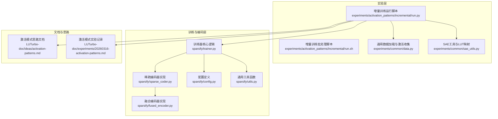
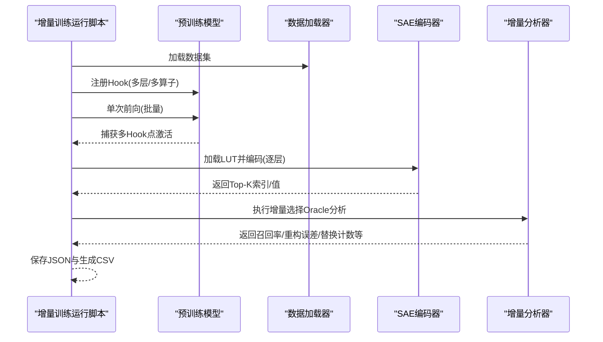
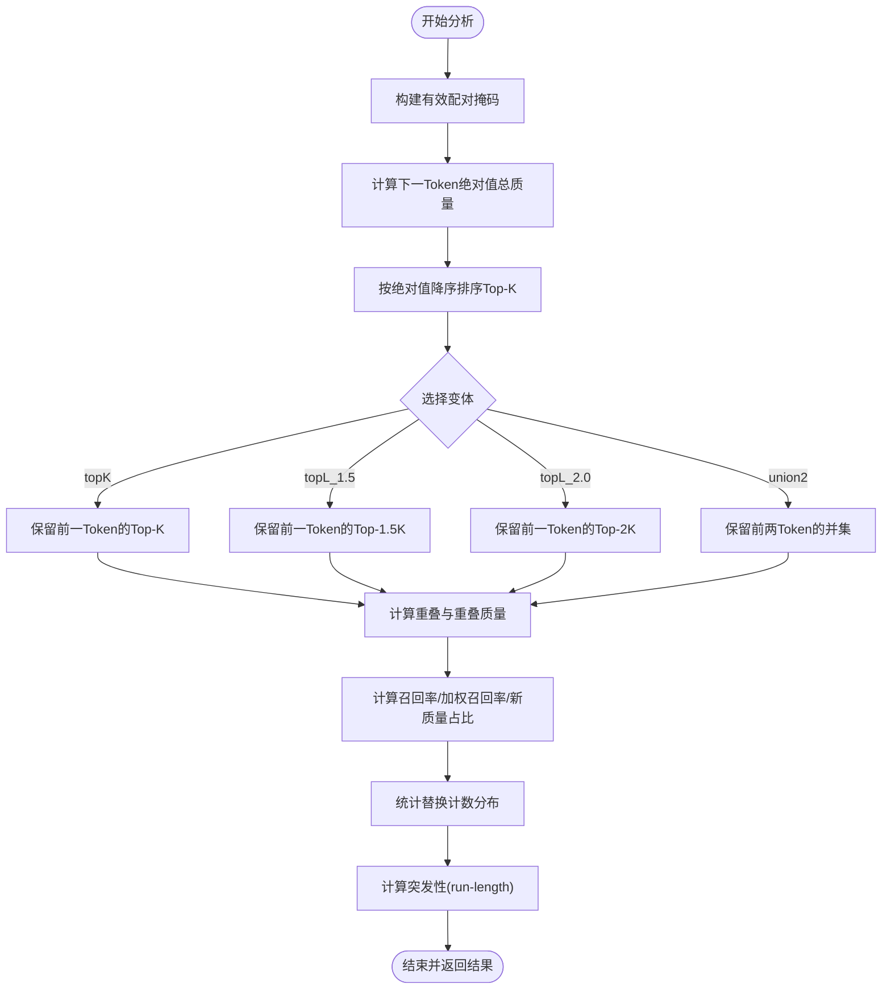
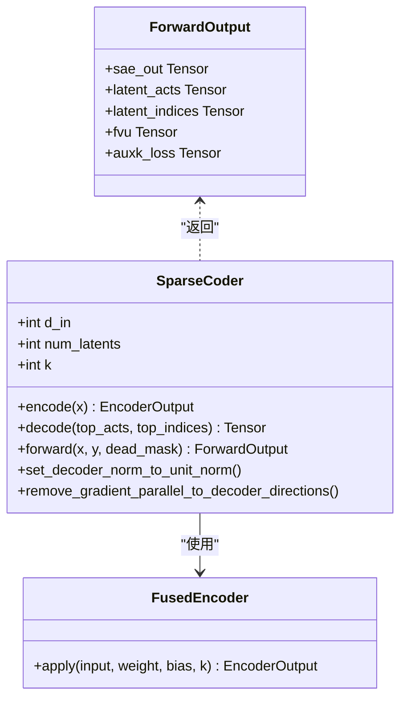
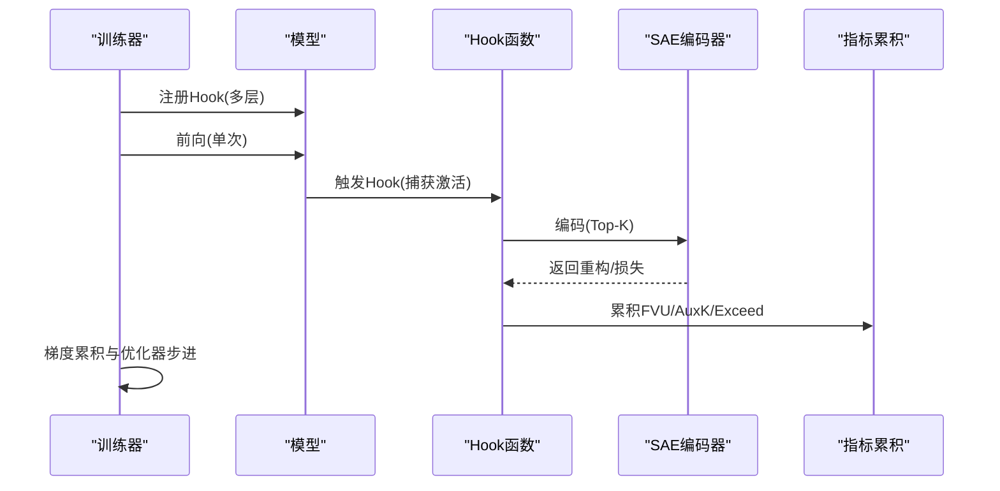
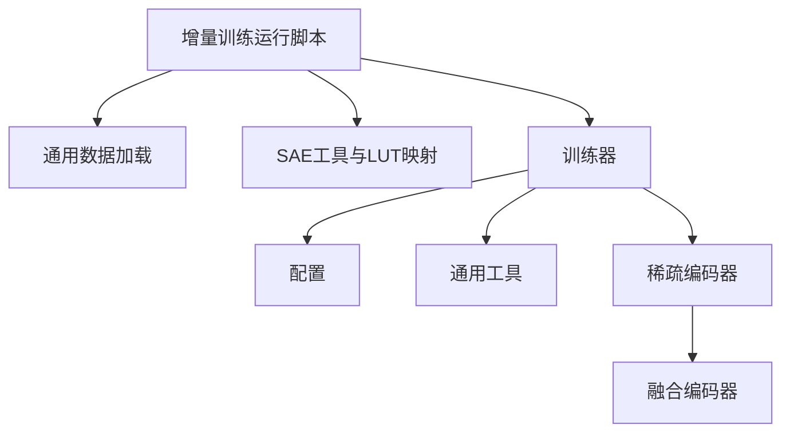

# 增量训练模式

<cite>
**本文引用的文件列表**
- [增量训练运行脚本](file://experiments/activation_patterns/incremental/run.py)
- [增量训练批处理脚本](file://experiments/activation_patterns/incremental/run.sh)
- [增量训练结果数据](file://results/activation_patterns/incremental/incremental_results.json)
- [通用数据加载与激活收集](file://experiments/common/data.py)
- [SAE工具与LUT映射](file://experiments/common/sae_utils.py)
- [训练器核心逻辑](file://sparsify/trainer.py)
- [稀疏编码器实现](file://sparsify/sparse_coder.py)
- [融合编码器实现](file://sparsify/fused_encoder.py)
- [配置定义](file://sparsify/config.py)
- [通用工具函数](file://sparsify/utils.py)
- [激活模式思路文档](file://LUTurbo-doc/ideas/activation-patterns.md)
- [激活模式实验记录](file://LUTurbo-doc/experiments/20260316-activation-patterns.md)
</cite>

## 目录
1. [简介](#简介)
2. [项目结构](#项目结构)
3. [核心组件](#核心组件)
4. [架构概览](#架构概览)
5. [详细组件分析](#详细组件分析)
6. [依赖关系分析](#依赖关系分析)
7. [性能考量](#性能考量)
8. [故障排查指南](#故障排查指南)
9. [结论](#结论)
10. [附录](#附录)

## 简介
本文件系统性阐述增量训练模式（Incremental Training Mode）在该代码库中的实现与应用，重点围绕“增量选择 Oracle 基线”展开，解释其概念、适用场景、实现原理、对训练稳定性与收敛速度的影响，并提供实验设计方法、参数配置策略与性能监控指标，最后给出实验运行脚本使用指南与结果分析方法。

增量训练的核心思想是在相邻时间步之间逐步扩展激活集合，利用前一时刻的选择结果作为保留集合，仅替换少量基向量，从而在保持重建质量的同时降低在线选择成本。该模式通过“保留集合 + 有限替换预算”的方式，模拟在完美先知条件下的理论上限，为后续工程化近似提供指导。

## 项目结构
与增量训练相关的模块主要分布在以下路径：
- 实验脚本与结果：experiments/activation_patterns/incremental
- 通用数据与SAE工具：experiments/common
- 训练器与编码器：sparsify
- 文档与思路：LUTurbo-doc

图表来源
- [增量训练运行脚本:1-510](file://experiments/activation_patterns/incremental/run.py#L1-L510)
- [增量训练批处理脚本:1-45](file://experiments/activation_patterns/incremental/run.sh#L1-L45)
- [通用数据加载与激活收集:1-271](file://experiments/common/data.py#L1-L271)
- [SAE工具与LUT映射:1-124](file://experiments/common/sae_utils.py#L1-L124)
- [训练器核心逻辑:1-760](file://sparsify/trainer.py#L1-L760)
- [稀疏编码器实现:1-269](file://sparsify/sparse_coder.py#L1-L269)
- [融合编码器实现:1-107](file://sparsify/fused_encoder.py#L1-L107)
- [配置定义:1-149](file://sparsify/config.py#L1-L149)
- [通用工具函数:1-227](file://sparsify/utils.py#L1-L227)
- [激活模式思路文档:1-193](file://LUTurbo-doc/ideas/activation-patterns.md#L1-L193)
- [激活模式实验记录:1-124](file://LUTurbo-doc/experiments/20260316-activation-patterns.md#L1-L124)

章节来源
- [增量训练运行脚本:1-510](file://experiments/activation_patterns/incremental/run.py#L1-L510)
- [增量训练批处理脚本:1-45](file://experiments/activation_patterns/incremental/run.sh#L1-L45)
- [通用数据加载与激活收集:1-271](file://experiments/common/data.py#L1-L271)
- [SAE工具与LUT映射:1-124](file://experiments/common/sae_utils.py#L1-L124)
- [训练器核心逻辑:1-760](file://sparsify/trainer.py#L1-L760)
- [稀疏编码器实现:1-269](file://sparsify/sparse_coder.py#L1-L269)
- [融合编码器实现:1-107](file://sparsify/fused_encoder.py#L1-L107)
- [配置定义:1-149](file://sparsify/config.py#L1-L149)
- [通用工具函数:1-227](file://sparsify/utils.py#L1-L227)
- [激活模式思路文档:1-193](file://LUTurbo-doc/ideas/activation-patterns.md#L1-L193)
- [激活模式实验记录:1-124](file://LUTurbo-doc/experiments/20260316-activation-patterns.md#L1-L124)

## 核心组件
- 增量训练运行脚本：负责加载模型与数据、收集原始激活、编码为Top-K、执行增量选择Oracle分析、汇总并保存结果。
- 通用数据加载与激活收集：支持多种数据源格式，单次前向收集多Hook点激活，按序列边界组织。
- SAE工具与LUT映射：从LUT加载SAE权重，按Hook点到LUT层名映射，提供Top-K编码接口。
- 训练器核心逻辑：标准训练流程，包含Hook注册、前向捕获、损失计算、梯度累积与优化器步进。
- 稀疏编码器实现：SAE编码/解码、AuxK损失、设备自动混合精度、融合解码器实现。
- 融合编码器实现：优化的Top-K编码与反向传播，减少内存占用与提升吞吐。
- 配置定义：训练配置、SAE配置、日志与保存策略等。
- 通用工具函数：层列表解析、部分前向、维度解析、解码器实现选择等。

章节来源
- [增量训练运行脚本:1-510](file://experiments/activation_patterns/incremental/run.py#L1-L510)
- [通用数据加载与激活收集:1-271](file://experiments/common/data.py#L1-L271)
- [SAE工具与LUT映射:1-124](file://experiments/common/sae_utils.py#L1-L124)
- [训练器核心逻辑:1-760](file://sparsify/trainer.py#L1-L760)
- [稀疏编码器实现:1-269](file://sparsify/sparse_coder.py#L1-L269)
- [融合编码器实现:1-107](file://sparsify/fused_encoder.py#L1-L107)
- [配置定义:1-149](file://sparsify/config.py#L1-L149)
- [通用工具函数:1-227](file://sparsify/utils.py#L1-L227)

## 架构概览
增量训练模式的端到端流程如下：
- 数据准备：加载预分词数据或本地Arrow/Parquet/HuggingFace数据集，按批次读取。
- 模型与Hook：注册目标层的前向Hook，单次前向收集多Hook点激活。
- 编码：将激活通过对应SAE编码为Top-K索引与值，形成Token级Top-K表示。
- 增量分析：对相邻Token对进行增量选择Oracle分析，计算召回率、重构误差、替换计数与突发性等指标。
- 结果汇总与可视化：保存JSON结果并生成CSV汇总。

图表来源
- [增量训练运行脚本:367-506](file://experiments/activation_patterns/incremental/run.py#L367-L506)
- [通用数据加载与激活收集:44-156](file://experiments/common/data.py#L44-L156)
- [SAE工具与LUT映射:15-57](file://experiments/common/sae_utils.py#L15-L57)
- [稀疏编码器实现:176-239](file://sparsify/sparse_coder.py#L176-L239)

## 详细组件分析

### 增量选择Oracle分析器
该组件对相邻Token对执行增量选择分析，核心包括：
- 有效配对掩码构建：过滤跨序列边界的配对，确保统计仅在同序列内进行。
- 重叠计算：以分块稠密指示向量的方式高效计算保留集合与下一Token候选的交集与重叠质量。
- 变体对比：支持topK、topL_1.5、topL_2.0、union2四种保留集合策略。
- 统计指标：召回率（含加权）、新进入质量占比、替换计数分布、突发性（run-length）等。

图表来源
- [增量训练运行脚本:33-145](file://experiments/activation_patterns/incremental/run.py#L33-L145)
- [增量训练运行脚本:148-222](file://experiments/activation_patterns/incremental/run.py#L148-L222)

章节来源
- [增量训练运行脚本:33-222](file://experiments/activation_patterns/incremental/run.py#L33-L222)

### SAE编码与Top-K选择
SAE编码器负责将激活映射到潜空间并进行Top-K选择，融合编码器进一步优化了反向传播效率：
- 编码：中心化后经线性层与ReLU，再Top-K选择得到索引与值。
- 解码：根据Top-K索引与激活值重建输入，计算重构误差。
- 辅助损失：Dead Feature AuxK损失，鼓励死特征学习残差。
- 融合实现：在CUDA/NPU上采用融合解码器，避免CPU回退。

图表来源
- [稀疏编码器实现:20-239](file://sparsify/sparse_coder.py#L20-L239)
- [融合编码器实现:7-106](file://sparsify/fused_encoder.py#L7-L106)

章节来源
- [稀疏编码器实现:176-239](file://sparsify/sparse_coder.py#L176-L239)
- [融合编码器实现:21-106](file://sparsify/fused_encoder.py#L21-L106)

### 训练器Hook与前向捕获
训练器在前向阶段注册Hook，捕获指定层的激活，支持Hadamard旋转、Exceed指标计算与Dead Feature检测：
- Hook注册：对目标层逐一注册，单次前向触发所有Hook。
- 激活捕获：将输入展平为(batch*seq_len, d_in)并存储。
- 指标累积：延迟归约，减少通信开销。
- 死特征计数：基于token计数更新，跨GPUMIN归约。

图表来源
- [训练器核心逻辑:347-576](file://sparsify/trainer.py#L347-L576)

章节来源
- [训练器核心逻辑:347-576](file://sparsify/trainer.py#L347-L576)

### LUT与Hook点映射
SAE权重来自LUT文件，通过Hook点到LUT层名映射确定具体编码器：
- LUT加载：从metadata.json读取K值，加载encoder/decoder权重与偏置。
- Hook映射：将模型子模块名映射到LUT层名（如mlp/up_proj→mlp.gate_up_proj）。
- 编码Top-K：按Top-K顺序返回索引与值，支持分块处理。

章节来源
- [SAE工具与LUT映射:15-57](file://experiments/common/sae_utils.py#L15-L57)
- [SAE工具与LUT映射:71-102](file://experiments/common/sae_utils.py#L71-L102)
- [SAE工具与LUT映射:105-123](file://experiments/common/sae_utils.py#L105-L123)

### 数据加载与激活收集
支持Arrow/Parquet/HuggingFace数据集，按批次读取并单次前向收集多Hook点激活：
- 自动识别数据源类型，加载预分词Arrow或Parquet，或下载HuggingFace数据集。
- 单次前向：注册Hook，执行模型前向，按序列边界拆分并累计。
- 设备迁移：将序列激活移至GPU后分块编码，避免显存溢出。

章节来源
- [通用数据加载与激活收集:12-41](file://experiments/common/data.py#L12-L41)
- [通用数据加载与激活收集:44-156](file://experiments/common/data.py#L44-L156)
- [通用数据加载与激活收集:189-270](file://experiments/common/data.py#L189-L270)

## 依赖关系分析
- 运行脚本依赖通用数据与SAE工具，调用训练器的Hook机制与SAE编码器。
- 训练器依赖配置、设备工具、稀疏编码器与融合解码器。
- 稀疏编码器依赖融合编码器与解码器实现，受设备类型影响选择不同实现。

图表来源
- [增量训练运行脚本:28-30](file://experiments/activation_patterns/incremental/run.py#L28-L30)
- [训练器核心逻辑:21-34](file://sparsify/trainer.py#L21-L34)
- [稀疏编码器实现:14-17](file://sparsify/sparse_coder.py#L14-L17)
- [融合编码器实现:1-6](file://sparsify/fused_encoder.py#L1-L6)

章节来源
- [增量训练运行脚本:28-30](file://experiments/activation_patterns/incremental/run.py#L28-L30)
- [训练器核心逻辑:21-34](file://sparsify/trainer.py#L21-L34)
- [稀疏编码器实现:14-17](file://sparsify/sparse_coder.py#L14-L17)
- [融合编码器实现:1-6](file://sparsify/fused_encoder.py#L1-L6)

## 性能考量
- 计算复杂度：增量分析采用分块稠密指示向量与向量化操作，避免Python循环，显著降低时间与内存开销。
- 内存管理：编码阶段按序列分块处理，及时释放中间张量，必要时清空缓存。
- 设备优化：在CUDA/NPU上使用融合解码器与自动混合精度，减少CPU回退与内核启动开销。
- 通信优化：训练器对指标进行延迟归约，减少DDP通信次数。

章节来源
- [增量训练运行脚本:43-88](file://experiments/activation_patterns/incremental/run.py#L43-L88)
- [稀疏编码器实现:187-189](file://sparsify/sparse_coder.py#L187-L189)
- [训练器核心逻辑:289-333](file://sparsify/trainer.py#L289-L333)

## 故障排查指南
- 设备与CUDA：若CUDA不可用，脚本自动切换CPU；确保GPU显存充足，必要时减小批大小或序列长度。
- LUT文件缺失：确认LUT目录存在且包含metadata.json与对应层的.lut.safetensors文件。
- 数据格式：确保数据集路径正确，Arrow/Parquet/HuggingFace均可，注意最大序列长度设置。
- 内存不足：分块编码（chunk_size）与及时释放中间变量有助于缓解显存压力。
- 指标异常：检查Exceed阈值文件路径与配置，确认Elbow阈值已正确加载。

章节来源
- [增量训练运行脚本:385-393](file://experiments/activation_patterns/incremental/run.py#L385-L393)
- [SAE工具与LUT映射:29-40](file://experiments/common/sae_utils.py#L29-L40)
- [通用数据加载与激活收集:12-41](file://experiments/common/data.py#L12-L41)
- [训练器核心逻辑:145-148](file://sparsify/trainer.py#L145-L148)

## 结论
增量训练模式通过“保留集合 + 有限替换预算”的策略，模拟在完美先知条件下的理论上限，为后续工程化近似提供明确目标。该实现具备高效的分块重叠计算、灵活的保留集合变体与完善的统计指标，既可用于评估不同策略的潜力，也可作为增量选择算法的基准。结合训练器的Hook机制与SAE编码器，可在大规模语言模型中高效开展增量训练探索。

## 附录

### 实验设计方法
- 数据集选择：建议使用与模型规模匹配的预分词数据集，控制序列长度与样本数量。
- 层与算子：按需选择特定层与算子（MLP/QKV/O），平衡计算与代表性。
- 参数扫描：对m值进行多点扫描（如0,4,8,16,32,64,K），观察召回率与新质量占比随预算变化的趋势。
- 变体对比：在相同总候选预算下比较不同保留集合变体的性能差异。

章节来源
- [增量训练运行脚本:246-247](file://experiments/activation_patterns/incremental/run.py#L246-L247)
- [增量训练运行脚本:376-379](file://experiments/activation_patterns/incremental/run.py#L376-L379)

### 参数配置策略
- 训练配置：合理设置批大小、梯度累积步数、日志频率与保存间隔。
- SAE配置：根据输入维度设置扩展因子与K值，启用解码器归一化以提升稳定性。
- 设备与编译：在CUDA/NPU上启用融合解码器与自动混合精度；必要时开启torch.compile以融合小算子。

章节来源
- [配置定义:28-149](file://sparsify/config.py#L28-L149)
- [稀疏编码器实现:14-15](file://sparsify/sparse_coder.py#L14-L15)
- [训练器核心逻辑:163-164](file://sparsify/trainer.py#L163-L164)

### 性能监控指标
- 召回率：未加权与加权召回率，关注均值与分位数。
- 新质量占比：衡量新增基向量对重构质量的贡献。
- 替换计数分布：评估达到100%召回所需的平均/分位替换数量。
- 突发性：替换计数超过阈值的连续段长度分布，反映训练稳定性。
- Exceed指标：在不同阈值下的超出比例，评估重构误差分布。

章节来源
- [增量训练运行脚本:157-222](file://experiments/activation_patterns/incremental/run.py#L157-L222)
- [训练器核心逻辑:690-707](file://sparsify/trainer.py#L690-L707)

### 实验运行脚本使用指南
- 增量训练运行脚本：提供命令行参数，支持模型路径、LUT目录、数据集、层数与算子类型、批大小、输出目录与设备选择。
- 批处理脚本：封装常用配置，便于快速运行与生成汇总CSV。

章节来源
- [增量训练运行脚本:367-383](file://experiments/activation_patterns/incremental/run.py#L367-L383)
- [增量训练批处理脚本:33-44](file://experiments/activation_patterns/incremental/run.sh#L33-L44)

### 结果分析方法
- JSON结果解读：按层/算子键访问不同变体与m值的统计指标，关注召回率、新质量占比与替换计数分布。
- 汇总与可视化：结合其他实验脚本生成图表，对比不同策略与层间差异。
- 与思路文档对照：参考激活模式思路文档与实验记录，理解指标含义与策略动机。

章节来源
- [增量训练结果数据:1-800](file://results/activation_patterns/incremental/incremental_results.json#L1-L800)
- [激活模式思路文档:19-193](file://LUTurbo-doc/ideas/activation-patterns.md#L19-L193)
- [激活模式实验记录:52-124](file://LUTurbo-doc/experiments/20260316-activation-patterns.md#L52-L124)