# 子库分析

<cite>
**本文引用的文件**
- [子库分析运行脚本](file://experiments/activation_patterns/sublibrary/run.py)
- [子库分析运行脚本（Shell）](file://experiments/activation_patterns/sublibrary/run.sh)
- [子库分析结果（JSON）](file://results/activation_patterns/sublibrary/sublibrary_results.json)
- [通用数据处理模块](file://experiments/common/data.py)
- [SAE工具模块](file://experiments/common/sae_utils.py)
- [稀疏自编码器核心实现](file://sparsify/sparse_coder.py)
- [训练器核心实现](file://sparsify/trainer.py)
- [配置定义](file://sparsify/config.py)
- [肘部阈值计算脚本](file://compute_elbow_thresholds.py)
- [结果汇总脚本](file://experiments/activation_patterns/summarize.py)
- [项目README](file://README.md)
</cite>

## 目录
1. [简介](#简介)
2. [项目结构](#项目结构)
3. [核心组件](#核心组件)
4. [架构概览](#架构概览)
5. [详细组件分析](#详细组件分析)
6. [依赖关系分析](#依赖关系分析)
7. [性能考虑](#性能考虑)
8. [故障排除指南](#故障排除指南)
9. [结论](#结论)
10. [附录](#附录)

## 简介

子库分析是一种在激活模式研究中应用的重要技术，它通过聚类令牌激活模式来构建条件子库，并测量路由召回率——即每个令牌的真实Top-K中有多少被其所属簇的子库覆盖。这种方法为优化激活集合选择和稀疏自编码器性能提供了重要的理论基础和实践指导。

在Transformer模型中，激活模式分析对于理解模型内部表示和优化推理效率具有重要意义。子库分析通过以下方式为激活模式研究提供价值：

- **理论上限估计**：通过条件子库分析，可以确定在给定激活模式约束下的最佳性能上限
- **稀疏性优化**：帮助确定最优的Top-K稀疏度设置，平衡压缩率和重建精度
- **硬件适配**：为不同硬件平台的激活存储和计算提供指导
- **模型压缩**：为后续的模型量化和压缩提供理论依据

## 项目结构

该项目围绕子库分析构建了一个完整的实验框架，包含以下关键组件：

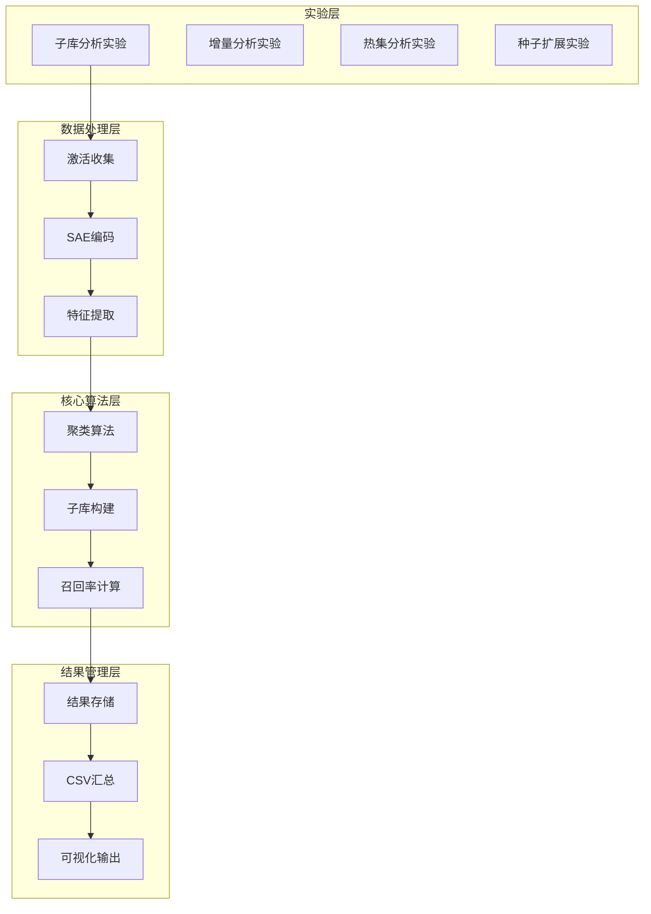

**图表来源**
- [子库分析运行脚本:1-453](file://experiments/activation_patterns/sublibrary/run.py#L1-L453)
- [通用数据处理模块:1-271](file://experiments/common/data.py#L1-L271)

**章节来源**
- [子库分析运行脚本:1-453](file://experiments/activation_patterns/sublibrary/run.py#L1-L453)
- [项目README:1-154](file://README.md#L1-L154)

## 核心组件

### 子库分析核心算法

子库分析的核心在于将令牌的激活模式进行聚类，并基于聚类结果构建条件子库。该过程包含以下几个关键步骤：

1. **激活特征构建**：将每个令牌的Top-K激活位置和强度转换为稀疏特征向量
2. **随机投影降维**：使用稀疏随机投影将高维激活特征降至128维
3. **MiniBatchKMeans聚类**：对降维后的特征进行批量K-means聚类
4. **子库构建**：为每个簇构建子库，包含该簇内所有令牌的Top-K索引
5. **召回率评估**：计算子库对原始Top-K的覆盖比例

### 数据处理管道

系统采用流水线化的数据处理方式，确保大规模激活数据的高效处理：

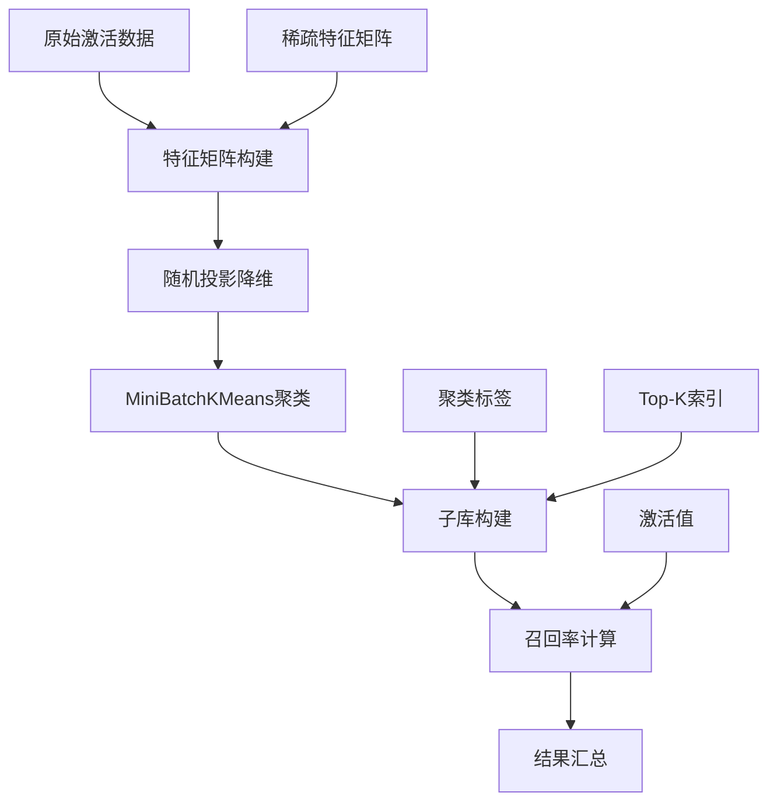

**图表来源**
- [子库分析运行脚本:35-290](file://experiments/activation_patterns/sublibrary/run.py#L35-L290)

**章节来源**
- [子库分析运行脚本:35-290](file://experiments/activation_patterns/sublibrary/run.py#L35-L290)

## 架构概览

整个子库分析系统采用模块化设计，各组件职责明确且高度解耦：

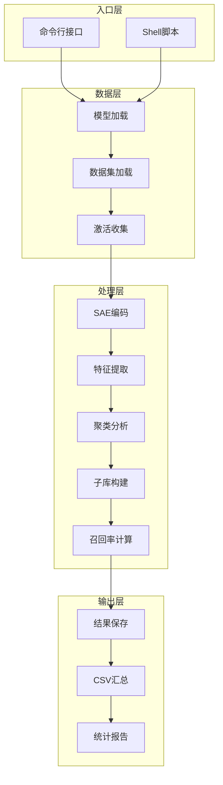

**图表来源**
- [子库分析运行脚本:326-452](file://experiments/activation_patterns/sublibrary/run.py#L326-L452)
- [通用数据处理模块:44-271](file://experiments/common/data.py#L44-L271)

**章节来源**
- [子库分析运行脚本:326-452](file://experiments/activation_patterns/sublibrary/run.py#L326-L452)
- [通用数据处理模块:44-271](file://experiments/common/data.py#L44-L271)

## 详细组件分析

### 子库分析算法实现

#### 特征构建模块

特征构建是子库分析的第一步，负责将令牌激活模式转换为机器学习友好的稀疏特征表示：

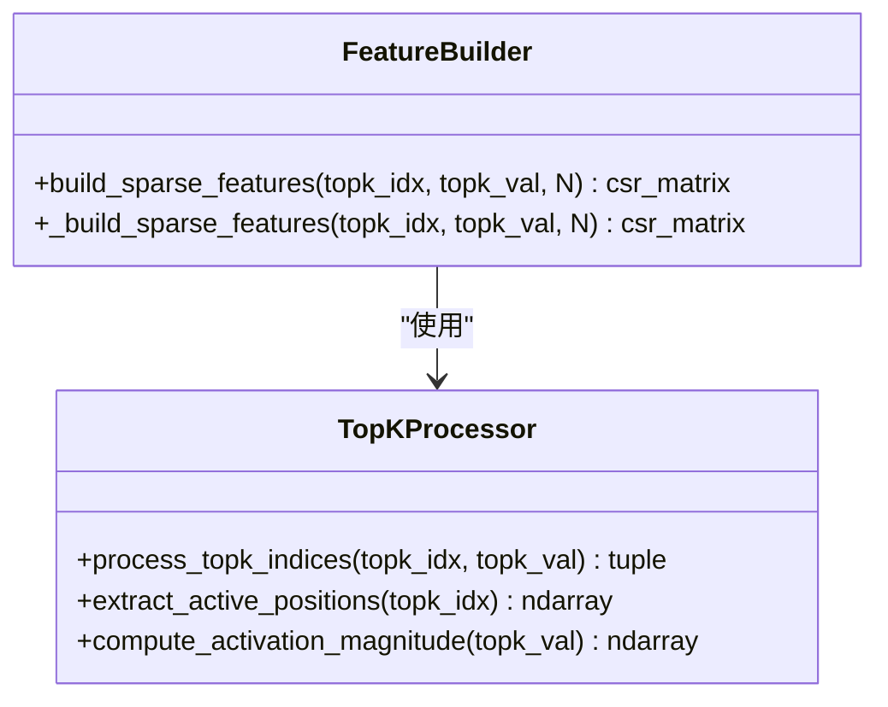

**图表来源**
- [子库分析运行脚本:35-45](file://experiments/activation_patterns/sublibrary/run.py#L35-L45)

该模块的关键特性包括：
- 使用CSR稀疏矩阵存储激活特征，节省内存空间
- 将激活值的绝对值作为权重，反映激活强度
- 支持大规模令牌序列的高效处理

#### 聚类分析模块

聚类分析模块采用混合策略，结合随机投影和MiniBatchKMeans算法：

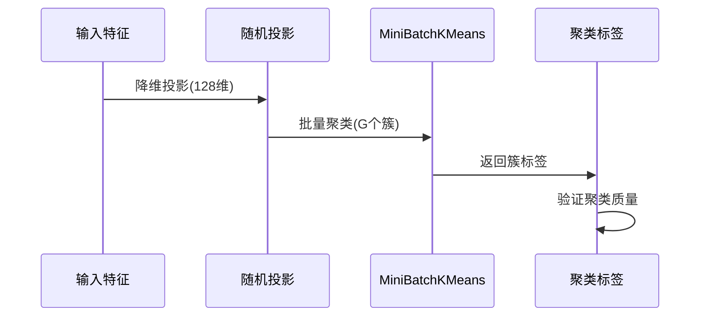

**图表来源**
- [子库分析运行脚本:47-66](file://experiments/activation_patterns/sublibrary/run.py#L47-L66)

聚类算法的关键参数：
- **投影维度**：128维，平衡计算复杂度和聚类效果
- **簇数量**：支持8、16、32、64等多尺度聚类
- **批处理大小**：根据数据规模自动调整

#### 子库构建模块

子库构建模块为每个聚类簇生成独立的子库：

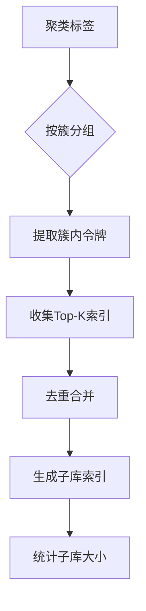

**图表来源**
- [子库分析运行脚本:68-93](file://experiments/activation_patterns/sublibrary/run.py#L68-L93)

子库构建策略：
- **完整子库**：包含簇内所有令牌的Top-K索引
- **截断子库**：限制子库大小为N_sub，优先保留高频索引
- **动态阈值**：根据簇大小和总潜在数自动选择N_sub

#### 召回率计算模块

召回率计算模块提供多维度的性能评估：

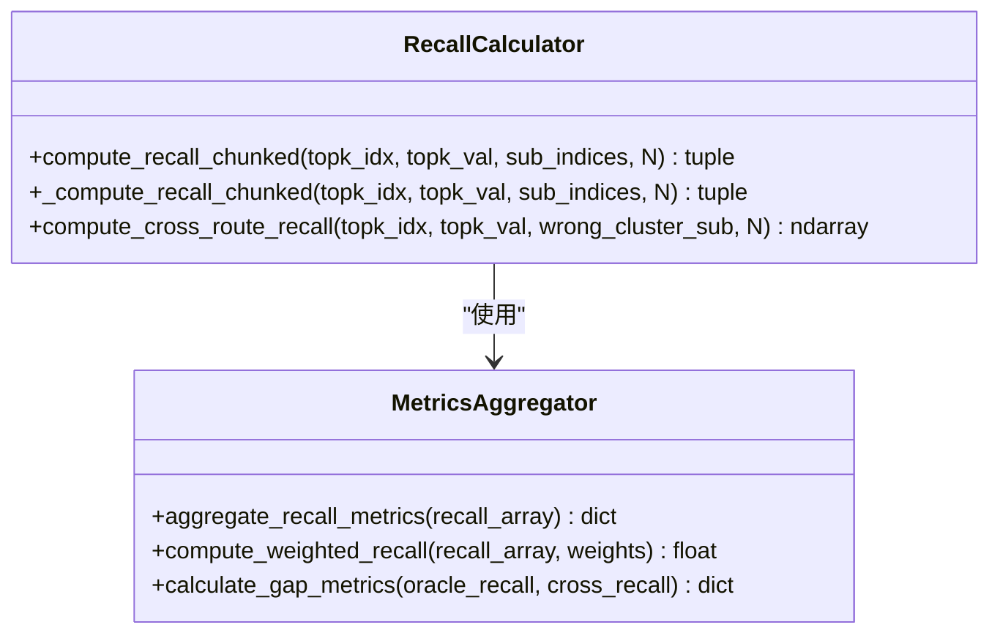

**图表来源**
- [子库分析运行脚本:95-124](file://experiments/activation_patterns/sublibrary/run.py#L95-L124)

召回率指标体系：
- **整体召回率**：衡量子库对原始Top-K的覆盖程度
- **加权召回率**：考虑激活强度的加权覆盖率
- **分位数召回率**：P10、P50、P90等分位数表现
- **交叉路由召回率**：错误路由场景下的性能

**章节来源**
- [子库分析运行脚本:35-290](file://experiments/activation_patterns/sublibrary/run.py#L35-L290)

### 实验配置与参数

#### 基础配置参数

| 参数名称 | 默认值 | 说明 |
|---------|--------|------|
| `--model` | 必需 | 模型路径或名称 |
| `--lut_dir` | 必需 | LUT目录路径 |
| `--dataset` | 必需 | 数据集路径或名称 |
| `--num_samples` | 256 | 处理的样本数量 |
| `--seq_len` | 512 | 序列长度 |
| `--layers` | [0,7,14,21,27] | 层索引列表 |
| `--op_types` | ["mlp"] | 算子类型列表 |

#### 高级配置参数

| 参数名称 | 默认值 | 说明 |
|---------|--------|------|
| `--batch_size` | 4 | 批处理大小 |
| `--device` | "auto" | 设备选择 |
| `--proj_dim` | 128 | 投影维度 |
| `--num_clusters_list` | [8,16,32,64] | 簇数量列表 |

#### 结果评估指标

子库分析生成的评估指标包括：

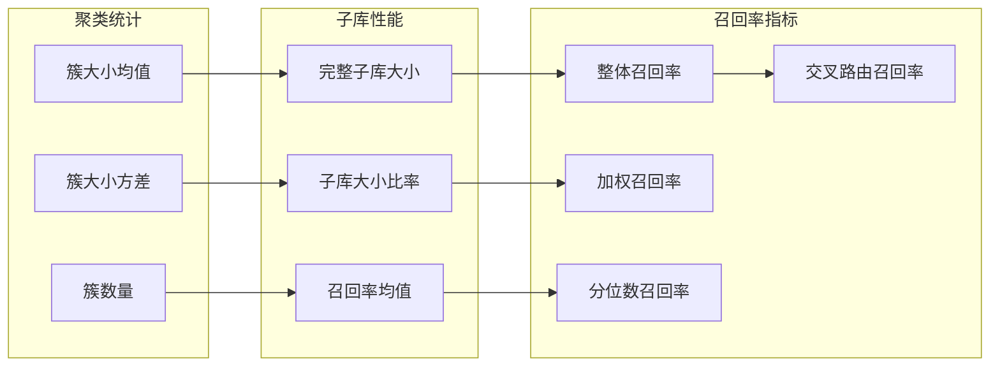

**图表来源**
- [子库分析运行脚本:178-288](file://experiments/activation_patterns/sublibrary/run.py#L178-L288)

**章节来源**
- [子库分析运行脚本:326-452](file://experiments/activation_patterns/sublibrary/run.py#L326-L452)

## 依赖关系分析

### 核心依赖关系

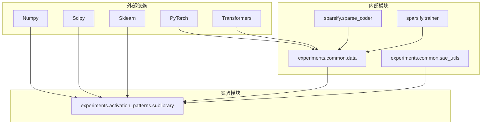

**图表来源**
- [子库分析运行脚本:17-32](file://experiments/activation_patterns/sublibrary/run.py#L17-L32)
- [通用数据处理模块:12-41](file://experiments/common/data.py#L12-L41)

### 数据流依赖

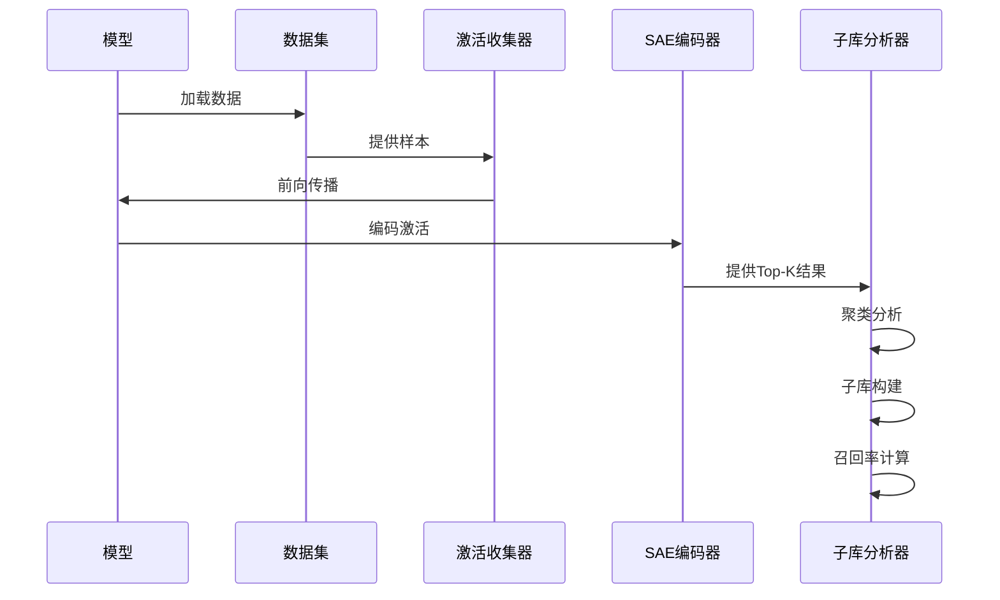

**图表来源**
- [通用数据处理模块:44-156](file://experiments/common/data.py#L44-L156)
- [SAE工具模块:15-124](file://experiments/common/sae_utils.py#L15-L124)

**章节来源**
- [通用数据处理模块:44-156](file://experiments/common/data.py#L44-L156)
- [SAE工具模块:15-124](file://experiments/common/sae_utils.py#L15-L124)

## 性能考虑

### 内存优化策略

子库分析涉及大规模矩阵运算，需要采用多种内存优化策略：

1. **稀疏矩阵存储**：使用CSR格式存储激活特征，减少内存占用
2. **分块处理**：对大规模数据进行分块处理，避免内存溢出
3. **设备管理**：合理管理GPU/CPU内存分配，及时释放临时张量

### 计算效率优化

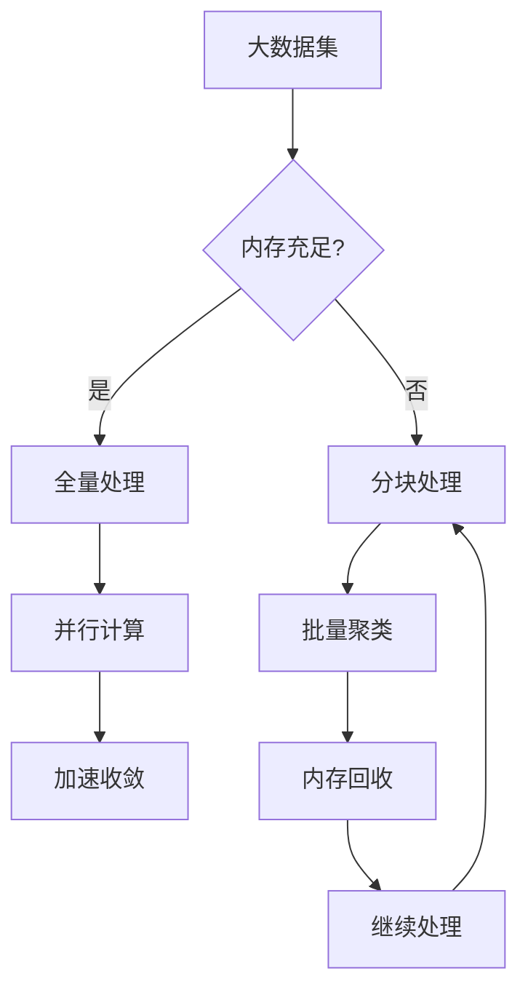

**图表来源**
- [子库分析运行脚本:112-123](file://experiments/activation_patterns/sublibrary/run.py#L112-L123)

### 并行处理策略

系统支持多进程并行处理，提高大规模数据的处理效率：

- **数据并行**：多个进程同时处理不同的数据片段
- **任务并行**：不同类型的计算任务分配给不同的进程
- **内存并行**：通过合理的内存管理避免进程间冲突

## 故障排除指南

### 常见问题及解决方案

#### 内存不足问题

**症状**：程序在聚类阶段崩溃，报内存不足错误

**解决方案**：
1. 减少`--num_samples`参数值
2. 降低`--batch_size`参数
3. 使用更小的`--proj_dim`值
4. 增加系统内存或使用更高规格的GPU

#### 聚类效果不佳

**症状**：聚类结果质量差，召回率偏低

**解决方案**：
1. 调整`--proj_dim`参数（建议128）
2. 尝试不同的`--num_clusters_list`值
3. 检查激活数据的质量和预处理
4. 验证SAE编码的准确性

#### 性能问题

**症状**：处理速度慢，长时间无响应

**解决方案**：
1. 确保使用GPU加速（`--device cuda`）
2. 适当增加`--batch_size`
3. 检查网络连接（如果使用远程模型）
4. 清理缓存和临时文件

**章节来源**
- [子库分析运行脚本:344-349](file://experiments/activation_patterns/sublibrary/run.py#L344-L349)

## 结论

子库分析为激活模式研究提供了一个强大的理论框架和实践工具。通过聚类令牌激活模式并构建条件子库，该方法能够：

1. **提供理论上限**：确定在给定激活模式约束下的最佳性能
2. **指导稀疏性优化**：为Top-K稀疏度设置提供科学依据
3. **支持硬件适配**：为不同硬件平台的激活存储和计算提供指导
4. **促进模型压缩**：为后续的模型量化和压缩提供理论基础

该系统的成功实施需要关注以下关键因素：
- **数据质量**：高质量的激活数据是分析准确性的基础
- **参数调优**：合适的聚类参数和子库参数对结果影响重大
- **计算资源**：充足的计算资源确保大规模分析的可行性
- **结果验证**：通过多种指标综合评估分析结果的有效性

随着深度学习模型规模的不断增长，子库分析作为一种重要的分析工具，将在模型优化、压缩和推理加速方面发挥越来越重要的作用。

## 附录

### 实验配置参数详解

#### 基础参数配置

| 参数 | 类型 | 默认值 | 说明 |
|------|------|--------|------|
| `model` | 字符串 | 必需 | 模型路径或名称 |
| `lut_dir` | 字符串 | 必需 | LUT目录路径 |
| `dataset` | 字符串 | 必需 | 数据集路径或名称 |
| `num_samples` | 整数 | 256 | 处理的样本数量 |
| `seq_len` | 整数 | 512 | 序列长度 |
| `layers` | 列表 | [0,7,14,21,27] | 层索引列表 |
| `op_types` | 列表 | ["mlp"] | 算子类型列表 |

#### 高级参数配置

| 参数 | 类型 | 默认值 | 说明 |
|------|------|--------|------|
| `batch_size` | 整数 | 4 | 批处理大小 |
| `device` | 字符串 | "auto" | 设备选择 |
| `proj_dim` | 整数 | 128 | 投影维度 |
| `num_clusters_list` | 列表 | [8,16,32,64] | 簇数量列表 |

### 结果评估指标说明

#### 聚类统计指标

- **簇大小均值**：各簇包含的令牌数量平均值
- **簇大小方差**：簇大小的标准差，反映聚类均衡性
- **簇数量**：最终形成的簇总数

#### 子库性能指标

- **完整子库大小**：包含所有令牌Top-K索引的子库大小
- **子库大小比率**：子库大小占总潜在数的比例
- **召回率均值**：子库对原始Top-K的平均覆盖比例

#### 召回率评估指标

- **整体召回率**：衡量子库对原始Top-K的覆盖程度
- **加权召回率**：考虑激活强度的加权覆盖率
- **分位数召回率**：P10、P50、P90等分位数表现
- **交叉路由召回率**：错误路由场景下的性能

### 实际应用建议

#### 实验设计建议

1. **数据规模选择**：根据可用资源选择合适的`num_samples`和`seq_len`
2. **参数范围探索**：从较小的簇数量开始，逐步增加
3. **多指标评估**：综合考虑召回率、子库大小和计算时间
4. **结果对比**：与其他激活模式分析方法进行对比验证

#### 性能优化建议

1. **硬件配置**：使用高性能GPU，确保足够的显存
2. **内存管理**：合理设置批处理大小，及时清理缓存
3. **并行计算**：充分利用多核CPU和GPU的并行能力
4. **结果复用**：将中间结果保存，避免重复计算