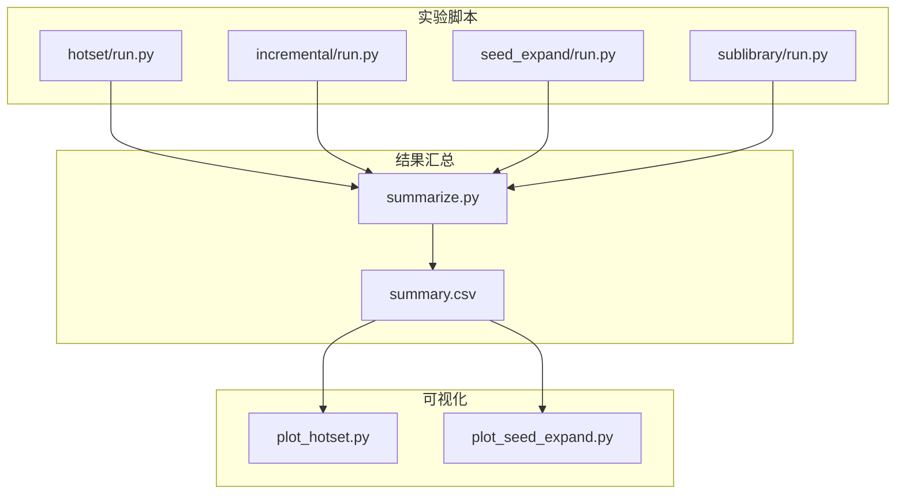
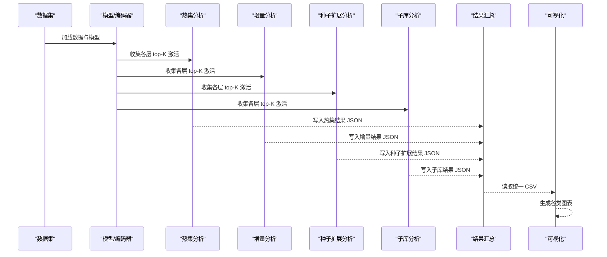
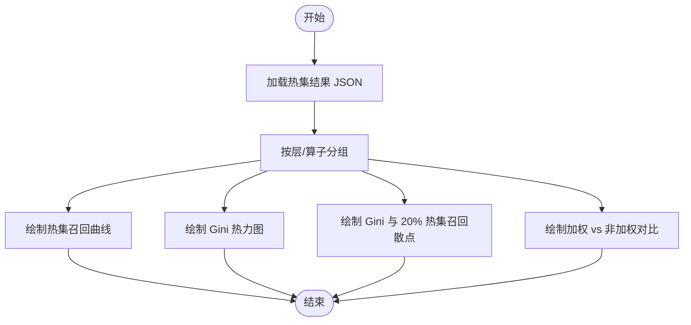
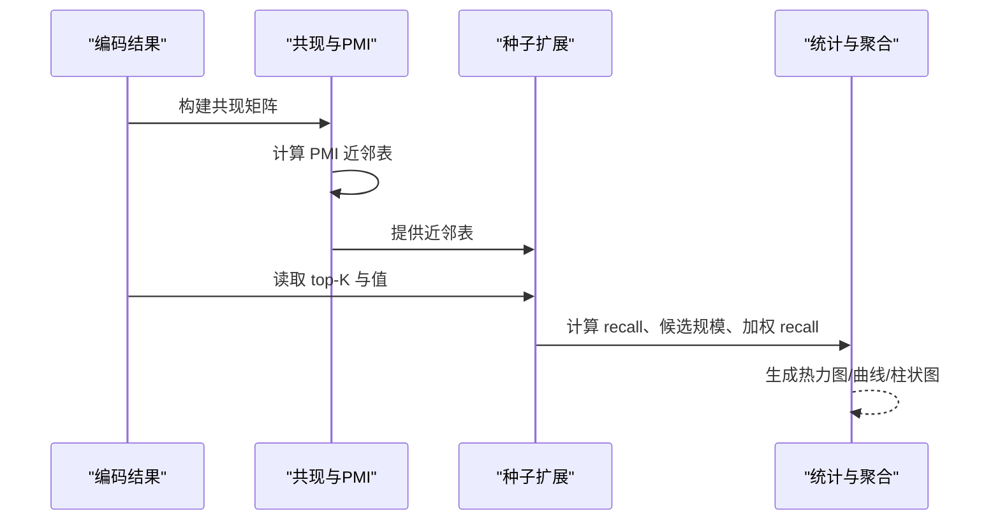
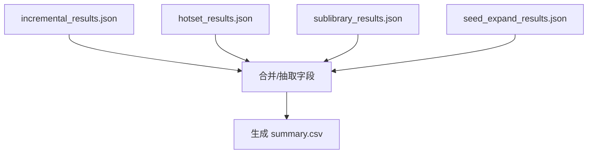
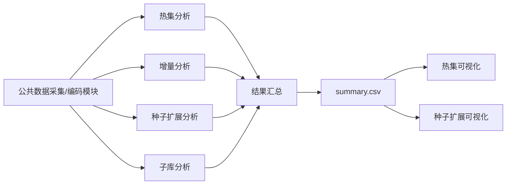

# 实验总结与分析

<cite>
**本文引用的文件**
- [experiments/activation_patterns/summarize.py](file://experiments/activation_patterns/summarize.py)
- [results/activation_patterns/summary.csv](file://results/activation_patterns/summary.csv)
- [experiments/activation_patterns/plot_hotset.py](file://experiments/activation_patterns/plot_hotset.py)
- [experiments/activation_patterns/plot_seed_expand.py](file://experiments/activation_patterns/plot_seed_expand.py)
- [LUTurbo-doc/experiments/20260316-activation-patterns.md](file://LUTurbo-doc/experiments/20260316-activation-patterns.md)
- [LUTurbo-doc/ideas/activation-patterns.md](file://LUTurbo-doc/ideas/activation-patterns.md)
- [experiments/activation_patterns/hotset/run.py](file://experiments/activation_patterns/hotset/run.py)
- [experiments/activation_patterns/incremental/run.py](file://experiments/activation_patterns/incremental/run.py)
- [experiments/activation_patterns/seed_expand/run.py](file://experiments/activation_patterns/seed_expand/run.py)
- [experiments/activation_patterns/sublibrary/run.py](file://experiments/activation_patterns/sublibrary/run.py)
</cite>

## 目录
1. [简介](#简介)
2. [项目结构](#项目结构)
3. [核心组件](#核心组件)
4. [架构总览](#架构总览)
5. [详细组件分析](#详细组件分析)
6. [依赖关系分析](#依赖关系分析)
7. [性能考量](#性能考量)
8. [故障排查指南](#故障排查指南)
9. [结论](#结论)
10. [附录](#附录)

## 简介
本文件面向“激活模式实验”的总结与分析，系统梳理了增量选择（C1e）、热集选择（C1h）、条件子库（A2b/C1c）与种子扩展（C1i）四类方案的实验设计、数据整合、统计分析与可视化呈现，并给出实验报告生成流程、关键指标提取方法、趋势分析技巧、可视化展示与性能对比表格制作指南，以及从实验总结中提炼训练策略优化建议与参数配置指导。

## 项目结构
该项目围绕“激活模式分析”形成“数据采集 → 分析计算 → 结果汇总 → 可视化 → 报告生成”的闭环流程，核心目录与文件如下：
- 实验脚本：位于 experiments/activation_patterns 下，分别实现四类 Oracle 基线的分析与输出
- 结果汇总：experiments/activation_patterns/summarize.py 将各实验 JSON 聚合为统一 CSV
- 结果可视化：对应实验的 plot_* 脚本生成图表
- 文档与规范：LUTurbo-doc 中包含实验设计思想、阈值与判定标准、阶段性总结报告

**图表来源**
- [experiments/activation_patterns/hotset/run.py](file://experiments/activation_patterns/hotset/run.py)
- [experiments/activation_patterns/incremental/run.py](file://experiments/activation_patterns/incremental/run.py)
- [experiments/activation_patterns/seed_expand/run.py](file://experiments/activation_patterns/seed_expand/run.py)
- [experiments/activation_patterns/sublibrary/run.py](file://experiments/activation_patterns/sublibrary/run.py)
- [experiments/activation_patterns/summarize.py](file://experiments/activation_patterns/summarize.py)
- [results/activation_patterns/summary.csv](file://results/activation_patterns/summary.csv)
- [experiments/activation_patterns/plot_hotset.py](file://experiments/activation_patterns/plot_hotset.py)
- [experiments/activation_patterns/plot_seed_expand.py](file://experiments/activation_patterns/plot_seed_expand.py)

**章节来源**
- [LUTurbo-doc/ideas/activation-patterns.md](file://LUTurbo-doc/ideas/activation-patterns.md)
- [LUTurbo-doc/experiments/20260316-activation-patterns.md](file://LUTurbo-doc/experiments/20260316-activation-patterns.md)

## 核心组件
- 数据采集与编码：通过模型前向与 SAE 编码，收集各层 Hook 点的 top-K 激活索引与值，按层落盘，避免内存峰值随层数线性增长
- Oracle 基线分析：
  - 增量选择（C1e）：保留前一 token 选择，允许替换 m 个，统计 recall、new-mass ratio、替换分布与 burstiness
  - 热集选择（C1h）：固定全局热集 H，统计 per-token recall、加权 recall、热值占比与频率分布
  - 条件子库（A2b/C1c）：离线聚类构建子库，统计全库与截断子库 recall、跨簇路由误差
  - 种子扩展（C1i）：以少量强激活种子，结合 PMI 近邻表扩展候选，统计候选规模与 recall
- 结果汇总：统一抽取字段，合并多实验 JSON，生成 CSV
- 可视化：生成热力图、曲线图、散点图与柱状图，直观呈现各方案在不同层/算子上的表现

**章节来源**
- [experiments/activation_patterns/hotset/run.py](file://experiments/activation_patterns/hotset/run.py)
- [experiments/activation_patterns/incremental/run.py](file://experiments/activation_patterns/incremental/run.py)
- [experiments/activation_patterns/sublibrary/run.py](file://experiments/activation_patterns/sublibrary/run.py)
- [experiments/activation_patterns/seed_expand/run.py](file://experiments/activation_patterns/seed_expand/run.py)
- [experiments/activation_patterns/summarize.py](file://experiments/activation_patterns/summarize.py)

## 架构总览
下图展示了从数据采集到实验结果可视化的整体流程与模块交互：

**图表来源**
- [experiments/activation_patterns/hotset/run.py](file://experiments/activation_patterns/hotset/run.py)
- [experiments/activation_patterns/incremental/run.py](file://experiments/activation_patterns/incremental/run.py)
- [experiments/activation_patterns/seed_expand/run.py](file://experiments/activation_patterns/seed_expand/run.py)
- [experiments/activation_patterns/sublibrary/run.py](file://experiments/activation_patterns/sublibrary/run.py)
- [experiments/activation_patterns/summarize.py](file://experiments/activation_patterns/summarize.py)
- [experiments/activation_patterns/plot_hotset.py](file://experiments/activation_patterns/plot_hotset.py)
- [experiments/activation_patterns/plot_seed_expand.py](file://experiments/activation_patterns/plot_seed_expand.py)

## 详细组件分析

### 数据采集与内存策略
- 逐层采集与编码，每层编码后立即落盘，避免同时驻留所有层导致内存线性增长
- 记录 token 位置与序列边界，支持增量分析与跨序列边界过滤
- 为 top-L 变体额外保留 top-2K 索引，便于保留集扩展

**章节来源**
- [LUTurbo-doc/ideas/activation-patterns.md](file://LUTurbo-doc/ideas/activation-patterns.md)
- [experiments/activation_patterns/hotset/run.py](file://experiments/activation_patterns/hotset/run.py)
- [experiments/activation_patterns/incremental/run.py](file://experiments/activation_patterns/incremental/run.py)

### 热集选择（C1h）分析与可视化
- 统计全局频率，按百分比构建热集 H，计算 per-token recall、加权 recall、热值占比与剩余搜索空间
- 生成热力图（层×算子 Gini）、散点图（Gini 与 20% 热集 recall）、对比柱状图（加权 vs 非加权）

**图表来源**
- [experiments/activation_patterns/plot_hotset.py](file://experiments/activation_patterns/plot_hotset.py)
- [results/activation_patterns/hotset/hotset_results.json](file://results/activation_patterns/hotset/hotset_results.json)

**章节来源**
- [experiments/activation_patterns/plot_hotset.py](file://experiments/activation_patterns/plot_hotset.py)
- [LUTurbo-doc/experiments/20260316-activation-patterns.md](file://LUTurbo-doc/experiments/20260316-activation-patterns.md)

### 增量选择（C1e）分析
- 计算相邻 token 对的重叠统计、替换分布（均值/P90/P99）、new-mass ratio、burstiness（最大/均值 run 长度）
- 提供跨变体对比（相同候选预算下 topK、topL、union2 的 recall）

**章节来源**
- [experiments/activation_patterns/incremental/run.py](file://experiments/activation_patterns/incremental/run.py)
- [LUTurbo-doc/experiments/20260316-activation-patterns.md](file://LUTurbo-doc/experiments/20260316-activation-patterns.md)

### 条件子库（A2b/C1c）分析
- 使用随机投影 + MiniBatchKMeans 聚类 token 激活模式，构建子库并统计全库与截断子库 recall、跨簇路由误差
- 关注子库大小与 recall 的权衡，评估路由错误代价

**章节来源**
- [experiments/activation_patterns/sublibrary/run.py](file://experiments/activation_patterns/sublibrary/run.py)
- [LUTurbo-doc/experiments/20260316-activation-patterns.md](file://LUTurbo-doc/experiments/20260316-activation-patterns.md)

### 种子扩展（C1i）分析与可视化
- 构建共现矩阵与 PMI 近邻表，统计平均有效邻居数与覆盖率
- 评估 oracle 种子与热集种子扩展的候选规模与 recall，绘制热力图、扩展曲线、候选规模-召回曲线、加权对比与 CV gap 柱状图

**图表来源**
- [experiments/activation_patterns/seed_expand/run.py](file://experiments/activation_patterns/seed_expand/run.py)
- [experiments/activation_patterns/plot_seed_expand.py](file://experiments/activation_patterns/plot_seed_expand.py)

**章节来源**
- [experiments/activation_patterns/seed_expand/run.py](file://experiments/activation_patterns/seed_expand/run.py)
- [experiments/activation_patterns/plot_seed_expand.py](file://experiments/activation_patterns/plot_seed_expand.py)
- [LUTurbo-doc/experiments/20260316-activation-patterns.md](file://LUTurbo-doc/experiments/20260316-activation-patterns.md)

### 结果汇总与报告生成
- 统一抽取字段，合并增量、热集、子库、种子扩展四类实验 JSON，生成 summary.csv
- 为后续可视化与报告提供结构化数据基础

**图表来源**
- [experiments/activation_patterns/summarize.py](file://experiments/activation_patterns/summarize.py)
- [results/activation_patterns/summary.csv](file://results/activation_patterns/summary.csv)

**章节来源**
- [experiments/activation_patterns/summarize.py](file://experiments/activation_patterns/summarize.py)
- [results/activation_patterns/summary.csv](file://results/activation_patterns/summary.csv)

## 依赖关系分析
- 实验脚本依赖公共数据采集与编码模块，按层流式处理，避免内存峰值
- 结果汇总脚本依赖各实验输出的 JSON 文件，统一字段后写入 CSV
- 可视化脚本依赖汇总 CSV，按层/算子/方案生成图表

**图表来源**
- [experiments/activation_patterns/hotset/run.py](file://experiments/activation_patterns/hotset/run.py)
- [experiments/activation_patterns/incremental/run.py](file://experiments/activation_patterns/incremental/run.py)
- [experiments/activation_patterns/seed_expand/run.py](file://experiments/activation_patterns/seed_expand/run.py)
- [experiments/activation_patterns/sublibrary/run.py](file://experiments/activation_patterns/sublibrary/run.py)
- [experiments/activation_patterns/summarize.py](file://experiments/activation_patterns/summarize.py)
- [experiments/activation_patterns/plot_hotset.py](file://experiments/activation_patterns/plot_hotset.py)
- [experiments/activation_patterns/plot_seed_expand.py](file://experiments/activation_patterns/plot_seed_expand.py)

**章节来源**
- [experiments/activation_patterns/hotset/run.py](file://experiments/activation_patterns/hotset/run.py)
- [experiments/activation_patterns/incremental/run.py](file://experiments/activation_patterns/incremental/run.py)
- [experiments/activation_patterns/seed_expand/run.py](file://experiments/activation_patterns/seed_expand/run.py)
- [experiments/activation_patterns/sublibrary/run.py](file://experiments/activation_patterns/sublibrary/run.py)
- [experiments/activation_patterns/summarize.py](file://experiments/activation_patterns/summarize.py)

## 性能考量
- 内存与 I/O
  - 逐层编码与落盘，避免总内存随层数线性增长
  - 向量化与分块处理（如增量 overlap、种子扩展召回）降低内存峰值
- 计算加速
  - GPU 加速的共现矩阵与 PMI 近邻计算
  - 向量化指示数组与分块归约，提升大规模矩阵运算效率
- 可视化与报告
  - 统一 CSV 便于批量生成图表，减少重复计算
  - 按层/算子分面展示，便于定位热点与异常

[本节为通用指导，无需列出具体文件来源]

## 故障排查指南
- 数据采集失败
  - 检查模型与 LUT 目录路径、数据集加载与分词器配置
  - 确认设备设置（CUDA/CPu）与 dtype 设定
- 内存不足
  - 确保每层编码后及时释放内存，必要时减小 batch_size 或 seq_len
  - 使用分块处理（如增量 overlap、种子扩展召回）降低峰值内存
- 结果为空或字段缺失
  - 确认各实验 JSON 输出路径与命名一致
  - 检查汇总脚本的 glob 匹配与字段抽取逻辑
- 可视化异常
  - 确认 summary.csv 字段与绘图脚本一致
  - 检查输出目录权限与 matplotlib 渲染环境

**章节来源**
- [experiments/activation_patterns/hotset/run.py](file://experiments/activation_patterns/hotset/run.py)
- [experiments/activation_patterns/incremental/run.py](file://experiments/activation_patterns/incremental/run.py)
- [experiments/activation_patterns/seed_expand/run.py](file://experiments/activation_patterns/seed_expand/run.py)
- [experiments/activation_patterns/sublibrary/run.py](file://experiments/activation_patterns/sublibrary/run.py)
- [experiments/activation_patterns/summarize.py](file://experiments/activation_patterns/summarize.py)

## 结论
- C1e（增量）：自然重叠率低、每步替换量大、burstiness 严重，单独不可行
- C1h（热集）：o_proj 中深层热集 recall 高（20% 热集可达 72%-94%），MLP/QKV 中等（43%-63%），可作为常驻集
- C1i（种子扩展）：独立不可行（oracle s=32,n=64 仅 44%-55% recall），但与热集组合效果显著（o_proj 12.5%N 候选达 88% recall）
- C1c（条件子库）：全子库接近全库（90%-100%N），聚类分离度差，收益有限，需配合结构化 SAE 训练

[本节为总结性陈述，无需列出具体文件来源]

## 附录

### 实验总结报告生成流程
- 步骤
  1) 运行各实验脚本，生成对应 JSON
  2) 运行汇总脚本，生成统一 CSV
  3) 运行可视化脚本，生成图表
  4) 基于 CSV 与图表撰写报告，标注关键阈值与判定标准

**章节来源**
- [experiments/activation_patterns/summarize.py](file://experiments/activation_patterns/summarize.py)
- [experiments/activation_patterns/plot_hotset.py](file://experiments/activation_patterns/plot_hotset.py)
- [experiments/activation_patterns/plot_seed_expand.py](file://experiments/activation_patterns/plot_seed_expand.py)

### 关键指标提取方法
- 热集（C1h）
  - per-token recall 均值/P10、加权 recall、热值占比、剩余搜索空间
- 增量（C1e）
  - replacement_count 均值/P90/P99、new-mass ratio、burstiness（最大/均值 run 长度）
- 子库（A2b/C1c）
  - 全子库大小比例、截断子库 recall、跨簇路由 gap
- 种子扩展（C1i）
  - 候选规模均值/比例、recall 均值/P10、加权 recall、CV gap

**章节来源**
- [LUTurbo-doc/experiments/20260316-activation-patterns.md](file://LUTurbo-doc/experiments/20260316-activation-patterns.md)

### 趋势分析技巧
- 横轴统一为候选集大小（或等效访存量），纵轴为 recall（或加权 recall）
- 分层/分算子对比，识别 o_proj 优势与 MLP/QKV 的局限
- 关注尾部分布（P90/P99）与连续坏段（burstiness），避免被均值误导

**章节来源**
- [LUTurbo-doc/ideas/activation-patterns.md](file://LUTurbo-doc/ideas/activation-patterns.md)
- [LUTurbo-doc/experiments/20260316-activation-patterns.md](file://LUTurbo-doc/experiments/20260316-activation-patterns.md)

### 可视化展示方法与性能对比表格
- 热集：召回曲线（层×算子）、Gini 热力图、Gini 与 20% 热集召回散点、加权 vs 非加权对比
- 种子扩展：oracle 种子热力图（s×n）、热集+扩展召回曲线、候选规模-召回曲线、加权对比、CV gap 柱状图
- 性能对比表：按层/算子/方案，汇总 recall@预算、候选规模、CV gap、路由误差等

**章节来源**
- [experiments/activation_patterns/plot_hotset.py](file://experiments/activation_patterns/plot_hotset.py)
- [experiments/activation_patterns/plot_seed_expand.py](file://experiments/activation_patterns/plot_seed_expand.py)
- [LUTurbo-doc/experiments/20260316-activation-patterns.md](file://LUTurbo-doc/experiments/20260316-activation-patterns.md)

### 训练策略优化建议与参数配置指导
- o_proj 优先：在 12.5%N 候选规模下达到 88% recall（加权 92%），建议优先实现热集+PMI 扩展
- MLP/QKV：候选规模 ≤25%N 时最高 74%（热集+扩展 n=32, 15-16%N），建议探索结构化 SAE 训练（引入分组约束）以在更小候选集下提升 recall
- 子库：当前 SAE 激活缺乏聚类结构（全子库 90%-100%N），需配合结构化训练或引入分组正则
- 参数建议：种子扩展 n=32 在 recall/candidate 比值上更优；热集大小 H=20%N 时路由误差小且 recall 高

**章节来源**
- [LUTurbo-doc/experiments/20260316-activation-patterns.md](file://LUTurbo-doc/experiments/20260316-activation-patterns.md)