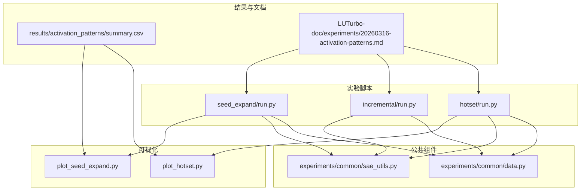
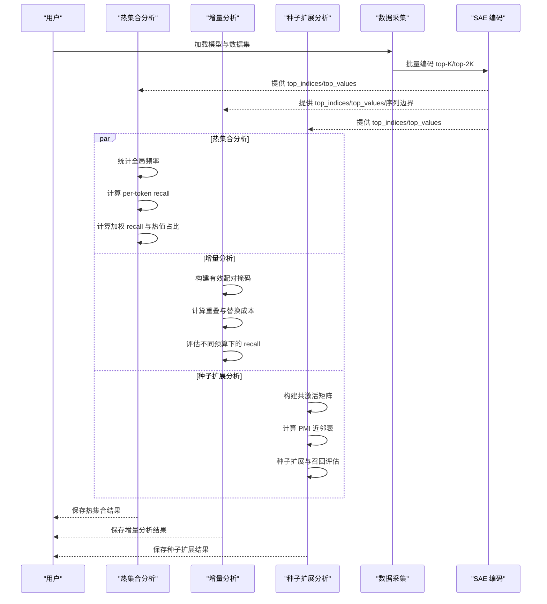
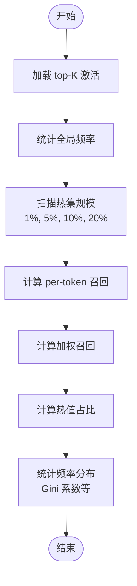
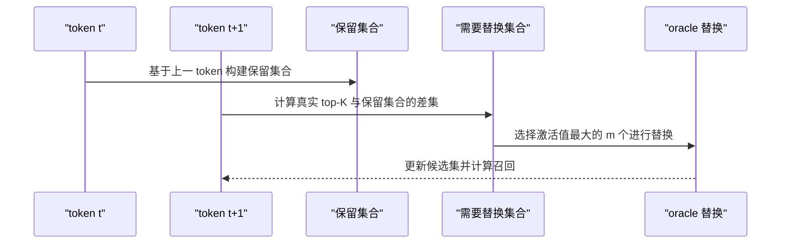
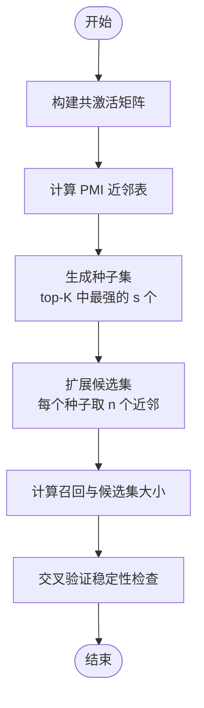
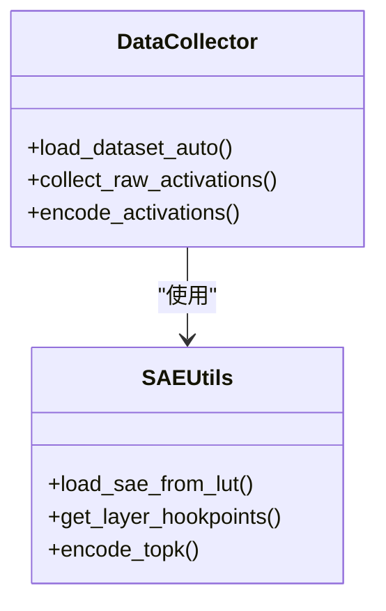
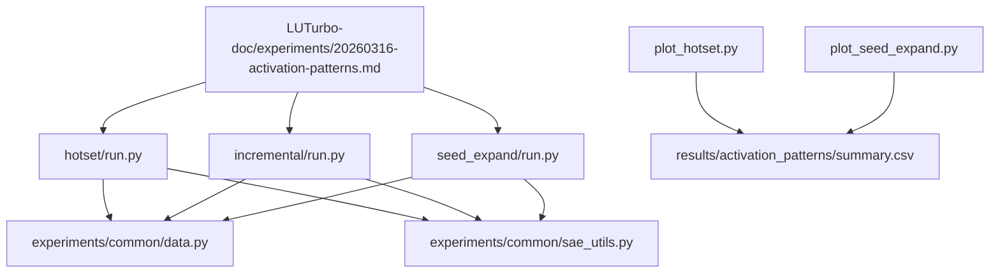

# 激活模式分析

<cite>
**本文档引用的文件**
- [experiments/activation_patterns/hotset/run.py](file://experiments/activation_patterns/hotset/run.py)
- [experiments/activation_patterns/incremental/run.py](file://experiments/activation_patterns/incremental/run.py)
- [experiments/activation_patterns/seed_expand/run.py](file://experiments/activation_patterns/seed_expand/run.py)
- [experiments/activation_patterns/plot_hotset.py](file://experiments/activation_patterns/plot_hotset.py)
- [experiments/activation_patterns/plot_seed_expand.py](file://experiments/activation_patterns/plot_seed_expand.py)
- [experiments/common/data.py](file://experiments/common/data.py)
- [experiments/common/sae_utils.py](file://experiments/common/sae_utils.py)
- [results/activation_patterns/summary.csv](file://results/activation_patterns/summary.csv)
- [LUTurbo-doc/experiments/20260316-activation-patterns.md](file://LUTurbo-doc/experiments/20260316-activation-patterns.md)
- [docs/training/config-reference.md](file://docs/training/config-reference.md)
- [sparsify/config.py](file://sparsify/config.py)
- [sparsify/trainer.py](file://sparsify/trainer.py)
</cite>

## 目录
1. [简介](#简介)
2. [项目结构](#项目结构)
3. [核心组件](#核心组件)
4. [架构概览](#架构概览)
5. [详细组件分析](#详细组件分析)
6. [依赖关系分析](#依赖关系分析)
7. [性能考量](#性能考量)
8. [故障排查指南](#故障排查指南)
9. [结论](#结论)
10. [附录](#附录)

## 简介
本文件系统性阐述激活模式分析系统的实现与应用，重点覆盖以下三个方面：
- 热集合（hotset）分析：固定全局热集对真实 top-K 的覆盖能力评估
- 增量训练模式：相邻 token 间的增量选择与替换策略上限
- 种子扩展实验：基于共激活关系的种子扩展候选集构建与召回评估

系统通过统一的"候选集大小 → 召回率 → 重构误差"框架，量化不同激活模式对阈值计算与稀疏性参数选择的影响，提供实验设计指南、数据分析方法与可视化工具使用说明。

## 项目结构
激活模式分析系统采用模块化设计，围绕实验脚本、数据采集、SAE 编码与可视化展开：

**图表来源**
- [experiments/activation_patterns/hotset/run.py:1-301](file://experiments/activation_patterns/hotset/run.py#L1-L301)
- [experiments/activation_patterns/incremental/run.py:1-510](file://experiments/activation_patterns/incremental/run.py#L1-L510)
- [experiments/activation_patterns/seed_expand/run.py:1-604](file://experiments/activation_patterns/seed_expand/run.py#L1-L604)
- [experiments/common/data.py:1-271](file://experiments/common/data.py#L1-L271)
- [experiments/common/sae_utils.py:1-124](file://experiments/common/sae_utils.py#L1-L124)
- [experiments/activation_patterns/plot_hotset.py:1-250](file://experiments/activation_patterns/plot_hotset.py#L1-L250)
- [experiments/activation_patterns/plot_seed_expand.py:1-399](file://experiments/activation_patterns/plot_seed_expand.py#L1-L399)
- [results/activation_patterns/summary.csv:1-362](file://results/activation_patterns/summary.csv#L1-L362)
- [LUTurbo-doc/experiments/20260316-activation-patterns.md:1-603](file://LUTurbo-doc/experiments/20260316-activation-patterns.md#L1-L603)

**章节来源**
- [experiments/activation_patterns/hotset/run.py:1-301](file://experiments/activation_patterns/hotset/run.py#L1-L301)
- [experiments/activation_patterns/incremental/run.py:1-510](file://experiments/activation_patterns/incremental/run.py#L1-L510)
- [experiments/activation_patterns/seed_expand/run.py:1-604](file://experiments/activation_patterns/seed_expand/run.py#L1-L604)
- [experiments/common/data.py:1-271](file://experiments/common/data.py#L1-L271)
- [experiments/common/sae_utils.py:1-124](file://experiments/common/sae_utils.py#L1-L124)

## 核心组件
- 数据采集与编码：统一的激活收集与 SAE 编码流程，支持批量处理与内存优化
- 热集合分析：基于全局频率统计的固定热集覆盖评估
- 增量选择分析：模拟相邻 token 的增量选择与替换策略上限
- 种子扩展分析：基于 PMI 共激活关系的种子扩展候选集构建
- 可视化工具：多维度图表生成，支持统一曲线与分布图

**章节来源**
- [experiments/common/data.py:44-271](file://experiments/common/data.py#L44-L271)
- [experiments/common/sae_utils.py:15-124](file://experiments/common/sae_utils.py#L15-L124)
- [experiments/activation_patterns/hotset/run.py:33-119](file://experiments/activation_patterns/hotset/run.py#L33-L119)
- [experiments/activation_patterns/incremental/run.py:225-312](file://experiments/activation_patterns/incremental/run.py#L225-L312)
- [experiments/activation_patterns/seed_expand/run.py:245-425](file://experiments/activation_patterns/seed_expand/run.py#L245-L425)

## 架构概览
系统采用"数据采集 → SAE 编码 → 激活模式分析 → 结果汇总与可视化"的流水线架构：

**图表来源**
- [experiments/common/data.py:44-271](file://experiments/common/data.py#L44-L271)
- [experiments/activation_patterns/hotset/run.py:227-296](file://experiments/activation_patterns/hotset/run.py#L227-L296)
- [experiments/activation_patterns/incremental/run.py:417-506](file://experiments/activation_patterns/incremental/run.py#L417-L506)
- [experiments/activation_patterns/seed_expand/run.py:523-599](file://experiments/activation_patterns/seed_expand/run.py#L523-L599)

## 详细组件分析

### 热集合（Hotset）分析
热集合分析通过统计全局频率，确定固定热集对真实 top-K 的覆盖能力，评估不同热集规模（以 N 的百分比表示）下的召回表现。

**图表来源**
- [experiments/activation_patterns/hotset/run.py:33-119](file://experiments/activation_patterns/hotset/run.py#L33-L119)

**章节来源**
- [experiments/activation_patterns/hotset/run.py:33-119](file://experiments/activation_patterns/hotset/run.py#L33-L119)
- [experiments/activation_patterns/hotset/run.py:122-130](file://experiments/activation_patterns/hotset/run.py#L122-L130)
- [experiments/activation_patterns/plot_hotset.py:47-164](file://experiments/activation_patterns/plot_hotset.py#L47-L164)

### 增量训练模式分析
增量分析模拟相邻 token 对的选择策略，评估在不同预算（保留集合大小 + 替换数量 m）下，从上一 token 的选择结果中复用并替换若干位置所能达到的召回。

**图表来源**
- [experiments/activation_patterns/incremental/run.py:225-312](file://experiments/activation_patterns/incremental/run.py#L225-L312)

**章节来源**
- [experiments/activation_patterns/incremental/run.py:225-312](file://experiments/activation_patterns/incremental/run.py#L225-L312)
- [experiments/activation_patterns/incremental/run.py:315-366](file://experiments/activation_patterns/incremental/run.py#L315-L366)

### 种子扩展实验
种子扩展分析基于 PMI 共激活关系，从少量强激活种子出发扩展候选集，评估不同种子数与近邻数组合下的召回表现。

**图表来源**
- [experiments/activation_patterns/seed_expand/run.py:245-425](file://experiments/activation_patterns/seed_expand/run.py#L245-L425)

**章节来源**
- [experiments/activation_patterns/seed_expand/run.py:245-425](file://experiments/activation_patterns/seed_expand/run.py#L245-L425)
- [experiments/activation_patterns/seed_expand/run.py:428-475](file://experiments/activation_patterns/seed_expand/run.py#L428-L475)

### 数据采集与 SAE 编码
系统通过 forward hook 流式捕获各层隐藏状态，使用 SAE 对激活进行编码，输出 top-K 与 top-2K 索引及值，支持大规模数据的批处理与内存优化。

**图表来源**
- [experiments/common/data.py:12-271](file://experiments/common/data.py#L12-L271)
- [experiments/common/sae_utils.py:15-124](file://experiments/common/sae_utils.py#L15-L124)

**章节来源**
- [experiments/common/data.py:44-271](file://experiments/common/data.py#L44-L271)
- [experiments/common/sae_utils.py:15-124](file://experiments/common/sae_utils.py#L15-L124)

## 依赖关系分析
系统依赖关系清晰，实验脚本通过公共模块实现数据采集与 SAE 编码，最终生成统一的可视化图表与汇总结果。

**图表来源**
- [experiments/activation_patterns/hotset/run.py:1-301](file://experiments/activation_patterns/hotset/run.py#L1-L301)
- [experiments/activation_patterns/incremental/run.py:1-510](file://experiments/activation_patterns/incremental/run.py#L1-L510)
- [experiments/activation_patterns/seed_expand/run.py:1-604](file://experiments/activation_patterns/seed_expand/run.py#L1-L604)
- [experiments/common/data.py:1-271](file://experiments/common/data.py#L1-L271)
- [experiments/common/sae_utils.py:1-124](file://experiments/common/sae_utils.py#L1-L124)
- [experiments/activation_patterns/plot_hotset.py:1-250](file://experiments/activation_patterns/plot_hotset.py#L1-L250)
- [experiments/activation_patterns/plot_seed_expand.py:1-399](file://experiments/activation_patterns/plot_seed_expand.py#L1-L399)
- [results/activation_patterns/summary.csv:1-362](file://results/activation_patterns/summary.csv#L1-L362)
- [LUTurbo-doc/experiments/20260316-activation-patterns.md:1-603](file://LUTurbo-doc/experiments/20260316-activation-patterns.md#L1-L603)

**章节来源**
- [results/activation_patterns/summary.csv:1-362](file://results/activation_patterns/summary.csv#L1-L362)

## 性能考量
- 内存优化：采用逐层流式处理与落盘策略，避免同时驻留所有层的激活，内存峰值≈单层缓存
- 批处理编码：对整个序列进行批处理编码，减少循环开销
- GPU 加速：在可用时使用 GPU 进行共激活矩阵与召回计算，显著提升性能
- 数据并行：支持分布式训练与日志记录，便于大规模实验

[本节为一般性指导，无需特定文件分析]

## 故障排查指南
- 设备与依赖
  - 确认 CUDA 可用且版本兼容
  - 安装必要的 Python 包（transformers、datasets、matplotlib、safetensors 等）
- 数据与模型
  - 检查模型路径与权重文件完整性
  - 确认数据集格式与路径正确
- 内存与性能
  - 调整 batch_size 与 num_samples 以适配显存
  - 使用更小的 K 或 top_mul 降低内存占用
- 结果一致性
  - 检查随机种子设置，确保可重复性
  - 对比不同设备上的结果，排除设备差异

**章节来源**
- [docs/training/config-reference.md:1-193](file://docs/training/config-reference.md#L1-L193)
- [sparsify/config.py:1-149](file://sparsify/config.py#L1-L149)
- [sparsify/trainer.py:1-200](file://sparsify/trainer.py#L1-L200)

## 结论
激活模式分析系统通过统一框架评估四种 C1 候选方案的理论上限，为后续算法设计与实现提供明确指导：
- 热集合（C1h）在深层 o_proj 算子上表现优异，可作为常驻集
- 增量选择（C1e）单独不可行，但可作为混合方案的动态补充
- 种子扩展（C1i）独立价值有限，但与热集合结合效果显著
- 条件子库（C1c）在当前 SAE 设置下缺乏有效聚类结构

[本节为总结性内容，无需特定文件分析]

## 附录

### 实验设计指南
- 选择目标层与算子：优先考虑 o_proj，其次 MLP/QKV
- 设置参数扫描：热集合使用 1%, 5%, 10%, 20%；种子扩展使用 s∈{4,8,16,32}, n∈{8,16,32,64}
- 数据规模：建议至少 2560 序列 × 512 令牌
- 评估指标：召回率、加权召回、候选集大小、新质量占比、突发性

**章节来源**
- [LUTurbo-doc/experiments/20260316-activation-patterns.md:388-603](file://LUTurbo-doc/experiments/20260316-activation-patterns.md#L388-L603)

### 数据分析方法
- 统计指标：均值、分位数（P10/P25/P50/P90/P99）、分布直方图
- 相关性分析：Gini 系数与召回率的相关性
- 稳定性检验：交叉验证 gap 评估近邻表稳定性

**章节来源**
- [experiments/activation_patterns/plot_hotset.py:128-164](file://experiments/activation_patterns/plot_hotset.py#L128-L164)
- [experiments/activation_patterns/plot_seed_expand.py:310-373](file://experiments/activation_patterns/plot_seed_expand.py#L310-L373)

### 结果解读技巧
- 候选集大小与召回的关系：寻找在较小候选集下达到高召回的方案
- 访存量估算：结合不同方案的在线开销进行综合比较
- 层间差异：针对不同层采用差异化策略

**章节来源**
- [LUTurbo-doc/experiments/20260316-activation-patterns.md:359-376](file://LUTurbo-doc/experiments/20260316-activation-patterns.md#L359-L376)

### 可视化工具使用说明
- 热集合可视化：召回曲线、Gini 系数热力图、加权召回对比
- 种子扩展可视化：召回热力图、候选集大小 vs 召回曲线、交叉验证柱状图
- 输出文件：PNG 图像与 JSON 结果文件

**章节来源**
- [experiments/activation_patterns/plot_hotset.py:1-250](file://experiments/activation_patterns/plot_hotset.py#L1-L250)
- [experiments/activation_patterns/plot_seed_expand.py:1-399](file://experiments/activation_patterns/plot_seed_expand.py#L1-L399)