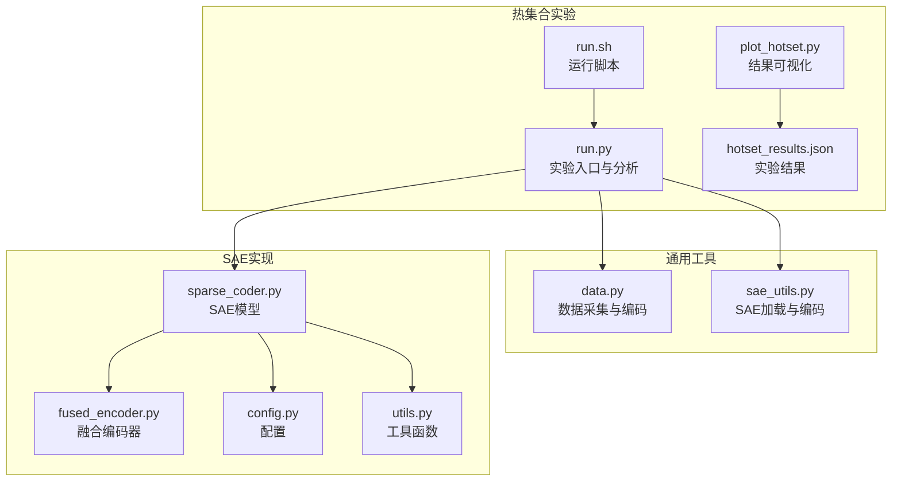
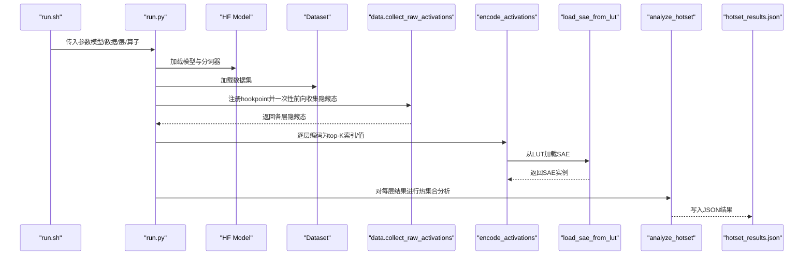
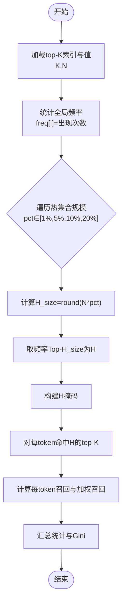
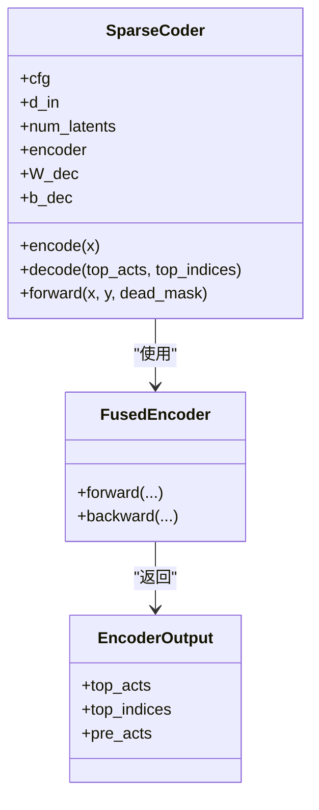
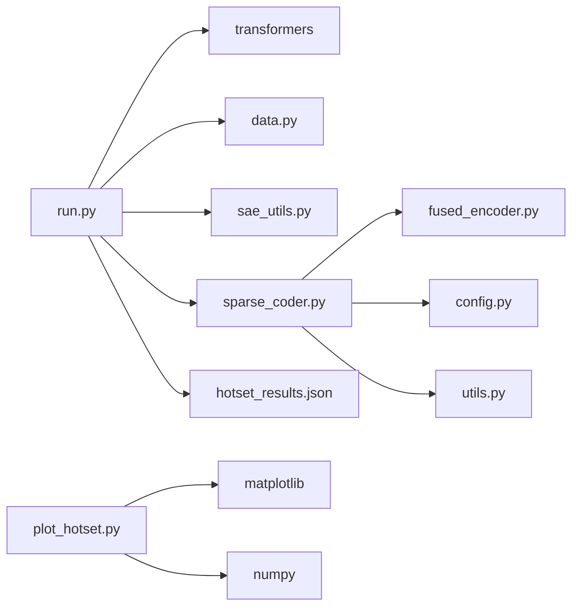

# 热集合分析

<cite>
**本文引用的文件**
- [hotset/run.py](file://experiments/activation_patterns/hotset/run.py)
- [hotset/run.sh](file://experiments/activation_patterns/hotset/run.sh)
- [plot_hotset.py](file://experiments/activation_patterns/plot_hotset.py)
- [hotset_results.json](file://results/activation_patterns/hotset/hotset_results.json)
- [data.py](file://experiments/common/data.py)
- [sae_utils.py](file://experiments/common/sae_utils.py)
- [sparse_coder.py](file://sparsify/sparse_coder.py)
- [fused_encoder.py](file://sparsify/fused_encoder.py)
- [config.py](file://sparsify/config.py)
- [utils.py](file://sparsify/utils.py)
- [20260316-activation-patterns.md](file://LUTurbo-doc/experiments/20260316-activation-patterns.md)
</cite>

## 目录
1. [简介](#简介)
2. [项目结构](#项目结构)
3. [核心组件](#核心组件)
4. [架构总览](#架构总览)
5. [详细组件分析](#详细组件分析)
6. [依赖分析](#依赖分析)
7. [性能考量](#性能考量)
8. [故障排查指南](#故障排查指南)
9. [结论](#结论)
10. [附录](#附录)

## 简介
本文件系统化阐述“热集合分析”（Hotset Analysis）在稀疏自编码器（SAE）训练与推理中的作用与实践。热集合分析通过“固定全局热集”的方式，评估其对每个 token 真实 top-K 选择的覆盖能力，从而为选择策略设计提供理论上限与工程指导。本文涵盖：
- 热集合概念与意义
- 实验设计与实现流程
- 热集合检测算法与阈值策略
- 性能影响与可视化
- 实验配置、运行脚本与结果解读
- 如何依据分析结果调整稀疏性参数与训练策略

## 项目结构
热集合分析相关代码主要分布在以下模块：
- 实验入口与执行：experiments/activation_patterns/hotset/run.py、run.sh
- 结果可视化：experiments/activation_patterns/plot_hotset.py
- 结果数据：results/activation_patterns/hotset/hotset_results.json
- 通用数据采集与编码：experiments/common/data.py、experiments/common/sae_utils.py
- SAE 核心实现：sparsify/sparse_coder.py、sparsify/fused_encoder.py、sparsify/config.py、sparsify/utils.py
- 文档与背景：LUTurbo-doc/experiments/20260316-activation-patterns.md

**图表来源**
- [hotset/run.py:160-296](file://experiments/activation_patterns/hotset/run.py#L160-L296)
- [hotset/run.sh:33-38](file://experiments/activation_patterns/hotset/run.sh#L33-L38)
- [plot_hotset.py:228-246](file://experiments/activation_patterns/plot_hotset.py#L228-L246)
- [data.py:44-156](file://experiments/common/data.py#L44-L156)
- [sae_utils.py:15-102](file://experiments/common/sae_utils.py#L15-L102)
- [sparse_coder.py:36-269](file://sparsify/sparse_coder.py#L36-L269)
- [fused_encoder.py:21-107](file://sparsify/fused_encoder.py#L21-L107)
- [config.py:7-26](file://sparsify/config.py#L7-L26)
- [utils.py:113-154](file://sparsify/utils.py#L113-L154)

**章节来源**
- [hotset/run.py:160-296](file://experiments/activation_patterns/hotset/run.py#L160-L296)
- [hotset/run.sh:33-38](file://experiments/activation_patterns/hotset/run.sh#L33-L38)
- [plot_hotset.py:228-246](file://experiments/activation_patterns/plot_hotset.py#L228-L246)
- [data.py:44-156](file://experiments/common/data.py#L44-L156)
- [sae_utils.py:15-102](file://experiments/common/sae_utils.py#L15-L102)
- [sparse_coder.py:36-269](file://sparsify/sparse_coder.py#L36-L269)
- [fused_encoder.py:21-107](file://sparsify/fused_encoder.py#L21-L107)
- [config.py:7-26](file://sparsify/config.py#L7-L26)
- [utils.py:113-154](file://sparsify/utils.py#L113-L154)

## 核心组件
- 热集合分析器（analyze_hotset）：对给定 top-K 索引与值，统计全局频率并评估不同热集合规模下的召回与加权召回、热值占比、残余搜索空间与残余 K 等指标。
- 数据采集与编码（collect_raw_activations、encode_activations）：从模型中流式收集隐藏态，按 hookpoint 分层编码为 top-K 索引与值。
- SAE 加载与编码（load_sae_from_lut、encode_topk）：从 LUT 文件加载 SAE，并执行 top-K 编码。
- 可视化（plot_hotset）：绘制热集合召回曲线、Gini 系数热力图、加权与非加权召回对比等。
- 结果数据（hotset_results.json）：保存每层每算子在不同热集合规模下的统计指标。

**章节来源**
- [hotset/run.py:33-119](file://experiments/activation_patterns/hotset/run.py#L33-L119)
- [data.py:44-156](file://experiments/common/data.py#L44-L156)
- [data.py:189-270](file://experiments/common/data.py#L189-L270)
- [sae_utils.py:15-102](file://experiments/common/sae_utils.py#L15-L102)
- [plot_hotset.py:47-226](file://experiments/activation_patterns/plot_hotset.py#L47-L226)
- [hotset_results.json:1-1141](file://results/activation_patterns/hotset/hotset_results.json#L1-L1141)

## 架构总览
热集合分析的端到端流程如下：
- 通过 run.sh 设置模型、数据集、层与算子等参数
- run.py 加载模型与数据，注册 hookpoint，一次性前向收集各层隐藏态
- 逐层编码为 top-K 索引与值，计算热集合召回与频率分布
- 保存 JSON 结果并生成可视化图表

**图表来源**
- [hotset/run.sh:33-38](file://experiments/activation_patterns/hotset/run.sh#L33-L38)
- [hotset/run.py:160-296](file://experiments/activation_patterns/hotset/run.py#L160-L296)
- [data.py:44-156](file://experiments/common/data.py#L44-L156)
- [data.py:189-270](file://experiments/common/data.py#L189-L270)
- [sae_utils.py:15-102](file://experiments/common/sae_utils.py#L15-L102)

## 详细组件分析

### 热集合检测与阈值策略
- 全局频率统计：对每层每算子，统计每个潜维在 top-K 中出现的次数，形成频率向量。
- 热集合构造：按频率排序，选取前 H_size（H_size = N × pct）构成热集合 H。
- 召回度量：
  - 每 token 召回：命中 H 的 top-K 数量 / K
  - 加权召回：按激活绝对值加权的命中质量
  - 热值占比：热集合命中贡献的激活值总和 / 总激活值
  - 残余搜索空间：N - H_size
  - 残余 K：K - 命中数均值
- 频率分布与不平等度：提供 num_ever_active、num_never_active、均值、分位数与 Gini 系数，衡量基向量使用不均衡程度。

**图表来源**
- [hotset/run.py:33-119](file://experiments/activation_patterns/hotset/run.py#L33-L119)

**章节来源**
- [hotset/run.py:33-119](file://experiments/activation_patterns/hotset/run.py#L33-L119)

### 实验配置与运行脚本
- run.sh 提供模型路径、LUT 目录、数据集路径、层列表、算子类型、样本数、序列长度、输出目录与设备等参数模板，便于快速切换与批量运行。
- run.py 解析参数，自动选择设备，加载模型与数据，构建 hookpoint 列表，执行一次性前向收集隐藏态，随后逐层编码并分析，最终保存 JSON 并打印摘要。

**章节来源**
- [hotset/run.sh:8-38](file://experiments/activation_patterns/hotset/run.sh#L8-L38)
- [hotset/run.py:160-296](file://experiments/activation_patterns/hotset/run.py#L160-L296)

### 结果可视化与解读
- recall_by_layer_op：按层与算子绘制不同热集合规模下的召回曲线，直观比较各层与算子的热集合覆盖能力。
- gini_heatmap：显示 Gini 系数热力图，层 × 算子维度，体现基向量使用不均衡程度。
- recall_vs_gini：散点图展示 Gini 与 20% 热集合召回的关系，辅助判断热集合有效性。
- weighted_vs_unweighted：对比加权与非加权召回，强调高频基向量对重构贡献的重要性。

**章节来源**
- [plot_hotset.py:47-226](file://experiments/activation_patterns/plot_hotset.py#L47-L226)

### 结果数据结构与示例
- 每个 hookpoint 名称对应一组指标，包含不同热集合规模（如 “|H|=1638(20%)”）的统计，以及频率统计（num_ever_active、num_never_active、freq_mean、freq_P50、freq_P90、freq_max、gini）。
- 示例字段包括：recall_mean、recall_P10、recall_weighted_mean、hot_value_ratio、residual_search_space、residual_K、num_tokens 等。

**章节来源**
- [hotset_results.json:1-1141](file://results/activation_patterns/hotset/hotset_results.json#L1-L1141)

### SAE 编码与融合优化
- SparseCoder：封装编码器与解码器权重，支持从 LUT 文件加载，提供 encode/decode 接口与辅助损失。
- fused_encoder：融合线性变换与 top-K 选择，优化反向传播的稀疏梯度累积，减少内存与计算开销。
- encode_topk：对输入执行线性变换与 ReLU，然后 top-K 选择，返回索引与值。

**图表来源**
- [sparse_coder.py:36-269](file://sparsify/sparse_coder.py#L36-L269)
- [fused_encoder.py:21-107](file://sparsify/fused_encoder.py#L21-L107)

**章节来源**
- [sparse_coder.py:36-269](file://sparsify/sparse_coder.py#L36-L269)
- [fused_encoder.py:21-107](file://sparsify/fused_encoder.py#L21-L107)
- [sae_utils.py:105-124](file://experiments/common/sae_utils.py#L105-L124)

### 数据采集与编码流程
- collect_raw_activations：注册多个 hookpoint，一次性前向收集各层隐藏态，记录序列边界与维度信息。
- encode_activations：逐层加载对应 LUT 的 SAE，将隐藏态分片编码为 top-K 索引与值，支持 top_mul 扩展至 top-2K 以满足后续分析需求。

**章节来源**
- [data.py:44-156](file://experiments/common/data.py#L44-L156)
- [data.py:189-270](file://experiments/common/data.py#L189-L270)

## 依赖分析
- 热集合分析依赖于：
  - 模型与数据：transformers 的 AutoModelForCausalLM 与 AutoTokenizer
  - SAE 加载：从 LUT safetensors 文件加载编码器/解码器权重与偏置
  - 编码器：fused_encoder 提供高效 top-K 选择与反向传播
  - 可视化：matplotlib 生成图表
  - 数值计算：numpy 与 torch 提供统计与张量运算

**图表来源**
- [hotset/run.py:160-296](file://experiments/activation_patterns/hotset/run.py#L160-L296)
- [plot_hotset.py:228-246](file://experiments/activation_patterns/plot_hotset.py#L228-L246)
- [data.py:44-156](file://experiments/common/data.py#L44-L156)
- [sae_utils.py:15-102](file://experiments/common/sae_utils.py#L15-L102)
- [sparse_coder.py:36-269](file://sparsify/sparse_coder.py#L36-L269)
- [fused_encoder.py:21-107](file://sparsify/fused_encoder.py#L21-L107)
- [config.py:7-26](file://sparsify/config.py#L7-L26)
- [utils.py:113-154](file://sparsify/utils.py#L113-L154)

**章节来源**
- [hotset/run.py:160-296](file://experiments/activation_patterns/hotset/run.py#L160-L296)
- [plot_hotset.py:228-246](file://experiments/activation_patterns/plot_hotset.py#L228-L246)
- [data.py:44-156](file://experiments/common/data.py#L44-L156)
- [sae_utils.py:15-102](file://experiments/common/sae_utils.py#L15-L102)
- [sparse_coder.py:36-269](file://sparsify/sparse_coder.py#L36-L269)
- [fused_encoder.py:21-107](file://sparsify/fused_encoder.py#L21-L107)
- [config.py:7-26](file://sparsify/config.py#L7-L26)
- [utils.py:113-154](file://sparsify/utils.py#L113-L154)

## 性能考量
- 内存与计算优化：
  - 一次性前向收集隐藏态，避免多次前向开销
  - 逐层编码并立即落盘/释放，降低峰值内存占用
  - fused_encoder 在大矩阵乘法阈值下采用稀疏散列+矩阵乘法，否则回退到 gather+bmm，平衡内存与速度
- 设备选择：优先使用 CUDA，若不可用则回退 CPU
- 批处理与分片：encode_activations 对长序列进行分片编码，避免 OOM

**章节来源**
- [data.py:44-156](file://experiments/common/data.py#L44-L156)
- [data.py:189-270](file://experiments/common/data.py#L189-L270)
- [fused_encoder.py:18-91](file://sparsify/fused_encoder.py#L18-L91)
- [hotset/run.py:178-186](file://experiments/activation_patterns/hotset/run.py#L178-L186)

## 故障排查指南
- LUT 文件缺失：确保 lut_dir 下存在对应 hookpoint 的 .lut.safetensors 文件与 metadata.json
- 设备不匹配：确认 CUDA 可用且与模型/SAE dtype 兼容
- 数据集格式：支持本地 arrow、parquet 或 HuggingFace hub 数据集，注意 max_seq_len 与分词器配置
- 内存不足：减小 num_samples、seq_len 或 batch_size，或启用更小的 K 与 N
- 结果为空：检查 hookpoint 列表与层索引是否正确，确认模型结构与 hookpoint 映射一致

**章节来源**
- [sae_utils.py:15-57](file://experiments/common/sae_utils.py#L15-L57)
- [data.py:12-41](file://experiments/common/data.py#L12-L41)
- [hotset/run.py:178-186](file://experiments/activation_patterns/hotset/run.py#L178-L186)

## 结论
热集合分析为稀疏自编码器的选择策略提供了可靠的理论上限与工程指导。通过全局频率统计与不同规模热集合的召回评估，可以：
- 识别最佳目标算子（如 o_proj 在深层表现尤为突出）
- 量化热集合对重构贡献（热值占比）
- 评估基向量使用不均衡程度（Gini 系数）
- 指导选择策略与候选集规模的工程折衷

结合可视化与阈值策略，可在小候选集预算下实现高召回，为后续在线算法设计与训练策略优化奠定基础。

## 附录

### 实验配置与运行步骤
- 设置 run.sh 中的模型、LUT、数据集、层与算子、样本数、序列长度、输出目录与设备
- 执行 run.sh 启动实验，等待数据采集、编码与分析完成
- 查看 results/activation_patterns/hotset/ 下的 JSON 与 PNG 图表
- 使用 summarize 脚本生成汇总 CSV

**章节来源**
- [hotset/run.sh:8-44](file://experiments/activation_patterns/hotset/run.sh#L8-L44)

### 结果解读与参数调整建议
- 若 Gini 较低（如 L0），热集合效果有限，建议结合增量选择或子库策略
- 若热集合 recall 在 20%N 下即可达到 80%+，可考虑将热集合作为常驻集，配合在线扩展策略
- 若热值占比低，说明热集合对重构贡献有限，需提升热集合质量或引入加权排序
- 根据残余搜索空间与残余 K，合理设置 K 与 N，平衡存储与计算

**章节来源**
- [hotset_results.json:1-1141](file://results/activation_patterns/hotset/hotset_results.json#L1-L1141)
- [20260316-activation-patterns.md:395-422](file://LUTurbo-doc/experiments/20260316-activation-patterns.md#L395-L422)