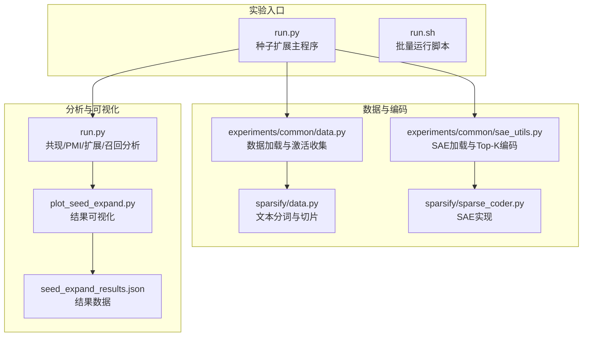
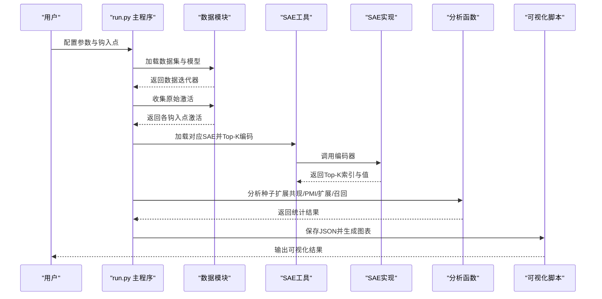
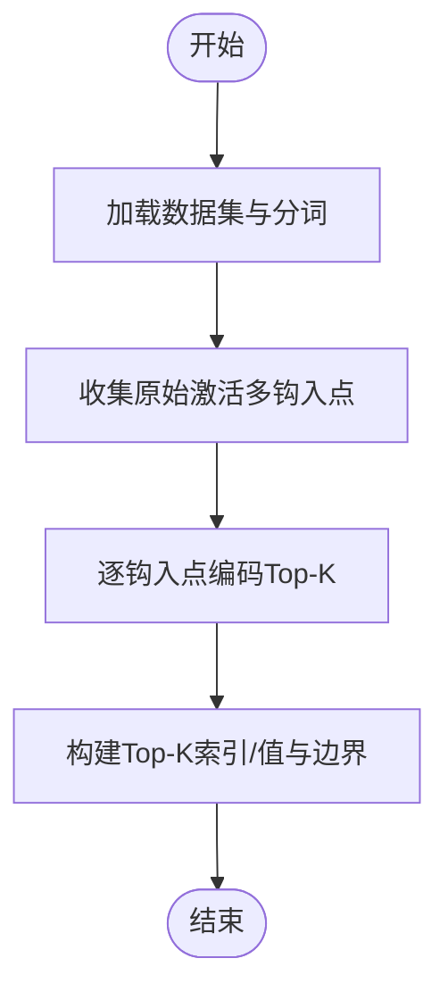
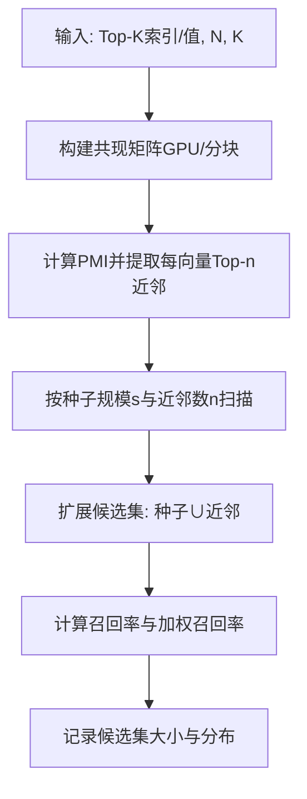
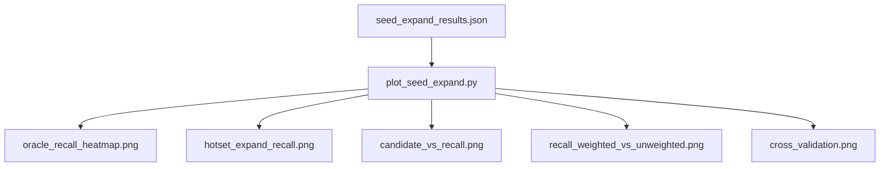
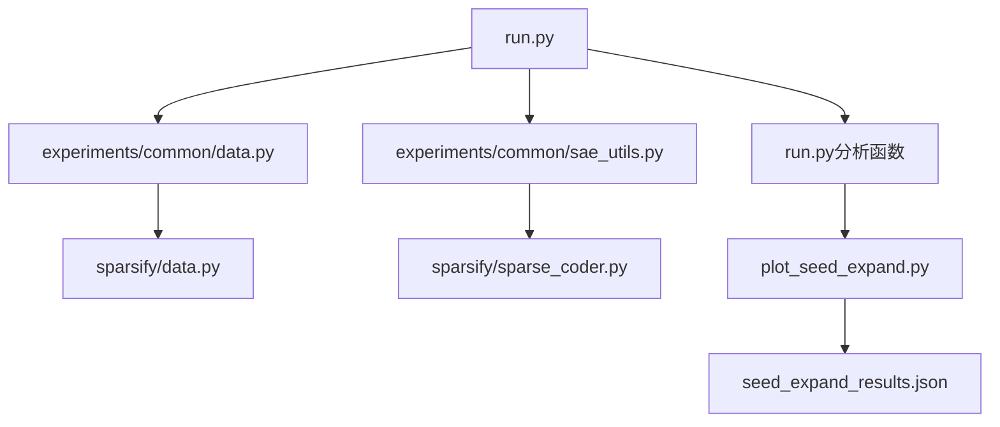

# 种子扩展实验

<cite>
**本文档引用的文件**
- [experiments/activation_patterns/seed_expand/run.py](file://experiments/activation_patterns/seed_expand/run.py)
- [experiments/activation_patterns/seed_expand/run.sh](file://experiments/activation_patterns/seed_expand/run.sh)
- [experiments/activation_patterns/plot_seed_expand.py](file://experiments/activation_patterns/plot_seed_expand.py)
- [results/activation_patterns/seed_expand/seed_expand_results.json](file://results/activation_patterns/seed_expand/seed_expand_results.json)
- [experiments/activation_patterns/hotset/run.py](file://experiments/activation_patterns/hotset/run.py)
- [experiments/common/data.py](file://experiments/common/data.py)
- [experiments/common/sae_utils.py](file://experiments/common/sae_utils.py)
- [sparsify/data.py](file://sparsify/data.py)
- [sparsify/sparse_coder.py](file://sparsify/sparse_coder.py)
- [sparsify/config.py](file://sparsify/config.py)
- [sparsify/trainer.py](file://sparsify/trainer.py)
- [README.md](file://README.md)
- [LUTurbo-doc/experiments/20260316-activation-patterns.md](file://LUTurbo-doc/experiments/20260316-activation-patterns.md)
- [docs/training/qwen3-guide.md](file://docs/training/qwen3-guide.md)
</cite>

## 目录
1. [简介](#简介)
2. [项目结构](#项目结构)
3. [核心组件](#核心组件)
4. [架构概览](#架构概览)
5. [详细组件分析](#详细组件分析)
6. [依赖关系分析](#依赖关系分析)
7. [性能考量](#性能考量)
8. [故障排查指南](#故障排查指南)
9. [结论](#结论)
10. [附录](#附录)

## 简介
本实验围绕"种子扩展"（C1i 上限）展开，旨在评估从少量强激活"种子"出发，利用共激活关系（PMI 近邻）扩展候选集以恢复真实 top-K 的能力。实验通过构建共激活邻接表，对不同种子规模（s）和每种子近邻数（n）进行系统扫描，量化候选集大小与召回率之间的关系，并与热集选择（C1h）组合方案进行对比。该实验为后续在 LUTurbo 推理流水线中设计高效的选择算法提供理论上限与工程启发。

## 项目结构
种子扩展实验位于 experiments/activation_patterns/seed_expand 目录，包含运行脚本、可视化脚本与结果数据。整体流程分为三步：收集激活 → 编码 → 分析（构建共现矩阵、PMI 近邻表、扩展与召回计算）。

**图表来源**
- [experiments/activation_patterns/seed_expand/run.py:476-604](file://experiments/activation_patterns/seed_expand/run.py#L476-L604)
- [experiments/activation_patterns/seed_expand/run.sh:1-43](file://experiments/activation_patterns/seed_expand/run.sh#L1-L43)
- [experiments/common/data.py:44-156](file://experiments/common/data.py#L44-L156)
- [experiments/common/sae_utils.py:15-124](file://experiments/common/sae_utils.py#L15-L124)
- [sparsify/data.py:16-101](file://sparsify/data.py#L16-L101)
- [sparsify/sparse_coder.py:176-186](file://sparsify/sparse_coder.py#L176-L186)
- [experiments/activation_patterns/plot_seed_expand.py:376-399](file://experiments/activation_patterns/plot_seed_expand.py#L376-L399)
- [results/activation_patterns/seed_expand/seed_expand_results.json:1-800](file://results/activation_patterns/seed_expand/seed_expand_results.json#L1-L800)

**章节来源**
- [experiments/activation_patterns/seed_expand/run.py:1-604](file://experiments/activation_patterns/seed_expand/run.py#L1-L604)
- [experiments/activation_patterns/seed_expand/run.sh:1-43](file://experiments/activation_patterns/seed_expand/run.sh#L1-L43)
- [experiments/common/data.py:1-271](file://experiments/common/data.py#L1-L271)
- [experiments/common/sae_utils.py:1-124](file://experiments/common/sae_utils.py#L1-L124)
- [sparsify/data.py:1-158](file://sparsify/data.py#L1-L158)
- [sparsify/sparse_coder.py:1-269](file://sparsify/sparse_coder.py#L1-L269)
- [experiments/activation_patterns/plot_seed_expand.py:1-399](file://experiments/activation_patterns/plot_seed_expand.py#L1-L399)
- [results/activation_patterns/seed_expand/seed_expand_results.json:1-800](file://results/activation_patterns/seed_expand/seed_expand_results.json#L1-L800)

## 核心组件
- 运行主程序：负责设备选择、模型与数据加载、钩入点构建、原始激活收集、SAE 编码、种子扩展分析与结果保存。
- 数据与编码模块：提供数据集自动加载、原始激活收集、SAE 加载与 Top-K 编码。
- 可视化模块：读取 JSON 结果，生成热力图、召回曲线、候选集 vs 召回曲线、加权与未加权召回对比、交叉验证稳定性图。
- 结果数据：包含邻接表统计、Oracle 种子方案、热集+扩展组合方案、交叉验证结果等。

**章节来源**
- [experiments/activation_patterns/seed_expand/run.py:476-604](file://experiments/activation_patterns/seed_expand/run.py#L476-L604)
- [experiments/common/data.py:44-271](file://experiments/common/data.py#L44-L271)
- [experiments/common/sae_utils.py:15-124](file://experiments/common/sae_utils.py#L15-L124)
- [experiments/activation_patterns/plot_seed_expand.py:376-399](file://experiments/activation_patterns/plot_seed_expand.py#L376-L399)
- [results/activation_patterns/seed_expand/seed_expand_results.json:1-800](file://results/activation_patterns/seed_expand/seed_expand_results.json#L1-L800)

## 架构概览
种子扩展实验采用"流式处理 + 离线分析"架构：先流式收集各钩入点的激活，再逐层编码并分析，最后汇总与可视化。

**图表来源**
- [experiments/activation_patterns/seed_expand/run.py:523-567](file://experiments/activation_patterns/seed_expand/run.py#L523-L567)
- [experiments/common/data.py:44-156](file://experiments/common/data.py#L44-L156)
- [experiments/common/sae_utils.py:189-271](file://experiments/common/sae_utils.py#L189-L271)
- [sparsify/sparse_coder.py:176-186](file://sparsify/sparse_coder.py#L176-L186)
- [experiments/activation_patterns/plot_seed_expand.py:376-399](file://experiments/activation_patterns/plot_seed_expand.py#L376-L399)

## 详细组件分析

### 数据采集与编码流程
- 数据加载：支持本地 Arrow/Parquet/HuggingFace 数据集，自动选择最优加载路径。
- 原始激活收集：注册钩子一次性捕获多层激活，按序列边界组织，避免全模型驻留内存。
- SAE 编码：按 LUT 映射加载对应 SparseCoder，分块编码序列，返回 Top-K 索引与值。

**图表来源**
- [experiments/common/data.py:12-42](file://experiments/common/data.py#L12-L42)
- [experiments/common/data.py:44-156](file://experiments/common/data.py#L44-L156)
- [experiments/common/data.py:189-271](file://experiments/common/data.py#L189-L271)
- [sparsify/data.py:16-101](file://sparsify/data.py#L16-L101)

**章节来源**
- [experiments/common/data.py:12-271](file://experiments/common/data.py#L12-L271)
- [sparsify/data.py:16-101](file://sparsify/data.py#L16-L101)
- [experiments/common/sae_utils.py:15-124](file://experiments/common/sae_utils.py#L15-L124)
- [sparsify/sparse_coder.py:176-186](file://sparsify/sparse_coder.py#L176-L186)

### 种子扩展分析算法
- 共现矩阵构建：基于 Top-K 索引统计共现次数，支持 GPU 加速与分块矩阵乘法。
- PMI 近邻表：计算每对基向量的 PMI 值，仅保留正值并按分数排序，形成近邻表。
- 扩展与召回：以种子集合为基础，按近邻表扩展候选集，统计命中真实 Top-K 的比例与加权召回。

**图表来源**
- [experiments/activation_patterns/seed_expand/run.py:36-74](file://experiments/activation_patterns/seed_expand/run.py#L36-L74)
- [experiments/activation_patterns/seed_expand/run.py:76-131](file://experiments/activation_patterns/seed_expand/run.py#L76-L131)
- [experiments/activation_patterns/seed_expand/run.py:133-243](file://experiments/activation_patterns/seed_expand/run.py#L133-L243)

**章节来源**
- [experiments/activation_patterns/seed_expand/run.py:36-243](file://experiments/activation_patterns/seed_expand/run.py#L36-L243)

### 结果可视化与汇总
- 热力图：Oracle 种子方案的召回热力图（s×n 网格）。
- 召回曲线：热集+扩展方案在不同近邻数下的召回曲线。
- 候选集 vs 召回：统一曲线对比 Oracle 与热集+扩展。
- 加权 vs 未加权：热集+扩展在 n=32 时的加权与未加权召回对比。
- 交叉验证：全表与训练集构建表的召回差异，评估近邻表稳定性。

**图表来源**
- [experiments/activation_patterns/plot_seed_expand.py:61-123](file://experiments/activation_patterns/plot_seed_expand.py#L61-L123)
- [experiments/activation_patterns/plot_seed_expand.py:125-179](file://experiments/activation_patterns/plot_seed_expand.py#L125-L179)
- [experiments/activation_patterns/plot_seed_expand.py:181-235](file://experiments/activation_patterns/plot_seed_expand.py#L181-L235)
- [experiments/activation_patterns/plot_seed_expand.py:237-308](file://experiments/activation_patterns/plot_seed_expand.py#L237-L308)
- [experiments/activation_patterns/plot_seed_expand.py:310-374](file://experiments/activation_patterns/plot_seed_expand.py#L310-L374)

**章节来源**
- [experiments/activation_patterns/plot_seed_expand.py:1-399](file://experiments/activation_patterns/plot_seed_expand.py#L1-L399)
- [results/activation_patterns/seed_expand/seed_expand_results.json:1-800](file://results/activation_patterns/seed_expand/seed_expand_results.json#L1-L800)

### 与热集选择（C1h）的组合
- 热集定义：按全局频率选取最活跃的 H%N 基向量作为热集。
- 种子生成：对每个 token，将真实 Top-K 中属于热集的部分作为种子。
- 扩展效果：热集提供大量种子，PMI 近邻表扩展低频部分，显著提升召回。

**章节来源**
- [experiments/activation_patterns/hotset/run.py:33-120](file://experiments/activation_patterns/hotset/run.py#L33-L120)
- [LUTurbo-doc/experiments/20260316-activation-patterns.md:484-517](file://LUTurbo-doc/experiments/20260316-activation-patterns.md#L484-L517)

## 依赖关系分析
- 运行主程序依赖数据模块与 SAE 工具模块，最终调用分析函数与可视化脚本。
- 数据模块依赖分词与数据集工具，编码模块依赖 SAE 实现。
- 可视化脚本依赖结果 JSON 文件。

**图表来源**
- [experiments/activation_patterns/seed_expand/run.py:476-604](file://experiments/activation_patterns/seed_expand/run.py#L476-L604)
- [experiments/common/data.py:12-271](file://experiments/common/data.py#L12-L271)
- [experiments/common/sae_utils.py:15-124](file://experiments/common/sae_utils.py#L15-L124)
- [sparsify/data.py:16-101](file://sparsify/data.py#L16-L101)
- [sparsify/sparse_coder.py:176-186](file://sparsify/sparse_coder.py#L176-L186)
- [experiments/activation_patterns/plot_seed_expand.py:376-399](file://experiments/activation_patterns/plot_seed_expand.py#L376-L399)

**章节来源**
- [experiments/activation_patterns/seed_expand/run.py:476-604](file://experiments/activation_patterns/seed_expand/run.py#L476-L604)
- [experiments/common/data.py:12-271](file://experiments/common/data.py#L12-L271)
- [experiments/common/sae_utils.py:15-124](file://experiments/common/sae_utils.py#L15-L124)
- [sparsify/data.py:16-101](file://sparsify/data.py#L16-L101)
- [sparsify/sparse_coder.py:176-186](file://sparsify/sparse_coder.py#L176-L186)
- [experiments/activation_patterns/plot_seed_expand.py:376-399](file://experiments/activation_patterns/plot_seed_expand.py#L376-L399)

## 性能考量
- GPU 加速：共现矩阵构建与扩展召回计算支持 CUDA 设备，显著降低时间成本。
- 内存管理：采用分块处理与及时释放中间变量，避免 OOM。
- 交叉验证：使用训练/测试集划分评估近邻表稳定性，确保部署时的可靠性。
- 工程折中：n=32 在召回与候选集大小之间取得较好平衡，适合工程落地。

**章节来源**
- [experiments/activation_patterns/seed_expand/run.py:494-499](file://experiments/activation_patterns/seed_expand/run.py#L494-L499)
- [experiments/activation_patterns/seed_expand/run.py:280-299](file://experiments/activation_patterns/seed_expand/run.py#L280-L299)
- [experiments/activation_patterns/seed_expand/run.py:382-424](file://experiments/activation_patterns/seed_expand/run.py#L382-L424)
- [LUTurbo-doc/experiments/20260316-activation-patterns.md:514-517](file://LUTurbo-doc/experiments/20260316-activation-patterns.md#L514-L517)

## 故障排查指南
- 设备选择：若未指定设备，默认使用 CUDA（若可用）或 CPU。
- 模型与数据：确认模型路径、数据集路径与分词器可用。
- 钩入点映射：确保 LUT 层名与模型钩入点映射正确。
- 内存不足：减少 num_samples、seq_len 或 batch_size，或启用 CUDA。
- 结果为空：检查输出目录权限与 JSON 文件完整性。

**章节来源**
- [experiments/activation_patterns/seed_expand/run.py:494-499](file://experiments/activation_patterns/seed_expand/run.py#L494-L499)
- [experiments/activation_patterns/seed_expand/run.py:514-522](file://experiments/activation_patterns/seed_expand/run.py#L514-L522)
- [experiments/activation_patterns/seed_expand/run.py:572-599](file://experiments/activation_patterns/seed_expand/run.py#L572-L599)

## 结论
种子扩展实验表明：独立的 Oracle 种子方案在当前 SAE 激活模式下召回率有限；但与热集选择（C1h）结合后，可在较小候选集预算下显著提升召回，尤其在注意力输出投影（o_proj）层表现突出。近邻表具有高度稳定性，适合离线预计算并在推理阶段直接查询。该实验为设计低开销的选择算法提供了明确的上限与工程启示。

## 附录

### 实验配置与运行指南
- 基本参数
  - 模型路径：--model
  - LUT 目录：--lut_dir
  - 数据集路径：--dataset
  - 样本数：--num_samples
  - 序列长度：--seq_len
  - 层列表：--layers
  - 算子类型：--op_types
  - 批大小：--batch_size
  - 输出目录：--output_dir
  - 设备：--device
- 运行脚本：run.sh 提供一键运行模板，便于批量执行与汇总。

**章节来源**
- [experiments/activation_patterns/seed_expand/run.py:476-499](file://experiments/activation_patterns/seed_expand/run.py#L476-L499)
- [experiments/activation_patterns/seed_expand/run.sh:8-43](file://experiments/activation_patterns/seed_expand/run.sh#L8-L43)

### 结果解读与最佳实践
- Oracle 种子：s=32, n=64 最大召回约 55%，独立方案不可行。
- 热集+扩展：H=20% 时，o_proj 在 12.5%N 候选下可达 88% 召回，n=32 为工程甜点。
- 稳定性：交叉验证 gap 极小，近邻表可离线预计算。
- 优化建议：优先在 o_proj 层采用热集+扩展；MLP/QKV 可尝试扩大热集至 30%N 或探索结构化 SAE。

**章节来源**
- [results/activation_patterns/seed_expand/seed_expand_results.json:1-800](file://results/activation_patterns/seed_expand/seed_expand_results.json#L1-L800)
- [LUTurbo-doc/experiments/20260316-activation-patterns.md:462-517](file://LUTurbo-doc/experiments/20260316-activation-patterns.md#L462-L517)

### 与训练管道的关系
- SAE 训练：通过 Trainer 在模型输入处学习稀疏自编码器，保存检查点并导出 LUT。
- 激活模式：种子扩展实验基于训练好的 SAE 激活，评估选择算法的上限。
- 导出流程：训练 → 阈值统计 → LUT 导出，为推理阶段提供高效近似。

**章节来源**
- [README.md:61-70](file://README.md#L61-L70)
- [sparsify/trainer.py:39-116](file://sparsify/trainer.py#L39-L116)
- [sparsify/config.py:28-149](file://sparsify/config.py#L28-L149)
- [docs/training/qwen3-guide.md:1-78](file://docs/training/qwen3-guide.md#L1-L78)