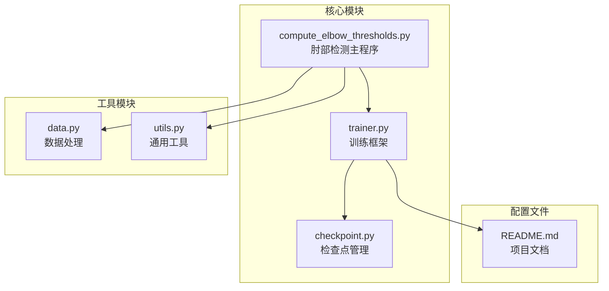
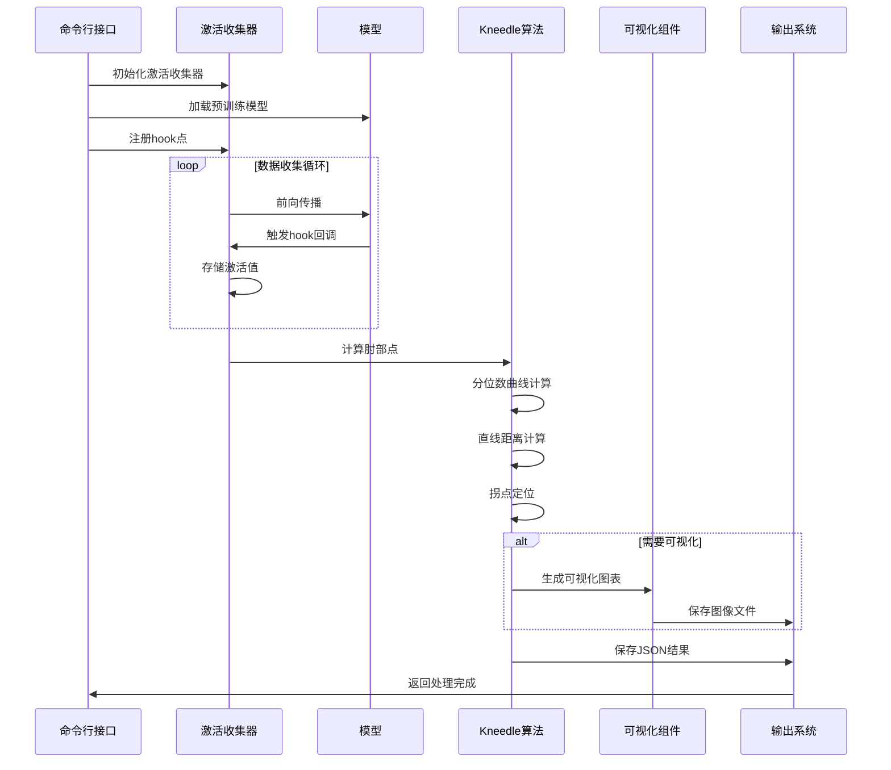
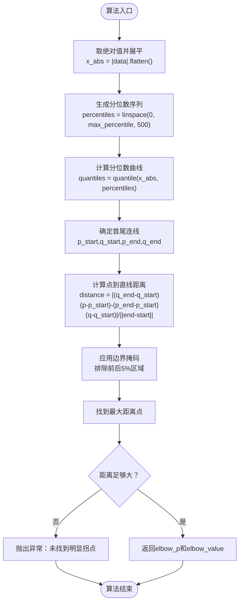
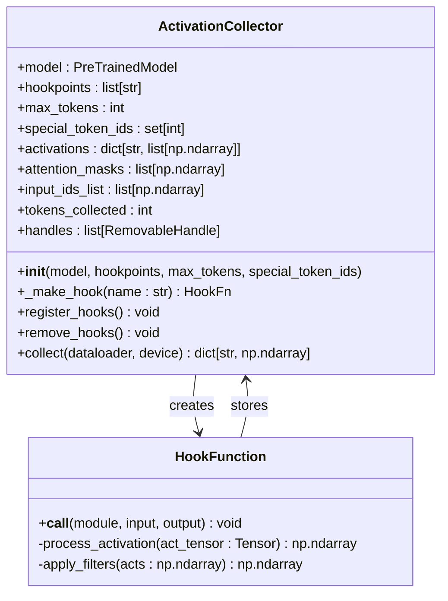
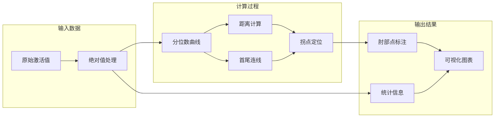
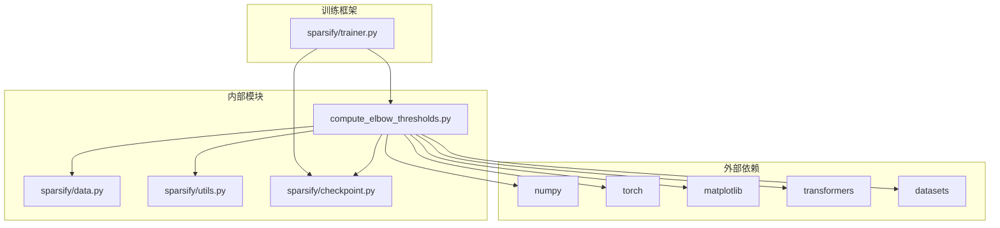

# 肘部检测算法

<cite>
**本文档引用的文件**
- [compute_elbow_thresholds.py](file://compute_elbow_thresholds.py)
- [trainer.py](file://sparsify/trainer.py)
- [checkpoint.py](file://sparsify/checkpoint.py)
- [data.py](file://sparsify/data.py)
- [utils.py](file://sparsify/utils.py)
- [README.md](file://README.md)
</cite>

## 目录
1. [简介](#简介)
2. [项目结构](#项目结构)
3. [核心组件](#核心组件)
4. [架构概览](#架构概览)
5. [详细组件分析](#详细组件分析)
6. [依赖关系分析](#依赖关系分析)
7. [性能考虑](#性能考虑)
8. [故障排除指南](#故障排除指南)
9. [结论](#结论)

## 简介

肘部检测算法是本项目中的关键组件，用于从模型激活值中自动识别最佳阈值。该算法基于Kneedle算法，通过分析激活值的分位数曲线来定位"肘部"点，从而确定合适的稀疏编码阈值。

在LUTurbo推理管道中，肘部检测算法产生的阈值被用于补偿逻辑，帮助优化稀疏自编码器的性能。该算法能够自动处理不同层和操作符的激活模式差异，为每个hookpoint生成相应的阈值。

## 项目结构

该项目采用模块化设计，肘部检测功能主要集中在独立的脚本文件中，同时与训练框架紧密集成：

**图表来源**
- [compute_elbow_thresholds.py:1-660](file://compute_elbow_thresholds.py#L1-L660)
- [trainer.py:1-760](file://sparsify/trainer.py#L1-L760)
- [checkpoint.py:1-302](file://sparsify/checkpoint.py#L1-L302)

**章节来源**
- [README.md:1-154](file://README.md#L1-L154)

## 核心组件

### Kneedle肘部检测算法

肘部检测算法的核心实现基于Kneedle算法，该算法通过以下步骤工作：

1. **激活值预处理**：将多维激活张量展平为一维数组，并取绝对值
2. **分位数曲线计算**：计算从0到max_percentile的分位数点
3. **直线距离计算**：计算每个分位数点到首尾连线的距离
4. **拐点定位**：找到距离最大的点作为肘部点
5. **边界处理**：排除边界区域以避免数值误差

### 激活收集器

ActivationCollector类负责从模型中收集激活值，支持多种数据源和过滤策略：

- **多层激活收集**：支持范围模式匹配多个层
- **特殊token过滤**：自动过滤BOS、EOS、PAD等特殊标记
- **注意力掩码处理**：正确处理填充位置
- **内存优化**：使用bfloat16到float32的转换和CPU内存管理

### 阈值加载系统

训练框架集成了肘部阈值加载功能，支持灵活的匹配策略：

- **直接匹配**：精确的hookpoint名称匹配
- **层号提取**：从复杂路径中提取层号
- **组件映射**：将不同命名约定映射到统一格式

**章节来源**
- [compute_elbow_thresholds.py:35-95](file://compute_elbow_thresholds.py#L35-L95)
- [compute_elbow_thresholds.py:202-361](file://compute_elbow_thresholds.py#L202-L361)
- [checkpoint.py:104-147](file://sparsify/checkpoint.py#L104-L147)

## 架构概览

肘部检测算法在整个系统中的位置和交互关系如下：

**图表来源**
- [compute_elbow_thresholds.py:364-660](file://compute_elbow_thresholds.py#L364-L660)
- [compute_elbow_thresholds.py:172-200](file://compute_elbow_thresholds.py#L172-L200)

## 详细组件分析

### Kneedle算法实现详解

#### 数学原理

Kneedle算法基于几何距离的概念来定位拐点：

1. **分位数曲线构建**：对于激活值x，计算累积分布函数F(x)和对应的分位数p
2. **首尾连线**：连接(p₀, F(x₀))和(p₁, F(x₁))的直线
3. **点到直线距离**：使用点到直线的标准距离公式计算每个分位数点到连线的距离

#### 实现细节

**图表来源**
- [compute_elbow_thresholds.py:49-95](file://compute_elbow_thresholds.py#L49-L95)

#### 参数配置

算法的关键参数及其作用：

| 参数名 | 默认值 | 类型 | 描述 | 影响范围 |
|--------|--------|------|------|----------|
| max_percentile | 0.95 | float | 最大分位数阈值 | 控制计算精度和性能 |
| num_points | 500 | int | 分位数采样点数量 | 直接影响计算复杂度 |
| margin | 0.05 | float | 边界排除比例 | 影响稳定性 |

**章节来源**
- [compute_elbow_thresholds.py:35-95](file://compute_elbow_thresholds.py#L35-L95)

### 激活收集器组件

ActivationCollector类实现了完整的激活值收集流程：

**图表来源**
- [compute_elbow_thresholds.py:202-361](file://compute_elbow_thresholds.py#L202-L361)

#### 数据过滤策略

激活收集器实现了多层次的数据过滤：

1. **注意力掩码过滤**：排除填充位置
2. **特殊token过滤**：过滤BOS、EOS、PAD等标记
3. **内存优化**：bfloat16到float32的类型转换
4. **批量处理**：支持大规模数据集的高效处理

**章节来源**
- [compute_elbow_thresholds.py:202-361](file://compute_elbow_thresholds.py#L202-L361)

### 可视化系统

肘部检测算法提供了完整的可视化功能：

**图表来源**
- [compute_elbow_thresholds.py:98-170](file://compute_elbow_thresholds.py#L98-L170)

**章节来源**
- [compute_elbow_thresholds.py:98-170](file://compute_elbow_thresholds.py#L98-L170)

## 依赖关系分析

肘部检测算法与其他组件的依赖关系：

**图表来源**
- [compute_elbow_thresholds.py:18-30](file://compute_elbow_thresholds.py#L18-L30)
- [trainer.py:21-34](file://sparsify/trainer.py#L21-L34)

**章节来源**
- [compute_elbow_thresholds.py:18-30](file://compute_elbow_thresholds.py#L18-L30)
- [trainer.py:21-34](file://sparsify/trainer.py#L21-L34)

## 性能考虑

### 计算复杂度

肘部检测算法的时间复杂度为O(n)，其中n是分位数采样点的数量（默认500）。空间复杂度主要由以下因素决定：

1. **激活值存储**：取决于收集的激活值大小
2. **分位数数组**：固定大小的500个元素
3. **距离计算**：临时存储每个点的距离值

### 内存优化策略

1. **bfloat16到float32转换**：确保数值精度的同时保持内存效率
2. **CPU内存管理**：将大型张量转移到CPU内存
3. **批处理处理**：分批处理激活值以控制内存使用
4. **并行计算**：使用多进程并行处理多个hookpoint

### 性能调优建议

1. **调整max_percentile**：根据数据分布特性调整计算范围
2. **优化num_points**：平衡计算精度和性能需求
3. **合理设置边界**：避免过度排除有效数据点
4. **并行化处理**：利用多核CPU进行并行计算

## 故障排除指南

### 常见问题及解决方案

#### 问题1：未找到明显拐点

**症状**：算法抛出"未找到明显拐点"异常

**可能原因**：
- 激活值分布过于均匀
- max_percentile设置过小
- 数据质量不佳

**解决方案**：
- 增加max_percentile值
- 检查数据收集过程
- 验证模型权重和配置

#### 问题2：内存不足

**症状**：处理大规模数据时内存溢出

**解决方案**：
- 减少max_tokens参数
- 使用更高效的过滤策略
- 增加系统内存或使用分布式处理

#### 问题3：计算速度慢

**症状**：肘部检测过程耗时过长

**优化方案**：
- 减少num_points数量
- 使用更高效的硬件加速
- 实施数据采样策略

**章节来源**
- [compute_elbow_thresholds.py:70-87](file://compute_elbow_thresholds.py#L70-L87)

### 调试方法

1. **启用详细日志**：查看数据收集和处理过程
2. **检查中间结果**：验证分位数曲线和距离计算
3. **可视化验证**：使用生成的图表确认结果
4. **参数敏感性分析**：测试不同参数组合的影响

## 结论

肘部检测算法为LUTurbo项目提供了自动化的阈值确定能力。通过Kneedle算法的数学原理和精心设计的实现，该算法能够有效地从复杂的激活值分布中识别最佳阈值。

算法的主要优势包括：
- **自动化程度高**：无需手动调参即可获得合理的阈值
- **鲁棒性强**：通过边界处理和异常检测提高稳定性
- **可扩展性好**：支持大规模数据和多层并行处理
- **可视化友好**：提供直观的结果展示和分析工具

未来可以考虑的改进方向：
- 实现自适应参数调整机制
- 增加更多的异常检测和处理策略
- 优化内存使用和计算性能
- 扩展到其他类型的激活值分析