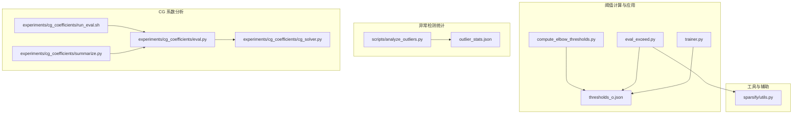
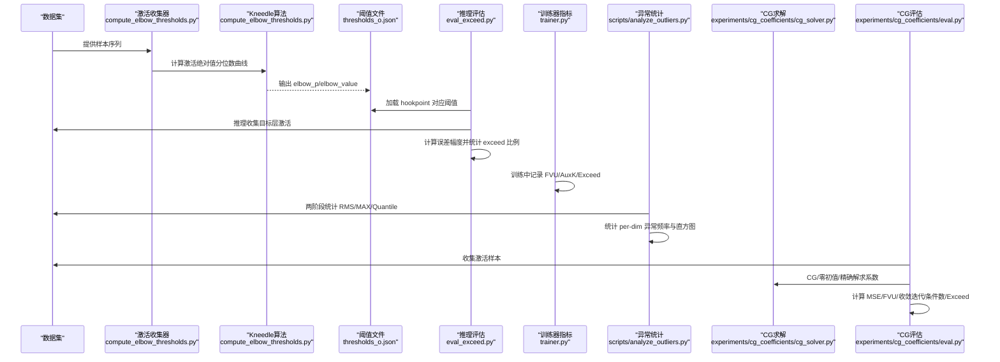
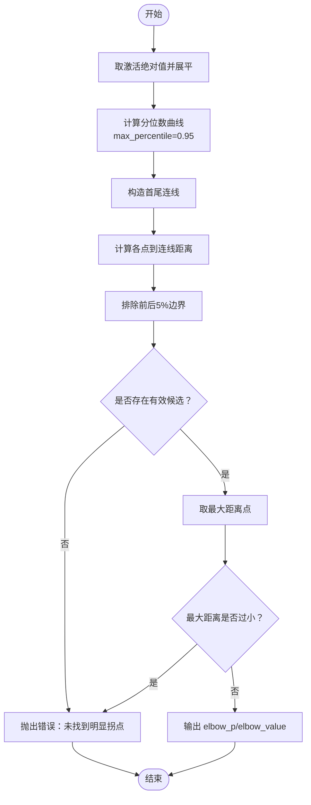
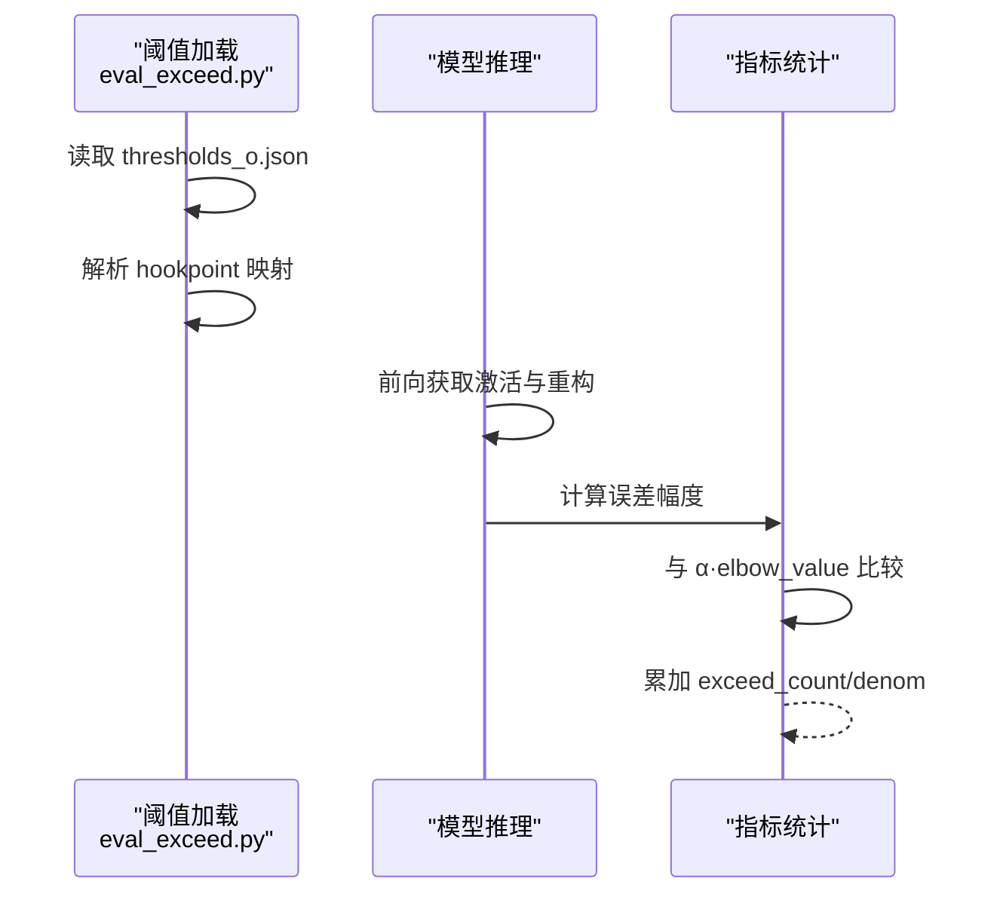
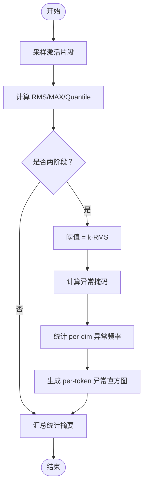
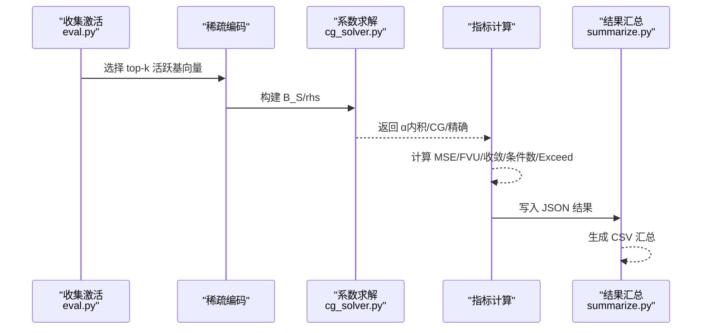
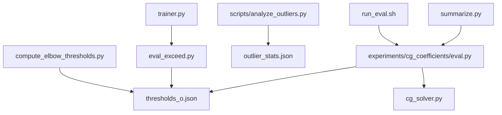

# 阈值统计与指标

<cite>
**本文档引用的文件**
- [compute_elbow_thresholds.py](file://compute_elbow_thresholds.py)
- [outlier_stats.json](file://outlier_stats.json)
- [thresholds_o.json](file://thresholds/Qwen3-4B/thresholds_o.json)
- [analyze_outliers.py](file://scripts/analyze_outliers.py)
- [cg_solver.py](file://experiments/cg_coefficients/cg_solver.py)
- [eval_exceed.py](file://scripts/eval_exceed.py)
- [eval.py](file://experiments/cg_coefficients/eval.py)
- [run_eval.sh](file://experiments/cg_coefficients/run_eval.sh)
- [summarize.py](file://experiments/cg_coefficients/summarize.py)
- [trainer.py](file://sparsify/trainer.py)
- [utils.py](file://sparsify/utils.py)
</cite>

## 目录
1. [简介](#简介)
2. [项目结构](#项目结构)
3. [核心组件](#核心组件)
4. [架构总览](#架构总览)
5. [详细组件分析](#详细组件分析)
6. [依赖关系分析](#依赖关系分析)
7. [性能考量](#性能考量)
8. [故障排查指南](#故障排查指南)
9. [结论](#结论)
10. [附录](#附录)

## 简介
本文件系统化梳理了项目中的阈值统计与性能指标体系，重点覆盖：
- 肘部阈值（Elbow Threshold）的计算方法、统计意义与应用场景
- 异常检测指标（如 FVU、AuxK、Exceed Ratio）的含义、计算方式与解释方法
- CG 系数分析的作用与计算流程
- 统计测试方法、置信区间估计与显著性检验思路
- 阈值质量评估、异常值检测与性能基准测试的实践指南

## 项目结构
围绕阈值统计与性能指标的关键模块与文件如下：
- 阈值计算与可视化：compute_elbow_thresholds.py
- 阈值加载与应用：eval_exceed.py、trainer.py
- 异常检测统计：scripts/analyze_outliers.py、outlier_stats.json
- CG 系数分析：experiments/cg_coefficients/cg_solver.py、eval.py、run_eval.sh、summarize.py
- 工具与辅助：sparsify/utils.py

图表来源
- [compute_elbow_thresholds.py:36-95](file://compute_elbow_thresholds.py#L36-L95)
- [eval_exceed.py:114-156](file://scripts/eval_exceed.py#L114-L156)
- [trainer.py:456-464](file://sparsify/trainer.py#L456-L464)
- [scripts/analyze_outliers.py:300-406](file://scripts/analyze_outliers.py#L300-L406)
- [experiments/cg_coefficients/cg_solver.py:14-108](file://experiments/cg_coefficients/cg_solver.py#L14-L108)
- [experiments/cg_coefficients/eval.py:120-305](file://experiments/cg_coefficients/eval.py#L120-L305)
- [experiments/cg_coefficients/run_eval.sh:33-88](file://experiments/cg_coefficients/run_eval.sh#L33-L88)
- [experiments/cg_coefficients/summarize.py:15-61](file://experiments/cg_coefficients/summarize.py#L15-L61)
- [sparsify/utils.py:82-105](file://sparsify/utils.py#L82-L105)

章节来源
- [compute_elbow_thresholds.py:364-659](file://compute_elbow_thresholds.py#L364-L659)
- [scripts/analyze_outliers.py:279-489](file://scripts/analyze_outliers.py#L279-L489)
- [experiments/cg_coefficients/eval.py:398-649](file://experiments/cg_coefficients/eval.py#L398-L649)

## 核心组件
- 肘部阈值计算与可视化：基于 Kneedle 算法，从激活值绝对值的分位数曲线中识别拐点，输出 elbow_p 与 elbow_value，并可生成可视化图谱。
- 阈值加载与应用：在推理阶段按 hookpoint 加载对应 elbow_value，结合 alpha 倍数计算异常阈值，统计 exceed 比例。
- 异常检测统计：通过两阶段统计（均方根 RMS、最大值 MAX、分位数 q0.995 等）与异常掩码统计，输出 per-dimension 的异常频率与直方图。
- CG 系数分析：以 Conjugate Gradient 解最优系数，对比内积解、零初值 CG、精确最小二乘解，计算 MSE、FVU、收敛迭代次数与条件数，并统计不同 τ 的 exceed 比例。
- 工具与辅助：提供层索引解析、部分前向、维度探测等实用工具，支撑高效评估与调试。

章节来源
- [compute_elbow_thresholds.py:36-95](file://compute_elbow_thresholds.py#L36-L95)
- [eval_exceed.py:114-156](file://scripts/eval_exceed.py#L114-L156)
- [scripts/analyze_outliers.py:300-406](file://scripts/analyze_outliers.py#L300-L406)
- [experiments/cg_coefficients/cg_solver.py:14-108](file://experiments/cg_coefficients/cg_solver.py#L14-L108)
- [experiments/cg_coefficients/eval.py:120-305](file://experiments/cg_coefficients/eval.py#L120-L305)
- [sparsify/utils.py:82-105](file://sparsify/utils.py#L82-L105)

## 架构总览
下图展示了从“阈值计算”到“性能指标评估”的整体流程，涵盖异常检测与 CG 分析两条主线。

图表来源
- [compute_elbow_thresholds.py:364-659](file://compute_elbow_thresholds.py#L364-L659)
- [eval_exceed.py:266-572](file://scripts/eval_exceed.py#L266-L572)
- [scripts/analyze_outliers.py:279-489](file://scripts/analyze_outliers.py#L279-L489)
- [experiments/cg_coefficients/cg_solver.py:14-108](file://experiments/cg_coefficients/cg_solver.py#L14-L108)
- [experiments/cg_coefficients/eval.py:120-305](file://experiments/cg_coefficients/eval.py#L120-L305)

## 详细组件分析

### 肘部阈值计算与统计意义
- 计算方法
  - 输入：模型某层激活张量（绝对值展开），设定最大分位数 max_percentile（如 0.95）
  - 步骤：计算绝对值的分位数曲线；构造首尾连线；对曲线上每一点计算其到连线的距离；在中间区域（排除前后 5% 边界）寻找最大距离点；若最大距离过小则判定无明显拐点
  - 输出：elbow_p（拐点对应的分位数）、elbow_value（该分位数处的激活值）
- 统计意义
  - elbow_p 表征“异常值占比”的近似位置；elbow_value 作为阈值基线，结合 alpha 倍数形成最终异常阈值
- 应用场景
  - 作为异常检测阈值的基础；在推理阶段按 hookpoint 加载对应 elbow_value，结合 alpha 倍数计算 exceed 比例，衡量重建误差超过阈值的比例
- 可视化
  - 绘制分位数曲线与首尾连线，标注 elbow 点，并叠加统计摘要与保存图像

图表来源
- [compute_elbow_thresholds.py:36-95](file://compute_elbow_thresholds.py#L36-L95)
- [compute_elbow_thresholds.py:98-170](file://compute_elbow_thresholds.py#L98-L170)

章节来源
- [compute_elbow_thresholds.py:36-95](file://compute_elbow_thresholds.py#L36-L95)
- [compute_elbow_thresholds.py:98-170](file://compute_elbow_thresholds.py#L98-L170)
- [thresholds/Qwen3-4B/thresholds_o.json:1-146](file://thresholds/Qwen3-4B/thresholds_o.json#L1-L146)

### 阈值加载与应用（推理阶段）
- 加载策略
  - 从 JSON 文件读取各 hookpoint 的 elbow_value；支持多种键名映射（如 layers.x.self_attn.o_proj → layer_x/self_attn_o_proj）
- 应用方式
  - 在推理时，对误差幅度 |target - reconstruction| 超过 α·elbow_value 的比例进行统计，得到 exceed_ratio
- 关键实现要点
  - 支持 Hadamard 旋转与异常裁剪场景下的原始空间重建，确保 exceed 计算在未旋转/未裁剪的原始域进行

图表来源
- [eval_exceed.py:114-156](file://scripts/eval_exceed.py#L114-L156)
- [eval_exceed.py:449-478](file://scripts/eval_exceed.py#L449-L478)

章节来源
- [eval_exceed.py:114-156](file://scripts/eval_exceed.py#L114-L156)
- [eval_exceed.py:449-478](file://scripts/eval_exceed.py#L449-L478)
- [sparsify/trainer.py:456-464](file://sparsify/trainer.py#L456-L464)

### 异常检测指标与统计方法
- 指标定义
  - RMS（均方根）：每维激活的均方根统计
  - MAX（最大值）：每维激活的最大值统计
  - 分位数（如 q0.995）：每维激活在高分位处的统计
  - Top-K：按 RMS/MAX/分位数排序的前 K 维
  - 异常频率（per-dim）：每维超出阈值的比例
- 统计方法
  - 两阶段统计：第一阶段采样并计算 RMS/MAX/分位数；第二阶段以 k·RMS 作为阈值，统计异常掩码并汇总 per-dim 频率与直方图
  - 支持按维度保存详细统计，便于后续分析与可视化

图表来源
- [scripts/analyze_outliers.py:300-406](file://scripts/analyze_outliers.py#L300-L406)
- [scripts/analyze_outliers.py:158-238](file://scripts/analyze_outliers.py#L158-L238)

章节来源
- [scripts/analyze_outliers.py:300-406](file://scripts/analyze_outliers.py#L300-L406)
- [scripts/analyze_outliers.py:158-238](file://scripts/analyze_outliers.py#L158-L238)
- [outlier_stats.json:1-800](file://outlier_stats.json#L1-L800)

### CG 系数分析与性能指标
- 目标
  - 评估不同系数求解策略（内积解、CG（编码器初值/零初值）、精确最小二乘）在 MSE、FVU、收敛迭代次数、条件数与 exceed 比例上的差异
- 方法
  - 选择活跃基向量 B_S，构建目标向量 rhs，分别求解最优系数 α
  - 计算重构误差，统计 SSE 并归一化为 MSE 与 FVU
  - 记录 CG 收敛残差历史、中位条件数与不同 τ 的 exceed 比例
- 实验流程
  - run_eval.sh 遍历多层与多个算子，批量运行 eval.py，随后 summarize.py 导出 CSV 汇总

图表来源
- [experiments/cg_coefficients/eval.py:120-305](file://experiments/cg_coefficients/eval.py#L120-L305)
- [experiments/cg_coefficients/cg_solver.py:14-108](file://experiments/cg_coefficients/cg_solver.py#L14-L108)
- [experiments/cg_coefficients/run_eval.sh:33-88](file://experiments/cg_coefficients/run_eval.sh#L33-L88)
- [experiments/cg_coefficients/summarize.py:15-61](file://experiments/cg_coefficients/summarize.py#L15-L61)

章节来源
- [experiments/cg_coefficients/eval.py:120-305](file://experiments/cg_coefficients/eval.py#L120-L305)
- [experiments/cg_coefficients/cg_solver.py:14-108](file://experiments/cg_coefficients/cg_solver.py#L14-L108)
- [experiments/cg_coefficients/run_eval.sh:33-88](file://experiments/cg_coefficients/run_eval.sh#L33-L88)
- [experiments/cg_coefficients/summarize.py:15-61](file://experiments/cg_coefficients/summarize.py#L15-L61)

### 性能指标详解
- FVU（Fraction of Variance Unexplained）
  - 定义：SSE / 总方差，衡量重构误差占总体方差的比例
  - 计算：SSE 累加后除以全局方差（基于 sum(x^2) - n·mean^2）
  - 用途：评估模型拟合程度，越低越好
- AuxK（辅助损失）
  - 定义：训练中引入的辅助项，通常与稀疏度或重构一致性相关
  - 计算：在训练器中以权重 α 乘以 AuxK 损失加入总损失
  - 用途：平衡主损失与稀疏约束，提升泛化与稳定性
- Exceed Ratio（超过阈值比例）
  - 定义：误差幅度超过 α·elbow_value 的比例
  - 计算：对每样本逐元素比较，统计超阈值元素数与总元素数
  - 用途：衡量异常检测阈值的有效性与鲁棒性

章节来源
- [experiments/cg_coefficients/eval.py:229-305](file://experiments/cg_coefficients/eval.py#L229-L305)
- [sparsify/trainer.py:478-478](file://sparsify/trainer.py#L478-L478)

## 依赖关系分析
- 阈值计算依赖于激活收集与 Kneedle 算法，输出 JSON 文件供推理与评估使用
- 推理评估依赖阈值文件与模型前向，计算 exceed 比例并与训练器指标联动
- 异常统计独立于阈值，但可与阈值配合进行异常频率分析
- CG 分析独立于阈值，但可使用阈值进行 exceed 比例对比，同时提供 MSE/FVU/收敛诊断

图表来源
- [compute_elbow_thresholds.py:614-652](file://compute_elbow_thresholds.py#L614-L652)
- [eval_exceed.py:286-289](file://scripts/eval_exceed.py#L286-L289)
- [scripts/analyze_outliers.py:408-411](file://scripts/analyze_outliers.py#L408-L411)
- [experiments/cg_coefficients/eval.py:468-482](file://experiments/cg_coefficients/eval.py#L468-L482)
- [experiments/cg_coefficients/run_eval.sh:33-88](file://experiments/cg_coefficients/run_eval.sh#L33-L88)
- [experiments/cg_coefficients/summarize.py:64-101](file://experiments/cg_coefficients/summarize.py#L64-L101)

章节来源
- [compute_elbow_thresholds.py:614-652](file://compute_elbow_thresholds.py#L614-L652)
- [eval_exceed.py:286-289](file://scripts/eval_exceed.py#L286-L289)
- [scripts/analyze_outliers.py:408-411](file://scripts/analyze_outliers.py#L408-L411)
- [experiments/cg_coefficients/eval.py:468-482](file://experiments/cg_coefficients/eval.py#L468-L482)
- [experiments/cg_coefficients/run_eval.sh:33-88](file://experiments/cg_coefficients/run_eval.sh#L33-L88)
- [experiments/cg_coefficients/summarize.py:64-101](file://experiments/cg_coefficients/summarize.py#L64-L101)

## 性能考量
- 并行与内存
  - 阈值计算采用多进程并行处理不同 hookpoint，减少等待时间
  - 异常统计在第一阶段仅采样，第二阶段以 k·RMS 作为阈值，避免重复计算
- 数值稳定
  - CG 求解统一在 float32 下进行，提高数值稳定性
  - FVU 计算使用稳定的全局方差公式，避免数值漂移
- 计算效率
  - 部分前向（partial forward）仅运行至所需层，减少不必要的计算
  - 两阶段统计先采样再统计，兼顾精度与速度

[本节为通用指导，无需特定文件来源]

## 故障排查指南
- 肘部阈值检测失败
  - 现象：报错提示“未找到明显拐点”或“没有有效的拐点候选”
  - 原因：数据分布过于平坦或极端值过多导致拐点不明显
  - 处理：调整 max_percentile（如增大上限分位）、检查激活数据质量、确认是否需要过滤特殊 token
- 推理阶段 exceed 比例异常
  - 现象：exceed_ratio 过高或过低
  - 原因：阈值设置不当（α 过小/过大）、Hadamard 旋转或异常裁剪影响
  - 处理：核对 elbow_value 与 α 的组合；确认是否启用旋转/裁剪；必要时重新计算阈值
- CG 收敛问题
  - 现象：CG 与精确解差距较大
  - 原因：CG 迭代次数不足、条件数过高
  - 处理：增加 cg_max_iter；检查基向量正交性；考虑预处理或正则化

章节来源
- [compute_elbow_thresholds.py:70-87](file://compute_elbow_thresholds.py#L70-L87)
- [experiments/cg_coefficients/eval.py:587-614](file://experiments/cg_coefficients/eval.py#L587-L614)

## 结论
本文件系统梳理了阈值统计与性能指标在项目中的实现与应用，涵盖肘部阈值计算、异常检测指标、CG 系数分析与基准测试流程。通过阈值文件与推理评估，可以量化异常检测效果；通过 CG 分析，可以评估不同求解策略的性能与收敛特性。建议在实际部署中结合具体任务与数据分布，动态调整阈值与评估参数，持续监控 FVU、AuxK 与 exceed 比例，以获得更稳健的性能表现。

[本节为总结性内容，无需特定文件来源]

## 附录

### 统计测试与显著性检验思路
- 置信区间估计
  - 对 exceed 比例，可在样本层面使用二项分布近似正态分布，计算 95% 置信区间
  - 对 MSE/FVU，可基于样本方差估计标准误，构建均值的置信区间
- 显著性检验
  - 比较不同阈值（α）或不同求解策略（内积/CG/精确）的 exceed 比例差异，可采用卡方检验或 Fisher 精确检验
  - 比较 MSE/FVU 的差异，可采用配对 t 检验（假设正态性）或非参数检验（如 Wilcoxon 符号秩检验）

[本节为概念性指导，无需特定文件来源]