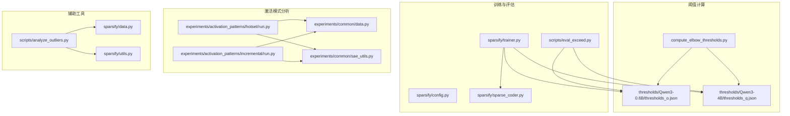
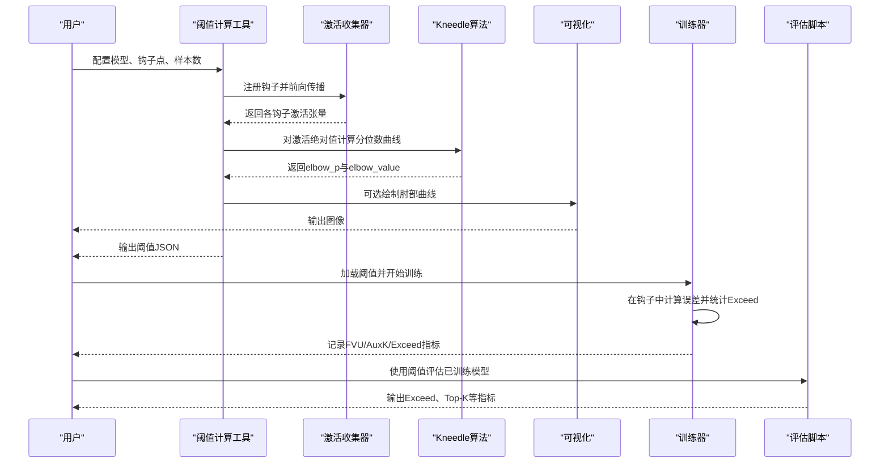
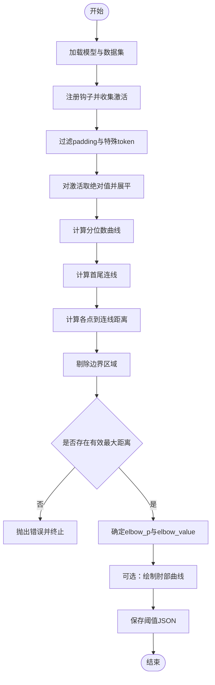
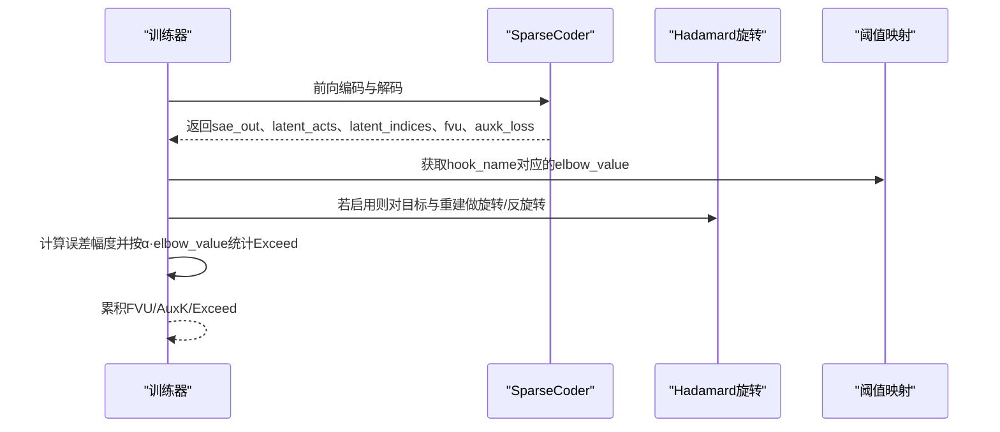
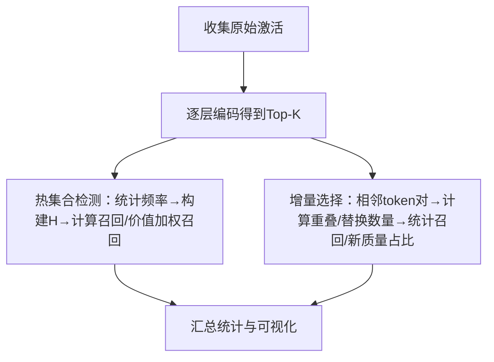
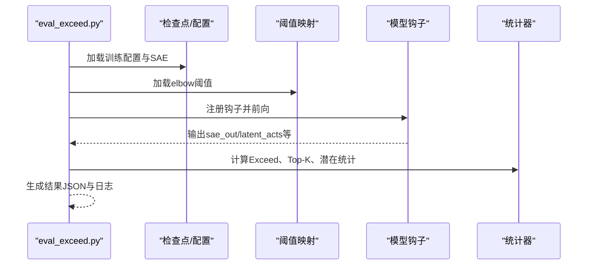
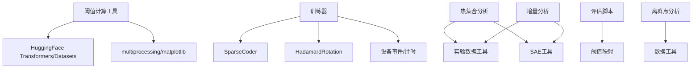

# 阈值计算

<cite>
**本文引用的文件**
- [compute_elbow_thresholds.py](file://compute_elbow_thresholds.py)
- [sparsify/trainer.py](file://sparsify/trainer.py)
- [sparsify/sparse_coder.py](file://sparsify/sparse_coder.py)
- [sparsify/config.py](file://sparsify/config.py)
- [sparsify/data.py](file://sparsify/data.py)
- [sparsify/utils.py](file://sparsify/utils.py)
- [experiments/activation_patterns/hotset/run.py](file://experiments/activation_patterns/hotset/run.py)
- [experiments/activation_patterns/incremental/run.py](file://experiments/activation_patterns/incremental/run.py)
- [experiments/common/data.py](file://experiments/common/data.py)
- [experiments/common/sae_utils.py](file://experiments/common/sae_utils.py)
- [scripts/analyze_outliers.py](file://scripts/analyze_outliers.py)
- [scripts/eval_exceed.py](file://scripts/eval_exceed.py)
- [thresholds/Qwen3-0.6B/thresholds_o.json](file://thresholds/Qwen3-0.6B/thresholds_o.json)
- [thresholds/Qwen3-4B/thresholds_q.json](file://thresholds/Qwen3-4B/thresholds_q.json)
</cite>

## 目录
1. [简介](#简介)
2. [项目结构](#项目结构)
3. [核心组件](#核心组件)
4. [架构总览](#架构总览)
5. [详细组件分析](#详细组件分析)
6. [依赖关系分析](#依赖关系分析)
7. [性能考量](#性能考量)
8. [故障排查指南](#故障排查指南)
9. [结论](#结论)
10. [附录](#附录)

## 简介
本文件系统化阐述阈值计算系统的设计与实现，覆盖以下主题：
- 肘部阈值的理论基础与Kneedle算法实现
- 激活模式分析（热集合检测、增量选择）
- 增量训练策略与异常检测指标（FVU、AuxK、Exceed）
- 阈值计算工具的使用方法、参数配置与输出格式
- 实验结果分析、可视化工具与性能基准测试
- 具体使用案例与调试指导

## 项目结构
该仓库围绕“稀疏自编码器（SAE）+ 阈值计算 + 激活模式分析 + 异常检测”构建了完整的流水线。关键模块包括：
- 阈值计算工具：基于Kneedle算法从模型激活中提取肘部阈值
- 训练与评估：在训练过程中结合肘部阈值进行异常检测（Exceed），并产出FVU与AuxK指标
- 激活模式分析：热集合检测（Hotset）与增量选择（Incremental）两类上界基线
- 结果与可视化：阈值文件、实验结果JSON、绘图脚本

**图表来源**
- [compute_elbow_thresholds.py:1-660](file://compute_elbow_thresholds.py#L1-L660)
- [sparsify/trainer.py:1-760](file://sparsify/trainer.py#L1-L760)
- [sparsify/sparse_coder.py:1-269](file://sparsify/sparse_coder.py#L1-L269)
- [sparsify/config.py:1-149](file://sparsify/config.py#L1-L149)
- [experiments/activation_patterns/hotset/run.py:1-301](file://experiments/activation_patterns/hotset/run.py#L1-L301)
- [experiments/activation_patterns/incremental/run.py:1-510](file://experiments/activation_patterns/incremental/run.py#L1-L510)
- [experiments/common/data.py:1-271](file://experiments/common/data.py#L1-L271)
- [experiments/common/sae_utils.py:1-124](file://experiments/common/sae_utils.py#L1-L124)
- [scripts/analyze_outliers.py:1-489](file://scripts/analyze_outliers.py#L1-L489)
- [scripts/eval_exceed.py:1-573](file://scripts/eval_exceed.py#L1-L573)

**章节来源**
- [compute_elbow_thresholds.py:1-660](file://compute_elbow_thresholds.py#L1-L660)
- [sparsify/trainer.py:1-760](file://sparsify/trainer.py#L1-L760)
- [sparsify/config.py:1-149](file://sparsify/config.py#L1-L149)

## 核心组件
- 阈值计算工具：通过Kneedle算法拟合激活绝对值的分位数曲线，识别显著偏离首尾连线的拐点，输出elbow_p与elbow_value，并可选生成可视化图谱。
- 训练器：在训练钩子中计算重建误差，按α·elbow_value阈值统计“超出”比例（Exceed），同时记录FVU与AuxK损失。
- 激活模式分析：热集合检测（Hotset）与增量选择（Incremental）两类上界基线，用于评估不同选择策略的召回与质量加权召回。
- 异常检测与可视化：提供两阶段评估脚本与离群点分析脚本，支持RMS、最大值、分位数统计与直方图/散点图可视化。

**章节来源**
- [compute_elbow_thresholds.py:35-95](file://compute_elbow_thresholds.py#L35-L95)
- [sparsify/trainer.py:428-476](file://sparsify/trainer.py#L428-L476)
- [sparsify/sparse_coder.py:20-34](file://sparsify/sparse_coder.py#L20-L34)
- [experiments/activation_patterns/hotset/run.py:33-119](file://experiments/activation_patterns/hotset/run.py#L33-L119)
- [experiments/activation_patterns/incremental/run.py:225-312](file://experiments/activation_patterns/incremental/run.py#L225-L312)
- [scripts/analyze_outliers.py:158-238](file://scripts/analyze_outliers.py#L158-L238)

## 架构总览
阈值计算系统贯穿数据采集、阈值计算、训练评估与分析实验四个阶段，形成闭环：

**图表来源**
- [compute_elbow_thresholds.py:202-361](file://compute_elbow_thresholds.py#L202-L361)
- [compute_elbow_thresholds.py:35-95](file://compute_elbow_thresholds.py#L35-L95)
- [compute_elbow_thresholds.py:98-170](file://compute_elbow_thresholds.py#L98-L170)
- [sparsify/trainer.py:428-476](file://sparsify/trainer.py#L428-L476)
- [scripts/eval_exceed.py:266-573](file://scripts/eval_exceed.py#L266-L573)

## 详细组件分析

### 阈值计算工具（Kneedle算法）
- 输入：模型、数据集、钩子点列表、目标token数、最大百分位等
- 处理流程：
  - 收集激活：注册钩子，遍历数据加载器，合并各层激活并过滤padding与特殊token
  - 分位数曲线：对激活绝对值展平，计算0到max_percentile的分位数序列
  - Kneedle：计算每个分位点到首尾连线的距离，剔除边界后取最大距离对应的拐点
  - 可视化：绘制分位数曲线与首尾连线，标注elbow点
  - 并行：多进程并行计算各钩子点的elbow
- 输出：JSON文件，键为“layer_i/op”，值为elbow_p与elbow_value

**图表来源**
- [compute_elbow_thresholds.py:202-361](file://compute_elbow_thresholds.py#L202-L361)
- [compute_elbow_thresholds.py:35-95](file://compute_elbow_thresholds.py#L35-L95)
- [compute_elbow_thresholds.py:98-170](file://compute_elbow_thresholds.py#L98-L170)

**章节来源**
- [compute_elbow_thresholds.py:35-95](file://compute_elbow_thresholds.py#L35-L95)
- [compute_elbow_thresholds.py:98-170](file://compute_elbow_thresholds.py#L98-L170)
- [compute_elbow_thresholds.py:172-200](file://compute_elbow_thresholds.py#L172-L200)
- [compute_elbow_thresholds.py:364-656](file://compute_elbow_thresholds.py#L364-L656)

### 训练器中的阈值使用与异常检测
- 阈值加载：训练配置支持elbow_threshold_path，训练器启动时加载阈值映射
- 指标计算：
  - FVU：重构误差平方和与总体方差的比值
  - AuxK：对“死亡特征”进行第二解码以鼓励预测残差
  - Exceed：在Hadarmard旋转场景下，使用原始空间的目标与重建计算误差幅度，按α·elbow_value阈值统计超出比例
- 关键实现位置：
  - 指标累积与阈值应用：[sparsify/trainer.py:428-476](file://sparsify/trainer.py#L428-L476)
  - FVU/AuxK计算与Forward输出：[sparsify/sparse_coder.py:20-34](file://sparsify/sparse_coder.py#L20-L34)

**图表来源**
- [sparsify/trainer.py:428-476](file://sparsify/trainer.py#L428-L476)
- [sparsify/sparse_coder.py:20-34](file://sparsify/sparse_coder.py#L20-L34)

**章节来源**
- [sparsify/trainer.py:145-149](file://sparsify/trainer.py#L145-L149)
- [sparsify/trainer.py:428-476](file://sparsify/trainer.py#L428-L476)
- [sparsify/sparse_coder.py:20-34](file://sparsify/sparse_coder.py#L20-L34)
- [sparsify/config.py:53-58](file://sparsify/config.py#L53-L58)

### 激活模式分析（热集合检测与增量选择）
- 热集合检测（Hotset）：
  - 思路：统计全局最频繁的basis向量构成“热集合”，评估其对每token的Top-K选择的召回与价值加权召回
  - 指标：不同热集合比例下的均值、分位数、热值占比、残余搜索空间等
- 增量选择（Incremental）：
  - 思路：对相邻token对(t, t+1)，模拟保留t的Top-K并在t+1中以oracle方式替换m个位置，统计召回与新质量占比
  - 指标：不同m下的均值、P90/P99、burstiness（连续替换超过阈值的片段）

**图表来源**
- [experiments/activation_patterns/hotset/run.py:33-119](file://experiments/activation_patterns/hotset/run.py#L33-L119)
- [experiments/activation_patterns/incremental/run.py:225-312](file://experiments/activation_patterns/incremental/run.py#L225-L312)
- [experiments/common/data.py:44-156](file://experiments/common/data.py#L44-L156)
- [experiments/common/sae_utils.py:105-124](file://experiments/common/sae_utils.py#L105-L124)

**章节来源**
- [experiments/activation_patterns/hotset/run.py:33-119](file://experiments/activation_patterns/hotset/run.py#L33-L119)
- [experiments/activation_patterns/incremental/run.py:225-312](file://experiments/activation_patterns/incremental/run.py#L225-L312)
- [experiments/common/data.py:44-156](file://experiments/common/data.py#L44-L156)
- [experiments/common/sae_utils.py:105-124](file://experiments/common/sae_utils.py#L105-L124)

### 异常检测与可视化工具
- 两阶段评估脚本：
  - 加载训练配置与阈值映射，注册钩子，计算Exceed、Top-K统计
  - 支持Hadarmard旋转与离群点裁剪（OutlierClipper）场景
- 离群点分析脚本：
  - 两轮统计：先统计RMS/最大值/分位数，再以k·RMS阈值进行二次统计，输出离群比例、每token离群histogram等

**图表来源**
- [scripts/eval_exceed.py:266-573](file://scripts/eval_exceed.py#L266-L573)
- [scripts/analyze_outliers.py:158-238](file://scripts/analyze_outliers.py#L158-L238)

**章节来源**
- [scripts/eval_exceed.py:114-156](file://scripts/eval_exceed.py#L114-L156)
- [scripts/eval_exceed.py:366-478](file://scripts/eval_exceed.py#L366-L478)
- [scripts/analyze_outliers.py:158-238](file://scripts/analyze_outliers.py#L158-L238)

## 依赖关系分析
- 阈值计算依赖：
  - 模型与数据加载：AutoModel/AutoTokenizer、MemmapDataset、HuggingFace datasets
  - 并发与可视化：multiprocessing、matplotlib
- 训练器依赖：
  - SAE实现、Hadamard旋转、设备事件计时、分布式同步
- 激活模式分析依赖：
  - 实验公共模块（数据收集、SAE加载与编码）
- 异常检测依赖：
  - 评估脚本与离群点分析脚本共享钩子注册与统计逻辑

**图表来源**
- [compute_elbow_thresholds.py:11-31](file://compute_elbow_thresholds.py#L11-L31)
- [sparsify/trainer.py:21-34](file://sparsify/trainer.py#L21-L34)
- [experiments/common/data.py:1-271](file://experiments/common/data.py#L1-L271)
- [experiments/common/sae_utils.py:1-124](file://experiments/common/sae_utils.py#L1-L124)
- [scripts/eval_exceed.py:1-573](file://scripts/eval_exceed.py#L1-L573)
- [scripts/analyze_outliers.py:1-489](file://scripts/analyze_outliers.py#L1-L489)

**章节来源**
- [compute_elbow_thresholds.py:11-31](file://compute_elbow_thresholds.py#L11-L31)
- [sparsify/trainer.py:21-34](file://sparsify/trainer.py#L21-L34)
- [experiments/common/data.py:1-271](file://experiments/common/data.py#L1-L271)
- [experiments/common/sae_utils.py:1-124](file://experiments/common/sae_utils.py#L1-L124)
- [scripts/eval_exceed.py:1-573](file://scripts/eval_exceed.py#L1-L573)
- [scripts/analyze_outliers.py:1-489](file://scripts/analyze_outliers.py#L1-L489)

## 性能考量
- 并行与内存：
  - 阈值计算采用多进程并行处理各钩子点，减少单核瓶颈；激活收集阶段对张量进行CPU侧拼接，注意内存峰值
- 计算效率：
  - 训练器在钩子中延迟聚合指标，减少通信开销；对Hadarmard旋转场景，预计算原始目标以避免重复反变换
- I/O与缓存：
  - MemmapDataset与chunk_and_tokenize提升大规模数据加载效率；阈值与结果JSON便于复用与对比

[本节为通用性能建议，无需特定文件引用]

## 故障排查指南
- 阈值计算失败：
  - 现象：Kneedle检测失败或未找到明显拐点
  - 排查：检查max_percentile设置、数据分布是否过于集中或噪声过低；确认激活收集是否正确过滤padding与特殊token
  - 参考：[compute_elbow_thresholds.py:70-87](file://compute_elbow_thresholds.py#L70-L87)
- 训练阶段Exceed为零或异常：
  - 现象：Exceed比例异常
  - 排查：确认elbow_threshold_path正确加载；检查是否启用Hadamard旋转且阈值与空间匹配；核对alpha系数
  - 参考：[sparsify/trainer.py:428-476](file://sparsify/trainer.py#L428-L476)
- 激活模式分析结果为空：
  - 现象：热集合/增量分析无输出
  - 排查：确认SAE加载成功、Top-K编码正常；检查序列边界与掩码
  - 参考：[experiments/common/data.py:189-271](file://experiments/common/data.py#L189-L271)
- 可视化缺失：
  - 现象：matplotlib不可用导致绘图失败
  - 排查：安装matplotlib或禁用绘图功能
  - 参考：[scripts/analyze_outliers.py:20-29](file://scripts/analyze_outliers.py#L20-L29)

**章节来源**
- [compute_elbow_thresholds.py:70-87](file://compute_elbow_thresholds.py#L70-L87)
- [sparsify/trainer.py:428-476](file://sparsify/trainer.py#L428-L476)
- [experiments/common/data.py:189-271](file://experiments/common/data.py#L189-L271)
- [scripts/analyze_outliers.py:20-29](file://scripts/analyze_outliers.py#L20-L29)

## 结论
阈值计算系统以Kneedle算法为核心，结合训练期Exceed与FVU/AuxK指标，以及热集合与增量选择两类激活模式分析，提供了从数据到模型再到实验的完整链路。通过合理的参数配置与并行优化，可在大规模模型上高效完成阈值提取与评估。

[本节为总结性内容，无需特定文件引用]

## 附录

### 使用方法与参数配置
- 阈值计算工具
  - 命令示例：[compute_elbow_thresholds.py:5-10](file://compute_elbow_thresholds.py#L5-L10)
  - 关键参数：
    - 模型名或路径、数据集、钩子点（支持范围语法）、目标token数、批大小、上下文长度、最大百分位、输出文件、设备
  - 输出：阈值JSON，键为“layer_i/op”，值为elbow_p与elbow_value
  - 参考：[compute_elbow_thresholds.py:364-388](file://compute_elbow_thresholds.py#L364-L388)、[compute_elbow_thresholds.py:648-656](file://compute_elbow_thresholds.py#L648-L656)
- 训练配置
  - 关键字段：exceed_alphas、elbow_threshold_path、use_hadamard、hadamard_block_size等
  - 参考：[sparsify/config.py:53-58](file://sparsify/config.py#L53-L58)、[sparsify/config.py:87-99](file://sparsify/config.py#L87-L99)
- 评估与离群点分析
  - 评估脚本：加载阈值、注册钩子、计算Exceed与Top-K统计
  - 离群点分析：两轮统计与可视化
  - 参考：[scripts/eval_exceed.py:266-573](file://scripts/eval_exceed.py#L266-L573)、[scripts/analyze_outliers.py:279-489](file://scripts/analyze_outliers.py#L279-L489)

**章节来源**
- [compute_elbow_thresholds.py:5-10](file://compute_elbow_thresholds.py#L5-L10)
- [compute_elbow_thresholds.py:364-388](file://compute_elbow_thresholds.py#L364-L388)
- [compute_elbow_thresholds.py:648-656](file://compute_elbow_thresholds.py#L648-L656)
- [sparsify/config.py:53-58](file://sparsify/config.py#L53-L58)
- [sparsify/config.py:87-99](file://sparsify/config.py#L87-L99)
- [scripts/eval_exceed.py:266-573](file://scripts/eval_exceed.py#L266-L573)
- [scripts/analyze_outliers.py:279-489](file://scripts/analyze_outliers.py#L279-L489)

### 实验结果与可视化
- 阈值文件示例：
  - O投影层阈值：[thresholds/Qwen3-0.6B/thresholds_o.json:1-114](file://thresholds/Qwen3-0.6B/thresholds_o.json#L1-L114)
  - Q投影层阈值：[thresholds/Qwen3-4B/thresholds_q.json:1-146](file://thresholds/Qwen3-4B/thresholds_q.json#L1-L146)
- 热集合与增量分析结果：
  - 热集合：[results/activation_patterns/hotset/hotset_results.json](file://results/activation_patterns/hotset/hotset_results.json)
  - 增量选择：[results/activation_patterns/incremental/incremental_results.json](file://results/activation_patterns/incremental/incremental_results.json)
- 可视化脚本：
  - 阈值曲线图：[compute_elbow_thresholds.py:98-170](file://compute_elbow_thresholds.py#L98-L170)
  - 离群点直方图/散点图：[scripts/analyze_outliers.py:412-468](file://scripts/analyze_outliers.py#L412-L468)

**章节来源**
- [thresholds/Qwen3-0.6B/thresholds_o.json:1-114](file://thresholds/Qwen3-0.6B/thresholds_o.json#L1-L114)
- [thresholds/Qwen3-4B/thresholds_q.json:1-146](file://thresholds/Qwen3-4B/thresholds_q.json#L1-L146)
- [scripts/analyze_outliers.py:412-468](file://scripts/analyze_outliers.py#L412-L468)

### 指标定义与解释
- FVU（Fraction of Variance Unexplained）：重构误差与总体方差的比值，越低越好
- AuxK（Auxiliary K）：对“死亡特征”的辅助损失，鼓励其学习残差
- Exceed（超出阈值）：误差幅度超过α·elbow_value的比例，用于衡量异常检测性能

**章节来源**
- [sparsify/sparse_coder.py:20-34](file://sparsify/sparse_coder.py#L20-L34)
- [sparsify/trainer.py:428-476](file://sparsify/trainer.py#L428-L476)
- [scripts/eval_exceed.py:449-478](file://scripts/eval_exceed.py#L449-L478)