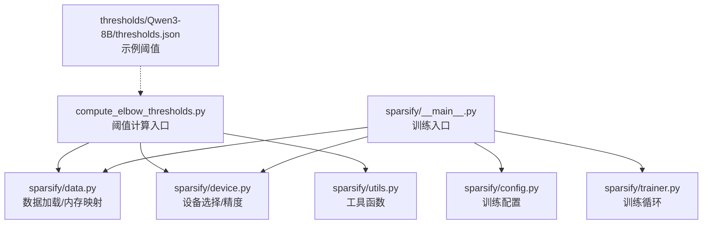
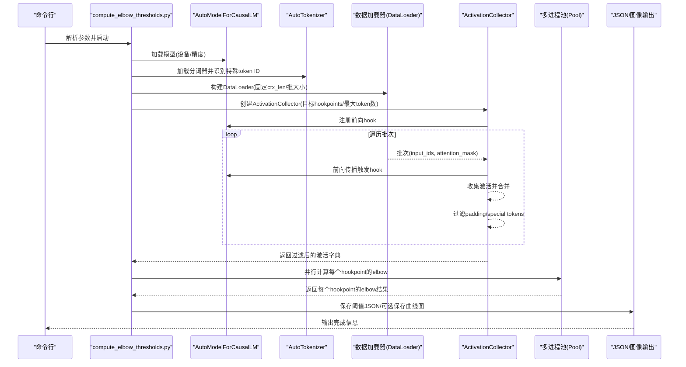
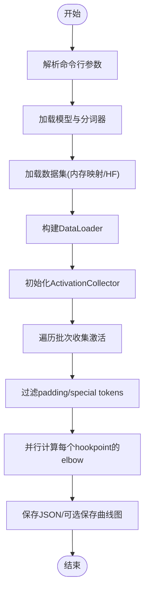
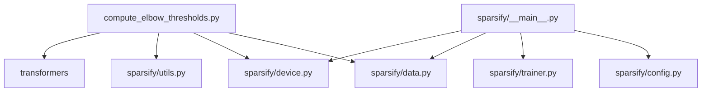

# 阈值计算工作流程

<cite>
**本文引用的文件**
- [compute_elbow_thresholds.py](file://compute_elbow_thresholds.py)
- [sparsify/__main__.py](file://sparsify/__main__.py)
- [sparsify/config.py](file://sparsify/config.py)
- [sparsify/data.py](file://sparsify/data.py)
- [sparsify/trainer.py](file://sparsify/trainer.py)
- [sparsify/device.py](file://sparsify/device.py)
- [sparsify/utils.py](file://sparsify/utils.py)
- [thresholds/Qwen3-8B/thresholds.json](file://thresholds/Qwen3-8B/thresholds.json)
- [README.md](file://README.md)
- [docs/README.md](file://docs/README.md)
- [scripts/PARALLEL_USAGE.md](file://scripts/PARALLEL_USAGE.md)
</cite>

## 目录
1. [简介](#简介)
2. [项目结构](#项目结构)
3. [核心组件](#核心组件)
4. [架构总览](#架构总览)
5. [详细组件分析](#详细组件分析)
6. [依赖关系分析](#依赖关系分析)
7. [性能考虑](#性能考虑)
8. [故障排除指南](#故障排除指南)
9. [结论](#结论)
10. [附录](#附录)

## 简介
本指南围绕“阈值计算工作流程”提供从数据收集到结果输出的完整实践方法，涵盖模型加载、激活收集、并行计算、阈值生成与保存等关键步骤。文档同时给出命令行工具使用方法、参数配置选项、内存管理策略、性能优化技巧、错误处理与故障排除建议，并结合仓库内现有实现与样例阈值文件，帮助读者快速落地并扩展该工作流程。

## 项目结构
该仓库围绕“训练 SAE → 计算肘部阈值 → 导出 LUT”形成闭环。与阈值计算直接相关的模块包括：
- 阈值计算入口：compute_elbow_thresholds.py
- 训练主入口：sparsify/__main__.py（用于训练 SAE，便于理解整体流程）
- 训练配置：sparsify/config.py
- 数据加载与内存映射：sparsify/data.py
- 设备抽象与性能：sparsify/device.py
- 工具函数：sparsify/utils.py
- 示例阈值文件：thresholds/Qwen3-8B/thresholds.json

图表来源
- [compute_elbow_thresholds.py:364-660](file://compute_elbow_thresholds.py#L364-L660)
- [sparsify/data.py:125-158](file://sparsify/data.py#L125-L158)
- [sparsify/device.py:34-118](file://sparsify/device.py#L34-L118)
- [sparsify/utils.py:1-227](file://sparsify/utils.py#L1-L227)
- [sparsify/__main__.py:131-211](file://sparsify/__main__.py#L131-L211)
- [sparsify/config.py:28-149](file://sparsify/config.py#L28-L149)
- [sparsify/trainer.py:39-162](file://sparsify/trainer.py#L39-L162)
- [thresholds/Qwen3-8B/thresholds.json:1-130](file://thresholds/Qwen3-8B/thresholds.json#L1-L130)

章节来源
- [README.md:61-69](file://README.md#L61-L69)
- [docs/README.md:1-34](file://docs/README.md#L1-L34)

## 核心组件
- 阈值计算入口与并行流程：compute_elbow_thresholds.py 提供命令行入口、激活收集、Kneedle 拐点计算、并行处理与结果保存。
- 数据加载与内存映射：sparsify/data.py 提供 MemmapDataset 与 chunk_and_tokenize，支持大体量数据高效加载。
- 设备与精度：sparsify/device.py 提供统一设备抽象、bf16 支持检测与事件计时。
- 工具函数：sparsify/utils.py 提供维度解析、层索引提取、部分前向等实用工具。
- 训练配置：sparsify/config.py 定义训练参数与阈值配置项（如 elbow_threshold_path）。

章节来源
- [compute_elbow_thresholds.py:364-660](file://compute_elbow_thresholds.py#L364-L660)
- [sparsify/data.py:125-158](file://sparsify/data.py#L125-L158)
- [sparsify/device.py:34-118](file://sparsify/device.py#L34-L118)
- [sparsify/utils.py:20-154](file://sparsify/utils.py#L20-L154)
- [sparsify/config.py:28-149](file://sparsify/config.py#L28-L149)

## 架构总览
下图展示从命令行到阈值输出的端到端流程，包括模型加载、数据准备、激活收集、并行阈值计算与结果保存。

图表来源
- [compute_elbow_thresholds.py:364-660](file://compute_elbow_thresholds.py#L364-L660)
- [sparsify/data.py:503-560](file://sparsify/data.py#L503-L560)
- [sparsify/device.py:58-64](file://sparsify/device.py#L58-L64)

## 详细组件分析

### 组件A：阈值计算入口与并行流程
- 功能要点
  - 命令行参数解析：模型名/路径、数据集、hookpoints、token 数量、批大小、上下文长度、输出文件、最大百分位、绘图目录、设备等。
  - 模型与分词器加载：自动选择 bf16 或 fp32，识别特殊 token ID（BOS/EOS/PAD/UNK）。
  - 数据集加载策略：优先尝试内存映射数据集，否则回退到 HuggingFace streaming + tokenization。
  - DataLoader 自定义 collate_fn：固定 ctx_len，生成 attention_mask，支持 already-tokenized 与 raw-text 两种输入。
  - Hookpoint 扩展与匹配：支持范围语法（如 layers.[0-10].self_attn.o_proj），按自然排序输出。
  - 激活收集：注册前向 hook，遍历数据集，累计 token 数，合并激活张量，过滤 padding 与特殊 token。
  - 并行计算：使用 multiprocessing.Pool 对每个 hookpoint 的激活并行计算 Kneedle 拐点；可选保存曲线图。
  - 结果保存：将每个 hookpoint 的 elbow_p/elbow_value 写入 JSON 文件，键名转换为 layer_X/xxx 格式。

- 关键实现位置
  - 参数解析与主流程：[compute_elbow_thresholds.py:364-660](file://compute_elbow_thresholds.py#L364-L660)
  - 激活收集类与过滤逻辑：[compute_elbow_thresholds.py:202-361](file://compute_elbow_thresholds.py#L202-L361)
  - Kneedle 拐点计算与绘图：[compute_elbow_thresholds.py:35-170](file://compute_elbow_thresholds.py#L35-L170)
  - 并行计算与结果汇总：[compute_elbow_thresholds.py:610-647](file://compute_elbow_thresholds.py#L610-L647)

- 并行计算流程图

图表来源
- [compute_elbow_thresholds.py:364-660](file://compute_elbow_thresholds.py#L364-L660)

章节来源
- [compute_elbow_thresholds.py:35-170](file://compute_elbow_thresholds.py#L35-L170)
- [compute_elbow_thresholds.py:202-361](file://compute_elbow_thresholds.py#L202-L361)
- [compute_elbow_thresholds.py:364-660](file://compute_elbow_thresholds.py#L364-L660)

### 组件B：数据加载与内存映射
- 功能要点
  - MemmapDataset：基于 numpy.memmap 的只读数据集，适合超大 bin 文件；支持 select/shard。
  - chunk_and_tokenize：GPT 风格分块与分词，确保每条样本长度为 ctx_len，长序列切分、短序列拼接，使用 EOS 作为分隔符。
  - DataLoader 自定义 collate_fn：将 input_ids 固定到 ctx_len，生成 attention_mask；支持 already-tokenized 与 raw-text 两种输入。

- 关键实现位置
  - 内存映射数据集：[sparsify/data.py:125-158](file://sparsify/data.py#L125-L158)
  - 分块与分词：[sparsify/data.py:16-101](file://sparsify/data.py#L16-L101)
  - 自定义 collate_fn：[sparsify/data.py:503-560](file://sparsify/data.py#L503-L560)

章节来源
- [sparsify/data.py:125-158](file://sparsify/data.py#L125-L158)
- [sparsify/data.py:16-101](file://sparsify/data.py#L16-L101)
- [sparsify/data.py:503-560](file://sparsify/data.py#L503-L560)

### 组件C：设备抽象与性能
- 功能要点
  - 设备类型检测：CUDA/NPU/CPU 自动识别。
  - bf16 支持检测：NPU 默认支持，CUDA 通过能力检测。
  - 事件计时与同步：统一的 Event/synchronize 抽象，便于跨平台性能测量。
  - 自动混合精度装饰器：device_autocast，屏蔽底层差异。

- 关键实现位置
  - 设备抽象与 bf16 检测：[sparsify/device.py:34-118](file://sparsify/device.py#L34-L118)

章节来源
- [sparsify/device.py:34-118](file://sparsify/device.py#L34-L118)

### 组件D：工具函数与维度解析
- 功能要点
  - get_layer_list：从模型中定位层列表，用于 hookpoint 匹配与维度解析。
  - resolve_widths：通过前向 hook 获取模块输入/输出维度，支持 input/output 模式。
  - get_max_layer_index：从 hookpoints 中提取最大层索引，辅助部分前向优化。
  - partial_forward_to_layer：仅运行到指定层，减少不必要的计算。
  - set_submodule：动态替换子模块，便于实验性修改。

- 关键实现位置
  - 维度解析与层索引：[sparsify/utils.py:20-106](file://sparsify/utils.py#L20-L106)
  - 部分前向与异常控制：[sparsify/utils.py:113-154](file://sparsify/utils.py#L113-L154)

章节来源
- [sparsify/utils.py:20-154](file://sparsify/utils.py#L20-L154)

### 组件E：训练配置与阈值集成
- 功能要点
  - TrainConfig：包含训练超参、hookpoints、exceed_alphas、elbow_threshold_path 等。
  - 阈值加载：Trainer 在初始化时可加载预计算的 elbow_thresholds，用于训练过程中的 exceed 指标计算。

- 关键实现位置
  - 训练配置定义：[sparsify/config.py:28-149](file://sparsify/config.py#L28-L149)
  - 阈值加载与使用：[sparsify/trainer.py:145-149](file://sparsify/trainer.py#L145-L149)

章节来源
- [sparsify/config.py:28-149](file://sparsify/config.py#L28-L149)
- [sparsify/trainer.py:145-149](file://sparsify/trainer.py#L145-L149)

## 依赖关系分析
- compute_elbow_thresholds.py 依赖
  - sparsify/data.py：MemmapDataset、chunk_and_tokenize、DataLoader
  - sparsify/device.py：设备选择、bf16 支持、事件计时
  - sparsify/utils.py：get_layer_list、expand_range_pattern（来自 trainer.py）
  - transformers：AutoModelForCausalLM、AutoTokenizer
  - numpy、matplotlib、tqdm、multiprocessing

- 训练侧依赖
  - sparsify/__main__.py：RunConfig、load_artifacts、DDP、Trainer
  - sparsify/config.py：TrainConfig
  - sparsify/trainer.py：Hookpoint 匹配、维度解析、exceed 指标

图表来源
- [compute_elbow_thresholds.py:25-29](file://compute_elbow_thresholds.py#L25-L29)
- [sparsify/__main__.py:15-26](file://sparsify/__main__.py#L15-L26)
- [sparsify/trainer.py:21-34](file://sparsify/trainer.py#L21-L34)

章节来源
- [compute_elbow_thresholds.py:25-29](file://compute_elbow_thresholds.py#L25-L29)
- [sparsify/__main__.py:15-26](file://sparsify/__main__.py#L15-L26)
- [sparsify/trainer.py:21-34](file://sparsify/trainer.py#L21-L34)

## 性能考虑
- 设备与精度
  - 优先使用 bf16（若硬件支持），降低显存占用与提升吞吐。
  - 使用 device_autocast 统一混合精度入口，避免平台差异。
- 内存管理
  - 激活收集阶段将张量移动到 CPU 存储，避免 GPU OOM；注意内存峰值与磁盘 IO。
  - 过滤 padding 与特殊 token，显著减少无效样本数量。
- 并行策略
  - 使用 multiprocessing.Pool 并行计算各 hookpoint 的 elbow，进程数不超过 hookpoint 数与 CPU 核心数。
  - 避免在多进程中传递 Path 对象，传字符串路径以兼容进程间通信。
- I/O 与缓存
  - MemmapDataset 适合超大数据集，减少内存占用。
  - DataLoader num_workers=0 保证兼容性，若需要可结合外部预处理。
- 计时与监控
  - 使用 device.create_event/synchronize 进行跨平台计时，评估前向与指标计算耗时。

章节来源
- [sparsify/device.py:58-118](file://sparsify/device.py#L58-L118)
- [compute_elbow_thresholds.py:610-627](file://compute_elbow_thresholds.py#L610-L627)
- [sparsify/data.py:125-158](file://sparsify/data.py#L125-L158)

## 故障排除指南
- 常见问题与解决
  - 未匹配到任何 hookpoint：检查 pattern 是否正确，确认模型结构与 base_model 名称一致。
  - 激活为空或形状异常：检查 attention_mask/input_ids 是否正确生成，确认过滤逻辑生效。
  - Kneedle 拐点检测失败：查看报错信息中的统计摘要，调整 max_percentile 或增加 token 数量。
  - 并行进程崩溃：检查共享对象序列化问题，确保传递字符串路径而非 Path 对象。
  - 设备不支持 bf16：回退到 fp32，或更换设备。
  - 数据集加载失败：确认数据路径、列名与 tokenization 状态，必要时先做本地预处理。
- 调试技巧
  - 使用 tqdm 进度条观察 token 收集与并行进度。
  - 逐步打印中间变量（如合并后的激活形状、过滤掩码统计）。
  - 限制 hookpoint 数量与 token 数量进行小规模验证。
- 性能分析
  - 使用 device.create_event/synchronize 记录前向与指标计算耗时。
  - 结合 nvidia-smi 或平台自带工具监控 GPU/CPU 占用。

章节来源
- [compute_elbow_thresholds.py:70-95](file://compute_elbow_thresholds.py#L70-L95)
- [compute_elbow_thresholds.py:196-199](file://compute_elbow_thresholds.py#L196-L199)
- [sparsify/device.py:83-89](file://sparsify/device.py#L83-L89)

## 结论
本工作流程以 compute_elbow_thresholds.py 为核心，串联模型加载、数据准备、激活收集、并行阈值计算与结果保存，形成从原始激活到 LUTurbo 可用阈值的完整闭环。通过合理的设备选择、内存管理与并行策略，可在大规模数据集上稳定高效地生成阈值文件；配合训练配置与示例阈值文件，可无缝衔接后续导出与推理阶段。

## 附录

### 命令行工具使用方法与参数
- 阈值计算入口
  - 基本用法：python compute_elbow_thresholds.py MODEL_NAME --hookpoints PATTERN --num_tokens N [--output PATH] [--plot_dir DIR] [--device DEVICE]
  - 关键参数
    - model：模型名或路径
    - dataset：数据集名或路径（默认使用仓库内示例）
    - hookpoints：支持范围语法，如 layers.[0-10].self_attn.o_proj
    - num_tokens：目标 token 数量
    - batch_size：数据批大小
    - ctx_len：上下文长度
    - output：输出 JSON 文件路径
    - max_percentile：Kneedle 最大百分位
    - plot_dir：可选保存曲线图的目录
    - device：设备字符串
- 训练入口（参考）
  - python -m sparsify MODEL DATASET --hookpoints ... --batch_size ... --ctx_len ... --sae.expansion_factor ... --sae.k ...

章节来源
- [compute_elbow_thresholds.py:364-389](file://compute_elbow_thresholds.py#L364-L389)
- [README.md:36-52](file://README.md#L36-L52)

### 参数配置选项
- 阈值计算相关
  - max_percentile：影响拐点检测的稳健性
  - plot_dir：可选，生成可视化曲线
- 训练配置（与阈值集成）
  - elbow_threshold_path：预计算阈值文件路径
  - exceed_alphas：用于训练期间的 exceed 指标计算

章节来源
- [sparsify/config.py:54-58](file://sparsify/config.py#L54-L58)
- [sparsify/config.py:57-58](file://sparsify/config.py#L57-L58)

### 最佳实践建议
- 数据准备
  - 使用 MemmapDataset 处理超大 bin 文件，或先进行 chunk_and_tokenize 以获得固定长度样本。
  - 确保 attention_mask 与 input_ids 正确生成，避免无效 token 影响阈值稳定性。
- 模型与设备
  - 优先使用 bf16（若硬件支持），减少显存占用。
  - 在多 GPU 环境中，合理分配进程数与 hookpoint 数量。
- 结果组织
  - 将阈值 JSON 与曲线图分类保存，便于后续分析与对比。
  - 与训练配置保持一致的命名约定，便于自动化导出。

### 示例阈值文件解读
- 示例文件展示了按层与操作名组合的阈值键，包含 elbow_p 与 elbow_value，可用于训练期间的 exceed 指标计算。

章节来源
- [thresholds/Qwen3-8B/thresholds.json:1-130](file://thresholds/Qwen3-8B/thresholds.json#L1-L130)

### 并行运行与监控
- 参考脚本提供了多 sweep 并行运行方法与 GPU 监控建议，可借鉴其端口分配与日志管理策略。

章节来源
- [scripts/PARALLEL_USAGE.md:1-166](file://scripts/PARALLEL_USAGE.md#L1-L166)