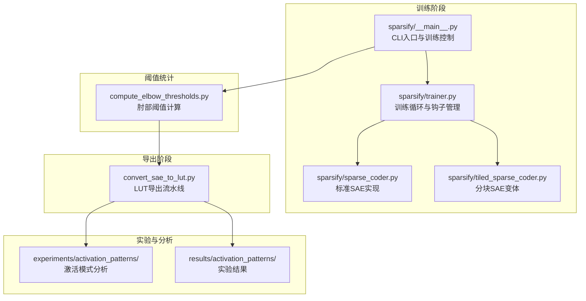
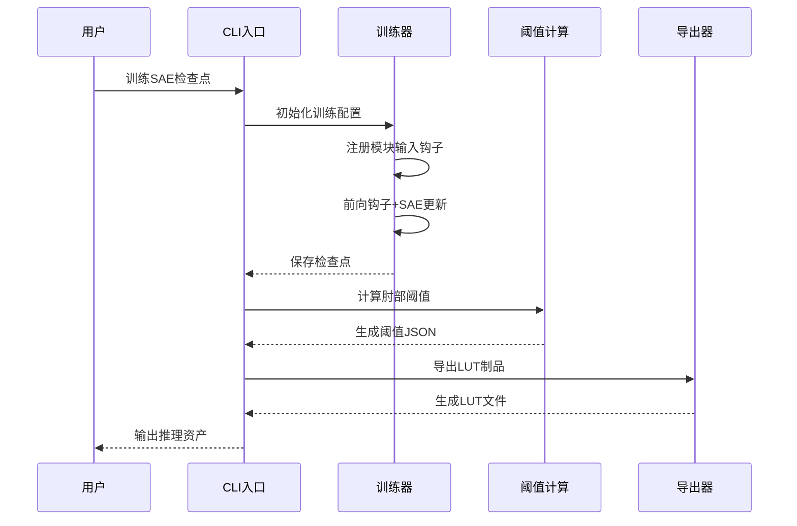
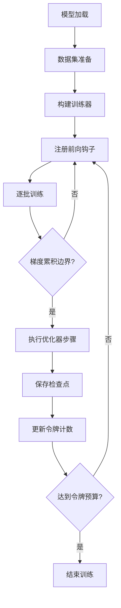
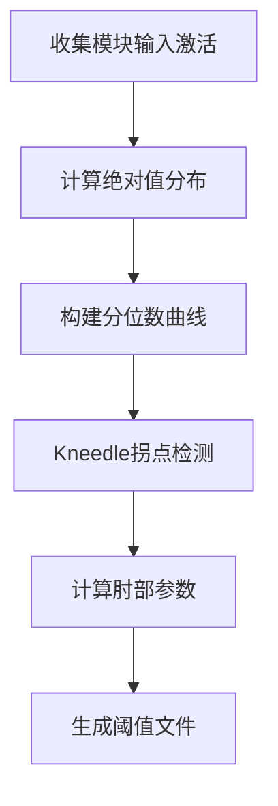
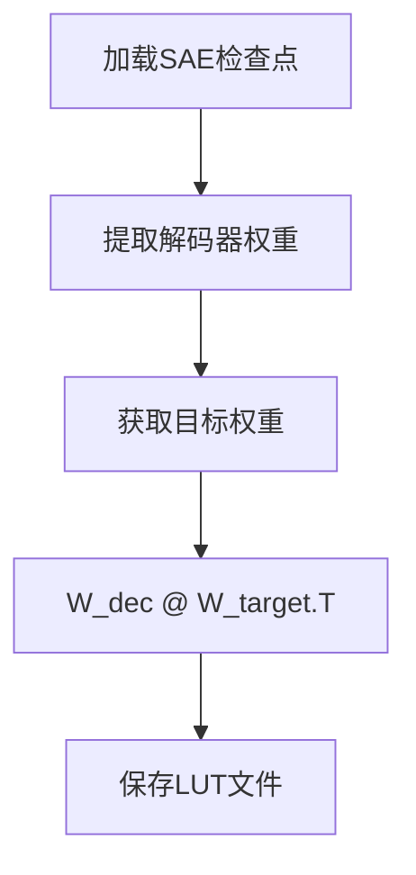
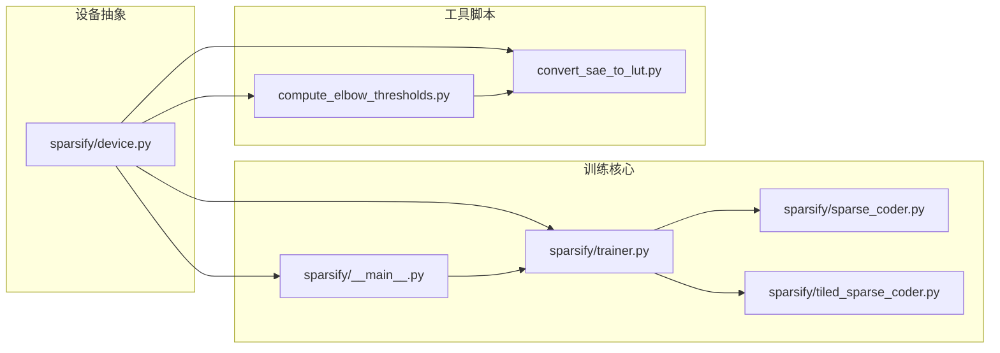

# 使用场景

<cite>
**本文引用的文件**
- [README.md](file://README.md)
- [docs/overview.md](file://docs/overview.md)
- [docs/training/quickstart.md](file://docs/training/quickstart.md)
- [docs/training/qwen3-guide.md](file://docs/training/qwen3-guide.md)
- [docs/training/config-reference.md](file://docs/training/config-reference.md)
- [docs/export/sae-to-lut.md](file://docs/export/sae-to-lut.md)
- [docs/architecture/training-pipeline.md](file://docs/architecture/training-pipeline.md)
- [sparsify/__main__.py](file://sparsify/__main__.py)
- [sparsify/device.py](file://sparsify/device.py)
- [compute_elbow_thresholds.py](file://compute_elbow_thresholds.py)
- [convert_sae_to_lut.py](file://convert_sae_to_lut.py)
- [scripts/first_time_train/Qwen3-0.6B/script.sh](file://scripts/first_time_train/Qwen3-0.6B/script.sh)
- [scripts/tiling_train/script.sh](file://scripts/tiling_train/script.sh)
- [results/activation_patterns/summary.csv](file://results/activation_patterns/summary.csv)
- [experiments/activation_patterns/hotset/run.py](file://experiments/activation_patterns/hotset/run.py)
</cite>

## 目录
1. [简介](#简介)
2. [项目结构](#项目结构)
3. [核心组件](#核心组件)
4. [架构概览](#架构概览)
5. [详细组件分析](#详细组件分析)
6. [依赖关系分析](#依赖关系分析)
7. [性能考量](#性能考量)
8. [故障排查指南](#故障排查指南)
9. [结论](#结论)
10. [附录](#附录)

## 简介
Sparsify 是 LUTurbo 的稀疏自编码器（SAE）训练与导出层，专注于在 Transformer 模块输入上训练 SAE、生成阈值统计信息，并导出面向 LUT 的制品，供下游 LUTurbo 推理流水线使用。项目当前定位为：
- NVIDIA/CUDA 是主要运行时路径
- Ascend/NPU 保留作为兼容性路径和历史参考
- 本仓库相比旧的 sparsify-ascend 分支有意精简了范围

Sparsify 的核心价值在于将昂贵的在线矩阵乘法替换为基于 SAE 基向量的查找表（LUT）流水线，从而显著降低推理成本。

## 项目结构
Sparsify 采用清晰的模块化结构，围绕训练、阈值统计和 LUT 导出三个核心阶段组织：

**图表来源**
- [sparsify/__main__.py:131-207](file://sparsify/__main__.py#L131-L207)
- [compute_elbow_thresholds.py:364-656](file://compute_elbow_thresholds.py#L364-L656)
- [convert_sae_to_lut.py:604-782](file://convert_sae_to_lut.py#L604-L782)

**章节来源**
- [README.md:11-23](file://README.md#L11-L23)
- [docs/overview.md:1-63](file://docs/overview.md#L1-L63)

## 核心组件
Sparsify 的核心组件围绕训练、阈值统计和导出三个关键环节构建：

### 训练组件
- **CLI入口** (`sparsify/__main__.py`): 提供完整的训练命令行接口，支持分布式训练、断点续训和微调
- **训练器** (`sparsify/trainer.py`): 实现钩子驱动的 SAE 训练循环，支持 TopK 稀疏激活和 FVU 评估
- **SAE实现** (`sparsify/sparse_coder.py`): 标准 SAE 架构，支持解码器归一化和死特征恢复
- **分块SAE** (`sparsify/tiled_sparse_coder.py`): 面向大规模模型的分块训练策略

### 阈值统计组件
- **肘部阈值计算** (`compute_elbow_thresholds.py`): 基于 Kneedle 算法的激活分布分析，生成补偿阈值

### 导出组件
- **LUT导出** (`convert_sae_to_lut.py`): 将训练好的 SAE 检查点转换为 LUT 格式，支持单投影和融合投影

**章节来源**
- [docs/training/config-reference.md:12-193](file://docs/training/config-reference.md#L12-L193)
- [docs/export/sae-to-lut.md:11-103](file://docs/export/sae-to-lut.md#L11-L103)

## 架构概览
Sparsify 采用端到端的工作流，从 Transformer 激活值到 LUTurbo 可用资产的完整路径：

**图表来源**
- [docs/overview.md:34-43](file://docs/overview.md#L34-L43)
- [docs/training/quickstart.md:126-134](file://docs/training/quickstart.md#L126-L134)

## 详细组件分析

### 训练管道分析
Sparsify 的训练管道采用钩子驱动的在线训练模式，避免离线激活缓存的高内存开销：

**图表来源**
- [docs/architecture/training-pipeline.md:60-124](file://docs/architecture/training-pipeline.md#L60-L124)

**章节来源**
- [docs/architecture/training-pipeline.md:1-167](file://docs/architecture/training-pipeline.md#L1-L167)
- [sparsify/__main__.py:131-207](file://sparsify/__main__.py#L131-L207)

### 阈值统计分析
肘部阈值计算采用 Kneedle 算法分析激活分布的分位数曲线：

**图表来源**
- [compute_elbow_thresholds.py:35-95](file://compute_elbow_thresholds.py#L35-L95)

**章节来源**
- [compute_elbow_thresholds.py:1-660](file://compute_elbow_thresholds.py#L1-L660)

### LUT导出分析
LUT 导出将 SAE 解码器权重与目标模型权重预计算结合：

**图表来源**
- [convert_sae_to_lut.py:249-308](file://convert_sae_to_lut.py#L249-L308)

**章节来源**
- [convert_sae_to_lut.py:1-783](file://convert_sae_to_lut.py#L1-L783)

## 依赖关系分析

**图表来源**
- [sparsify/device.py:1-118](file://sparsify/device.py#L1-L118)
- [sparsify/__main__.py:1-27](file://sparsify/__main__.py#L1-L27)

**章节来源**
- [sparsify/device.py:1-118](file://sparsify/device.py#L1-L118)

## 性能考量

### CUDA 平台优势
- **编译加速**: `torch.compile` 仅在 CUDA 后端启用，显著提升训练速度
- **bf16 支持**: 在支持的 GPU 上自动使用 bf16 以提高吞吐量
- **优化默认**: CUDA 作为主要开发和调试平台

### NPU 平台兼容性
- **设备抽象层**: 通过统一的设备 API 支持 Ascend NPU
- **性能限制**: NPU 不支持 `compile_model`，且性能调试不再是主要关注点
- **历史参考**: NPU 相关的性能分析材料已归档至 `docs/archive/ascend/`

### 训练性能优化策略
- **分块训练**: 对于大规模模型，使用分块 SAE 减少内存占用
- **梯度累积**: 通过 `grad_acc_steps` 实现虚拟批量大小扩展
- **混合精度**: 自动启用 bf16 以平衡精度和性能

**章节来源**
- [docs/architecture/performance.md:54-71](file://docs/architecture/performance.md#L54-L71)
- [docs/training/config-reference.md:142-150](file://docs/training/config-reference.md#L142-L150)

## 故障排查指南

### 常见问题诊断
1. **检查点加载失败**
   - 检查检查点目录结构是否符合预期
   - 验证 `cfg.json` 和 `sae.safetensors` 是否存在
   - 确认分块检查点的命名模式

2. **阈值计算异常**
   - 确认激活收集的令牌数量足够
   - 检查 Kneedle 算法的分位数范围设置
   - 验证输入数据的质量和分布

3. **LUT 导出错误**
   - 确认 SAE 解码器维度与目标权重维度匹配
   - 检查融合投影的模块路径映射
   - 验证输出目录的写权限

### 性能问题排查
- **内存不足**: 使用分块训练或减少 `batch_size`
- **训练缓慢**: 确认 CUDA 编译已启用，检查 bf16 支持状态
- **收敛问题**: 调整学习率和稀疏度参数

**章节来源**
- [docs/training/config-reference.md:160-170](file://docs/training/config-reference.md#L160-L170)
- [convert_sae_to_lut.py:498-504](file://convert_sae_to_lut.py#L498-L504)

## 结论
Sparsify 为 LUTurbo 项目提供了完整的 SAE 训练和导出解决方案，具有以下核心优势：

1. **明确的应用场景**: 专门针对 Transformer 模块输入的 SAE 训练，服务于 LUTurbo 推理优化
2. **简洁的架构**: 相比历史版本更加精简，专注于主流使用模式
3. **强大的工具链**: 从训练到导出的完整工作流，支持多种硬件平台
4. **可扩展性**: 支持分块训练和融合投影，适应不同规模的模型

对于希望在生产环境中部署高效推理系统的团队，Sparsify 提供了经过验证的端到端解决方案。

## 附录

### 应用场景分类

#### 小型模型（0.6B 参数级）
- **推荐配置**: `sae.expansion_factor=8`, `sae.k=128`, `batch_size=1`
- **适用场景**: 快速原型验证、资源受限环境
- **训练脚本**: [scripts/first_time_train/Qwen3-0.6B/script.sh:1-124](file://scripts/first_time_train/Qwen3-0.6B/script.sh#L1-L124)

#### 中型模型（4B-8B 参数级）
- **推荐配置**: 基于小型模型配置向上调整
- **适用场景**: 生产环境部署、性能基准测试
- **训练策略**: 使用分块训练和梯度累积

#### 大型模型（13B+ 参数级）
- **推荐策略**: 分块 SAE + 融合投影
- **硬件要求**: 多 GPU 训练环境
- **性能优化**: 启用 CUDA 编译和 bf16 训练

### 最佳实践建议

#### 训练阶段
1. **钩子选择**: 优先选择注意力输出投影（`o_proj`）和 MLP 上投影（`up_proj`）
2. **稀疏度设置**: 从 `k=128` 开始，根据重构质量逐步增加
3. **扩展因子**: 通常设置为 8，平衡压缩比和精度

#### 阈值统计
1. **样本数量**: 至少 1000 万令牌用于稳定估计
2. **分位数范围**: `max_percentile=0.95` 作为默认设置
3. **可视化**: 生成阈值曲线图便于分析

#### 导出阶段
1. **融合投影**: 优先使用 `qkv` 和 `gate_up` 融合以减少文件数量
2. **数据类型**: 默认使用 `bfloat16` 以平衡精度和存储空间
3. **批量计算**: 对于大型检查点启用批量计算以优化内存使用

### 硬件平台适配

#### CUDA 平台
- **优势**: 完整的功能支持，最佳性能表现
- **要求**: 支持 bf16 的现代 GPU
- **配置**: 自动启用编译和 bf16

#### NPU 平台
- **现状**: 设备抽象层可用，但不作为主要开发平台
- **限制**: 不支持 `compile_model` 功能
- **用途**: 兼容性保留，适合特定部署环境

**章节来源**
- [docs/training/qwen3-guide.md:17-78](file://docs/training/qwen3-guide.md#L17-L78)
- [scripts/first_time_train/Qwen3-0.6B/script.sh:1-124](file://scripts/first_time_train/Qwen3-0.6B/script.sh#L1-L124)
- [scripts/tiling_train/script.sh:1-85](file://scripts/tiling_train/script.sh#L1-L85)