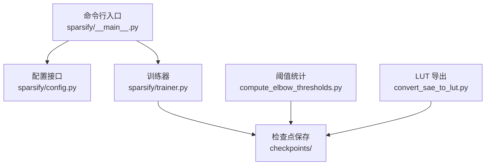
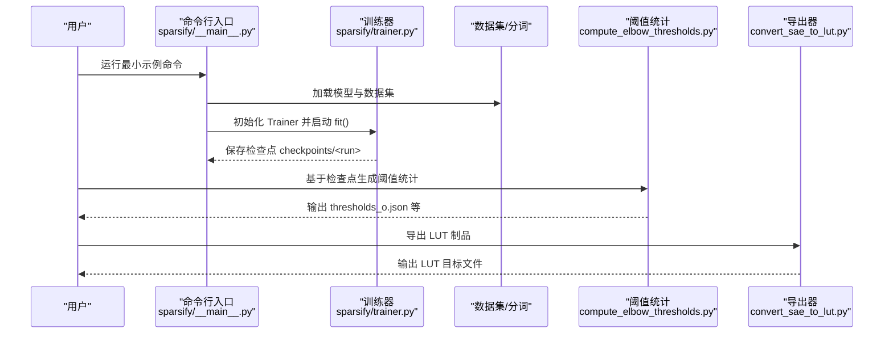
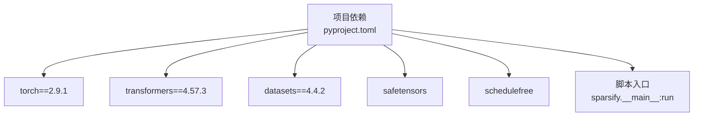

# 快速开始

<cite>
**本文引用的文件**
- [README.md](file://README.md)
- [pyproject.toml](file://pyproject.toml)
- [sparsify/__main__.py](file://sparsify/__main__.py)
- [docs/training/quickstart.md](file://docs/training/quickstart.md)
- [docs/training/config-reference.md](file://docs/training/config-reference.md)
- [docs/training/qwen3-guide.md](file://docs/training/qwen3-guide.md)
- [sparsify/config.py](file://sparsify/config.py)
- [sparsify/trainer.py](file://sparsify/trainer.py)
- [compute_elbow_thresholds.py](file://compute_elbow_thresholds.py)
- [convert_sae_to_lut.py](file://convert_sae_to_lut.py)
- [scripts/first_time_train/Qwen3-0.6B/script.sh](file://scripts/first_time_train/Qwen3-0.6B/script.sh)
</cite>

## 目录
1. [简介](#简介)
2. [项目结构](#项目结构)
3. [核心组件](#核心组件)
4. [架构总览](#架构总览)
5. [详细组件分析](#详细组件分析)
6. [依赖分析](#依赖分析)
7. [性能考虑](#性能考虑)
8. [故障排除指南](#故障排除指南)
9. [结论](#结论)
10. [附录](#附录)

## 简介
本指南面向首次接触 Sparsify 的用户，帮助你在最短时间内完成安装、准备数据与模型、执行一次最小可行的训练任务，并顺利进入阈值统计与 LUT 导出阶段。你将获得：
- 环境要求与依赖安装步骤
- 命令行最小示例与逐步操作
- 数据准备、模型选择、训练配置与结果验证方法
- 常见问题与故障排除建议
- 后续学习路径与官方文档链接

## 项目结构
Sparsify 的核心围绕“命令行入口 + 训练器 + 阈值统计 + LUT 导出”四条主线展开。下图展示了从命令行到训练再到导出的关键文件映射。

图表来源
- [sparsify/__main__.py:131-211](file://sparsify/__main__.py#L131-L211)
- [sparsify/config.py:28-149](file://sparsify/config.py#L28-L149)
- [sparsify/trainer.py:39-200](file://sparsify/trainer.py#L39-L200)
- [compute_elbow_thresholds.py:1-200](file://compute_elbow_thresholds.py#L1-L200)
- [convert_sae_to_lut.py:1-200](file://convert_sae_to_lut.py#L1-L200)

章节来源
- [README.md:36-69](file://README.md#L36-L69)
- [docs/training/quickstart.md:1-153](file://docs/training/quickstart.md#L1-L153)

## 核心组件
- 命令行入口：解析参数、加载模型与数据集、初始化分布式训练、启动训练循环。
- 配置系统：统一管理 SAE 架构参数与训练超参，包含校验与默认值。
- 训练器：基于前向钩子收集模块输入，Top-K 稀疏激活，FVU 评估，支持分块 SAE 与 Hadamard 预处理。
- 阈值统计：对激活分布做 Kneedle 拐点分析，生成 elbow 统计文件。
- LUT 导出：将 SAE 权重转换为 LUT 友好格式，便于下游推理优化。

章节来源
- [sparsify/__main__.py:31-129](file://sparsify/__main__.py#L31-L129)
- [sparsify/config.py:7-149](file://sparsify/config.py#L7-L149)
- [sparsify/trainer.py:39-200](file://sparsify/trainer.py#L39-L200)
- [compute_elbow_thresholds.py:1-200](file://compute_elbow_thresholds.py#L1-L200)
- [convert_sae_to_lut.py:1-200](file://convert_sae_to_lut.py#L1-L200)

## 架构总览
下面的序列图展示了从命令行到训练、阈值统计与导出的端到端流程。

图表来源
- [sparsify/__main__.py:131-211](file://sparsify/__main__.py#L131-L211)
- [sparsify/trainer.py:162-200](file://sparsify/trainer.py#L162-L200)
- [compute_elbow_thresholds.py:1-200](file://compute_elbow_thresholds.py#L1-L200)
- [convert_sae_to_lut.py:1-200](file://convert_sae_to_lut.py#L1-L200)

## 详细组件分析

### 安装与环境要求
- Python 版本要求：>= 3.10
- 推荐 CUDA 环境；编译加速仅在 CUDA 生效
- 依赖通过 pip 安装，开发依赖可选

步骤
1) 在仓库根目录安装（包含开发依赖）
2) 验证安装：查看 CLI 帮助或运行最小示例

章节来源
- [pyproject.toml:9](file://pyproject.toml#L9)
- [README.md:24-34](file://README.md#L24-L34)
- [README.md:150-152](file://README.md#L150-L152)

### 最小可行示例（命令行）
- 示例命令直接来自仓库文档，覆盖数据集、文本列、钩子点、上下文长度、SAE 超参与保存目录等
- 支持 DDP 多卡训练（torchrun）

章节来源
- [README.md:36-52](file://README.md#L36-L52)
- [docs/training/quickstart.md:19-33](file://docs/training/quickstart.md#L19-L33)
- [scripts/first_time_train/Qwen3-0.6B/script.sh:11-47](file://scripts/first_time_train/Qwen3-0.6B/script.sh#L11-L47)

### 数据准备与模型选择
- 数据集支持 HuggingFace 数据集、本地磁盘数据集与内存映射 .bin 文件
- 若数据未分词，CLI 会自动分词；否则跳过分词
- 模型通过 AutoModel/AutoTokenizer 加载，支持 revision 与 token

章节来源
- [sparsify/__main__.py:81-128](file://sparsify/__main__.py#L81-L128)
- [docs/training/quickstart.md:35-41](file://docs/training/quickstart.md#L35-L41)

### 训练配置与钩子点
- 钩子点支持通配与范围语法，训练器会将其扩展为实际模块名
- 默认使用模块输入作为激活源；可按层步长采样
- 学习率按 SAE 维度缩放；支持 AuxK 死特征恢复与分块 SAE/Hadamard 预处理

章节来源
- [sparsify/trainer.py:39-86](file://sparsify/trainer.py#L39-L86)
- [sparsify/config.py:28-149](file://sparsify/config.py#L28-L149)
- [docs/training/config-reference.md:99-106](file://docs/training/config-reference.md#L99-L106)

### 结果验证与检查点
- 检查点命名包含世界规模、批大小、梯度累积、扩展因子与 k 等信息
- 常见文件：config.json、state.pt、optimizer_*.pt、各 hookpoint 的 cfg.json 与 sae.safetensors
- 支持保存最佳快照与断点续训

章节来源
- [docs/training/quickstart.md:42-58](file://docs/training/quickstart.md#L42-L58)
- [docs/training/config-reference.md:171-193](file://docs/training/config-reference.md#L171-L193)

### 阈值统计与 LUT 导出
- 阈值统计：对激活分布做 Kneedle 拐点分析，输出包含 elbow_p 与 elbow_value 的 JSON
- LUT 导出：根据投影类型（qproj/o_proj/up_proj 等）与层范围，读取检查点并生成 LUT 制品

章节来源
- [compute_elbow_thresholds.py:35-96](file://compute_elbow_thresholds.py#L35-L96)
- [docs/training/quickstart.md:80-125](file://docs/training/quickstart.md#L80-L125)
- [convert_sae_to_lut.py:31-78](file://convert_sae_to_lut.py#L31-L78)

## 依赖分析
- 项目依赖集中在 PyTorch 2.x、Transformers、Datasets、safetensors、schedulefree 等
- 可选开发依赖包含可视化与日志工具
- CLI 提供脚本入口，便于直接运行

图表来源
- [pyproject.toml:12-28](file://pyproject.toml#L12-L28)
- [pyproject.toml:44-45](file://pyproject.toml#L44-L45)

章节来源
- [pyproject.toml:12-42](file://pyproject.toml#L12-L42)

## 性能考虑
- CUDA 为默认推荐平台；compile_model 仅在 CUDA 生效
- 使用 bf16（若硬件支持）可提升吞吐
- 合理设置 batch_size、grad_acc_steps 与 ctx_len，平衡显存与速度
- 分块 SAE 与 Hadamard 预处理可改善收敛，但会增加额外计算

章节来源
- [docs/training/quickstart.md:148-153](file://docs/training/quickstart.md#L148-L153)
- [sparsify/config.py:124-149](file://sparsify/config.py#L124-L149)
- [sparsify/__main__.py:84](file://sparsify/__main__.py#L84)

## 故障排除指南
- CUDA 不可用导致 compile_model 被禁用：确认设备类型或关闭该选项
- 钩子点匹配失败：检查范围语法与模型结构，确保模块名存在
- 数据集未分词导致报错：提供 text_column 或预先分词
- 断点续训找不到匹配路径：确保 run_name 与保存目录一致或使用完整路径
- 阈值统计未找到拐点：调整 max_percentile 或增大样本量
- 导出找不到检查点：确认投影类型与层范围与训练一致

章节来源
- [sparsify/config.py:138-142](file://sparsify/config.py#L138-L142)
- [sparsify/__main__.py:174-196](file://sparsify/__main__.py#L174-L196)
- [compute_elbow_thresholds.py:70-88](file://compute_elbow_thresholds.py#L70-L88)
- [convert_sae_to_lut.py:106-151](file://convert_sae_to_lut.py#L106-L151)

## 结论
通过本快速开始，你已经完成了 Sparsify 的安装、最小示例运行、检查点生成、阈值统计与 LUT 导出的完整闭环。建议在稳定基础配置后再逐步调优学习率、扩展因子与层范围，并结合官方文档深入理解训练与导出细节。

## 附录
- 官方文档与阅读顺序
  - [docs/overview.md](file://docs/overview.md)
  - [docs/training/quickstart.md](file://docs/training/quickstart.md)
  - [docs/training/config-reference.md](file://docs/training/config-reference.md)
  - [docs/training/qwen3-guide.md](file://docs/training/qwen3-guide.md)
  - [docs/architecture/training-pipeline.md](file://docs/architecture/training-pipeline.md)
  - [docs/export/sae-to-lut.md](file://docs/export/sae-to-lut.md)

章节来源
- [README.md:81-103](file://README.md#L81-L103)