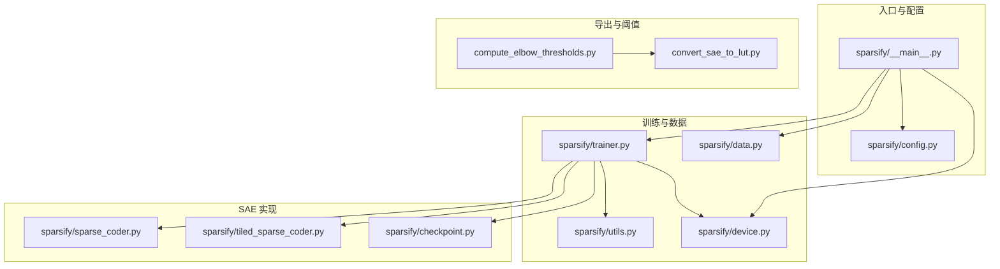
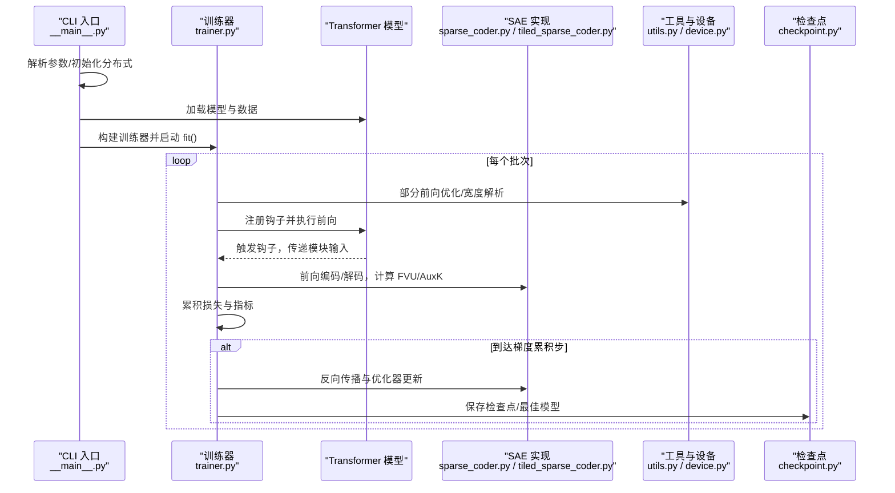
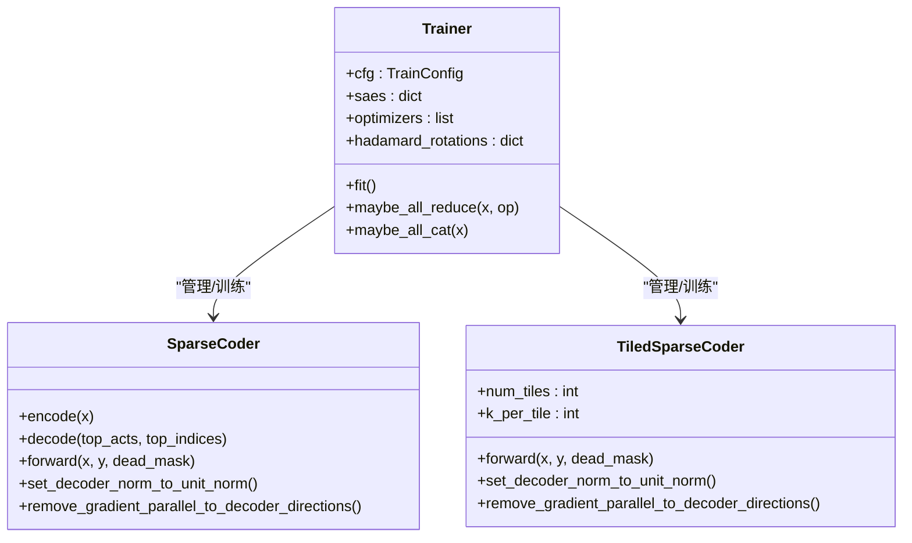
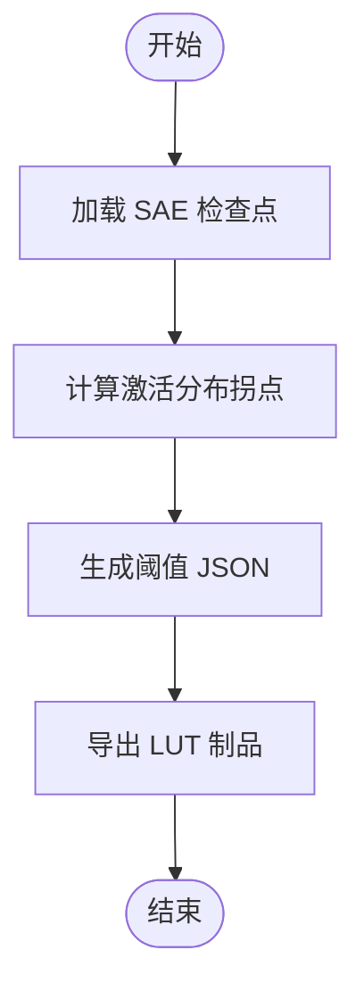
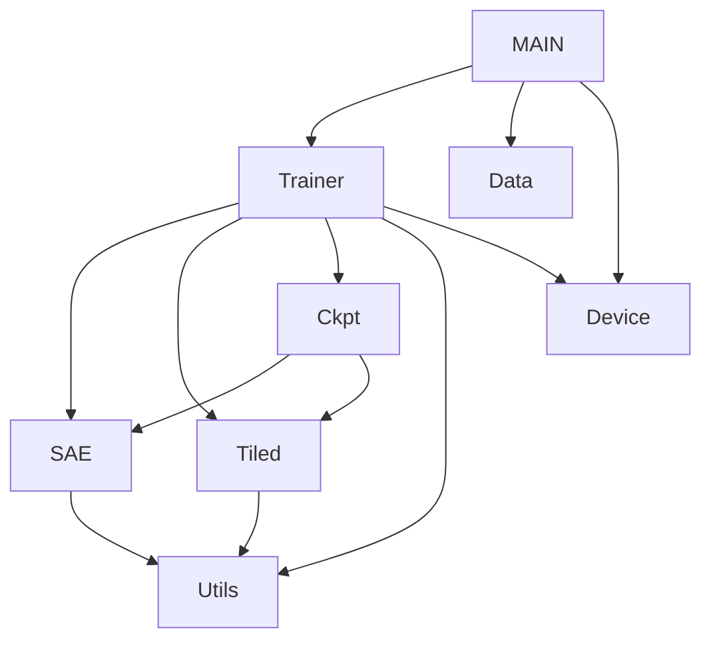

# 架构概览

<cite>
**本文档引用的文件**
- [README.md](file://README.md)
- [docs/overview.md](file://docs/overview.md)
- [docs/architecture/training-pipeline.md](file://docs/architecture/training-pipeline.md)
- [sparsify/__main__.py](file://sparsify/__main__.py)
- [sparsify/trainer.py](file://sparsify/trainer.py)
- [sparsify/config.py](file://sparsify/config.py)
- [sparsify/data.py](file://sparsify/data.py)
- [sparsify/sparse_coder.py](file://sparsify/sparse_coder.py)
- [sparsify/tiled_sparse_coder.py](file://sparsify/tiled_sparse_coder.py)
- [sparsify/checkpoint.py](file://sparsify/checkpoint.py)
- [sparsify/utils.py](file://sparsify/utils.py)
- [sparsify/device.py](file://sparsify/device.py)
- [compute_elbow_thresholds.py](file://compute_elbow_thresholds.py)
- [convert_sae_to_lut.py](file://convert_sae_to_lut.py)
</cite>

## 目录
1. [简介](#简介)
2. [项目结构](#项目结构)
3. [核心组件](#核心组件)
4. [架构总览](#架构总览)
5. [详细组件分析](#详细组件分析)
6. [依赖关系分析](#依赖关系分析)
7. [性能考量](#性能考量)
8. [故障排查指南](#故障排查指南)
9. [结论](#结论)
10. [附录](#附录)

## 简介
Sparsify 是 LUTurbo 的稀疏自编码器（SAE）训练与导出层，专注于在 Transformer 模块输入上训练 SAE、生成阈值统计信息，并导出面向 LUT 的制品。系统采用钩子驱动的在线训练流水线，结合配置驱动设计与模块化组件，形成从数据输入到最终导出的完整链路。

## 项目结构
项目采用按功能域划分的模块化组织方式，核心模块包括：
- CLI 与入口：负责参数解析、分布式初始化、模型与数据加载
- 训练器：钩子驱动的 SAE 训练循环，支持分块 SAE、Hadamard 预处理、辅助损失等
- 编码器/解码器：标准与分块 SAE 实现，提供高效前向与融合解码
- 配置系统：统一的训练与 SAE 配置接口
- 工具与设备抽象：宽度解析、部分前向、设备与分布式抽象
- 检查点管理：训练状态与权重的保存与恢复
- 导出工具：阈值统计与 LUT 导出

**图表来源**
- [sparsify/__main__.py:131-211](file://sparsify/__main__.py#L131-L211)
- [sparsify/trainer.py:39-162](file://sparsify/trainer.py#L39-L162)
- [sparsify/config.py:7-149](file://sparsify/config.py#L7-L149)
- [sparsify/data.py:16-158](file://sparsify/data.py#L16-L158)
- [sparsify/sparse_coder.py:36-269](file://sparsify/sparse_coder.py#L36-L269)
- [sparsify/tiled_sparse_coder.py:17-342](file://sparsify/tiled_sparse_coder.py#L17-L342)
- [sparsify/checkpoint.py:101-302](file://sparsify/checkpoint.py#L101-L302)
- [sparsify/utils.py:20-200](file://sparsify/utils.py#L20-L200)
- [sparsify/device.py:1-118](file://sparsify/device.py#L1-L118)
- [compute_elbow_thresholds.py:1-200](file://compute_elbow_thresholds.py#L1-L200)
- [convert_sae_to_lut.py:1-200](file://convert_sae_to_lut.py#L1-L200)

**章节来源**
- [README.md:1-154](file://README.md#L1-L154)
- [docs/overview.md:1-63](file://docs/overview.md#L1-L63)

## 核心组件
- CLI 入口与运行配置
  - 解析命令行参数，初始化分布式环境，加载模型与数据集，构建训练器并启动训练
  - 关键职责：参数解析、分布式初始化、模型/数据加载、训练器装配
- 训练器（Trainer）
  - 钩子驱动的在线训练循环，支持多种子初始化、分块 SAE、Hadamard 旋转、辅助损失、部分前向优化
  - 关键职责：钩子注册与执行、损失累积与反传、死特征计数同步、检查点保存与日志
- SAE 实现
  - 标准 SAE：线性编码器与解码器，Top-K 稀疏激活，FVU 评估，可选辅助损失
  - 分块 SAE：将输入按隐藏维切分为多个块，每块独立训练，支持全局 Top-K 与输入混合
- 配置系统
  - 统一的训练与 SAE 配置接口，涵盖批大小、梯度累积、学习率、稀疏度、Hadamard 参数、编译选项等
- 工具与设备抽象
  - 宽度解析、部分前向停止、设备类型检测与事件封装、自动精度上下文
- 检查点管理
  - 支持常规与分块检查点的加载/保存，训练状态与优化器状态持久化，跨进程同步
- 导出与阈值
  - 阈值统计：基于 Kneedle 拐点算法计算激活分布拐点，生成 per-hookpoint 阈值
  - LUT 导出：将 SAE 权重与阈值转换为 LUT 友好格式，支持单投影与融合投影

**章节来源**
- [sparsify/__main__.py:31-211](file://sparsify/__main__.py#L31-L211)
- [sparsify/trainer.py:39-760](file://sparsify/trainer.py#L39-L760)
- [sparsify/config.py:7-149](file://sparsify/config.py#L7-L149)
- [sparsify/sparse_coder.py:36-269](file://sparsify/sparse_coder.py#L36-L269)
- [sparsify/tiled_sparse_coder.py:17-342](file://sparsify/tiled_sparse_coder.py#L17-L342)
- [sparsify/checkpoint.py:101-302](file://sparsify/checkpoint.py#L101-L302)
- [sparsify/utils.py:20-200](file://sparsify/utils.py#L20-L200)
- [sparsify/device.py:1-118](file://sparsify/device.py#L1-L118)
- [compute_elbow_thresholds.py:1-200](file://compute_elbow_thresholds.py#L1-L200)
- [convert_sae_to_lut.py:1-200](file://convert_sae_to_lut.py#L1-L200)

## 架构总览
Sparsify 的整体架构围绕“钩子驱动的在线训练”展开，训练器在每个批次中注册钩子，拦截选定模块的输入，将其作为 SAE 的训练样本，立即计算局部重建损失并参与梯度累积与优化。系统通过配置驱动设计与模块化组件，实现了高扩展性与平台无关性。

**图表来源**
- [sparsify/__main__.py:131-211](file://sparsify/__main__.py#L131-L211)
- [sparsify/trainer.py:162-729](file://sparsify/trainer.py#L162-L729)
- [sparsify/sparse_coder.py:176-239](file://sparsify/sparse_coder.py#L176-L239)
- [sparsify/tiled_sparse_coder.py:103-140](file://sparsify/tiled_sparse_coder.py#L103-L140)
- [sparsify/utils.py:113-154](file://sparsify/utils.py#L113-L154)
- [sparsify/checkpoint.py:246-302](file://sparsify/checkpoint.py#L246-L302)

## 详细组件分析

### 训练器（Trainer）类
- 职责与流程
  - 钩点解析：支持通配符与范围语法，推断层列表，应用步长
  - SAE 构建：根据配置选择标准或分块 SAE，支持多种子实例
  - 优化器设置：默认使用 SignSGD 配合 Schedule-Free 包装器
  - 在线训练：注册钩子，拦截模块输入，执行编码/解码，累积指标，按步长执行优化器更新
  - 死特征追踪：收集每步激活索引，聚合后直接写零，避免昂贵的 per-forward 散布操作
  - 日志与检查点：聚合指标，记录耗时，周期性保存检查点与最佳模型
- 关键特性
  - 部分前向：根据最高层索引提前停止，减少无效计算
  - 分布式：DDP 包装 SAE，no_sync 优化，all_reduce 同步
  - Hadamard 旋转：可选块对角变换，提升稀疏性与重建质量
  - 超出指标：基于肘部阈值计算误差超过比例，辅助下游补偿

**图表来源**
- [sparsify/trainer.py:39-162](file://sparsify/trainer.py#L39-L162)
- [sparsify/sparse_coder.py:36-269](file://sparsify/sparse_coder.py#L36-L269)
- [sparsify/tiled_sparse_coder.py:17-342](file://sparsify/tiled_sparse_coder.py#L17-L342)

**章节来源**
- [sparsify/trainer.py:39-760](file://sparsify/trainer.py#L39-L760)
- [docs/architecture/training-pipeline.md:1-167](file://docs/architecture/training-pipeline.md#L1-L167)

### 配置系统（TrainConfig/SparseCoderConfig）
- 设计要点
  - 配置驱动：通过数据类统一管理训练与 SAE 参数，支持序列化与校验
  - 参数校验：范围检查、平台兼容性（如编译开关）、Hadamard 块大小必须为 2 的幂
  - 默认值与缩放：学习率随潜变量数量缩放；稀疏度与扩展因子决定潜在维度
- 关键字段
  - 训练：批大小、梯度累积、最大 token 数、日志频率、保存策略
  - SAE：扩展因子、稀疏度、归一化解码器、辅助损失系数
  - 钩子与层：钩点列表、层索引与步长、范围/通配符解析
  - 分块与预处理：分块数量、全局 Top-K、输入混合、Hadamard 旋转
  - 编译与日志：模型编译、W&B 日志开关

**章节来源**
- [sparsify/config.py:7-149](file://sparsify/config.py#L7-L149)

### 数据与设备抽象
- 数据处理
  - 分词与分块：GPT 风格分块，确保每条样本长度一致，支持多进程并行
  - 内存映射：针对大规模二进制数据集的高效访问
- 设备与分布式
  - 平台抽象：统一 CUDA/NPU/CPu 设备类型检测、bf16 支持判断、事件与同步封装
  - 分布式后端：根据平台选择 nccl/hccl/gloo

**章节来源**
- [sparsify/data.py:16-158](file://sparsify/data.py#L16-L158)
- [sparsify/device.py:1-118](file://sparsify/device.py#L1-L118)

### 检查点与恢复
- 功能
  - 支持常规与分块检查点的加载/保存，训练状态（步数、token 数、最佳损失）与优化器状态持久化
  - 跨进程一致性：rank 间共享死特征计数与最佳损失
  - Hadamard 旋转状态：在启用时保存/加载旋转状态
- 恢复策略
  - 自动匹配运行名与模式，支持多种子与分块配置的恢复

**章节来源**
- [sparsify/checkpoint.py:101-302](file://sparsify/checkpoint.py#L101-L302)

### 阈值统计与 LUT 导出
- 阈值统计
  - 基于 Kneedle 拐点算法计算激活分布的拐点，输出 per-hookpoint 的 elbow_value，再由下游按 alpha 计算阈值
- LUT 导出
  - 将 SAE 权重与阈值转换为 LUT 友好格式，支持单投影与融合投影（如 qkv、gate_up），并按层范围批量处理

**图表来源**
- [compute_elbow_thresholds.py:1-200](file://compute_elbow_thresholds.py#L1-L200)
- [convert_sae_to_lut.py:1-200](file://convert_sae_to_lut.py#L1-L200)

**章节来源**
- [compute_elbow_thresholds.py:1-200](file://compute_elbow_thresholds.py#L1-L200)
- [convert_sae_to_lut.py:1-200](file://convert_sae_to_lut.py#L1-L200)

## 依赖关系分析
- 组件耦合
  - Trainer 与 SAE 实现松耦合：通过接口统一的 forward 输出进行指标采集与反传
  - 配置驱动：训练器与 SAE 均依赖配置对象，便于参数化与扩展
  - 工具与设备抽象：向上层屏蔽平台差异，降低耦合度
- 外部依赖
  - Transformers/HuggingFace：模型与分词器加载
  - Datasets：数据集加载与分块
  - Torch/Distributed：分布式训练与事件同步
  - safetensors：高效权重存储与加载

**图表来源**
- [sparsify/trainer.py:39-162](file://sparsify/trainer.py#L39-L162)
- [sparsify/sparse_coder.py:36-269](file://sparsify/sparse_coder.py#L36-L269)
- [sparsify/tiled_sparse_coder.py:17-342](file://sparsify/tiled_sparse_coder.py#L17-L342)
- [sparsify/checkpoint.py:101-302](file://sparsify/checkpoint.py#L101-L302)
- [sparsify/utils.py:20-200](file://sparsify/utils.py#L20-L200)
- [sparsify/device.py:1-118](file://sparsify/device.py#L1-L118)
- [sparsify/__main__.py:131-211](file://sparsify/__main__.py#L131-L211)
- [sparsify/data.py:16-158](file://sparsify/data.py#L16-L158)

**章节来源**
- [sparsify/trainer.py:39-760](file://sparsify/trainer.py#L39-L760)
- [sparsify/sparse_coder.py:36-269](file://sparsify/sparse_coder.py#L36-L269)
- [sparsify/tiled_sparse_coder.py:17-342](file://sparsify/tiled_sparse_coder.py#L17-L342)
- [sparsify/checkpoint.py:101-302](file://sparsify/checkpoint.py#L101-L302)
- [sparsify/utils.py:20-200](file://sparsify/utils.py#L20-L200)
- [sparsify/device.py:1-118](file://sparsify/device.py#L1-L118)
- [sparsify/__main__.py:131-211](file://sparsify/__main__.py#L131-L211)
- [sparsify/data.py:16-158](file://sparsify/data.py#L16-L158)

## 性能考量
- 在线训练与钩子驱动
  - 避免离线激活缓存，减少 IO 与存储压力，但增加前向开销
  - 通过部分前向与 no_sync 优化，降低不必要的计算与通信
- 稀疏性与解码效率
  - Top-K 稀疏激活与融合解码实现，减少解码计算量
  - 可选解码器归一化与梯度正交投影，稳定训练并提升收敛
- 平台与精度
  - 自动 bf16 上下文，加速前向与反向
  - 设备事件计时与异步同步，精确测量耗时瓶颈
- 分布式与内存
  - DDP 包装与 all_reduce 同步，避免死锁与数据不一致
  - 内存映射数据集与分块 SAE，平衡显存占用与吞吐

[本节为通用性能讨论，无需具体文件分析]

## 故障排查指南
- 分布式训练问题
  - 现象：不同 rank 数据量不一致导致死锁
  - 处理：训练前按世界大小整除裁剪样本，确保各 rank 工作量一致
- 检查点不匹配
  - 现象：分块与非分块检查点混用报错
  - 处理：确认 num_tiles 一致后再恢复/微调
- Hadamard 旋转异常
  - 现象：启用时出现维度不匹配
  - 处理：确保 d_in 可被 num_tiles 整除，且块大小为 2 的幂
- 指标缺失或异常
  - 现象：W&B 日志失败或指标为空
  - 处理：检查日志开关与网络连接，必要时降级为本地记录

**章节来源**
- [sparsify/trainer.py:162-729](file://sparsify/trainer.py#L162-L729)
- [sparsify/checkpoint.py:44-73](file://sparsify/checkpoint.py#L44-L73)
- [sparsify/config.py:138-149](file://sparsify/config.py#L138-L149)

## 结论
Sparsify 通过钩子驱动的在线训练、配置驱动设计与模块化组件，构建了从数据输入到 LUT 导出的完整流水线。其架构强调实时性、可扩展性与平台无关性，既满足当前主流训练需求，也为未来功能扩展提供了清晰的边界与接口。

## 附录
- 推荐阅读顺序
  - 从概览与快速开始入手，再深入训练流水线与配置参考
  - 需要导出 LUT 时，配合阈值统计与导出脚本使用
- 相关文档导航
  - 概览与角色定位：[docs/overview.md](file://docs/overview.md)
  - 训练流水线详解：[docs/architecture/training-pipeline.md](file://docs/architecture/training-pipeline.md)
  - 快速开始与配置参考：[README.md](file://README.md)