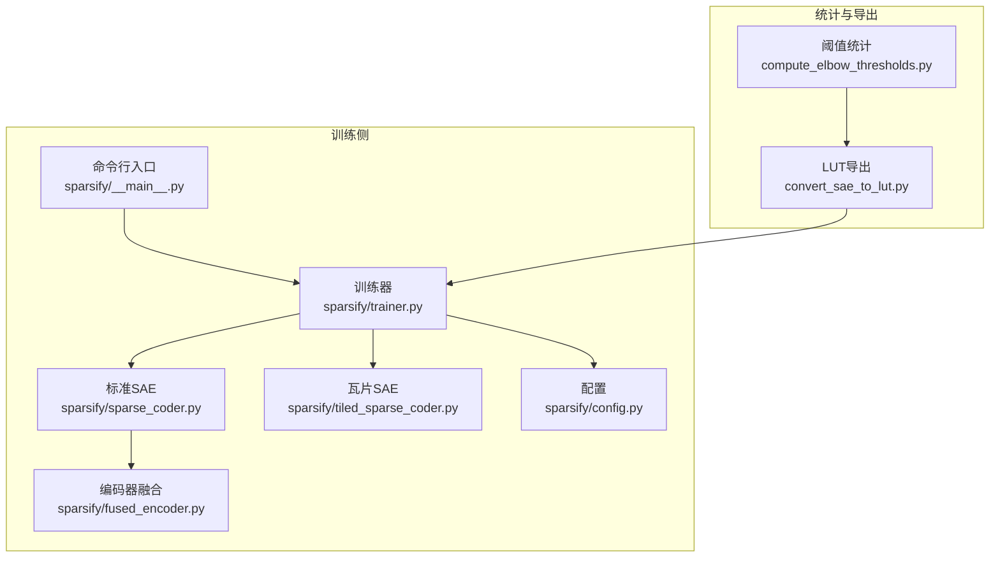
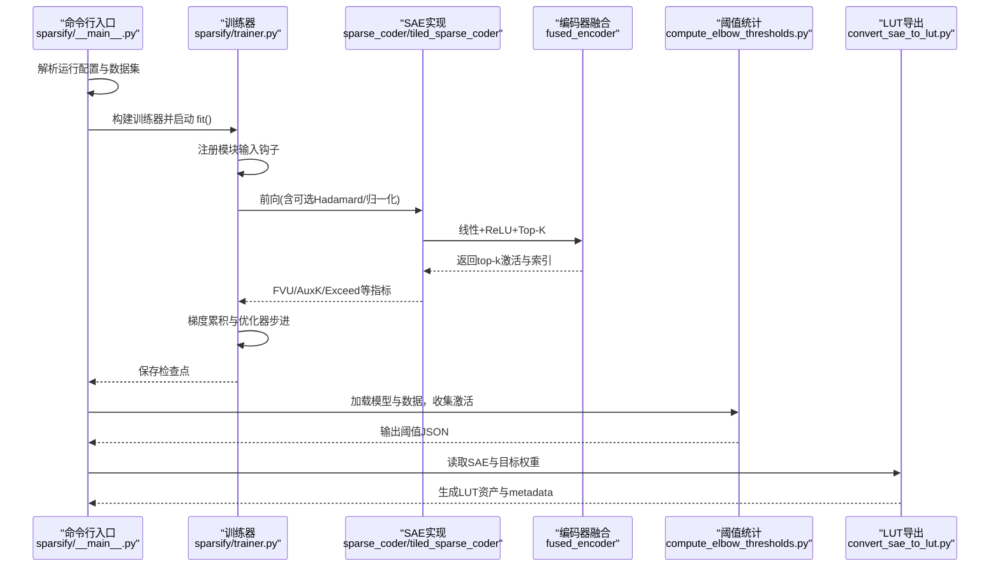
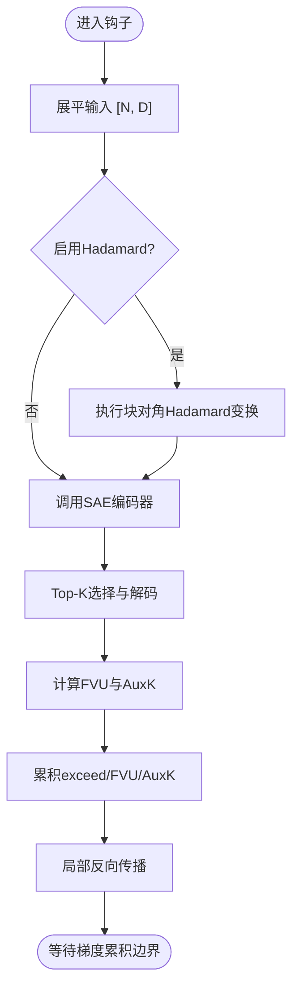
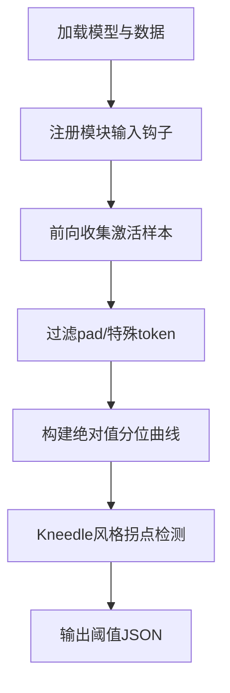
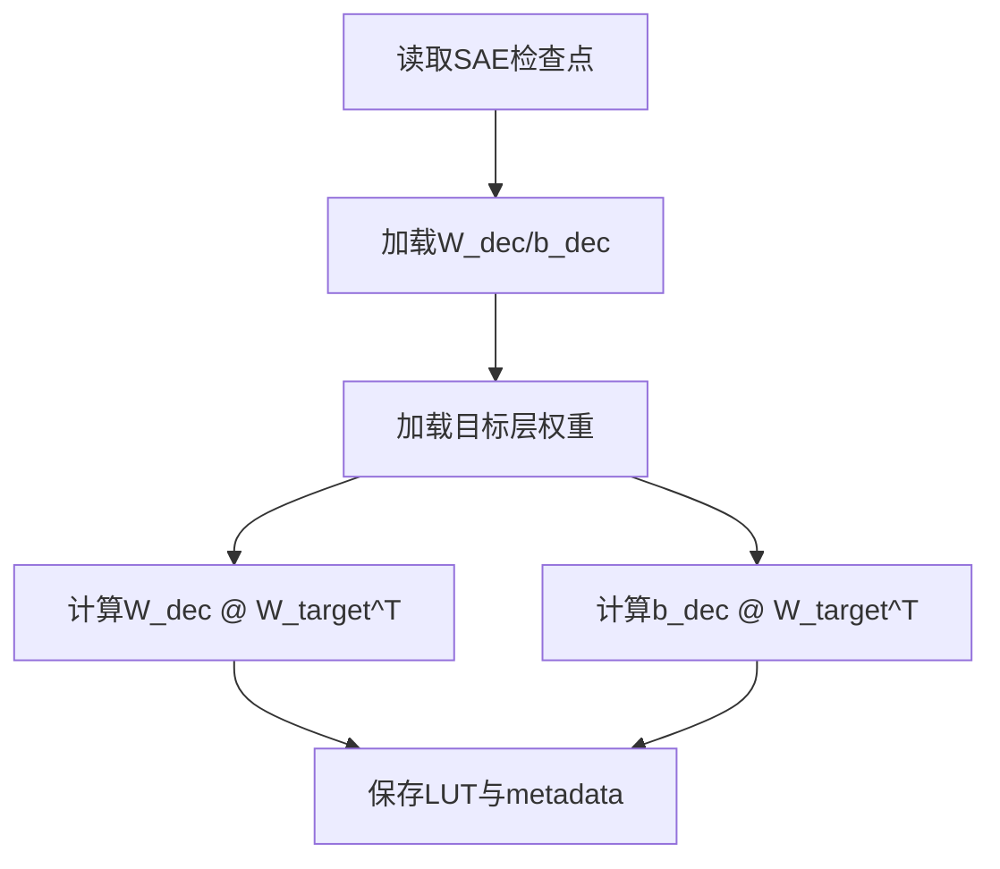
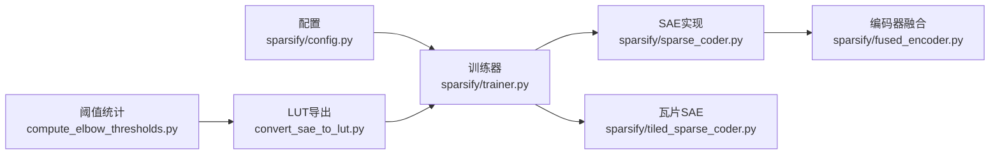

# 核心能力

<cite>
**本文引用的文件**
- [sparsify/__main__.py](file://sparsify/__main__.py)
- [sparsify/trainer.py](file://sparsify/trainer.py)
- [sparsify/sparse_coder.py](file://sparsify/sparse_coder.py)
- [sparsify/tiled_sparse_coder.py](file://sparsify/tiled_sparse_coder.py)
- [sparsify/fused_encoder.py](file://sparsify/fused_encoder.py)
- [sparsify/config.py](file://sparsify/config.py)
- [convert_sae_to_lut.py](file://convert_sae_to_lut.py)
- [compute_elbow_thresholds.py](file://compute_elbow_thresholds.py)
- [README.md](file://README.md)
- [docs/training/quickstart.md](file://docs/training/quickstart.md)
- [docs/export/sae-to-lut.md](file://docs/export/sae-to-lut.md)
- [docs/architecture/training-pipeline.md](file://docs/architecture/training-pipeline.md)
</cite>

## 目录
1. [简介](#简介)
2. [项目结构](#项目结构)
3. [核心组件](#核心组件)
4. [架构总览](#架构总览)
5. [详细组件分析](#详细组件分析)
6. [依赖分析](#依赖分析)
7. [性能考量](#性能考量)
8. [故障排查指南](#故障排查指南)
9. [结论](#结论)
10. [附录](#附录)

## 简介
本文件聚焦 Sparsify 的三大核心能力：
- 稀疏自编码器（SAE）训练：通过模块输入激活的在线钩子驱动训练，结合局部重构质量与可选的死特征恢复策略，形成高效稳定的训练流水线。
- 阈值统计计算：基于激活分布的 Kneedle 拐点法计算“肘部”阈值，支撑下游补偿逻辑与异常比例评估。
- LUT 资产导出：将已训练的 SAE 权重与目标层权重预计算组合，生成面向推理的查找表资产，降低在线推理时的矩阵乘开销。

这些能力协同构成从“原始模型激活”到“LUTurbo 推理资产”的完整闭环，并在 CUDA/NVIDIA 为主流平台的前提下，提供可扩展、可复现的工程化方案。

## 项目结构
Sparsify 的核心代码围绕以下模块组织：
- 命令行入口与运行时装配：sparsify/__main__.py
- 训练器与钩子驱动训练：sparsify/trainer.py
- 标准与瓦片化 SAE 实现：sparsify/sparse_coder.py、sparsify/tiled_sparse_coder.py
- 编码器融合优化：sparsify/fused_encoder.py
- 配置定义：sparsify/config.py
- 阈值统计脚本：compute_elbow_thresholds.py
- LUT 导出脚本：convert_sae_to_lut.py
- 文档与快速上手：docs/training/quickstart.md、docs/export/sae-to-lut.md、docs/architecture/training-pipeline.md

图表来源
- [sparsify/__main__.py:1-211](file://sparsify/__main__.py#L1-L211)
- [sparsify/trainer.py:1-760](file://sparsify/trainer.py#L1-L760)
- [sparsify/sparse_coder.py:1-269](file://sparsify/sparse_coder.py#L1-L269)
- [sparsify/tiled_sparse_coder.py:1-342](file://sparsify/tiled_sparse_coder.py#L1-L342)
- [sparsify/fused_encoder.py:1-107](file://sparsify/fused_encoder.py#L1-L107)
- [sparsify/config.py:1-149](file://sparsify/config.py#L1-L149)
- [compute_elbow_thresholds.py:1-660](file://compute_elbow_thresholds.py#L1-L660)
- [convert_sae_to_lut.py:1-783](file://convert_sae_to_lut.py#L1-L783)

章节来源
- [README.md:1-154](file://README.md#L1-L154)
- [docs/training/quickstart.md:1-153](file://docs/training/quickstart.md#L1-L153)
- [docs/architecture/training-pipeline.md:1-167](file://docs/architecture/training-pipeline.md#L1-L167)

## 核心组件
- 稀疏自编码器（SAE）训练器：负责模块输入激活的在线钩子采集、损失计算、梯度累积与优化器步进，支持多种子初始化、死特征追踪、可选 Hadamard 预处理与编译加速。
- 标准 SAE 与瓦片化 SAE：前者按通道维度独立训练；后者将输入按隐藏维切分为多个块，分别训练独立 SAE，并支持全局 top-k 与输入混合以提升跨通道信息流动。
- 编码器融合：通过自定义 Autograd 函数在前向中完成线性+ReLU+Top-K，并在反向中采用稀疏散射+矩阵乘或 gather+bmm 的混合策略，平衡吞吐与内存。
- 阈值统计：对选定模块输入的激活进行采样，构建绝对值分位曲线，使用 Kneedle 风格拐点法提取“肘部”参数，输出 JSON 文件供导出与推理补偿使用。
- LUT 导出：读取 SAE 权重与目标层权重，预计算 W_dec @ W_target^T 与 b_dec @ W_target^T，打包为 safetensors 查找表，附带元数据与阈值信息。

章节来源
- [sparsify/trainer.py:162-727](file://sparsify/trainer.py#L162-L727)
- [sparsify/sparse_coder.py:36-269](file://sparsify/sparse_coder.py#L36-L269)
- [sparsify/tiled_sparse_coder.py:17-342](file://sparsify/tiled_sparse_coder.py#L17-L342)
- [sparsify/fused_encoder.py:21-107](file://sparsify/fused_encoder.py#L21-L107)
- [compute_elbow_thresholds.py:35-660](file://compute_elbow_thresholds.py#L35-L660)
- [convert_sae_to_lut.py:1-783](file://convert_sae_to_lut.py#L1-L783)

## 架构总览
Sparsify 的训练与导出流程如下图所示，展示了从模型加载、数据准备、在线钩子训练，到阈值统计与 LUT 导出的完整闭环。

图表来源
- [sparsify/__main__.py:131-207](file://sparsify/__main__.py#L131-L207)
- [sparsify/trainer.py:347-574](file://sparsify/trainer.py#L347-L574)
- [sparsify/sparse_coder.py:176-239](file://sparsify/sparse_coder.py#L176-L239)
- [sparsify/fused_encoder.py:94-106](file://sparsify/fused_encoder.py#L94-L106)
- [compute_elbow_thresholds.py:364-656](file://compute_elbow_thresholds.py#L364-L656)
- [convert_sae_to_lut.py:604-778](file://convert_sae_to_lut.py#L604-L778)

## 详细组件分析

### 稀疏自编码器训练（SAE Training）
- 在线钩子驱动：训练器在每个批次注册所选模块的 forward 钩子，将模块输入展平为 [N, D]，作为 SAE 的训练样本。
- 损失与指标：计算局部重构损失（FVU），可选 AuxK 死特征辅助损失；支持超额比例（exceed）指标，结合肘部阈值评估误差占比。
- 优化策略：默认使用 SignSGD + ScheduleFree 包装器；可选 Hadamard 预处理与层内编译以减少小算子开销。
- 死特征管理：通过累计“自上次触发以来的token数”，在每步结束时批量更新计数并跨进程 MIN all-reduce，避免昂贵的 per-forward scatter。
- 多种子与瓦片化：支持同一 hookpoint 多种子初始化；当 num_tiles > 1 时，使用瓦片化 SAE，支持 per-tile 或 global-top-k，以及输入混合矩阵。

图表来源
- [sparsify/trainer.py:347-479](file://sparsify/trainer.py#L347-L479)
- [sparsify/sparse_coder.py:176-239](file://sparsify/sparse_coder.py#L176-L239)

章节来源
- [sparsify/trainer.py:162-727](file://sparsify/trainer.py#L162-L727)
- [sparsify/sparse_coder.py:36-269](file://sparsify/sparse_coder.py#L36-L269)
- [sparsify/tiled_sparse_coder.py:17-342](file://sparsify/tiled_sparse_coder.py#L17-L342)
- [docs/architecture/training-pipeline.md:70-125](file://docs/architecture/training-pipeline.md#L70-L125)

### 阈值统计计算（Elbow Thresholds）
- 数据收集：加载模型与数据集，注册模块输入钩子，按 token 预算收集激活样本；支持过滤 pad 与特殊 token。
- 统计计算：对绝对值激活构建分位曲线，使用 Kneedle 风格算法寻找“肘部”点，输出 elbow_p 与 elbow_value。
- 可视化与输出：可选保存拐点曲线图，最终生成 JSON 文件，供导出阶段使用。

图表来源
- [compute_elbow_thresholds.py:202-361](file://compute_elbow_thresholds.py#L202-L361)
- [compute_elbow_thresholds.py:35-95](file://compute_elbow_thresholds.py#L35-L95)
- [compute_elbow_thresholds.py:364-656](file://compute_elbow_thresholds.py#L364-L656)

章节来源
- [compute_elbow_thresholds.py:1-660](file://compute_elbow_thresholds.py#L1-L660)
- [docs/training/quickstart.md:80-105](file://docs/training/quickstart.md#L80-L105)

### LUT 资产导出（SAE to LUT）
- 输入整合：读取 SAE 检查点（encoder/decoder 权重与偏置、配置）与目标模型权重；支持单投影与融合投影（如 qkv、gate_up）。
- 预计算：对每个目标层计算 W_dec @ W_target^T 与 b_dec @ W_target^T，支持批处理以控制显存。
- 输出产物：保存 safetensors 查找表与 metadata.json，包含 SAE 配置、模型配置、各层信息与阈值映射。

图表来源
- [convert_sae_to_lut.py:419-558](file://convert_sae_to_lut.py#L419-L558)
- [convert_sae_to_lut.py:604-778](file://convert_sae_to_lut.py#L604-L778)

章节来源
- [convert_sae_to_lut.py:1-783](file://convert_sae_to_lut.py#L1-L783)
- [docs/export/sae-to-lut.md:1-103](file://docs/export/sae-to-lut.md#L1-L103)

## 依赖分析
- 训练器依赖：
  - 配置系统：TrainConfig/SparseCoderConfig 提供训练超参与 SAE 结构参数。
  - 优化器：SignSGD + ScheduleFree 包装器，学习率按潜变量数量缩放。
  - 设备与分布式：DDP 封装 SAE，设备事件计时，跨进程 all_reduce。
  - 编码器融合：FusedEncoder 自定义 Autograd，优化 Top-K 选择的反向。
  - 瓦片化 SAE：TiledSparseCoder 将输入分块，支持 per-tile 与 global-top-k，以及输入混合矩阵。
- 导出与统计：
  - 导出脚本依赖 Transformers 加载模型权重，HuggingFace Hub 下载 SAE 检查点，safetensors 读写。
  - 阈值统计脚本依赖 NumPy/SciPy 分位与拟合，Matplotlib 可选绘图。

图表来源
- [sparsify/config.py:28-149](file://sparsify/config.py#L28-L149)
- [sparsify/trainer.py:119-131](file://sparsify/trainer.py#L119-L131)
- [sparsify/sparse_coder.py:176-239](file://sparsify/sparse_coder.py#L176-L239)
- [sparsify/tiled_sparse_coder.py:57-61](file://sparsify/tiled_sparse_coder.py#L57-L61)
- [sparsify/fused_encoder.py:21-91](file://sparsify/fused_encoder.py#L21-L91)
- [compute_elbow_thresholds.py:364-656](file://compute_elbow_thresholds.py#L364-L656)
- [convert_sae_to_lut.py:604-778](file://convert_sae_to_lut.py#L604-L778)

章节来源
- [sparsify/trainer.py:1-760](file://sparsify/trainer.py#L1-L760)
- [sparsify/sparse_coder.py:1-269](file://sparsify/sparse_coder.py#L1-L269)
- [sparsify/tiled_sparse_coder.py:1-342](file://sparsify/tiled_sparse_coder.py#L1-L342)
- [sparsify/fused_encoder.py:1-107](file://sparsify/fused_encoder.py#L1-L107)
- [compute_elbow_thresholds.py:1-660](file://compute_elbow_thresholds.py#L1-L660)
- [convert_sae_to_lut.py:1-783](file://convert_sae_to_lut.py#L1-L783)

## 性能考量
- 在线钩子训练：避免离线缓存激活，减少磁盘 IO 与内存峰值，但需注意小算子融合与编译优化。
- 编码器融合：根据矩阵规模阈值自动切换稀疏散射+矩阵乘或 gather+bmm，兼顾吞吐与内存占用。
- 死特征追踪：使用延迟聚合与 MIN all-reduce 替代 per-forward scatter，显著降低跨步开销。
- 瓦片化 SAE：在高维隐藏空间下拆分训练，减少单体模型参数与显存压力；global-top-k 与输入混合在保持稀疏性的同时增强跨通道信息。
- 导出阶段：预计算矩阵乘积，将在线推理中的稠密乘法替换为查找表组合，显著降低算力消耗。

[本节为通用性能讨论，无需特定文件引用]

## 故障排查指南
- 训练阶段
  - 梯度累积边界：确认 grad_acc_steps 与 micro_acc_steps 设置，避免过早或过晚的优化器步进。
  - DDP 一致性：确保每轮步长末尾同步，且每卡样本数能被世界大小整除，避免死锁。
  - 死特征过多：适当提高 dead_feature_threshold 或启用 AuxK 辅助项，观察 dead_pct 指标。
  - Hadamard 参数：块大小必须为 2 的幂，否则会触发配置校验错误。
- 导出阶段
  - 权重维度不匹配：W_dec 的 d_in 必须等于目标层权重的输入维，否则报错。
  - 检查点命名：导出器依赖特定命名模式（如 “*-qproj”），若不一致会导致找不到对应 SAE。
  - 阈值文件：确保阈值 JSON 与导出投影类型映射一致，否则无法注入到 metadata。
- 阈值统计阶段
  - 数据不足：若未达到 token 预算，或激活为空，将导致拐点检测失败，建议增加 num_tokens 或调整 max_percentile。
  - 特殊 token 过多：过滤 pad 与特殊 token 后仍无有效样本，需检查数据与掩码构造。

章节来源
- [sparsify/trainer.py:575-652](file://sparsify/trainer.py#L575-L652)
- [sparsify/config.py:124-149](file://sparsify/config.py#L124-L149)
- [convert_sae_to_lut.py:498-504](file://convert_sae_to_lut.py#L498-L504)
- [compute_elbow_thresholds.py:70-95](file://compute_elbow_thresholds.py#L70-L95)

## 结论
Sparsify 将“在线钩子训练 + 阈值统计 + LUT 导出”三段式工程化能力有机整合，形成从激活到推理资产的高效流水线。其优势在于：
- 训练侧：模块输入驱动、局部重构质量、死特征恢复与编译优化，兼顾稳定性与效率；
- 统计侧：基于激活分布的拐点阈值，为下游补偿提供可靠依据；
- 导出侧：预计算矩阵乘积，将在线稠密乘法替换为查找表组合，显著降低推理成本。

[本节为总结性内容，无需特定文件引用]

## 附录
- 快速上手与推荐阅读顺序见文档索引，建议先读 overview 再按 training/quickstart/config-reference/qwen3-guide/architecture/export 逐步深入。
- 若需进一步了解当前训练路径与实现细节，可参考训练管道文档与各模块源码。

章节来源
- [README.md:81-103](file://README.md#L81-L103)
- [docs/training/quickstart.md:148-153](file://docs/training/quickstart.md#L148-L153)