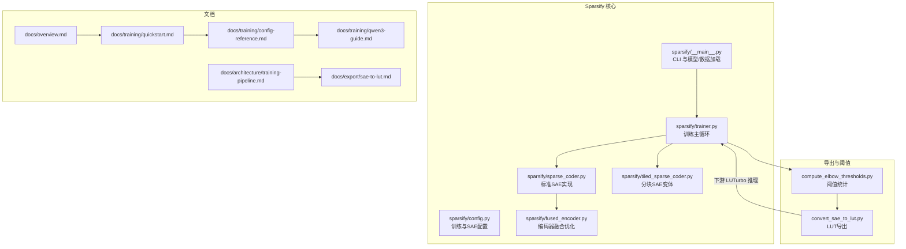
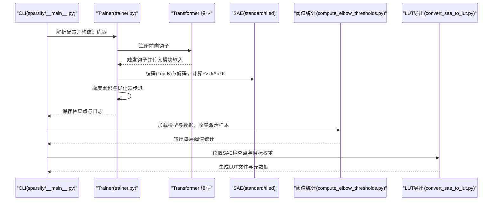
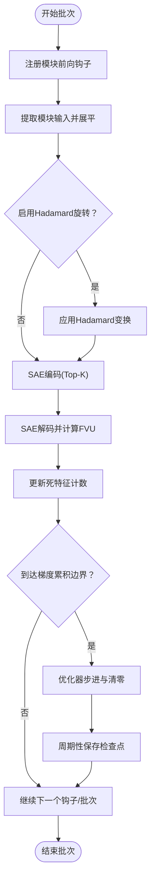
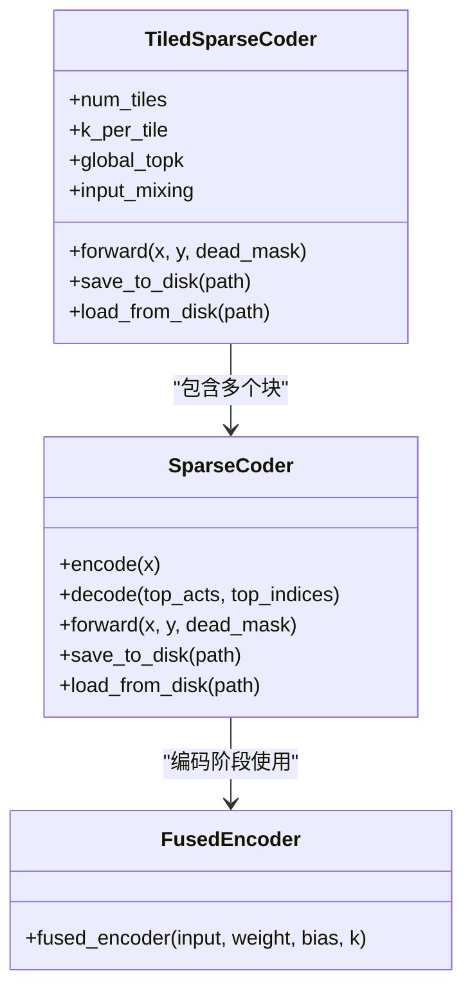
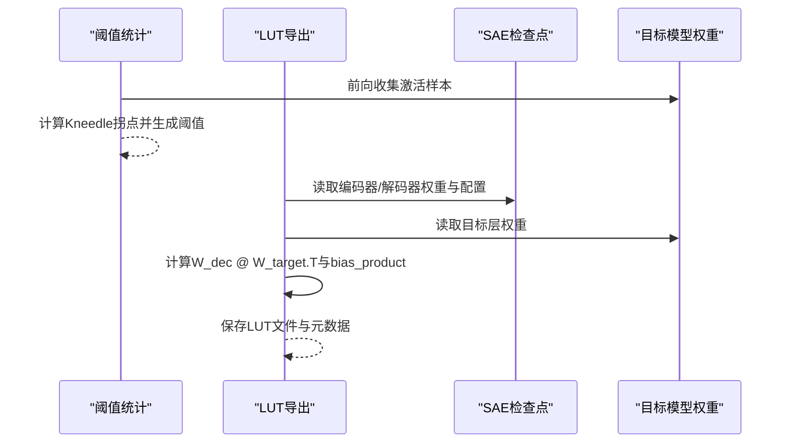
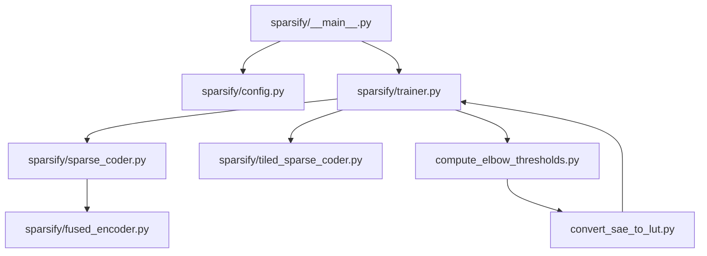

# 项目介绍

<cite>
**本文档引用的文件**
- [README.md](file://README.md)
- [docs/overview.md](file://docs/overview.md)
- [docs/training/quickstart.md](file://docs/training/quickstart.md)
- [docs/training/config-reference.md](file://docs/training/config-reference.md)
- [docs/training/qwen3-guide.md](file://docs/training/qwen3-guide.md)
- [docs/export/sae-to-lut.md](file://docs/export/sae-to-lut.md)
- [docs/architecture/training-pipeline.md](file://docs/architecture/training-pipeline.md)
- [sparsify/__main__.py](file://sparsify/__main__.py)
- [sparsify/__init__.py](file://sparsify/__init__.py)
- [sparsify/config.py](file://sparsify/config.py)
- [sparsify/trainer.py](file://sparsify/trainer.py)
- [sparsify/sparse_coder.py](file://sparsify/sparse_coder.py)
- [sparsify/tiled_sparse_coder.py](file://sparsify/tiled_sparse_coder.py)
- [sparsify/fused_encoder.py](file://sparsify/fused_encoder.py)
- [convert_sae_to_lut.py](file://convert_sae_to_lut.py)
- [compute_elbow_thresholds.py](file://compute_elbow_thresholds.py)
- [pyproject.toml](file://pyproject.toml)
</cite>

## 目录
1. [引言](#引言)
2. [项目结构](#项目结构)
3. [核心组件](#核心组件)
4. [架构总览](#架构总览)
5. [详细组件分析](#详细组件分析)
6. [依赖分析](#依赖分析)
7. [性能考虑](#性能考虑)
8. [故障排查指南](#故障排查指南)
9. [结论](#结论)
10. [附录](#附录)

## 引言

Sparsify 是 LUTurbo 生态系统中负责训练稀疏自编码器（SAE）并将其导出为面向查找表（LUT）推理的中间产物的核心模块。它的定位非常明确：在 LUTurbo 的整体管线中，Sparsify 专注于“训练与导出”阶段，将昂贵的在线矩阵乘法替换为基于 SAE 基底向量的查找表读取路径。

- Sparsify 不是完整的 LUTurbo 推理运行时，而是上游的训练与导出层。
- 它通过在 Transformer 模块输入上训练 SAE，生成重建质量指标与阈值统计，并将训练好的检查点导出为 LUT 友好的中间资产，供下游 LUTurbo 推理管线消费。

Sparsify 的设计目标是：
- 高效、可扩展地训练 SAE，覆盖注意力输出投影、MLP 上投影等关键模块输入。
- 提供稳定、可复现的导出流程，确保 SAE 基底与目标权重矩阵的组合能被下游推理高效利用。
- 保持与 LUTurbo 推理管线的紧密耦合，使从激活到 LUT 的转换尽可能平滑。

## 项目结构

Sparsify 的代码组织围绕“训练-阈值-导出”的三段式工作流展开，主要目录与文件如下：

- 核心训练入口与配置
  - CLI 入口：`sparsify/__main__.py`
  - 训练配置：`sparsify/config.py`
  - 训练主循环：`sparsify/trainer.py`
  - 稀疏编码器实现：`sparsify/sparse_coder.py`
  - 分块训练变体：`sparsify/tiled_sparse_coder.py`
  - 编码器融合优化：`sparsify/fused_encoder.py`

- 导出与阈值工具
  - 阈值统计：`compute_elbow_thresholds.py`
  - LUT 导出：`convert_sae_to_lut.py`

- 文档与示例
  - 总览文档：`docs/overview.md`
  - 快速开始：`docs/training/quickstart.md`
  - 参数参考：`docs/training/config-reference.md`
  - Qwen3 使用指南：`docs/training/qwen3-guide.md`
  - 训练流水线：`docs/architecture/training-pipeline.md`
  - SAE 到 LUT 导出：`docs/export/sae-to-lut.md`

**图表来源**
- [sparsify/__main__.py:131-207](file://sparsify/__main__.py#L131-L207)
- [sparsify/trainer.py:39-162](file://sparsify/trainer.py#L39-L162)
- [sparsify/sparse_coder.py:36-180](file://sparsify/sparse_coder.py#L36-L180)
- [sparsify/tiled_sparse_coder.py:17-140](file://sparsify/tiled_sparse_coder.py#L17-L140)
- [sparsify/fused_encoder.py:21-106](file://sparsify/fused_encoder.py#L21-L106)
- [compute_elbow_thresholds.py:364-656](file://compute_elbow_thresholds.py#L364-L656)
- [convert_sae_to_lut.py:604-782](file://convert_sae_to_lut.py#L604-L782)

**章节来源**
- [README.md:11-79](file://README.md#L11-L79)
- [docs/overview.md:5-76](file://docs/overview.md#L5-L76)

## 核心组件

- CLI 与运行配置
  - `sparsify/__main__.py`：解析命令行参数、加载模型与数据集、初始化分布式环境、构建训练器并启动训练。
  - `sparsify/config.py`：定义 SAE 架构参数（如 expansion_factor、k、normalize_decoder）与训练参数（如 batch_size、grad_acc_steps、max_tokens、exceed_alphas、hookpoints 等）。

- 训练引擎
  - `sparsify/trainer.py`：基于前向钩子驱动的在线训练，逐批从选定模块输入收集激活，即时计算局部重建损失，累积梯度并在边界步执行优化器更新；支持 DDP、编译加速、Hadamard 预处理、分块 SAE、死特征恢复等特性。

- 稀疏编码器
  - `sparsify/sparse_coder.py`：标准 SAE 实现，包含编码（Top-K）、解码、重建误差（FVU）、可选的 AuxK 死特征辅助损失；提供从磁盘或 Hub 加载/保存检查点的能力。
  - `sparsify/tiled_sparse_coder.py`：将输入按维度切分为多个块，每块独立训练 SAE，并支持全局 Top-K 与输入混合矩阵，提升吞吐与灵活性。
  - `sparsify/fused_encoder.py`：融合线性层与 Top-K 的自定义 Autograd 函数，优化反向传播效率。

- 导出与阈值
  - `compute_elbow_thresholds.py`：在给定 hookpoints 上收集激活样本，计算 Kneedle 拐点对应的阈值，生成 per-layer 阈值统计，用于下游补偿与超限评估。
  - `convert_sae_to_lut.py`：将训练好的 SAE 权重与目标模型权重组合，预计算 W_dec @ W_target.T 与偏置项，输出 LUT 友好格式，配套生成元数据。

**章节来源**
- [sparsify/__main__.py:31-207](file://sparsify/__main__.py#L31-L207)
- [sparsify/config.py:7-149](file://sparsify/config.py#L7-L149)
- [sparsify/trainer.py:39-760](file://sparsify/trainer.py#L39-L760)
- [sparsify/sparse_coder.py:36-269](file://sparsify/sparse_coder.py#L36-L269)
- [sparsify/tiled_sparse_coder.py:17-342](file://sparsify/tiled_sparse_coder.py#L17-L342)
- [sparsify/fused_encoder.py:21-106](file://sparsify/fused_encoder.py#L21-L106)
- [compute_elbow_thresholds.py:364-656](file://compute_elbow_thresholds.py#L364-L656)
- [convert_sae_to_lut.py:604-782](file://convert_sae_to_lut.py#L604-L782)

## 架构总览

Sparsify 的整体架构围绕“在线钩子驱动的训练 + 阈值统计 + LUT 导出”的闭环展开。其核心思想是：在 Transformer 前向过程中，针对选定模块输入实时训练 SAE，同时记录重建质量与异常比例，最终将 SAE 基底与目标权重组合导出为 LUT 资产。

**图表来源**
- [sparsify/__main__.py:131-207](file://sparsify/__main__.py#L131-L207)
- [sparsify/trainer.py:347-574](file://sparsify/trainer.py#L347-L574)
- [compute_elbow_thresholds.py:364-656](file://compute_elbow_thresholds.py#L364-L656)
- [convert_sae_to_lut.py:604-782](file://convert_sae_to_lut.py#L604-L782)

## 详细组件分析

### 训练流水线（Trainer）

- 钩子驱动的在线训练
  - 在每个批次中，Trainer 为选定模块注册前向钩子，从模块输入提取扁平化激活，可选地进行 Hadamard 旋转，然后调用 SAE 前向计算局部重建误差与 Top-K 激活，累积 FVU 与可选的 AuxK 损失，最后在梯度累积边界执行优化器步进。
  - 支持 DDP，使用 no_sync 降低同步开销，并在边界步进行 all_reduce 同步。
  - 支持 torch.compile 对 Transformer 层进行融合以减少内核启动开销（仅 CUDA）。

- 死特征检测与恢复
  - 通过累计“自上次触发以来的 token 数”，在边界步使用 MIN all_reduce 同步各副本计数，零化已触发特征计数，从而避免昂贵的 per-forward scatter 操作。
  - 可选的 AuxK 死特征辅助损失鼓励“死特征”预测残差的一部分，提升稀疏性稳定性。

- 阈值与超限评估
  - 若提供预计算的肘部阈值，训练期间对绝对重建误差进行超限比率统计，按不同 alpha 倍数评估超出比例，辅助下游补偿策略。

**图表来源**
- [sparsify/trainer.py:347-574](file://sparsify/trainer.py#L347-L574)
- [sparsify/trainer.py:575-727](file://sparsify/trainer.py#L575-L727)

**章节来源**
- [docs/architecture/training-pipeline.md:1-167](file://docs/architecture/training-pipeline.md#L1-L167)
- [sparsify/trainer.py:39-760](file://sparsify/trainer.py#L39-L760)

### 稀疏编码器（SparseCoder 与 TiledSparseCoder）

- 标准 SAE
  - 编码器为线性层 + ReLU + Top-K，解码器为共享权重的转置（可选单位范数归一化），支持可选的 AuxK 死特征辅助损失。
  - 提供从磁盘/Hub 加载与保存检查点的接口，便于复用与发布。

- 分块 SAE（Tiled SAE）
  - 将输入维度按块切分，每块独立训练 SAE，支持两种模式：
    - 独立 Top-K：每块独立选择 k_per_tile 个活跃特征。
    - 全局 Top-K：所有块竞争相同的 k 个活跃特征，采用块对角解码矩阵一次性完成解码，提升吞吐。
  - 可选输入混合矩阵，允许跨块信息流动并重新计算 FVU。

**图表来源**
- [sparsify/sparse_coder.py:36-269](file://sparsify/sparse_coder.py#L36-L269)
- [sparsify/tiled_sparse_coder.py:17-342](file://sparsify/tiled_sparse_coder.py#L17-L342)
- [sparsify/fused_encoder.py:21-106](file://sparsify/fused_encoder.py#L21-L106)

**章节来源**
- [sparsify/sparse_coder.py:36-269](file://sparsify/sparse_coder.py#L36-L269)
- [sparsify/tiled_sparse_coder.py:17-342](file://sparsify/tiled_sparse_coder.py#L17-L342)
- [sparsify/fused_encoder.py:21-106](file://sparsify/fused_encoder.py#L21-L106)

### 阈值统计与 LUT 导出

- 阈值统计（Elbow）
  - 在指定 hookpoints 上收集激活样本，计算绝对值分位数曲线并使用 Kneedle 方法识别拐点，输出每层的 elbow_p 与 elbow_value，供下游补偿与超限评估使用。
  - 可选生成可视化图谱，便于调试与验证。

- LUT 导出
  - 读取 SAE 检查点（encoder/decoder 权重与偏置、配置），结合目标模型权重矩阵，预计算 W_dec @ W_target.T 与 bias_product，输出 LUT 文件与元数据，适配下游 LUTurbo 推理管线。

**图表来源**
- [compute_elbow_thresholds.py:364-656](file://compute_elbow_thresholds.py#L364-L656)
- [convert_sae_to_lut.py:604-782](file://convert_sae_to_lut.py#L604-L782)

**章节来源**
- [compute_elbow_thresholds.py:364-656](file://compute_elbow_thresholds.py#L364-L656)
- [convert_sae_to_lut.py:604-782](file://convert_sae_to_lut.py#L604-L782)
- [docs/export/sae-to-lut.md:1-103](file://docs/export/sae-to-lut.md#L1-L103)

## 依赖分析

Sparsify 的依赖关系主要体现在模块间的调用与数据流上：

- CLI 依赖于训练器与配置模块，负责参数解析与资源加载。
- 训练器依赖于 SAE 实现（标准与分块）、设备抽象、优化器包装器（Schedule-Free）、以及数据加载与钩子注册逻辑。
- 导出脚本依赖于 SAE 检查点格式与目标模型权重布局，生成 LUT 文件与元数据。
- 阈值统计脚本依赖于模型前向钩子与激活收集逻辑，输出标准化的阈值 JSON。

**图表来源**
- [sparsify/__main__.py:131-207](file://sparsify/__main__.py#L131-L207)
- [sparsify/trainer.py:39-162](file://sparsify/trainer.py#L39-L162)
- [sparsify/sparse_coder.py:36-180](file://sparsify/sparse_coder.py#L36-L180)
- [sparsify/tiled_sparse_coder.py:17-140](file://sparsify/tiled_sparse_coder.py#L17-L140)
- [sparsify/fused_encoder.py:21-106](file://sparsify/fused_encoder.py#L21-L106)
- [compute_elbow_thresholds.py:364-656](file://compute_elbow_thresholds.py#L364-L656)
- [convert_sae_to_lut.py:604-782](file://convert_sae_to_lut.py#L604-L782)

**章节来源**
- [pyproject.toml:12-28](file://pyproject.toml#L12-L28)
- [sparsify/__init__.py:3-15](file://sparsify/__init__.py#L3-L15)

## 性能考虑

- 在线训练与钩子融合
  - 训练与前向钩子在同一循环内执行，避免离线缓存激活带来的 IO 与存储压力，适合大规模模型与长序列场景。
  - 支持 torch.compile 对 Transformer 层进行融合，减少小算子与 dtype 转换开销（CUDA 限定）。

- 编码器融合优化
  - 自定义 Autograd 函数将线性层与 Top-K 合并，使用 scatter-matmul 或 gather+bmm 两种路径在内存与性能间权衡，显著降低反向传播成本。

- 分块 SAE 与全局 Top-K
  - 分块 SAE 将输入维度切分，提升并行度与吞吐；全局 Top-K 模式通过块对角解码矩阵一次性完成解码，减少循环与内存拷贝。

- 死特征检测与去抖动
  - 使用计数器与 all_reduce 同步替代 per-forward 的布尔散射，避免某些后端上的 AI_CPU 回退；同时通过 AuxK 损失缓解死特征问题。

- 设备与精度
  - 自动选择 bf16（若后端支持），在 CUDA/NPU 上使用 autocast 提升吞吐；导出阶段统一使用 float32 计算以保证数值稳定。

**章节来源**
- [docs/architecture/training-pipeline.md:95-125](file://docs/architecture/training-pipeline.md#L95-L125)
- [sparsify/fused_encoder.py:18-91](file://sparsify/fused_encoder.py#L18-L91)
- [sparsify/tiled_sparse_coder.py:102-140](file://sparsify/tiled_sparse_coder.py#L102-L140)
- [sparsify/trainer.py:575-653](file://sparsify/trainer.py#L575-L653)

## 故障排查指南

- 训练无法启动或卡住
  - 检查 hookpoints 是否正确匹配模型模块名；确认范围语法已被展开且排序正确。
  - 在 DDP 模式下，确保数据集大小能被世界规模整除，避免死锁；必要时启用自动修剪与分片。

- 梯度累积边界步未更新
  - 确认 `grad_acc_steps` 与 `micro_acc_steps` 设置合理；检查日志中是否出现“到达梯度累积边界”的提示。
  - 若使用 torch.compile，确认仅在 CUDA 后端生效。

- 死特征过多或重建质量差
  - 提高 `auxk_alpha` 或调整 `dead_feature_threshold`；适当增大 `sae.k` 或 `sae.expansion_factor`。
  - 启用 `normalize_decoder` 与 `remove_gradient_parallel_to_decoder_directions` 以改善收敛。

- 导出失败或维度不匹配
  - 确保 SAE 检查点命名与导出脚本期望的投影家族一致（如 qproj/oproj/upproj）。
  - 检查目标模型权重维度与 SAE 输入维度一致；若使用融合投影（如 qkv/gate_up），确认源 SAE 与目标模块映射正确。

- 阈值统计不可用或为空
  - 确认收集的 token 数量足够；检查特殊 token 过滤逻辑是否正确。
  - 若需要可视化，确认绘图目录可写且 matplotlib 后端可用。

**章节来源**
- [docs/training/quickstart.md:80-153](file://docs/training/quickstart.md#L80-L153)
- [docs/training/config-reference.md:160-193](file://docs/training/config-reference.md#L160-L193)
- [docs/export/sae-to-lut.md:98-103](file://docs/export/sae-to-lut.md#L98-L103)
- [compute_elbow_thresholds.py:364-656](file://compute_elbow_thresholds.py#L364-L656)

## 结论

Sparsify 以“在线钩子驱动的 SAE 训练 + 阈值统计 + LUT 导出”为核心路径，为 LUTurbo 推理管线提供了高效率、可扩展且可复现的上游支撑。它聚焦于模块输入的局部重建质量与异常评估，通过分块 SAE、融合编码器与优化的死特征管理，兼顾了性能与稳定性。对于希望将昂贵在线矩阵乘法替换为查找表读取的团队，Sparsify 提供了从训练到导出的一体化解决方案。

## 附录

- 快速开始与最小工作流
  - 训练 SAE 检查点 → 计算肘部阈值 → 导出 LUT 资产
- 推荐参数与 Hookpoints（以 Qwen3 为例）
  - 常用 hookpoints：`layers.[7,14].self_attn.o_proj`、`layers.[7,14].self_attn.q_proj`、`layers.[7,14].mlp.up_proj`
  - 建议起始配置：`sae.expansion_factor=8`、`sae.k=128`、`batch_size=1`、`grad_acc_steps=8`、`ctx_len=2048`
- 平台优先级
  - CUDA 为主力运行路径；NPU 仍保留兼容路径与历史资料。

**章节来源**
- [docs/training/quickstart.md:1-153](file://docs/training/quickstart.md#L1-L153)
- [docs/training/qwen3-guide.md:1-78](file://docs/training/qwen3-guide.md#L1-L78)
- [README.md:5-23](file://README.md#L5-L23)