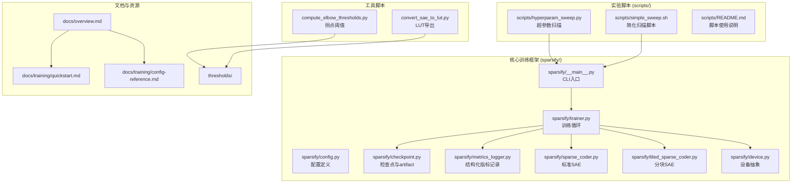
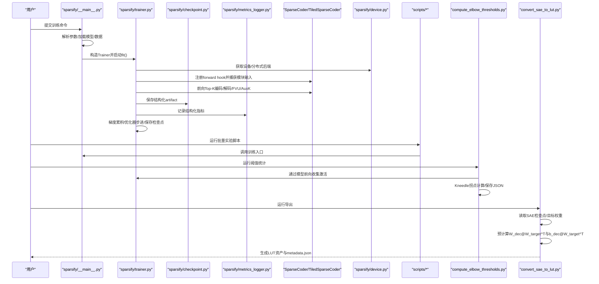
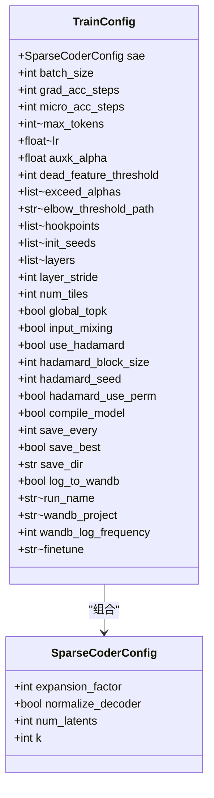
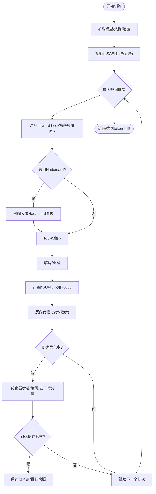
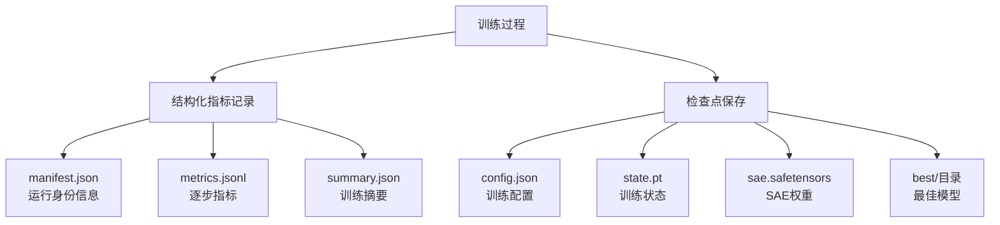
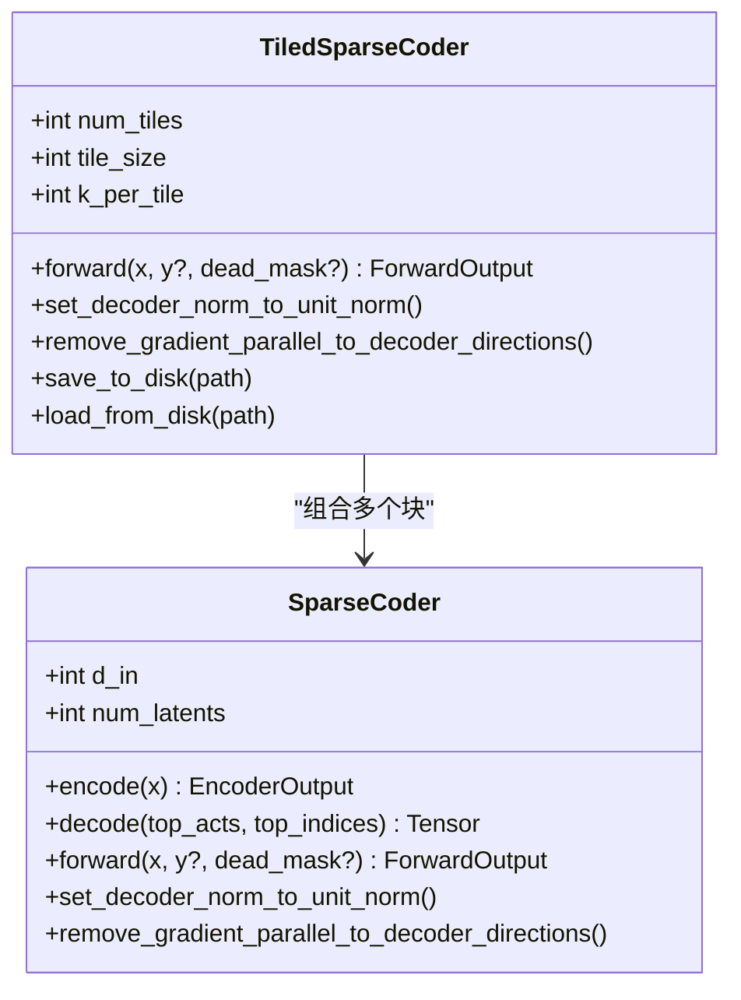
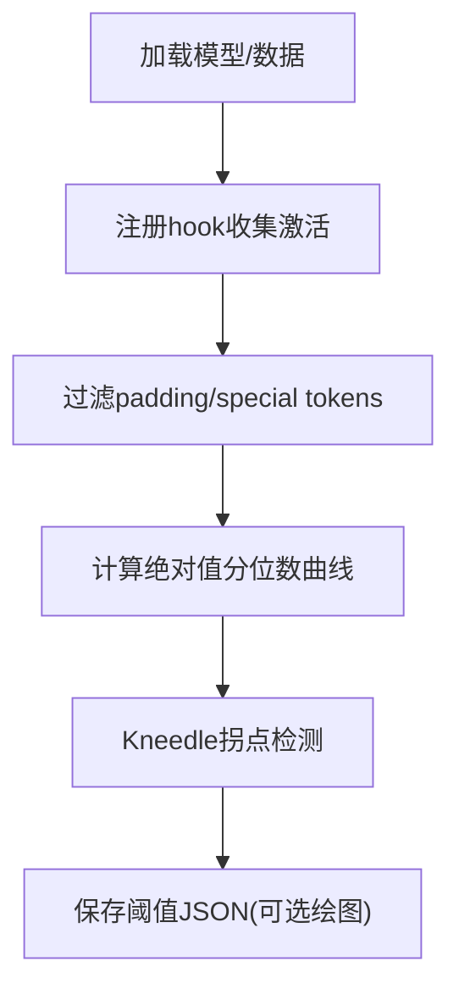
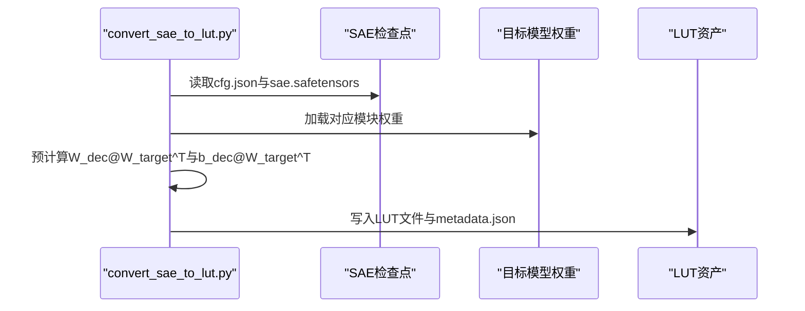
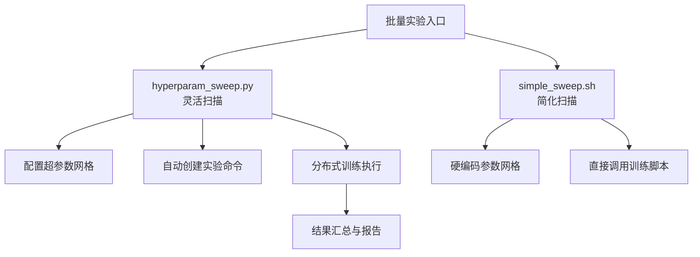
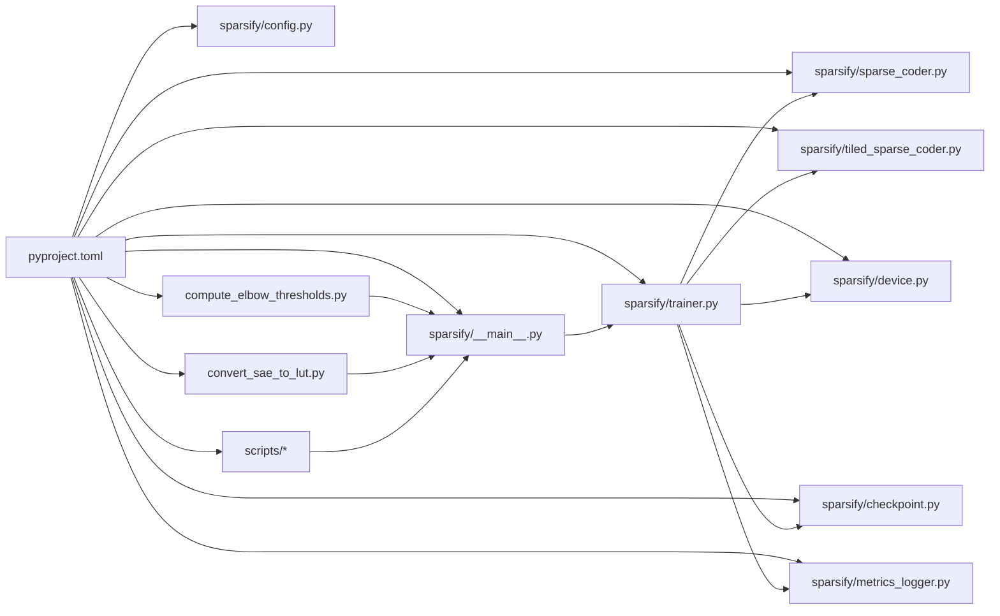

# 项目概述

<cite>
**本文引用的文件**
- [README.md](file://README.md)
- [docs/README.md](file://docs/README.md)
- [docs/overview.md](file://docs/overview.md)
- [docs/training/quickstart.md](file://docs/training/quickstart.md)
- [docs/training/config-reference.md](file://docs/training/config-reference.md)
- [sparsify/__main__.py](file://sparsify/__main__.py)
- [sparsify/config.py](file://sparsify/config.py)
- [sparsify/trainer.py](file://sparsify/trainer.py)
- [sparsify/checkpoint.py](file://sparsify/checkpoint.py)
- [sparsify/metrics_logger.py](file://sparsify/metrics_logger.py)
- [scripts/README.md](file://scripts/README.md)
- [pyproject.toml](file://pyproject.toml)
</cite>

## 更新摘要
**所做更改**
- 更新了 Phase 2 训练框架的描述，强调结构化 artifact 生产的重要性
- 明确了 sparsify/ 和 scripts/ 的分离职责
- 新增了结构化训练 artifact 的详细说明
- 更新了检查点保存与传统检查点保存的区别说明

## 目录
1. [简介](#简介)
2. [项目结构](#项目结构)
3. [核心组件](#核心组件)
4. [架构总览](#架构总览)
5. [详细组件分析](#详细组件分析)
6. [依赖关系分析](#依赖关系分析)
7. [性能考量](#性能考量)
8. [故障排查指南](#故障排查指南)
9. [结论](#结论)
10. [附录](#附录)

## 简介
Sparsify 是 LUTurbo 生态系统中负责"稀疏自编码器（SAE）训练与导出"的关键模块。其职责包括：
- 在 Transformer 模块输入上训练 SAE
- 生成用于 LUTurbo 在线补偿逻辑的拐点阈值统计
- 将训练好的 SAE 检查点导出为面向 LUT 的中间产物，供下游推理管线使用

**更新** 项目现已采用 Phase 2 训练框架，强调结构化 artifact 生产，将 sparsify/ 和 scripts/ 目录明确分离职责：

- **sparsify/**：核心训练框架与实现，专注于训练逻辑、检查点管理、指标记录等
- **scripts/**：实验脚本与批量训练脚本，专注于超参数扫描、批量实验管理等

当前仓库定位为聚焦于 NVIDIA/CUDA 的主运行路径，Ascend/NPU 作为兼容路径与历史参考保留。

本项目强调"从模块输入到 LUT 面向资产"的最小闭环：训练 SAE → 计算拐点阈值 → 导出 LUT 资产 → 下游 LUTurbo 推理。

**章节来源**
- [README.md:1-154](file://README.md#L1-L154)
- [docs/README.md:1-34](file://docs/README.md#L1-L34)
- [docs/overview.md:1-42](file://docs/overview.md#L1-L42)

## 项目结构
仓库采用按功能域划分的组织方式，核心目录与文件如下：
- **sparsify/**：训练与推理相关的核心 Python 包
  - __main__.py：CLI 入口，模型与数据加载
  - config.py：训练配置定义
  - trainer.py：基于 forward hook 的 SAE 训练循环
  - checkpoint.py：检查点保存/加载与结构化 artifact 生产
  - metrics_logger.py：结构化训练指标记录
  - sparse_coder.py / tiled_sparse_coder.py：标准与分块（瓦片）SAE 实现
  - device.py：CUDA/Ascend NPU 设备抽象层
  - 其他工具模块（如 fused_encoder、hadamard、sign_sgd 等）
- **scripts/**：实验脚本与批量训练脚本
  - hyperparam_sweep.py：超参数扫描脚本
  - simple_sweep.sh：简化版超参数扫描脚本
  - 各种训练辅助脚本
- **docs/**：官方文档（训练、架构、导出等）
- **thresholds/**：各模型的拐点阈值 JSON 文件
- **results/experiments/**：实验结果与汇总
- **compute_elbow_thresholds.py**：激活分布拐点阈值计算脚本
- **convert_sae_to_lut.py**：SAE 检查点到 LUT 资产的导出脚本
- **pyproject.toml**：项目元数据与依赖声明

**图表来源**
- [sparsify/__main__.py:1-211](file://sparsify/__main__.py#L1-L211)
- [sparsify/config.py:1-149](file://sparsify/config.py#L1-L149)
- [sparsify/trainer.py:1-800](file://sparsify/trainer.py#L1-L800)
- [sparsify/checkpoint.py:1-302](file://sparsify/checkpoint.py#L1-L302)
- [sparsify/metrics_logger.py:1-81](file://sparsify/metrics_logger.py#L1-L81)
- [sparsify/sparse_coder.py:1-269](file://sparsify/sparse_coder.py#L1-L269)
- [sparsify/tiled_sparse_coder.py:1-342](file://sparsify/tiled_sparse_coder.py#L1-L342)
- [sparsify/device.py:1-118](file://sparsify/device.py#L1-L118)
- [scripts/README.md:1-299](file://scripts/README.md#L1-L299)
- [compute_elbow_thresholds.py:1-660](file://compute_elbow_thresholds.py#L1-L660)
- [convert_sae_to_lut.py:1-783](file://convert_sae_to_lut.py#L1-L783)
- [docs/overview.md:1-42](file://docs/overview.md#L1-L42)
- [docs/training/quickstart.md:1-190](file://docs/training/quickstart.md#L1-L190)
- [docs/training/config-reference.md:1-217](file://docs/training/config-reference.md#L1-L217)

**章节来源**
- [README.md:71-103](file://README.md#L71-L103)
- [docs/README.md:18-34](file://docs/README.md#L18-L34)

## 核心组件
- **CLI 入口与数据加载**
  - sparsify/__main__.py：解析命令行参数、加载模型与数据集、DDP 初始化、调用 Trainer 开始训练
- **训练配置**
  - sparsify/config.py：定义 SparseCoderConfig 与 TrainConfig，涵盖扩展因子、k、梯度累积、微步、Hadamard 旋转、瓦片训练、编译开关、保存与日志等
- **训练循环**
  - sparsify/trainer.py：基于 forward hook 捕获模块输入，构建 SAE（标准或分块），执行前向、损失与反向，周期性保存与记录指标；支持 DDP、超参自动 LR、Exceed 指标、Elbow 阈值联动
- **结构化 Artifact 生产**
  - sparsify/checkpoint.py：检查点保存/加载，包含结构化 artifact 生产逻辑
  - sparsify/metrics_logger.py：生成 manifest.json、metrics.jsonl、summary.json 等结构化指标文件
- **SAE 实现**
  - sparsify/sparse_coder.py：标准 SAE，Top-K 编码、解码、FVU 重建质量、可选 AuxK 死特征恢复
  - sparsify/tiled_sparse_coder.py：分块 SAE，支持 per-tile 与 global-top-k，可选输入混合矩阵，提升并行与跨通道信息流动
- **设备抽象**
  - sparsify/device.py：统一 CUDA/Ascend NPU 的设备选择、bf16 支持、事件与分布式后端
- **阈值统计**
  - compute_elbow_thresholds.py：收集模块输入激活，计算 Kneedle 拐点阈值，输出 JSON 与可选可视化
- **LUT 导出**
  - convert_sae_to_lut.py：读取 SAE 检查点与目标模型权重，预计算 W_dec @ W_target^T 与 b_dec @ W_target^T，生成 LUT 资产与元数据
- **批量实验管理**
  - scripts/hyperparam_sweep.py：超参数扫描与批量实验管理
  - scripts/simple_sweep.sh：简化版超参数扫描脚本

**章节来源**
- [sparsify/__main__.py:31-211](file://sparsify/__main__.py#L31-L211)
- [sparsify/config.py:7-149](file://sparsify/config.py#L7-L149)
- [sparsify/trainer.py:39-800](file://sparsify/trainer.py#L39-L800)
- [sparsify/checkpoint.py:1-302](file://sparsify/checkpoint.py#L1-L302)
- [sparsify/metrics_logger.py:1-81](file://sparsify/metrics_logger.py#L1-L81)
- [sparsify/sparse_coder.py:36-269](file://sparsify/sparse_coder.py#L36-L269)
- [sparsify/tiled_sparse_coder.py:17-342](file://sparsify/tiled_sparse_coder.py#L17-L342)
- [sparsify/device.py:34-118](file://sparsify/device.py#L34-L118)
- [compute_elbow_thresholds.py:1-660](file://compute_elbow_thresholds.py#L1-L660)
- [convert_sae_to_lut.py:1-783](file://convert_sae_to_lut.py#L1-L783)
- [scripts/README.md:1-299](file://scripts/README.md#L1-L299)

## 架构总览
Sparsify 在 LUTurbo 中承担"训练与导出"阶段，形成如下端到端工作流：
- 输入：Transformer 模型 + 已分词/待分词的数据集 + 选定 hookpoints（通常是投影模块输入）
- 输出：SAE 检查点树 + 阈值 JSON + LUT 资产（含预计算矩阵与元数据）

**更新** 现在强调结构化 artifact 生产，sparsify/ 和 scripts/ 明确分离职责：

**图表来源**
- [sparsify/__main__.py:131-211](file://sparsify/__main__.py#L131-L211)
- [sparsify/trainer.py:162-800](file://sparsify/trainer.py#L162-L800)
- [sparsify/checkpoint.py:199-302](file://sparsify/checkpoint.py#L199-L302)
- [sparsify/metrics_logger.py:10-81](file://sparsify/metrics_logger.py#L10-L81)
- [sparsify/sparse_coder.py:176-269](file://sparsify/sparse_coder.py#L176-L269)
- [sparsify/tiled_sparse_coder.py:103-342](file://sparsify/tiled_sparse_coder.py#L103-L342)
- [sparsify/device.py:34-118](file://sparsify/device.py#L34-L118)
- [scripts/README.md:1-299](file://scripts/README.md#L1-L299)
- [compute_elbow_thresholds.py:364-660](file://compute_elbow_thresholds.py#L364-L660)
- [convert_sae_to_lut.py:604-783](file://convert_sae_to_lut.py#L604-L783)

## 详细组件分析

### 训练配置与参数体系
- **SparseCoderConfig**：控制 SAE 维度（expansion_factor 或显式 num_latents）、k、归一化等
- **TrainConfig**：控制 batch/grad_acc/micro_acc、LR、AuxK、死特征阈值、Hookpoint 选择、瓦片与 Hadamard、编译开关、保存/日志、finetune/resume 等
- **参数校验**：对 layer_stride 与 layers 的互斥、Hadamard block_size 的幂次约束、compile_model 的平台限制等进行校验

**图表来源**
- [sparsify/config.py:7-149](file://sparsify/config.py#L7-L149)

**章节来源**
- [sparsify/config.py:7-149](file://sparsify/config.py#L7-L149)

### 训练循环与 Hook 驱动
- **Hook 选择**：支持通配符与范围展开，匹配实际模块名；可按 stride 采样层
- **前向钩子**：在捕获输入后，可选 Hadamard 旋转、初始化解码器偏置、Top-K 编码、解码、FVU 与 AuxK 损失
- **指标与日志**：支持 Exceed 指标（基于 Elbow 阈值）、时间度量、W&B 日志、死特征比例
- **优化**：梯度累积、微步、Schedule-Free SignSGD、可选 torch.compile 层融合
- **分布式**：DDP 包装 SAE、all_reduce 同步、屏障与余数处理

**图表来源**
- [sparsify/trainer.py:162-800](file://sparsify/trainer.py#L162-L800)

**章节来源**
- [sparsify/trainer.py:39-800](file://sparsify/trainer.py#L39-L800)

### 结构化 Artifact 生产
**更新** sparsify/ 现在专注于结构化 artifact 生产，包含以下核心功能：

- **检查点保存**：保存 SAE 权重、训练状态、优化器状态、配置信息
- **结构化指标记录**：生成 manifest.json、metrics.jsonl、summary.json
- **最佳模型保存**：按 hookpoint 保存最佳检查点
- **Hadamard 状态保存**：保存旋转状态以便恢复

**图表来源**
- [sparsify/checkpoint.py:199-302](file://sparsify/checkpoint.py#L199-L302)
- [sparsify/metrics_logger.py:10-81](file://sparsify/metrics_logger.py#L10-L81)

**章节来源**
- [sparsify/checkpoint.py:1-302](file://sparsify/checkpoint.py#L1-L302)
- [sparsify/metrics_logger.py:1-81](file://sparsify/metrics_logger.py#L1-L81)

### SAE 核心实现
- **标准 SAE**：线性编码器 + 可选解码器权重共享 + 归一化 + Top-K 选择 + FVU + 可选 AuxK
- **分块 SAE**：将隐藏维切分为 T 块，每块独立训练 SAE；支持 per-tile 与 global-top-k；可选输入混合矩阵；解码时合并索引并统一计算

**图表来源**
- [sparsify/sparse_coder.py:36-269](file://sparsify/sparse_coder.py#L36-L269)
- [sparsify/tiled_sparse_coder.py:17-342](file://sparsify/tiled_sparse_coder.py#L17-L342)

**章节来源**
- [sparsify/sparse_coder.py:36-269](file://sparsify/sparse_coder.py#L36-L269)
- [sparsify/tiled_sparse_coder.py:17-342](file://sparsify/tiled_sparse_coder.py#L17-L342)

### 阈值统计（Elbow）
- **功能**：收集模块输入激活，计算绝对值分位数曲线的 Kneedle 拐点，输出 elbow_p 与 elbow_value
- **流程**：多进程并行计算每个 hookpoint 的拐点，可选生成可视化图
- **用途**：为 LUTurbo 补偿逻辑与训练期间的 Exceed 指标提供阈值

**图表来源**
- [compute_elbow_thresholds.py:172-200](file://compute_elbow_thresholds.py#L172-L200)
- [compute_elbow_thresholds.py:364-660](file://compute_elbow_thresholds.py#L364-L660)

**章节来源**
- [compute_elbow_thresholds.py:1-660](file://compute_elbow_thresholds.py#L1-L660)

### LUT 导出
- **功能**：将 SAE 检查点与目标模型权重结合，预计算 W_dec @ W_target^T 与 b_dec @ W_target^T，生成 LUT 资产与 metadata.json
- **支持**：单投影与融合投影（如 qkv、gate_up），自动检测层范围，支持批处理以降低内存占用
- **元数据**：包含版本、SAE 配置、模型配置、层信息与阈值

**图表来源**
- [convert_sae_to_lut.py:419-558](file://convert_sae_to_lut.py#L419-L558)
- [convert_sae_to_lut.py:604-783](file://convert_sae_to_lut.py#L604-L783)

**章节来源**
- [convert_sae_to_lut.py:1-783](file://convert_sae_to_lut.py#L1-L783)

### 批量实验管理
**更新** scripts/ 目录现在专门负责批量实验管理：

- **超参数扫描**：scripts/hyperparam_sweep.py 提供灵活的超参数扫描功能
- **简化脚本**：scripts/simple_sweep.sh 提供无需 Python 依赖的简化版本
- **实验监控**：支持实时监控、结果对比、报告生成
- **错误处理**：支持中断恢复、错误继续等高级功能

**图表来源**
- [scripts/README.md:1-299](file://scripts/README.md#L1-L299)

**章节来源**
- [scripts/README.md:1-299](file://scripts/README.md#L1-L299)

## 依赖关系分析
- **技术栈**
  - PyTorch 2.9.1、Transformers 4.57.3、Datasets、Simple-Parsing、ScheduleFree、safetensors、accelerate 等
  - 可选开发依赖：matplotlib、wandb、GitPython 等
- **关键依赖关系**
  - Trainer 依赖 SAE 实现（SparseCoder/TiledSparseCoder）、设备抽象、优化器包装
  - CLI 依赖 Trainer、数据加载与设备选择
  - 导出脚本依赖 Transformers 加载模型、safetensors 读写、阈值文件
  - 阈值脚本依赖 Transformers、Datasets、matplotlib（非交互式）
  - **更新** MetricsLogger 依赖 GitPython 进行版本信息收集

**图表来源**
- [pyproject.toml:12-42](file://pyproject.toml#L12-L42)
- [sparsify/trainer.py:1-800](file://sparsify/trainer.py#L1-L800)
- [sparsify/config.py:1-149](file://sparsify/config.py#L1-L149)
- [sparsify/sparse_coder.py:1-269](file://sparsify/sparse_coder.py#L1-L269)
- [sparsify/tiled_sparse_coder.py:1-342](file://sparsify/tiled_sparse_coder.py#L1-L342)
- [sparsify/device.py:1-118](file://sparsify/device.py#L1-L118)
- [sparsify/__main__.py:1-211](file://sparsify/__main__.py#L1-L211)
- [sparsify/checkpoint.py:1-302](file://sparsify/checkpoint.py#L1-L302)
- [sparsify/metrics_logger.py:1-81](file://sparsify/metrics_logger.py#L1-L81)
- [compute_elbow_thresholds.py:1-660](file://compute_elbow_thresholds.py#L1-L660)
- [convert_sae_to_lut.py:1-783](file://convert_sae_to_lut.py#L1-L783)
- [scripts/README.md:1-299](file://scripts/README.md#L1-L299)

**章节来源**
- [pyproject.toml:12-42](file://pyproject.toml#L12-L42)

## 性能考量
- **设备与精度**
  - 自动检测 bf16 支持，设备无关的 autocast 装饰器
  - CUDA 优先，NPU 作为兼容路径
- **训练优化**
  - 梯度累积与微步减少显存峰值
  - torch.compile 对 Transformer 层进行内核融合（CUDA）
  - DDP 分布式训练，all_reduce 同步
- **指标与监控**
  - Exceed 指标与 Elbow 阈值联动，辅助在线补偿
  - 时间度量事件仅在需要时开启，避免额外开销
- **导出优化**
  - 预计算矩阵乘法，支持批处理以缓解内存压力
- **结构化 artifact 优化**
  - **更新** MetricsLogger 使用流式写入，避免大文件内存占用
  - 检查点保存采用增量更新，减少磁盘 I/O

## 故障排查指南
- **训练无法启动或报错**
  - 检查 CUDA/NPU 可用性与 bf16 支持
  - 确认配置中 Hadamard block_size 为正的 2 的幂
  - 确认 compile_model 仅在 CUDA 上启用
- **分布式训练异常**
  - 确保 WORLD_SIZE 与本地进程数一致
  - 注意余数样本导致的死锁，确保数据长度可被 WORLD_SIZE 整除
- **SAE 检查点加载失败**
  - 确认 cfg.json 与 sae.safetensors 存在且命名规范一致
  - 检查导出脚本的目录风格（嵌套/扁平）是否匹配
- **阈值计算失败**
  - 确认 hookpoint 范围正确展开并匹配实际模块名
  - 检查激活收集是否成功（token 数量与过滤策略）
- **LUT 导出维度不匹配**
  - 确认 SAE d_in 与目标模块权重输入维度一致
  - 检查融合导出时的源 SAE 与目标模块映射
- **结构化 artifact 生成失败**
  - **更新** 检查 Git 仓库状态，确保 GitPython 可用
  - 确认磁盘空间充足，避免流式写入中断
  - 检查权限问题，确保能写入日志目录
- **批量实验脚本异常**
  - **更新** 检查端口冲突，脚本会自动递增端口
  - 确认 GPU 内存足够，必要时调整 batch_size 或 grad_acc_steps
  - 检查数据预处理进程数设置

**章节来源**
- [sparsify/config.py:124-149](file://sparsify/config.py#L124-L149)
- [sparsify/trainer.py:162-800](file://sparsify/trainer.py#L162-L800)
- [sparsify/checkpoint.py:44-73](file://sparsify/checkpoint.py#L44-L73)
- [sparsify/metrics_logger.py:29-56](file://sparsify/metrics_logger.py#L29-L56)
- [convert_sae_to_lut.py:498-504](file://convert_sae_to_lut.py#L498-L504)
- [compute_elbow_thresholds.py:562-584](file://compute_elbow_thresholds.py#L562-L584)
- [scripts/README.md:211-299](file://scripts/README.md#L211-L299)

## 结论
Sparsify 以"模块输入 SAE 训练 + 阈值统计 + LUT 导出"为核心闭环，为 LUTurbo 的推理管线提供高效、可复用的中间资产。其设计强调：

- **明确的职责边界**：sparsify/ 专注训练框架与结构化 artifact 生产，scripts/ 专注批量实验管理
- **结构化 artifact 生产**：通过 MetricsLogger 和 CheckpointMixin 实现标准化的训练产物
- **清晰的参数体系与严格的配置校验**
- **高效的训练与导出路径，兼顾性能与可扩展性**
- **文档与代码保持一致，以代码为准绳**

**更新** Phase 2 训练框架引入了更加规范的结构化 artifact 生产流程，与传统的检查点保存相比，现在提供了：

- **标准化的指标格式**：metrics.jsonl 提供机器可读的逐步指标
- **完整的运行元数据**：manifest.json 包含 git 信息、模型配置等
- **结构化的摘要信息**：summary.json 提供训练结束后的统计摘要
- **更好的可追溯性**：完整的运行身份信息便于实验管理和结果复现

对于初学者，建议先从训练快速入门与导出文档入手；对于进阶用户，可深入训练管道与分块 SAE 的实现细节，以及结构化 artifact 生产的最佳实践。

## 附录
- **快速开始**
  - 安装：pip install -e .[dev]
  - 训练示例：python -m sparsify ...（见 quickstart 文档）
  - 批量实验：python scripts/hyperparam_sweep.py（见 scripts/README.md）
  - 阈值统计：compute_elbow_thresholds.py
  - LUT 导出：convert_sae_to_lut.py
- **推荐阅读顺序**
  - 概览 → 训练快速入门 → 配置参考 → 批量实验脚本 → 结构化 artifact → Qwen3 指南 → 训练流水线 → 核心组件 → 性能要点 → 导出说明
- **文档策略**
  - 主要文档仅描述当前代码路径
  - 历史设计笔记和性能分析报告存放于 archive/ 下
  - 当文档与代码不一致时，以代码为准，特别是 sparsify/__main__.py、sparsify/config.py、sparsify/trainer.py 和 sparsify/checkpoint.py

**章节来源**
- [docs/training/quickstart.md:1-190](file://docs/training/quickstart.md#L1-L190)
- [docs/training/config-reference.md:1-217](file://docs/training/config-reference.md#L1-L217)
- [docs/overview.md:32-42](file://docs/overview.md#L32-L42)
- [docs/README.md:29-34](file://docs/README.md#L29-L34)
- [scripts/README.md:1-299](file://scripts/README.md#L1-L299)